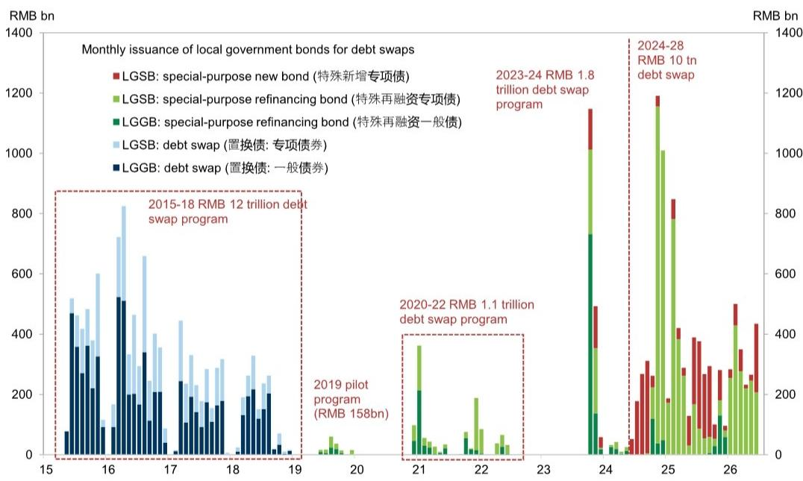

# 美元强势，但人民币更稳：中国汇率韧性背后的政策逻辑

传统观点认为，美元走强必然导致新兴市场货币承压。然而在6月，当美元指数上涨约2%时，人民币兑美元汇率基本保持稳定，在6.79附近窄幅波动。这并非暂时的平静，而是精心设计的政策架构的可见结果——该架构旨在使中国汇率摆脱美国货币政策收紧的引力。对全球观察者而言，信号清晰：仅凭美元走强就押注人民币贬值，正变得越来越不划算。

然而，这种韧性掩盖了更深层的张力。在汇率保持坚挺的同时，国内经济数据出现波动。5月数据显示，社会消费品零售总额同比下降0.6%，单月固定资产投资下降10.6%，二季度实际GDP增速可能低于4.5%。债券市场已反映出这一变化：短端利率保持低位，回报表现曲线陡峭化。但对激进政策宽松的预期仍然有限。政策反应函数是反应性的，而非主动性的，4.5%至5.0%的增长目标为经济放缓提供了比市场预期更大的容忍度。

对于固定收益和外汇研究者而言，战略问题不再是“中国是否会放松政策”，而是“管理汇率、经济放缓、央行耐心这三者的组合能否维持一个连贯的研究框架”。答案取决于理解6月数据揭示的四个结构性动态。

## 政策制定者将人民币用作吸收美元强势的缓冲器，而非释放国内疲弱的阀门

6月外汇数据最显著的特征是美元走势与人民币稳定性之间的背离。美元指数在6月美联储会议后因美国短端利率上升而上涨约2%。然而，美元/人民币即期汇率经历了一个来回，月末基本回到月初水平。结果是CFETS人民币指数升值约2%，意味着人民币在对美元保持稳定的同时，对一篮子货币走强。

这不是市场自发的结果，而是政策的结果。每日中间价设定机制（包括逆周期因子）继续锚定预期。中间价调整速度尚未完全抵消美元多头头寸的正利差，但出口商结汇行为限制了上行空间。政策偏好人民币对美元渐进升值的取向保持不变，市场已内化这一预期。

这一策略的战略意义在于其传递的中国外部优先序信号。当局并未允许人民币贬值以支持出口竞争力或抵消内需疲弱，而是选择通过汇率吸收美元强势。这一选择反映了这样一种权衡：汇率稳定和国际信誉优先于短期增长支持。这也表明，人民币对美元走强的下一个催化剂可能来自外部：美联储加息预期的消退，或地缘政治事件（如9月下旬可能举行的中美高层会晤）。

二阶影响是，人民币正成为新兴市场中的相对避险货币。当美元上涨时，其他货币跌幅更大，而人民币跌幅较小，甚至不跌。对于全球资产配置者而言，这改变了人民币计价资产的风险收益计算。利差并不惊人，但下行保护是实在的。

## 债券市场正正确地为国内疲弱定价，但曲线结构揭示了研究者不应忽视的政策约束

中国债券市场以令人瞩目的冷静吸收了增长放缓。6月，现金回报表现和互换利率保持低位，尽管对政策利率下调的预期有限，且季末流动性需求导致隔夜回购利率出现暂时性飙升。基本面驱动因素很直接：内需疲弱、油价下跌、核心CPI通胀温和，都支持短端利率保持低位。央行引入隔夜逆回购操作，操作利率低于政策利率，强化了银行间流动性将保持充裕的信号。

复杂性在于曲线的远端。10年期国债回报表现处于低位但区间波动，10s30s斜率已陡峭化。这并非市场功能失调的信号，而是财政管道即将开启的信号。更快的财政政策执行，加上三季度更多超长期国债的发行，将增加长端供给。截至6月，政府债券额度使用率仅为41.5%，远慢于去年，这意味着未来发行将显著加速。

分析洞见在于，回报表现曲线正被两股相反力量塑造：央行希望短端利率保持低位以支持流动性，而财政部门需要吸收长端供给。结果是陡峭的曲线，为愿意在短端承担久期风险、同时对冲长端的读者提供了利差机会。但风险在于，如果增长继续放缓，央行可能最终被迫下调政策利率，这将使曲线平坦化并进一步压缩短端回报表现。

悬而未决的问题是，央行对降息的耐心是战略选择还是约束。如果是选择，那么曲线陡峭化是可维持的。如果是约束（出于对银行体系盈利能力或资本外流的担忧），那么陡峭化可能成为更剧烈调整的前奏。

## 报告数据提出了关于当前政策组合可持续性的未解问题

报告提供了政策框架在短期内有效的细致证据，但也包含数据未能完全解决的内部矛盾。在外汇方面，人民币的韧性得到强劲贸易顺差、官方外汇储备上升以及离岸/在岸人民币价差收窄的支持。在利率方面，低回报表现得到充裕流动性、疲弱贷款需求以及央行对银行间充裕感到满意的支持。但这两方面并非独立。

持续强势的人民币（即使对美元走强）会对国内通胀和出口竞争力构成下行压力。这强化了降息的理由。但持续的低利率会降低持有人民币资产的利差优势，并可能最终削弱汇率。只有当央行能同时在两方面维持信誉时，这一政策组合才有效。

数据没有回答如果美元继续走强至当前水平以上会发生什么。逆周期因子已收窄至约+200个基点，表明在没有更激进工具部署的情况下，进一步干预的空间有限。美元/离岸人民币的利差波动比已显著上升，使做空美元头寸的吸引力降低。而做多人民币和做多欧元的动量仍在持续，但这一交易是由与欧洲的双边贸易顺差动态驱动的，而非人民币的根本性重估。

这些未解问题并非报告的弱点，而是分析的前沿。对于认真的研究者，下一步是在美元持续走强、国内增长更急剧放缓或美联储政策预期转变等情景下，对当前框架进行压力测试。

## 研究中国汇率与利率框架的决策思路

将报告发现转化为可操作的决策，需要一个能解释政策框架内在逻辑的思路。以下三步方法旨在帮助研究者在为最可能结果布局的同时，对冲尾部风险。

首先，评估美元周期。人民币的韧性以美元不进入持续、无序的上涨为条件。如果美元逐步走强，央行有工具和意愿将人民币维持在窄幅区间。如果美元因美联储鹰派意外或全球避险事件而飙升，中间价机制将面临压力，区间可能被突破。研究者应监测美元指数和美国短端利率作为领先指标，而非人民币即期汇率本身。

其次，评估财政节奏。债券回报表现曲线的陡峭化是供给预期的函数。如果三季度超长期国债发行如预期加速，长端将保持锚定。如果发行慢于预期，曲线可能因长端回报表现下降而平坦化。研究者应跟踪每周国债拍卖数据和地方政府专项债券发行节奏，后者已在6月加速。

第三，观察政策反应函数。报告数据表明，央行是反应性的，而非主动性的。这意味着，除非增长数据进一步恶化或金融条件意外收紧，否则降息不太可能发生。7月政治局会议是下一个关键政策信号窗口。如果会议释放转向更激进宽松的信号，短端回报表现将进一步下降，曲线将平坦化。如果释放耐心的信号，当前框架将持续。

这一决策思路并非预测下一步行动，而是识别哪些变量将决定框架的稳定性，并据此布局。

## 加入社区阅读完整报告并查看原始图表

以上分析基于一份详尽的月度中国汇率与利率监测报告，该报告追踪数十个指标的估值、技术面、资金流和基本面。完整报告包含39张图表，涵盖从逆周期因子到政府债券额度使用率、再到城投债发行回报表现等各个方面。对于需要建立中国配置信心的研究者而言，这些图表至关重要。原始数据讲述的故事是摘要文字无法完全捕捉的。

加入社区阅读完整报告并查看原始图表。

*仅供参考。部分内容可能基于源材料通过AI辅助生成、翻译、摘要或编辑，可能存在遗漏或错误。请独立核实。本文不构成专业建议。*

仅供参考。部分内容可能基于源材料通过AI辅助生成、翻译、摘要或编辑，可能存在遗漏或错误。请独立核实。本文不构成专业建议。

