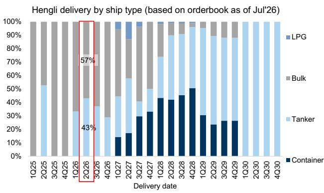
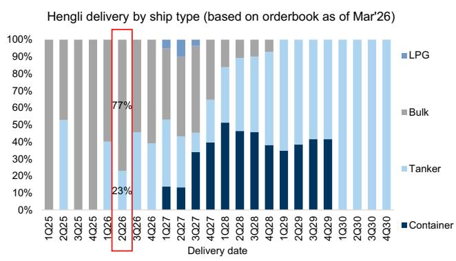
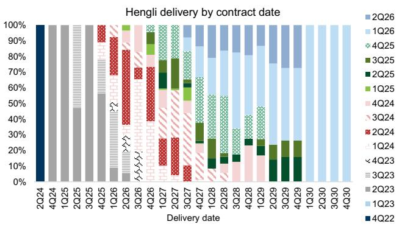
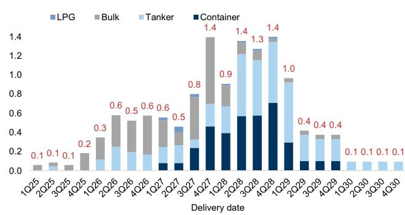

GS Factor Profile

# Guangdong Songfa Ceramics Co (603268.SS)

# 2Q26 results above expectations, driven by earlier blocks construction pre phase III, better margin and operational efficiency

603268.SS 12m Target: Rmb200.00 Price: Rmb160.37

Post market close on July 7th, Songfa/Hengli Heavy Industry released 1H26 prelim results, with 1H26 reported net profit of c.Rmb3.6bn and adjusted net profit at around c.Rmb3.5bn. This implies 2Q26 net profit of c.Rmb 2.5bn (+129% QoQ) and adjusted net profit of c. Rmb2.4bn (+120% QoQ), which is ahead of our expectation of Rmb1.8bn (see Exhibit 1) and the range mentioned in our conversations with investors, accounting for c.35% of WIND FY26 consensus. We attribute the strong results to: 1) Earlier commencement of blocks construction, ahead of phase III drydock's operation starting from June - Though phase III drydock (where the ship is finally assembled) started operation in June, we believe the company had pre-fabricated blocks e.g. cutting steel at ground workshops before that, which could have also contributed to revenue based on the construction progress recognition method. 2) Better-than-expected margin driven by product mix improvement - Hengli started blocks construction ahead of phase III drydocks operation, which effectively enabled more higher-margin tankers and containerships to be constructed earlier, by comparing delivery schedules in July-26 vs. Mar-26 (Exhibit 2, Exhibit 3). 3) Operational efficiency improvement - During 2Q26, Hengli delivered 2 VLCCs to clients at least 3 months ahead of contract deadline, showcasing in our view, its improved operational efficiency after experience accumulation.

Post this announcement, we revise up our earnings forecast for 2026E-28E to Rmb9.2bn/Rmb14.4bn/Rmb16.2bn up +22%/10%/8% (Exhibit 6) vs. our priors, mainly factoring in earlier expanded capacity in place in 2Q26 and higher margin from improved operational efficiency. As a result, we raise our 12m target to Rmb200/share (up 8% from Rmb185 previously) based on an unchanged target 2028E P/E of 12x.

In addition, we see further earnings upside if Hengli finalises the phase IV capacity addition, which is estimated to add another up to 100% capacity to the existing three phases, as we believe the expanded capacity would be filled by strong new ship orders. Hengli's order-winning momentum remained strong in Jun-26. After winning Rmb15bn new orders at Posidonia Exhibition (see Jun-26 report), news reported that MSC has ordered up to 20 x 20k TEU containerships from Hengli recently, which we estimate is valued at US\$4bn (based on recent newbuild price), accounting for over 10% of the orderbook. We expect Hengli can sustain its order-winning momentum benefiting from booming tanker orders and global aging fleet. Hengli has a cover years of 2.7x (incl. Ph III capacity), and we expect the company may continue to expand capacity via phase IV (see Jun-26 report). A shorter-than-peers cover years (global avg at 3.8x years) is a key competitive moat for Hengli when bidding for orders, because shippers mentioned it's hard to find slots delivered in 2028 among tier-1 shipyards (see Jul-26 report) and they are still actively looking for slots from global shipyards for tanker delivery for 2H28-1H29 and are willing to pay c.10% premium over those to be delivered in 2030 (see our shipbuilding trip takeaways).

Exhibit 1: Hengli 1H26 prelim results and implied 2Q26 results

<table><tr><td rowspan="2">mn RMB</td><td rowspan="2">1H26Prelim</td><td rowspan="2">1Q26Reported</td><td rowspan="2">2Q26Implied</td><td colspan="2">QoQ</td><td rowspan="2">2Q26Gse</td><td colspan="2">Vs. Gse</td></tr><tr><td>mn RMB</td><td>%</td><td>mn RMB</td><td>%</td></tr><tr><td>Net profit</td><td>3,600</td><td>1,093</td><td>2,507</td><td>1,413</td><td>129%</td><td>1,791</td><td>716</td><td>40%</td></tr><tr><td>Adjusted net profit</td><td>3,500</td><td>1,092</td><td>2,408</td><td>1,316</td><td>120%</td><td>1,820</td><td>588</td><td>32%</td></tr><tr><td>- One off</td><td>100</td><td>1</td><td>99</td><td></td><td></td><td></td><td></td><td></td></tr></table>

Source: Company data, GS Global Investment Research

Exhibit 2: Hengli deliveries (in CGT terms) by ship type as of Jul'26  
  
As of July 7, 2026.

Exhibit 3: Hengli deliveries (in CGT terms) by ship type as of Mar'26  
  
Source: Clarksons, Data compiled by GS Global Investment Research

Exhibit 4: Hengli deliveries (in CGT terms) by contract date  
  
As of July 7, 2026.  
Source: Clarksons, Data compiled by GS Global Investment Research

## Exhibit 5: Hengli's latest orderbook is at c.11.8mn CGT

(mn CGT) Hengli delivery by ship type (based on orderbook as of Jul'26)  
  
As of July 7, 2026.  
Source: Clarksons, Data compiled by GS Global Investment Research

Exhibit 6: Earnings forecast changes

<table><tr><td rowspan="2">Hengli Heavy Industry</td><td colspan="3">2026E</td><td colspan="3">2027E</td><td colspan="3">2028E</td></tr><tr><td>New</td><td>Old</td><td>Change(%)</td><td>New</td><td>Old</td><td>Change(%)</td><td>New</td><td>Old</td><td>Change(%)</td></tr><tr><td colspan="10">Key operating metrics</td></tr><tr><td>Completion recognized (mn CGT)</td><td>3.04</td><td>2.89</td><td>5%</td><td>4.00</td><td>4.00</td><td>0%</td><td>4.00</td><td>4.00</td><td>0%</td></tr><tr><td>Average price per CGT recognized (US$)</td><td>2,476</td><td>2,451</td><td>1%</td><td>2,569</td><td>2,569</td><td>0%</td><td>2,651</td><td>2,637</td><td>1%</td></tr><tr><td>New order value (US$ mn) - GSe</td><td>21,679</td><td>20,331</td><td>7%</td><td>13,999</td><td>10,532</td><td>33%</td><td>13,348</td><td>9,883</td><td>35%</td></tr><tr><td colspan="10">Key Financials (Rmb mn)</td></tr><tr><td>Total revenue</td><td>53,843</td><td>50,816</td><td>6%</td><td>72,445</td><td>71,977</td><td>1%</td><td>74,906</td><td>74,846</td><td>0%</td></tr><tr><td>Shipbuilding revenue</td><td>51,663</td><td>48,622</td><td>6%</td><td>68,859</td><td>68,846</td><td>0%</td><td>71,059</td><td>70,671</td><td>1%</td></tr><tr><td>Engine revenue (external)</td><td>1,366</td><td>1,380</td><td>-1%</td><td>2,732</td><td>2,277</td><td>20%</td><td>2,951</td><td>3,279</td><td>-10%</td></tr><tr><td>Others</td><td>813</td><td>813</td><td>0%</td><td>854</td><td>854</td><td>0%</td><td>897</td><td>897</td><td>0%</td></tr><tr><td>Total COGS</td><td>(40,472)</td><td>(39,364)</td><td>3%</td><td>(53,134)</td><td>(54,222)</td><td>-2%</td><td>(53,689)</td><td>(55,097)</td><td>-3%</td></tr><tr><td>EBIT</td><td>13,371</td><td>11,452</td><td>17%</td><td>19,311</td><td>17,755</td><td>9%</td><td>21,217</td><td>19,750</td><td>7%</td></tr><tr><td>EBIT margin (%)</td><td>24.8%</td><td>22.5%</td><td>2.3ppt</td><td>26.7%</td><td>24.7%</td><td>2.0ppt</td><td>28.3%</td><td>26.4%</td><td>1.9ppt</td></tr><tr><td>EBITDA</td><td>12,397</td><td>10,568</td><td>17%</td><td>18,570</td><td>17,026</td><td>9%</td><td>20,457</td><td>18,990</td><td>8%</td></tr><tr><td>EBITDA margin (%)</td><td>23.0%</td><td>20.8%</td><td>2.2ppt</td><td>25.6%</td><td>23.7%</td><td>2.0ppt</td><td>27.3%</td><td>25.4%</td><td>1.9ppt</td></tr><tr><td>Net interest expense</td><td>(754)</td><td>(754)</td><td>0%</td><td>(623)</td><td>(631)</td><td>-1%</td><td>(337)</td><td>(347)</td><td>-3%</td></tr><tr><td>PBT</td><td>11,069</td><td>9,040</td><td>22%</td><td>16,906</td><td>15,354</td><td>10%</td><td>19,038</td><td>17,561</td><td>8%</td></tr><tr><td>PAT</td><td>9,236</td><td>7,543</td><td>22%</td><td>14,370</td><td>13,050</td><td>10%</td><td>16,182</td><td>14,927</td><td>8%</td></tr><tr><td>Net profit (reported)</td><td>9,236</td><td>7,543</td><td>22%</td><td>14,370</td><td>13,050</td><td>10%</td><td>16,182</td><td>14,927</td><td>8%</td></tr><tr><td>Net margin (reported) (%)</td><td>17.2%</td><td>14.8%</td><td>2.3ppt</td><td>19.8%</td><td>18.1%</td><td>1.7ppt</td><td>21.6%</td><td>19.9%</td><td>1.7ppt</td></tr><tr><td>Net profit (adjusted)</td><td>9,202</td><td>7,659</td><td>20%</td><td>14,370</td><td>13,050</td><td>10%</td><td>16,182</td><td>14,927</td><td>8%</td></tr><tr><td>Net margin (adjusted) (%)</td><td>17.1%</td><td>15.1%</td><td>2.0ppt</td><td>19.8%</td><td>18.1%</td><td>1.7ppt</td><td>21.6%</td><td>19.9%</td><td>1.7ppt</td></tr><tr><td>Reported EPS (Rmb)</td><td>9.51</td><td>7.77</td><td>22%</td><td>14.80</td><td>13.44</td><td>10%</td><td>16.67</td><td>15.38</td><td>8%</td></tr><tr><td>Adjusted EPS (Rmb)</td><td>9.48</td><td>7.89</td><td>20%</td><td>14.80</td><td>13.44</td><td>10%</td><td>16.67</td><td>15.38</td><td>8%</td></tr><tr><td>DPS (Rmb)</td><td>0.95</td><td>0.78</td><td>22%</td><td>1.48</td><td>1.34</td><td>10%</td><td>1.67</td><td>1.54</td><td>8%</td></tr></table>

Source: GS Global Investment Research

## Investment Thesis - Guangdong Songfa Ceramics

We view Guangdong Songfa Ceramics positively, whose primary asset, Hengli Heavy Industry, appears well positioned to become the second-largest shipbuilder globally by 2027E (GSe). We expect Hengli to be a major capacity addition player with a 29% CAGR in 2025-27E, factoring in the completion of its phase III yard, vs. a 3% CAGR for global peers. We expect this to drive its capacity market share to 7% by end-2026E and reduce its orderbook cover years to 2.7x (vs. global / China avg 3.6x/4.0x), one of the lowest among global major shipyards. On the other hand, we expect tanker super-cycle and an aging fleet to continue to bring new tanker orders, driving the orderbook to rise by c.50% to US\$39bn. Risks: Delays in ship delivery or new capacity release; Higher-than-expected steel prices; Less-than-expected new order wins; Lower-than-expected ASP; Stronger-than-expected RMB appreciation vs. USD; Faster-than-expected capacity expansion from other shipyards. Key catalysts: Earnings uptrend and new order wins.

## Target and Risks - Guangdong Songfa Ceramics Co

Our 12-m target of Rmb200/share is based on a 2028E P/E of 12x, based on the average of Chinese and Korean shipyards. Risks: Delays in ship delivery or new capacity release; Higher-than-expected steel prices; Less-than-expected new order wins; Lower-than-expected ASP; Stronger-than-expected RMB appreciation vs. USD; Faster-than-expected capacity expansion from other shipyards.

## Disclosure Appendix

## Reg AC

We, Herbert Lu and Wing Huang, hereby certify that all of the views expressed in this report accurately reflect our personal views about the subject company or companies and its or their securities. We also certify that no part of our compensation was, is or will be, directly or indirectly, related to the specific recommendations or views expressed in this report.

Unless otherwise stated, the individuals listed on the cover page of this report are analysts in GS' Global Investment Research division.

Contributing Authors: Herbert Lu GS (Asia) L.L.C., Simon Cheung, CFA GS (Asia) L.L.C., Wing Huang GS (Asia) L.L.C..

Unless otherwise stated, the individuals listed in the Contributing Authors disclosure of this report are analysts in GS' Global Investment Research division.

## GS Factor Profile

The GS Factor Profile provides investment context for a stock by comparing key attributes to the market (i.e. our universe of rated stocks) and its sector peers. The four key attributes depicted are: Growth, Financial Returns, Multiple (e.g. valuation) and Integrated (a composite of Growth, Financial Returns and Multiple). Growth, Financial Returns and Multiple are calculated by using normalized ranks for specific metrics for each stock. The normalized ranks for the metrics are then averaged and converted into percentiles for the relevant attribute. The precise calculation of each metric may vary depending on the fiscal year, industry and region, but the standard approach is as follows:

Growth is based on a stock's forward-looking sales growth, EBITDA growth and EPS growth (for financial stocks, only EPS and sales growth), with a higher percentile indicating a higher growth company. Financial Returns is based on a stock's forward-looking ROE, ROCE and CROCI (for financial stocks, only ROE), with a higher percentile indicating a company with higher financial returns. Multiple is based on a stock's forward-looking P/E, P/B, price/dividend (P/D), EV/EBITDA, EV/FCF and EV/Debt Adjusted Cash Flow (DACF) (for financial stocks, only P/E, P/B and P/D), with a higher percentile indicating a stock trading at a higher multiple. The Integrated percentile is calculated as the average of the Growth percentile, Financial Returns percentile and (100% - Multiple percentile).

Financial Returns and Multiple use the GS analyst forecasts at the fiscal year-end at least three quarters in the future. Growth uses inputs for the fiscal year at least seven quarters in the future compared with the year at least three quarters in the future (on a per-share basis for all metrics).

For a more detailed description of how we calculate the GS Factor Profile, please contact your GS representative.

## M&A Rank

Across our global coverage, we examine stocks using an M&A framework, considering both qualitative factors and quantitative factors (which may vary across sectors and regions) to incorporate the potential that certain companies could be acquired. We then assign a M&A rank as a means of scoring companies under our rated coverage from 1 to 3, with 1 representing high (30%-50%) probability of the company becoming an acquisition target, 2 representing medium (15%-30%) probability and 3 representing low (0%-15%) probability. For companies ranked 1 or 2, in line with our standard departmental guidelines we incorporate an M&A component into our target price. M&A rank of 3 is considered immaterial and therefore does not factor into our price target, and may or may not be discussed in research.

## Quantum

Quantum is GS' proprietary database providing access to detailed financial statement histories, forecasts and ratios. It can be used for in-depth analysis of a single company, or to make comparisons between companies in different sectors and markets.

## Disclosures

## Other disclosures

## Clarkson Research Services Limited (CRSL)

Clarkson Research Services Limited (CRSL) have not reviewed the context of any of the statistics or information contained in the commentaries and all statistics and information were obtained by GS & Co. from standard CRSL published sources. Furthermore, CRSL have not carried out any form of due diligence exercise on the information, as would be the case with finance raising documentation such as Initial Public Offerings (IPOs) or Bond Placements. Therefore reliance on the statistics and information contained within the commentaries will be for the risk of the party relying on the information and CRSL does not accept any liability whatsoever for relying on the statistics or information. Insofar as the statistical and graphical market information comes from CRSL, CRSL points out that such information is drawn from the CRSL database and other sources. CRSL has advised that: (i) some information in CRSL's database is derived from estimates or subjective judgments; and (ii) the information in the database of other maritime data collection agencies may differ from the information in CRSL's database; and (iii) whilst CRSL has taken reasonable care in the compilation of that statistical and graphical information and believes it to be accurate and correct, data compilation is subject to limited audit and validation procedures and may accordingly contain errors; and (iv) CRSL, its agents, officers and employees do not accept liability for any loss suffered in consequence of reliance on such information or in any other manner; and (v) the provision of such information does not obviate any need to make appropriate further enquiries; and (vi) the provision of such information is not an endorsement of any commercial policies and/or any conclusions by CRSL; and (vii) shipping is a variable and cyclical business and any forecasting concerning it cannot be very accurate.

The rating(s) for Guangdong Songfa Ceramics Co is/are relative to the other companies in its/their coverage universe: Air China (A), Air China (H), COSCO SHIPPING Holdings (A), COSCO SHIPPING Holdings (H), COSCO Shipping Energy (A), COSCO Shipping Energy (H), COSCO Shipping Ports Ltd., China Eastern Airlines (A), China Eastern Airlines (H), China Merchants Port Holdings, China Southern Airlines (A), China Southern Airlines (H), Eastern Air Logistics, Guangdong Songfa Ceramics Co, Guangzhou Baiyun Intl Airport Co., Hainan Meilan Intl Airport, Hutchison Port Holdings, Shanghai International Port, Shanghai Intl Airport, Spring Airlines Co., Yangzijiang Shipbuilding

## Company-specific regulatory disclosures

The following disclosures relate to relationships between The GS Group, Inc. (with its affiliates, “GS”) and companies covered by GS Global Investment Research and referred to in this research.

There are no company-specific disclosures for: Guangdong Songfa Ceramics Co (Rmb160.37)

## Distribution of ratings/investment banking relationships

GS Investment Research global Equity coverage universe

<table><tr><td rowspan="2"></td><td colspan="3">Rating Distribution</td><td colspan="3">Investment Banking Relationships</td></tr><tr><td>Buy</td><td>Hold</td><td>Sell</td><td>Buy</td><td>Hold</td><td>Sell</td></tr><tr><td>Global</td><td>50%</td><td>34%</td><td>16%</td><td>65%</td><td>60%</td><td>45%</td></tr></table>

As of April 1, 2026, GS Global Investment Research had investment ratings on 3,074 equity securities. GS assigns stocks as Buys and Sells on various regional Investment Lists; stocks not so assigned are deemed Neutral. Such assignments equate to Buy, Hold and Sell for the purposes of the above disclosure required by the FINRA Rules. See 'Ratings, Coverage universe and related definitions' below. The Investment Banking Relationships chart reflects the percentage of subject companies within each rating category for whom GS has provided investment banking services within the previous twelve months.

## Target price history table(s)

## Guangdong Songfa Ceramics Co (603268.SS)

<table><tr><td>Date of report</td><td>Target price (Rmb)</td><td>Closing price (Rmb)</td></tr><tr><td>07-Jul-26</td><td>200.00</td><td>160.37</td></tr><tr><td>27-Apr-26</td><td>185.00</td><td>138.92</td></tr><tr><td>02-Apr-26</td><td>169.00</td><td>116.99</td></tr></table>

Price targets shown in table(s) are unadjusted for corporate actions.

## Regulatory disclosures

## Disclosures required by United States laws and regulations

See company-specific regulatory disclosures above for any of the following disclosures required as to companies referred to in this report: manager or co-manager in a pending transaction; 1% or other ownership; compensation for certain services; types of client relationships; managed/co-managed public offerings in prior periods; directorships; for equity securities, market making and/or specialist role. GS trades or may trade as a principal in debt securities (or in related derivatives) of issuers discussed in this report.

The following are additional required disclosures: Ownership and material conflicts of interest: GS policy prohibits its analysts, professionals reporting to analysts and members of their households from owning securities of any company in the analyst's area of coverage. Analyst compensation: Analysts are paid in part based on the profitability of GS, which includes investment banking revenues. Analyst as officer or director: GS policy generally prohibits its analysts, persons reporting to analysts or members of their households from serving as an officer, director or advisor of any company in the analyst's area of coverage. Non-U.S. Analysts: Non-U.S. analysts may not be associated persons of GS & Co. LLC and therefore may not be subject to FINRA Rule 2241 or FINRA Rule 2242 restrictions on communications with a subject company, public appearances and trading in securities covered by the analysts.

## Additional disclosures required under the laws and regulations of jurisdictions other than the United States

Additional disclosures required under the laws and regulations of jurisdictions other than the United States

The following disclosures are those required by the jurisdiction indicated, except to the extent already made above pursuant to United States laws and regulations. Australia: GS Australia Pty Ltd and its affiliates are not authorised deposit-taking institutions (as that term is defined in the Banking Act 1959 (Cth)) in Australia and do not provide banking services, nor carry on a banking business, in Australia. This research, and any access to it, is intended only for "wholesale clients" within the meaning of the Australian Corporations Act, unless otherwise agreed by GS. In producing research reports, members of Global Investment Research of GS Australia may attend site visits and other meetings hosted by the companies and other entities which are the subject of its research reports. In some instances the costs of such site visits or meetings may be met in part or in whole by the issuers concerned if GS Australia considers it is appropriate and reasonable in the specific circumstances relating to the site visit or meeting. To the extent that the contents of this document contains any financial product advice, it is general advice only and has been prepared by GS without taking into account a client's objectives, financial situation or needs. A client should, before acting on any such advice, consider the appropriateness of the advice having regard to the client's own objectives, financial situation and needs. A copy of certain GS Australia and New Zealand disclosure of interests and a copy of GS' Australian Sell-Side Research Independence Policy Statement are available at: https://www.goldmansachs.com/disclosures/australia-new-zealand/index.html. Brazil: Disclosure information in relation to CVM Resolution n. 20 is available at https://www.gs.com/worldwide/brazil/area/gir/index.html. Where applicable, the Brazil-registered analyst primarily responsible for the content of this research report, as defined in Article 20 of CVM Resolution n. 20, is the first author named at the beginning of this report, unless indicated otherwise at the end of the text. Canada: This information is being provided to you for information purposes only and is not, and under no circumstances should be construed as, an advertisement, offering or solicitation by GS & Co. LLC for purchasers of securities in Canada to trade in any Canadian security. GS & Co. LLC is not registered as a dealer in any jurisdiction in Canada under applicable Canadian securities laws and generally is not permitted to trade in Canadian securities and may be prohibited from selling certain securities and products in certain jurisdictions in Canada. If you wish to trade in any Canadian securities or other products in Canada please contact GS Canada Inc., an affiliate of The GS Group Inc., or another registered Canadian dealer. Hong Kong: Further information on the securities of covered companies referred to in this research may be obtained on request from GS (Asia) L.L.C. India: Further information on the subject company or companies referred to in this research may be obtained from GS (India) Securities Private Limited, Research Analyst - SEBI Registration Number INH000001493, 10th Floor, Ascent-Worli, Sudam Kalu Ahire Marg, Worli, Mumbai-400 025, India, Corporate Identity Number U74140MH2006FTC160634, Phone +91 22 6616 9000, Fax +91 22 6616 9001. GS may beneficially own 1% or more of the securities (as such term is defined in clause 2 (h) the Indian Securities Contracts (Regulation) Act, 1956) of the subject company or companies referred to in this research report. Registration granted by SEBI and certification from NISM in no way guarantee performance of the intermediary or provide any assurance of returns to investors. GS (India) Securities Private Limited compliance officer and investor grievance contact details, a copy of the annual compliance audit report and other relevant information and disclosures can be found at this link:

https://www.goldmansachs.com/worldwide/india/research-analyst. Japan: See below. Korea: This research, and any access to it, is intended only for "professional investors" within the meaning of the Financial Services and Capital Markets Act, unless otherwise agreed by GS. Further information on the subject company or companies referred to in this research may be obtained from GS (Asia) L.L.C., Seoul Branch. New Zealand: GS New Zealand Limited and its affiliates are neither "registered banks" nor "deposit takers" (as defined in the Reserve Bank of New Zealand Act 1989) in New Zealand. This research, and any access to it, is intended for "wholesale clients" (as defined in the Financial Advisers Act 2008) unless otherwise agreed by GS. A copy of certain GS Australia and New Zealand disclosure of interests is available at: https://www.goldmansachs.com/disclosures/australia-new-zealand/index.html. Russia: Research reports distributed in the Russian Federation are not advertising as defined in the Russian legislation, but are information and analysis not having product promotion as their main purpose and do not provide appraisal within the meaning of the Russian legislation on appraisal activity. Research reports do not constitute a personalized investment recommendation as defined in Russian laws and regulations, are not addressed to a specific client, and are prepared without analyzing the financial circumstances, investment profiles or risk profiles of clients. GS assumes no responsibility for any investment decisions that may be taken by a client or any other person based on this research report. Singapore: GS (Singapore) Pte. (Company Number: 198602165W), which is regulated by the Monetary Authority of Singapore, accepts legal responsibility for this research, and should be contacted with respect to any matters arising from, or in connection with, this research. Taiwan: This material is for reference only and must not be reprinted without permission. Investors should carefully consider their own investment risk. Investment results are the responsibility of the individual investor. United Kingdom: Persons who would be categorized as retail clients in the United Kingdom, as such term is defined in the rules of the Financial Conduct Authority, should read this research in conjunction with prior GS on the covered companies referred to herein and should refer to the risk warnings that have been sent to them by GS International. A copy of these risks warnings, and a glossary of certain financial terms used in this report, are available from GS International on request.

European Union and United Kingdom: Disclosure information in relation to Article 6 (2) of the European Commission Delegated Regulation (EU) (2016/958) supplementing Regulation (EU) No 596/2014 of the European Parliament and of the Council (including as that Delegated Regulation is implemented into United Kingdom domestic law and regulation following the United Kingdom's departure from the European Union and the European Economic Area) with regard to regulatory technical standards for the technical arrangements for objective presentation of investment recommendations or other information recommending or suggesting an investment strategy and for disclosure of particular interests or indications of conflicts of interest is available at https://www.gs.com/disclosures/europeanpolicy.html which states the European Policy for Managing Conflicts of Interest in Connection with Investment Research.

Japan: GS Japan Co., Ltd. is a Financial Instrument Dealer registered with the Kanto Financial Bureau under registration number Kinsho 69, and a member of Japan Securities Dealers Association, Financial Futures Association of Japan Type II Financial Instruments Firms Association, and Investment Management Association of Japan. Sales and purchase of equities are subject to commission pre-determined with clients plus consumption tax. See company-specific disclosures as to any applicable disclosures required by Japanese stock exchanges, the Japanese Securities Dealers Association or the Japanese Securities Finance Company.

## Ratings, coverage universe and related definitions

Buy (B), Neutral (N), Sell (S) Analysts recommend stocks as Buys or Sells for inclusion on various regional Investment Lists. Being assigned a Buy or Sell on an Investment List is determined by a stock's total return potential relative to its coverage universe. Any stock not assigned as a Buy or a Sell on an Investment List with an active rating (i.e., a stock that is not Rating Suspended, Not Rated, Early-Stage Biotech, Coverage Suspended or Not Covered), is deemed Neutral. Each region manages Regional Conviction Lists, which are selected from Buy rated stocks on the respective region's Investment Lists and represent investment recommendations focused on the size of the total return potential and/or the likelihood of the realization of the return across their respective areas of coverage. The addition or removal of stocks from such Conviction Lists are managed by the Investment Review Committee or other designated committee in each respective region and do not represent a change in the analysts' investment rating for such stocks.

Total return potential represents the upside or downside differential between the current share price and the price target, including all paid or anticipated dividends, expected during the time horizon associated with the price target. Price targets are required for all covered stocks. The total return potential, price target and associated time horizon are stated in each report adding or reiterating an Investment List membership.

Coverage Universe: A list of all stocks in each coverage universe is available by primary analyst, stock and coverage universe at https://www.gs.com/research/hedge.html.

Not Rated (NR). The investment rating, target price and earnings estimates (where relevant) are removed pursuant to GS policy when GS is acting in an advisory capacity in a merger or in a strategic transaction involving this company, when there are legal, regulatory or policy constraints due to GS' involvement in a transaction, and in certain other circumstances. Early-Stage Biotech (ES). An investment rating and a target price are not assigned pursuant to GS policy when this company has neither a drug, treatment or medical device that has passed a Phase II clinical trial nor a license to distribute a post-Phase II drug, treatment or medical device. Rating Suspended (RS). GS has suspended the investment rating and price target for this stock, because there is not a sufficient fundamental basis for determining an investment rating or target price. The previous investment rating and target price, if any, are no longer in effect for this stock and should not be relied upon. Coverage Suspended (CS). GS has suspended coverage of this company. Not Covered (NC). GS does not cover this company.

## Global product; distributing entities

GS Global Investment Research produces and distributes research products for clients of GS on a global basis. Analysts based in GS offices around the world produce research on industries and companies, and research on macroeconomics, currencies, commodities and portfolio strategy. This research is disseminated in Australia by GS Australia Pty Ltd (ABN 21 006 797 897); in Brazil by GS do Brasil Corretora de Títulos e Valores Mobiliários S.A.; Public Communication Channel GS Brazil:
