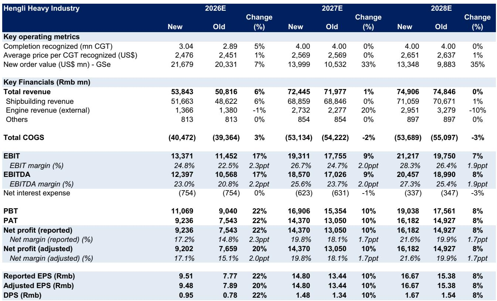
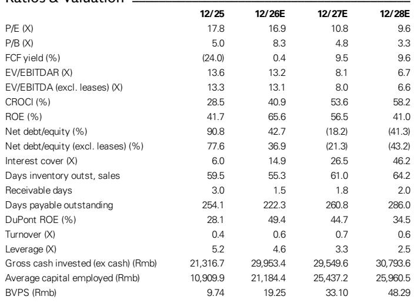

# Hengli Heavy Industry’s 2Q26 Beat Reveals a Structural Shift in Shipbuilding Economics, Not Just a Quarterly Surprise

The market is treating Hengli Heavy Industry’s 2Q26 earnings beat as a positive data point. That interpretation is correct but dangerously shallow. The reported net profit of approximately Rmb2.5 billion, representing 129% sequential growth and a 40% upside relative to consensus expectations, is not merely a function of higher volume or favorable timing. It signals something more fundamental: the company has unlocked a new operating model that compresses the traditional shipbuilding cycle, improves capital efficiency, and creates a self-reinforcing competitive advantage that most observers have not yet priced in.

This matters now because the global shipbuilding industry is entering a period of structural capacity constraint. Tier-1 shipyards globally are booked through 2028, and shippers are actively paying premiums for earlier delivery slots. In this environment, Hengli’s ability to pre-fabricate blocks ahead of phase III drydock operations, deliver vessels months ahead of contractual deadlines, and simultaneously improve product mix toward higher-margin tankers and containerships represents a strategic inflection point. The company is not just building more ships; it is building them faster, better, and more profitably than its peers.

The report we are analyzing, prepared by a global investment bank, revises 2026–2028 earnings estimates upward by 22%, 10%, and 8% respectively, but that is only part of the story. The real insight lies in understanding how Hengli’s operational efficiency, capacity sequencing, and order book dynamics interact to create a durable earnings trajectory that may extend well beyond the current forecast horizon.

## The Pre-Fabrication Advantage Is Reshaping Revenue Recognition and Margin Profiles in Ways Most Analysts Underestimate

The single most underappreciated driver of Hengli’s 2Q26 beat is the earlier commencement of blocks construction ahead of phase III drydock operations. This is not a minor scheduling nuance. In shipbuilding, revenue recognition is tied to construction progress, and blocks are the fundamental building units of a vessel. By pre-fabricating steel blocks in ground workshops before the phase III drydock became operational in June, Hengli effectively front-loaded revenue that would otherwise have been recognized later in the year.

The strategic implication extends far beyond accounting mechanics. Pre-fabrication allows the company to decouple the physical constraints of drydock capacity from the pace of construction. This means Hengli can begin work on higher-margin vessels earlier, rather than waiting for drydock availability. The report notes that the company started blocks construction for tankers and containerships ahead of schedule, which directly improved product mix. The data comparing delivery schedules in July 2026 versus March 2026 shows a clear shift toward these more profitable ship types.

What this means for observers is that Hengli has effectively increased its effective capacity without adding a single new drydock. The company is extracting more economic value from its existing infrastructure by optimizing the sequence and composition of construction activity. This is not a one-time benefit. As the company accumulates experience with this model, the efficiency gains should compound. The report highlights that Hengli delivered two VLCCs to clients at least three months ahead of contract deadline during 2Q26, which the analyst attributes to improved operational efficiency after experience accumulation. This is a learning curve effect that competitors cannot easily replicate.

## The Order Book Is Not Just Full; It Is Strategically Constructed to Maximize Pricing Power and Customer Leverage

Hengli’s order book, estimated at approximately 11.8 million compensated gross tons (CGT), is impressive in scale, but the structure matters more than the size. The company has a cover years ratio of 2.7x, which is significantly below the global average of 3.8x. At first glance, this might appear to be a weakness, suggesting that Hengli has less visibility into future revenue than its peers. The report explicitly reframes this as a competitive moat.

The logic is straightforward but powerful. Shippers are struggling to find available slots for 2028 delivery among tier-1 shipyards. They are actively seeking delivery windows in the second half of 2028 through the first half of 2029 and are willing to pay approximately 10% premiums over vessels scheduled for 2030 delivery. In this context, having a shorter coverage period is an advantage because it means Hengli has more near-term capacity to offer to desperate buyers. The company can command premium pricing for earlier delivery slots while its competitors are fully booked years in advance.

The report provides concrete evidence of this dynamic. After winning Rmb15 billion in new orders at the Posidonia Exhibition in June 2026, news emerged that MSC has ordered up to 20 twenty-thousand TEU containerships from Hengli, valued at an estimated US$4 billion. This single order represents over 10% of the company’s entire order book. The ability to secure such large, high-profile orders from top-tier global shipping lines underscores the brand value and operational credibility Hengli has built.

The sustainability of this order-winning momentum depends on two factors that the report identifies but does not fully explore. First, the global tanker fleet is aging, and replacement demand is accelerating. Second, booming tanker orders are absorbing capacity across the industry. Hengli is positioned at the intersection of these trends. The question observers should ask is whether the company can maintain its pricing advantage as competitors eventually expand their own capacity. The report hints at phase IV expansion but does not provide detail on timing or magnitude.

## Margin Expansion Is Driven by Structural Mix Shift, Not Cyclical Pricing Tailwinds

The most common mistake in analyzing shipbuilding earnings is to attribute margin improvement to rising steel prices or favorable macro conditions. The report makes clear that Hengli’s margin expansion in 2Q26 was driven by product mix improvement and operational efficiency, not external factors. The EBIT margin for 2026E is now forecast at 24.8%, up from 22.5% previously, with further expansion to 26.7% in 2027E and 28.3% in 2028E.

These are not cyclical numbers. They reflect a structural shift in what Hengli builds and how it builds it. The company is increasingly focused on higher-value vessels: tankers and large containerships, which carry better margins than bulk carriers or smaller vessels. The pre-fabrication strategy enables this mix shift by allowing the company to prioritize these vessels in its construction schedule.

The report also shows improving cost efficiency. Cost of goods sold as a percentage of revenue is declining, and the company is generating strong cash flow from operations. Free cash flow is expected to turn positive in 2026E and grow to nearly Rmb15 billion by 2028E. This cash generation will allow Hengli to rapidly de-lever, with net debt turning negative by 2027E. The balance sheet transformation from highly leveraged to net cash within two years is remarkable and suggests that the company’s earnings quality is high.

However, there is a risk that margin expansion may slow as the company scales. The report’s own forecasts show revenue growth decelerating from 148.8% in 2026E to 34.5% in 2027E and just 3.4% in 2028E. This implies that the low-hanging fruit from mix shift and efficiency gains may be captured in the next 12–18 months. Sustaining margin expansion beyond 2028 will require either continued product mix improvement, further capacity expansion, or a sustained pricing premium in the market.

## What the Report Does Not Fully Answer: The Phase IV Capacity Decision and Its Implications for Long-Term Earnings Power

The report acknowledges that further earnings upside exists if Hengli finalizes phase IV capacity addition, which is estimated to add up to 100% capacity relative to the existing three phases. This is a tantalizing prospect but also a significant analytical gap. The report does not provide a timeline, capital expenditure estimate, or expected return on investment for phase IV. It also does not address the regulatory, environmental, or competitive risks associated with such a large expansion.

Observers need to consider several open questions. First, would phase IV be funded internally given the company’s rapidly improving cash flow, or would it require additional debt or equity financing? The balance sheet is improving, but a doubling of capacity would require substantial capital outlay. Second, would the market absorb the additional output without pressuring pricing? The global shipbuilding cycle is strong now, but a wave of new capacity coming online in 2029–2030 could change the supply-demand dynamics. Third, can Hengli replicate its operational efficiency at a significantly larger scale? The learning curve effects that have driven margin improvement may not scale linearly.

The report also leaves unanswered the question of how Hengli’s competitive position would evolve if major competitors, particularly in South Korea and China, also pursue capacity expansion. The global shipbuilding industry has a history of boom-bust cycles driven by overcapacity. Hengli’s current advantage is partly a function of its relative scarcity of available slots. If phase IV materializes and others follow, the pricing premium may erode.

## A Decision Framework for Observers: Evaluating Hengli Across Three Horizons

For those considering a position in Hengli, the report provides sufficient data to construct a multi-horizon thesis. The following framework can help assess risk and return across different time frames.

**Horizon 1 (0–12 months): Execution and momentum.** The immediate catalyst is the 2Q26 beat and the upward revision to earnings forecasts. The key variables to monitor are quarterly delivery volumes, order intake, and margin trends. The report’s confidence in near-term earnings is high, supported by the strong order book and pre-fabrication advantage. The primary risk is that the market has already priced in the beat, limiting upside from here.

**Horizon 2 (12–24 months): Capacity utilization and pricing.** As phase III reaches full utilization and the company begins to exhaust its near-term delivery slots, the focus will shift to whether Hengli can maintain pricing power. The report suggests that shippers are willing to pay premiums for 2028 delivery, but this dynamic may change if global trade slows or if new capacity comes online elsewhere. Observers should track the company’s average price per CGT and the ratio of new orders to deliveries.

**Horizon 3 (24–36 months): Phase IV decision and competitive dynamics.** The most significant swing factor is the phase IV expansion. If Hengli announces a definitive plan with credible financial parameters, the stock could re-rate higher. If the expansion is delayed or abandoned, the growth narrative may shift toward a more moderate earnings trajectory. Phase IV would likely justify a higher multiple.

The report also implies that Hengli’s competitive moat is widening. The combination of pre-fabrication capability, shorter coverage years, and improving operational efficiency creates a virtuous cycle. Faster delivery attracts more orders, which improves scale and learning, which further reduces costs and delivery times. This is the kind of structural advantage that can persist even as the industry cycle turns.

## Why This Analysis Is Just the Beginning

The report from the global investment bank provides a rigorous foundation for understanding Hengli’s near-term earnings trajectory. But the most interesting questions lie beyond the forecast horizon. Will the company use its growing cash pile to invest in phase IV, return capital to shareholders, or pursue vertical integration? How will the competitive landscape evolve as other shipyards respond to the same demand signals? And can Hengli maintain its margin advantage as the mix of vessels in its order book shifts over time?

These are not idle questions. They will determine whether Hengli is a cyclical trading opportunity or a compounder that can deliver sustained returns over multiple years. The report provides the data to ask these questions but does not answer them definitively. That is the nature of high-quality research: it equips readers to make their own judgments rather than prescribing a single conclusion.

For serious observers who want to go deeper, the full report includes detailed exhibits on delivery schedules, order book composition, and earnings sensitivity analysis. The charts and data tables that accompany the original research provide the granularity needed to stress-test the assumptions behind the forecasts.

*For informational purposes only. Portions may be generated, translated, summarized, or edited with AI assistance based on source materials and may contain omissions or errors. Please verify independently. This is not professional advice.*

For informational purposes only. Portions may be generated, translated, summarized, or edited with AI assistance based on source materials and may contain omissions or errors. Please verify independently. This is not professional advice.

