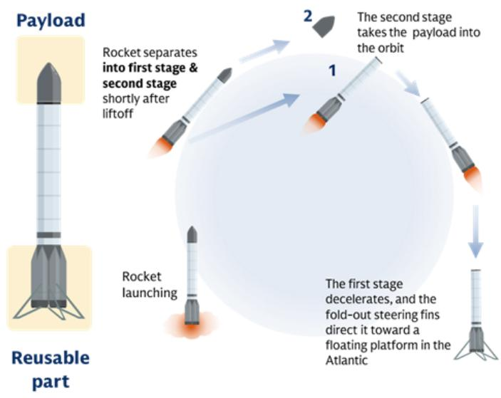
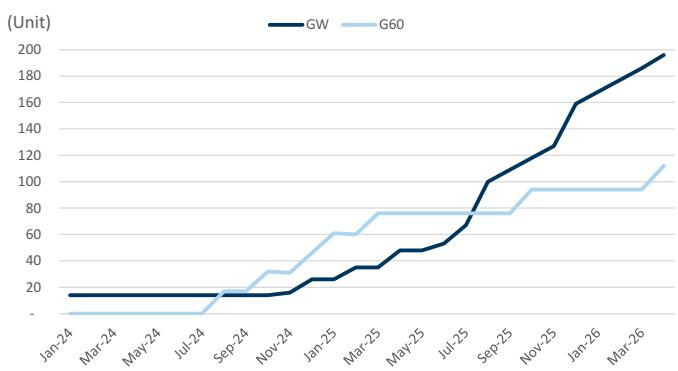
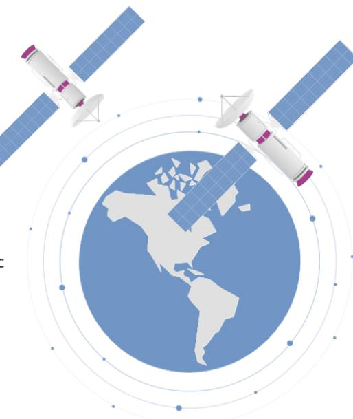

# 全球技术：低轨卫星部署加速；预计2028年/2031年装机量达2.4万/30.5万台；乐观情景下2031年达39.6万台

自2025年2月发布全球低轨卫星行业估算以来，我们观察到2025年低轨卫星发射加速，截至2025年低轨卫星装机量达1万台（此前预估为9,700台）。我们预计这一增长势头将持续，支撑我们更新后的基准情景下全球低轨卫星装机量在2028年/2031年达到2.4万/30.5万台。全球卫星运营商（如亚马逊低轨卫星、国网等）正积极更新卫星发射计划，并拓展卫星应用领域，包括空中通信和空间数据中心，以推动商业化进程。在本报告中，我们提出一个乐观情景，假设中国厂商提交的20万颗卫星申请（新闻链接）得以实现，且低轨容量竞争加剧，预计2028年/2031年装机量将达2.7万/39.6万台。了解更多：SpaceX启动报告。

Allen Chang
+852-2978-2930 |
allen.k.chang@gs.com
GS (Asia) L.L.C.

Eric Sheridan
+1(917)343-8683 |
eric.sheridan@gs.com
GS & Co. LLC

Verena Jeng
+852-2978-1681 | verena.jeng@gs.com
GS (Asia) L.L.C.

Alex Vegliante, CFA
+1(212)934-1878 |
alex.vegliante@gs.com
GS & Co. LLC

Julia Fein-Ashley
+1(212)902-5070 | julia.fein-
ashley@gs.com
GS & Co. LLC

Yifan Hu
+852-2978-0996 | yifan.hu@gs.com
GS (Asia) L.L.C.

Andrew Lee
+44(20)7774-1383 |
andrew.j.lee@gs.com
GS International

James Schneider, Ph.D.
+1(212)357-2929 |
jim.schneider@gs.com
GS & Co. LLC

Halima Elyas
+44(20)7774-6503 |
halima.elyas@gs.com
GS International

## 全球低轨卫星装机量：预计2028年/2031年达2.4万/30.5万台

继2025年低轨卫星发射加速后，我们预计卫星装机量将从2025年的1万台持续增长至2026年/2027年的1.3万/1.7万台（此前预估为1.2万/1.5万台）。随着更多运营商启动或加速发射以抢占低轨理想轨道位置，以及卫星应用向商业领域拓展（如空间数据中心、空中通信、应急通信、自主水面车辆、智慧海洋牧场、无人工业机器人等），我们预计装机量将在2028年/2031年达到2.4万/30.5万台（此前预估为1.9万/4.2万台）。

全球卫星运营商已更新低轨卫星计划并提高目标数量。在运营商提交的文件中，亚马逊低轨卫星于2026年2月获得美国联邦通信委员会批准，可额外发射4,500颗低轨卫星（链接）。中国卫星运营商向国际电信联盟提交申请，寻求批准超过20万颗中低轨卫星（链接）。

图表1：我们预计低轨卫星装机量将在2028年/2031年达到2.4万/30.5万台

<table><tr><td></td><td>2025</td><td>2026E</td><td>2027E</td><td>2028E</td><td>2029E</td><td>2030E</td><td>2031E</td></tr><tr><td colspan="8">卫星 - 新估算</td></tr><tr><td>低轨卫星装机量（台）</td><td>9,982</td><td>13,088</td><td>17,292</td><td>23,796</td><td>90,042</td><td>164,244</td><td>305,293</td></tr><tr><td>同比增长率</td><td></td><td>31%</td><td>32%</td><td>38%</td><td>278%</td><td>82%</td><td>86%</td></tr><tr><td>按应用分类的装机量（台）</td><td>9,982</td><td>13,088</td><td>17,292</td><td>23,796</td><td>90,042</td><td>164,244</td><td>305,293</td></tr><tr><td>卫星互联网</td><td>9,982</td><td>13,088</td><td>17,292</td><td>23,796</td><td>33,219</td><td>46,697</td><td>63,807</td></tr><tr><td>空间数据中心</td><td>-</td><td>-</td><td>-</td><td>-</td><td>56,823</td><td>117,547</td><td>241,486</td></tr><tr><td>其他</td><td>-</td><td>-</td><td>-</td><td>-</td><td>-</td><td>-</td><td>-</td></tr><tr><td>按应用占比</td><td>100%</td><td>100%</td><td>100%</td><td>100%</td><td>100%</td><td>100%</td><td>100%</td></tr><tr><td>卫星互联网</td><td>100%</td><td>100%</td><td>100%</td><td>100%</td><td>37%</td><td>28%</td><td>21%</td></tr><tr><td>空间数据中心</td><td>0%</td><td>0%</td><td>0%</td><td>0%</td><td>63%</td><td>72%</td><td>79%</td></tr><tr><td>其他</td><td>0%</td><td>0%</td><td>0%</td><td>0%</td><td>0%</td><td>0%</td><td>0%</td></tr><tr><td>按供应商地区分类的装机量（台）</td><td>9,982</td><td>13,088</td><td>17,292</td><td>23,796</td><td>90,042</td><td>164,244</td><td>305,293</td></tr><tr><td>美国</td><td>9,077</td><td>11,833</td><td>15,581</td><td>21,419</td><td>83,748</td><td>150,651</td><td>281,050</td></tr><tr><td>中国</td><td>253</td><td>603</td><td>1,103</td><td>1,853</td><td>5,780</td><td>13,100</td><td>23,750</td></tr><tr><td>欧盟</td><td>652</td><td>652</td><td>608</td><td>524</td><td>514</td><td>493</td><td>493</td></tr><tr><td>按供应商地区占比</td><td>100%</td><td>100%</td><td>100%</td><td>100%</td><td>100%</td><td>100%</td><td>100%</td></tr><tr><td>美国</td><td>91%</td><td>90%</td><td>90%</td><td>90%</td><td>93%</td><td>92%</td><td>92%</td></tr><tr><td>中国</td><td>3%</td><td>5%</td><td>6%</td><td>8%</td><td>6%</td><td>8%</td><td>8%</td></tr><tr><td>欧盟</td><td>7%</td><td>5%</td><td>4%</td><td>2%</td><td>1%</td><td>0%</td><td>0%</td></tr><tr><td>新旧对比</td><td>3%</td><td>7%</td><td>16%</td><td>25%</td><td>252%</td><td>399%</td><td>634%</td></tr></table>

来源：公司数据，GS全球研究

火箭是提升发射节奏的关键。(1) 提高发射频率可有效促进卫星发射的快速增长：2025年，领先低轨卫星运营商Starlink每三天发射一次卫星；2026年4月，领先火箭供应商SpaceX在19小时内完成两次火箭发射，表明效率仍有提升空间。(2) 提升火箭运力：当前主流可重复使用火箭可将17,500公斤载荷送入低轨，而下一代火箭运力可达100-150吨。(3) 可重复使用技术是一个里程碑：对于中国低轨卫星，我们预计在其国产可重复使用火箭成功研发后，部署速度将更快提升。

图表2：可重复使用火箭可快速降低发射成本

  
来源：公司数据，GS全球研究

## 乐观情景

我们提出全球低轨卫星装机量的乐观情景，考虑到火箭发射能力可能超预期、卫星通信商业化速度可能快于预期、低轨卫星运营商的长期目标以及空间数据中心的潜在增长空间，预计2028年/2031年装机量将达2.7万/39.6万台（基准情景为2.4万/30.5万台）。

在我们的乐观情景中，主要增长来自中国低轨卫星，这部分未纳入基准情景。尽管技术可行性仍有待验证，但我们认为空间数据中心潜力较大，因其可无限获取低成本太阳能供电，并具备边缘计算能力，可直接处理卫星数据。我们的乐观情景基于中国厂商提交的20万颗低轨星座计划将在长期内实现的假设，以反映商业化加速的潜力。

图表3：情景分析：我们的乐观情景预计全球低轨装机量在2028年/2031年达2.7万/39.6万台

<table><tr><td></td><td>2025</td><td>2026E</td><td>2027E</td><td>2028E</td><td>2029E</td><td>2030E</td><td>2031E</td></tr><tr><td colspan="8">卫星 - 乐观情景</td></tr><tr><td colspan="8">乐观情景 - 低轨装机量（台）</td></tr><tr><td>总计</td><td>9,996</td><td>13,348</td><td>18,226</td><td>26,798</td><td>102,461</td><td>203,018</td><td>395,624</td></tr><tr><td>同比增长率</td><td></td><td>34%</td><td>37%</td><td>47%</td><td>282%</td><td>98%</td><td>95%</td></tr><tr><td>按应用分类的装机量（台）</td><td>9,996</td><td>13,348</td><td>18,226</td><td>26,798</td><td>102,461</td><td>203,018</td><td>395,624</td></tr><tr><td>卫星互联网</td><td>9,993</td><td>13,334</td><td>18,195</td><td>26,624</td><td>40,548</td><td>61,874</td><td>113,204</td></tr><tr><td>空间数据中心</td><td>-</td><td>2</td><td>3</td><td>118</td><td>61,823</td><td>141,013</td><td>282,244</td></tr><tr><td>其他</td><td>3</td><td>12</td><td>28</td><td>55</td><td>90</td><td>130</td><td>176</td></tr><tr><td>按应用占比</td><td>100%</td><td>100%</td><td>100%</td><td>100%</td><td>100%</td><td>100%</td><td>100%</td></tr><tr><td>卫星互联网</td><td>100%</td><td>100%</td><td>100%</td><td>99%</td><td>40%</td><td>30%</td><td>29%</td></tr><tr><td>空间数据中心</td><td>0%</td><td>0%</td><td>0%</td><td>0%</td><td>60%</td><td>69%</td><td>71%</td></tr><tr><td>其他</td><td>0%</td><td>0%</td><td>0%</td><td>0%</td><td>0%</td><td>0%</td><td>0%</td></tr><tr><td>按供应商地区分类的装机量（台）</td><td>9,996</td><td>13,348</td><td>18,226</td><td>26,798</td><td>102,461</td><td>203,018</td><td>395,624</td></tr><tr><td>美国</td><td>9,078</td><td>11,835</td><td>15,584</td><td>21,537</td><td>85,733</td><td>156,117</td><td>293,808</td></tr><tr><td>中国</td><td>266</td><td>861</td><td>2,034</td><td>4,736</td><td>16,183</td><td>46,315</td><td>101,148</td></tr><tr><td>欧盟</td><td>652</td><td>652</td><td>608</td><td>524</td><td>545</td><td>586</td><td>668</td></tr><tr><td>按供应商地区占比</td><td>100%</td><td>100%</td><td>100%</td><td>100%</td><td>100%</td><td>100%</td><td>100%</td></tr><tr><td>美国</td><td>91%</td><td>89%</td><td>86%</td><td>80%</td><td>84%</td><td>77%</td><td>74%</td></tr><tr><td>中国</td><td>3%</td><td>6%</td><td>11%</td><td>18%</td><td>16%</td><td>23%</td><td>26%</td></tr><tr><td>欧盟</td><td>7%</td><td>5%</td><td>3%</td><td>2%</td><td>1%</td><td>0%</td><td>0%</td></tr><tr><td>乐观情景 vs. 基准情景</td><td>0%</td><td>2%</td><td>5%</td><td>13%</td><td>14%</td><td>24%</td><td>30%</td></tr></table>

来源：公司数据，GS全球研究

## 中国进展

装机量加速增长：在基准情景下，我们预计中国供应商运营的低轨卫星装机量在2028年达1,900台，2031年达2.4万台。在乐观情景下，装机量在2031年将达10.1万台。截至2025年底，中国供应商运营的卫星数量为253台，部署正在加速。

图表4：GW和G60运营卫星（2024年1月至2026年4月实际数据）

  
数据截至2026年4月

来源：公司数据

领先供应商已制定部署计划：中国主要低轨星座包括GW（国网）、G60（或SpaceSail）和鸿鹄，均为大规模通信星座，将发射超过1万颗卫星。GW星座于2020年向国际电信联盟提交了12,992颗卫星的计划（来源：新华网，链接），其中10%（即1,299颗）需在2029年前发射。G60计划发射15,000颗卫星，目标是在2027年底前达到1,296颗，2030年前达到15,000颗（来源：新华网，链接）。鸿鹄也于2024年向国际电信联盟提交了1万颗低轨卫星的计划（来源：新浪，链接），意味着到2033年底需有1,000颗卫星在轨运行。除这些计划外，中国卫星运营商在2025年底前共同向国际电信联盟提交了20万颗卫星的申请（链接），我们认为这是为获取频谱和轨道资源而采取的战略举措。

火箭研发快速推进：中国低轨运营商目前主要使用中国航天科技集团的长征六号甲和长征十二号火箭，均为非可重复使用型。然而，可重复使用火箭的研发正在加速，2026年将有更多试飞计划。2026年2月，中国航天科技集团的长征十号火箭成功实现一级海上软着陆溅落（链接）。蓝箭航天的朱雀三号火箭于2025年12月试飞取得部分成功，另一次回收试飞将于2026年第二季度进行（来源：央视，链接）。星际荣耀的双曲线三号可重复使用火箭将于2026年底前进行首次发射（来源：hket，链接）。星河动力的PALLAS-1可重复使用火箭也将在2026年进行首次发射（来源：futurephecd.com，链接）。

## 供应链概览

## 全球卫星供应链

# 卫星生态系统

## 运营商

SpaceX/Starlink ■
Eutelsat ■
Amazon ■
Iridium
中国卫通
银河航天

Telesat
Globalstar
鸿擎科技
Siddus Space
MEASAT
JSAT

VIASAT JSAT 中国卫通 MEASAT Telesat

## 卫星组件

射频与微波
UMT ■
Win Semi ■
国博电子
成都畅达
航天华宇
亚光科技
聚瑞
通宇通讯 ■
电源
TSEC
ChiconyPower
PCB与CCL
同欣电子
Parpro
Compeq
半导体
成都畅达
国博电子
激光通信
中国航天科技

组件
NEC ■
C&Q
Filtronic
Apollo Microwaves
同欣电子
国博电子
Rapidtek

线缆/连接器 鸿海

Unitech PCB
Elite material

## 卫星制造

平台与子系统
鸿海 ■
中国航天科技
长光卫星
银河航天
零重空间
微纳星空

设计/组装/测试  
鸿海 ■  
波音 ■  
Rapitek  
中国卫星  
沪工  
上海航天  
Astranis  
国星宇航

## 卫星发射

火箭实验室
蓝色起源
蓝箭航天
星河动力
东方空间

相对论空间
中科宇航
Hylmpulse
阿丽亚娜空间
Orbex

维珍轨道
星际荣耀
阿丽亚娜集团
PLD Space

## 遥感服务

低轨/中轨/地球同步轨道
航天宏图
航天微电子
Gepvos
中科遥感
Elipspace
Kongberg Gruppen ASA

Maxar
空客 ■
Planet Labs ■

Spire Global
Pixxel

## 定位服务

中轨导航
Trimble
Hexagon
Topcon
海格通信

华测导航 ■
司南导航
中轨定位
HiTarget

## 地面站

设施与系统解决方案
中国卫通
Kratos ■
泰雷兹集团
通信设备
Genew MTI
中国金宝
中国卫星
海格通信 鸿海 ■
聚瑞
天线
航天通宇 ■
华宇

## 用户终端

终端与服务
北斗星通 合众思壮
广和通 中兴通讯 ■
海能达 MTI
奥登
亚太卫星
ODM
WNC ■
鸿海 ■ 聚瑞
Compal ■
天线
M&S 航天
电子 华宇
群创 通宇 ■
Sunway Rapidtek
基带
华创
Cygnusem
存储
美光 ■
模拟
意法半导体 ■
MOSFET
英飞凌 ■
射频前端
卓胜微 ■ 三安光电
唯捷创芯 ■

GS覆盖 私有企业
■ 买入 ■ 卖出 ■ 中性

我们注意到，上述生态系统中的公司列表并非详尽无遗，涉及的公司范围可能比所列示的更广。

## 鸿海入选亚洲确信买入名单

来源：公司数据，GS全球研究

## 披露附录

## Reg AC

我们，Allen Chang、Eric Sheridan、Verena Jeng、Alex Vegliante（CFA）、Julia Fein-Ashley、Yifan Hu、Andrew Lee、James Schneider（博士）和Halima Elyas，特此证明本报告中表达的所有观点准确反映了我们个人对相关公司及其证券的看法。我们还证明，我们的薪酬中没有任何部分直接或间接与报告中表达的具体建议或观点相关。

除非另有说明，本报告封面所列人员为GS全球研究部门的分析师。

撰稿作者：Allen Chang GS (Asia) L.L.C.，Eric Sheridan GS & Co. LLC，Verena Jeng GS (Asia) L.L.C.，Alex Vegliante（CFA）GS & Co. LLC，Julia Fein-Ashley GS & Co. LLC，Yifan Hu GS (Asia) L.L.C.，Andrew Lee GS International，James Schneider（博士）GS & Co. LLC，Halima Elyas GS International。

除非另有说明，本报告撰稿作者披露中列出的个人为GS全球研究部门的分析师。

## GS因子概况

GS因子概况通过将关键属性与市场（即我们评级的股票池）及其行业同行进行比较，为股票提供研究背景。所描绘的四个关键属性是：增长、财务回报、倍数（例如估值）和综合（增长、财务回报和倍数的综合）。增长、财务回报和倍数是通过使用每只股票特定指标的标准化排名来计算的。然后将各指标的标准化排名进行平均，并转换为相关属性的百分位数。每个指标的具体计算可能因财年、行业和地区而异，但标准方法如下：

增长基于股票的前瞻性销售增长、EBITDA增长和每股收益增长（对于金融股，仅基于每股收益和销售增长），百分位数越高表示增长越高的公司。财务回报基于股票的前瞻性ROE、ROCE和CROCI（对于金融股，仅基于ROE），百分位数越高表示财务回报越高的公司。倍数基于股票的前瞻性市盈率、市净率、价格/股息、EV/EBITDA、EV/FCF和EV/债务调整后现金流（对于金融股，仅基于市盈率、市净率和价格/股息），百分位数越高表示股票交易倍数越高。综合百分位数计算为增长百分位数、财务回报百分位数和（100% - 倍数百分位数）的平均值。

财务回报和倍数使用GS分析师对未来至少三个季度后的财年末的预测。增长使用对未来至少七个季度后的财年与未来至少三个季度后的财年相比的输入数据（所有指标均基于每股）。

有关我们如何计算GS因子概况的更详细说明，请联系您的GS代表。

## 并购排名

在我们的全球覆盖范围内，我们使用并购框架研究股票，考虑定性因素和定量因素（可能因行业和地区而异），以纳入某些公司可能被收购的潜在可能性。然后我们分配一个并购排名，作为对我们评级覆盖范围内的公司进行评分的方法，从1到3，其中1表示公司成为收购目标的可能性较高（30%-50%），2表示可能性中等（15%-30%），3表示可能性较低（0%-15%）。对于排名为1或2的公司，按照我们的标准部门指南，我们在目标价中纳入并购成分。并购排名为3被认为不重要，因此不计入我们的目标价，并且可能在研究中讨论或不讨论。

## Quantum

Quantum是GS的专有数据库，提供详细的财务报表历史、预测和比率的访问。它可用于对单一公司进行深入分析，或比较不同行业和市场的公司。

## 披露

## 评级和定价信息

亚马逊公司（买入，\$244.16），波音公司（买入，\$234.54），Compal（中性，NT\$35.70），Eutelsat Communications（中性，€2.55），鸿海（买入，NT\$242.00），英飞凌（买入，€77.21），Kratos（买入，\$53.54），NEC（买入，¥4,347），广达（中性，NT\$378.00），意法半导体（中性，€63.36），通宇通讯（买入，Rmb33.37），UMT（买入，NT\$1,300.00），唯捷创芯（卖出，Rmb31.51），WNC（买入，NT\$258.50），稳懋半导体（卖出，NT\$421.00）和中兴通讯（H股）（中性，HK\$23.04）。

## 评级/投资银行关系分布

GS研究全球股票覆盖范围

<table><tr><td rowspan="2"></td><td colspan="3">评级分布</td><td colspan="3">投资银行关系</td></tr><tr><td>买入</td><td>持有</td><td>卖出</td><td>买入</td><td>持有</td><td>卖出</td></tr><tr><td>全球</td><td>50%</td><td>34%</td><td>16%</td><td>65%</td><td>60%</td><td>45%</td></tr></table>

截至2026年4月1日，GS全球研究对3,074只股票有评级。GS将股票指定为买入和卖出，列入各地区的投资清单；未如此指定的股票被视为中性。为满足FINRA规则要求的上述披露，此类分配等同于买入、持有和卖出。请参见下文“评级、覆盖范围和相关定义”。投资银行关系图反映了每个评级类别中GS在过去十二个月内提供过投资银行服务的公司所占的百分比。

## 监管披露

## 美国法律法规要求的披露

请参见上述针对本报告中提及的公司的具体监管披露，以了解以下任何要求的披露：待定交易中的经理或联合经理；1%或以上的所有权；特定服务的报酬；客户关系类型；先前期间的已管理/联合管理公开发行；董事职位；对于股票，做市和/或专家角色。GS交易或可能作为本金交易本报告中讨论的发行人的债务证券（或相关衍生品）。

以下是额外的要求披露：所有权和重大利益冲突：GS政策禁止其分析师、向分析师报告的专业人员及其家庭成员持有分析师覆盖范围内的任何公司的证券。分析师薪酬：分析师的薪酬部分基于GS的盈利能力，其中包括投资银行收入。分析师作为高管或董事：GS政策通常禁止其分析师、向分析师报告的人员或其家庭成员在分析师覆盖范围内的任何公司担任高管、董事或顾问。非美国分析师：非美国分析师可能不是GS & Co. LLC的关联人员，因此可能不受FINRA规则2241或FINRA规则2242关于与主题公司沟通、公开露面以及交易分析师所覆盖证券的限制。

## 美国以外司法管辖区法律法规要求的额外披露

以下披露是所指示司法管辖区要求的，除非已根据美国法律法规在上文作出。澳大利亚：GS Australia Pty Ltd及其关联公司不是澳大利亚的授权存款机构（该术语在1959年银行法（联邦）中定义），在澳大利亚不提供银行服务，也不从事银行业务。除非GS另有约定，本研究及其任何访问仅面向澳大利亚公司法意义上的“批发客户”。在编制研究报告时，GS Australia全球研究成员可能参加由研究报告所涉及的公司和其他实体主办或组织的现场访问和其他会议。在某些情况下，如果GS Australia认为在特定情况下适当且合理，此类现场访问或会议的费用可能部分或全部由相关发行人承担。如果本文档内容包含任何金融产品建议，则仅为一般性建议，由GS在未考虑客户目标、财务状况或需求的情况下编制。客户在根据任何此类建议采取行动之前，应考虑该建议是否适合其自身目标、财务状况和需求。某些GS Australia和New Zealand利益披露以及GS澳大利亚卖方研究独立性政策声明的副本可在以下网址获取：https://www.goldmansachs.com/disclosures/australia-new-zealand/index.html。巴西：有关CVM决议n. 20的披露信息可在https://www.gs.com/worldwide/brazil/area/gir/index.html获取。在适用的情况下，根据CVM决议n. 20第20条的定义，主要负责本研究报告内容的巴西注册分析师是本报告开头列出的第一作者，除非文本末尾另有说明。加拿大：此信息仅供您参考，在任何情况下均不应被解释为GS & Co. LLC为在加拿大购买证券而在加拿大交易任何加拿大证券的广告、要约或招揽。GS & Co. LLC未在加拿大任何司法管辖区根据适用的加拿大证券法注册为交易商，通常不允许交易加拿大证券，并且可能被禁止在加拿大某些司法管辖区销售某些证券和产品。如果您希望在加拿大交易任何加拿大证券或其他产品，请联系GS Canada Inc.（GS Group Inc.的关联公司）或其他注册的加拿大交易商。香港：可向GS (Asia) L.L.C.索取本研究中提及的所覆盖公司证券的进一步信息。印度：可从GS (India) Securities Private Limited获取本研究中提及的主题公司或公司的进一步信息，研究分析师 - SEBI注册号INH000001493，地址：10th Floor, Ascent-Worli, Sudam Kalu Ahire Marg, Worli, Mumbai-400 025, India，企业识别号U74140MH2006FTC160634，电话+91 22 6616 9000，传真+91 22 6616 9001。GS可能实益拥有本研究报告所提及的主题公司或公司1%或以上的证券（该术语在1956年印度证券合同（监管）法第2(h)条中定义）。SEBI的注册和NISM的认证绝不保证中介机构的业绩，也不向读者提供任何回报保证。GS (India) Securities Private Limited合规官和读者投诉联系详情、年度合规审计报告副本以及其他相关信息和披露可在以下链接找到：https://www.goldmansachs.com/worldwide/india/research-analyst。日本：见下文。韩国：除非GS另有约定，本研究及其任何访问仅面向金融服务和资本市场法意义上的“专业读者”。可从GS (Asia) L.L.C.首尔分行获取本研究中提及的主题公司或公司的进一步信息。新西兰：GS New Zealand Limited及其关联公司不是新西兰的“注册银行”或“存款接受者”（定义见1989年新西兰储备银行法）。除非GS另有约定，本研究及其任何访问面向“批发客户”（定义见2008年金融顾问法）。某些GS Australia和New Zealand利益披露的副本可在以下网址获取：https://www.goldmansachs.com/disclosures/australia-new-zealand/index.html。俄罗斯：在俄罗斯联邦分发的研究报告不是俄罗斯立法中定义的广告，而是信息和分析，其主要目的不是推广产品，并且不提供俄罗斯评估活动立法意义上的评估。研究报告不构成俄罗斯法律法规定义的个人化研究建议，不针对特定客户，并且是在未分析客户财务状况、研究概况或风险概况的情况下编制的。GS对客户或任何其他人基于本研究报告可能做出的任何研究决策不承担任何责任。新加坡：GS (Singapore) Pte.（公司编号：198602165W），受新加坡金融管理局监管，对本研究承担法律责任，如有任何与本研究报告相关的事宜，应联系该公司。台湾：此材料仅供参考，未经许可不得转载。读者应仔细考虑自身研究风险。研究结果由个人读者自行负责。英国：在英国可能被归类为零售客户的人员（该术语在金融行为监管局规则中定义）应结合GS先前关于本研究报告所提及的所覆盖公司的研究来阅读本研究报告，并应参考GS International已发送给他们的风险警告。这些风险警告的副本以及本报告中使用的某些金融术语的词汇表，可向GS International索取。

欧盟和英国：有关欧盟委员会授权条例（EU）（2016/958）第6(2)条（包括该授权条例在英国脱离欧盟和欧洲经济区后作为英国国内法律和法规实施）的披露信息，涉及客观呈现研究建议或其他建议或暗示研究策略的技术安排以及披露特定利益或利益冲突迹象的技术标准，可在https://www.gs.com/disclosures/europeanpolicy.html获取，其中说明了与研究相关的利益冲突管理欧洲政策。

日本：GS Japan Co., Ltd.是在关东财务局注册的金融工具交易商，注册号Kinsho 69，是日本证券交易商协会、日本金融期货协会、第二类金融工具公司协会和日本研究管理协会的成员。股票买卖需支付与客户预先确定的佣金加上消费税。有关日本证券交易所、日本证券交易商协会或日本证券金融公司要求的任何适用披露，请参见公司特定披露。

## 评级、覆盖范围和相关定义

买入（B）、中性（N）、卖出（S）分析师建议将股票作为买入或卖出列入各地区的投资清单。被指定为投资清单上的买入或卖出取决于股票相对于其覆盖范围的总回报潜力。任何未被指定为投资清单上的买入或卖出且具有活跃评级（即未暂停评级、未评级、早期生物技术、暂停覆盖或未覆盖的股票）的股票被视为中性。每个地区管理地区确信买入清单，这些清单选自相应地区投资清单中的报告评级股票，代表侧重于总回报潜力大小和/或在其各自覆盖范围内实现回报的可能性的研究建议。股票加入或退出此类确信买入清单由每个相应地区的研究审查委员会或其他指定委员会管理，并不代表分析师对该等股票的研究评级的变更。

总回报潜力代表当前股价与目标价之间的上行或下行差异，包括所有已支付或预期股息，在目标价相关的时间范围内预期实现。所有覆盖的股票都需要目标价。总回报潜力、目标价和相关时间范围在每份添加或重申投资清单成员资格的报告中有说明。

覆盖范围：每个覆盖范围的所有股票清单可按主要分析师、股票和覆盖范围在https://www.gs.com/research/hedge.html获取。

未评级（NR）。当GS在涉及该公司的合并或战略交易中担任顾问角色时，当存在法律、监管或政策限制（由于GS参与交易）时，以及在某些其他情况下，根据GS政策，研究评级、目标价和盈利预测（如相关）将被移除。早期生物技术（ES）。根据GS政策，当该公司没有通过二期临床试验的药物、治疗或医疗设备，也没有获得分销二期后药物、治疗或医疗设备的许可时，不分配研究评级和目标价。评级暂停（RS）。GS已暂停对该股票的研究评级和目标价，因为没有足够的基础来确定研究评级或目标价。先前的评级和目标价（如有）不再对该股票有效，不应依赖。覆盖暂停（CS）。GS已暂停对该公司的覆盖。未覆盖（NC）。GS不覆盖该公司。

## 全球产品；分发实体

GS全球研究在全球范围内为GS客户制作和分发研究产品。位于GS全球各办事处的分析师对行业和公司进行研究，并对宏观经济、货币、大宗商品和组合策略进行研究。本研究由GS Australia Pty Ltd（ABN 21 006 797 897）在澳大利亚分发；由GS do Brasil Corretora de Títulos e Valores Mobiliários S.A.在巴西分发；GS Brazil公共沟通渠道：0800 727 5764和/或contatogoldmanbrasil@gs.com。工作日（节假日除外），上午9点至下午6点。GS Brasil客户沟通渠道：0800 727 5764和/
