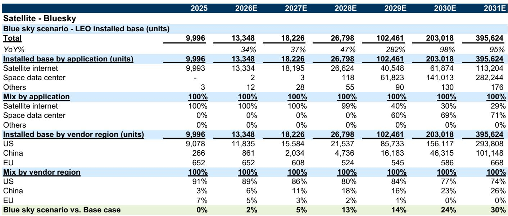
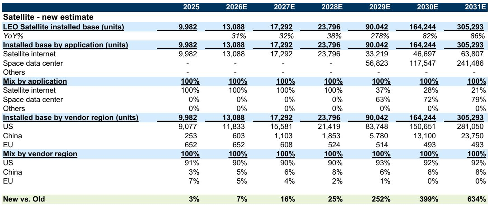

# The LEO Satellite Market Is Not Just Growing—It Is About to Inflect, and the Window for Strategic Positioning Is Narrowing

The global Low Earth Orbit satellite industry has reached an inflection point that most observers and strategists are still underestimating. In 2025, the installed base of LEO satellites reached approximately 10,000 units, exceeding earlier projections. This is not merely a data point to note; it is the leading indicator of a structural shift. The pace of launches has accelerated, operators are filing for dramatically larger constellations, and new applications—particularly space data centers—are moving from concept to credible demand drivers. The base case now projects an installed base of 24,000 units by 2028 and 305,000 units by 2031. That represents a compound annual growth rate that few industrial sectors can match.

Why now matters. The combination of reusable rocket technology maturing, regulatory filings surging, and commercial use cases expanding has created a window where early strategic commitments will define competitive outcomes for the next decade. The question is no longer whether LEO satellites will scale, but who will capture the value across the supply chain, which applications will drive the majority of demand, and how quickly the center of gravity shifts from US-dominant operators to a more multipolar landscape. The report underpinning this analysis provides the most detailed framework we have seen for answering these questions, but it also leaves critical gaps that demand independent judgment.

The argument of this article is straightforward: the LEO satellite market is on the cusp of a compound growth phase that will reshape telecommunications, edge computing, and defense-related infrastructure. Corporate strategists and observers who treat this as a slow, linear build-out will be caught off guard. The data supports a view that the installed base could more than triple between 2028 and 2031 alone, driven by the emergence of space-based data centers as the dominant application. But the path to that outcome is not uniform, and the risks—technological, regulatory, and geopolitical—are as large as the opportunity.

## The Installed Base Forecast Has Been Revised Upward Sharply, and the Revision Itself Tells a Story About Momentum

The most concrete signal from the updated estimates is the magnitude of the upward revision. The previous forecast for 2028 was 19,000 units; it is now 24,000. For 2031, the previous forecast was 42,000 units; it is now 305,000. That is not a marginal adjustment. It is a fundamental revaluation of how quickly the ecosystem can scale. The key driver is not just operator ambition but demonstrated launch cadence. In 2025, a leading operator launched satellites every three days. In April 2026, a major rocket supplier launched two rockets in 19 hours. These are not theoretical efficiencies; they are operational realities that compound over time.

The implication for strategists is that the supply-side constraint—launch capacity—is loosening faster than most models assume. Reusable rockets are the critical enabler. Current mainstream reusable rockets can carry 17,500 kilograms to LEO, while next-generation designs target 100 to 150 tonnes. Each improvement in payload capacity directly translates into lower cost per satellite and faster constellation build-out. The report notes that reusable technology is a milestone for Chinese operators in particular, where domestic reusable rockets are expected to accelerate deployment once successfully developed. This is not a future scenario; it is an unfolding process with visible milestones.

What this means in practice is that the window for securing orbital slots, spectrum rights, and market share is closing. Operators that delay launch plans risk losing access to the most favorable orbital altitudes. The 200,000 satellite applications submitted by Chinese vendors to the International Telecommunication Union should be read as a strategic land grab, not a near-term production target. The installed base numbers, however impressive, may still understate the eventual scale if regulatory approvals and launch capacity align.

## The Blue Sky Scenario Reveals Where the Real Upside Resides: Chinese Constellations and Space Data Centers

The base case is already aggressive, but the blue sky scenario is where the strategic imagination should focus. Under the blue sky scenario, the installed base reaches 27,000 units by 2028 and 396,000 units by 2031. The gap between base and blue sky widens from 13 percent in 2028 to 30 percent in 2031. The source of that gap is almost entirely attributable to two factors: faster-than-expected deployment of Chinese LEO satellites and the commercialization of space data centers.

Chinese operators currently account for only 3 percent of the installed base, but the blue sky scenario projects that share to reach 26 percent by 2031. That represents a jump from roughly 250 units to over 100,000 units. The assumption rests on the 200,000 satellite constellation plans submitted to the ITU. Even if only a fraction of those plans materialize, the scale would transform the global supply chain. Chinese rocket development is accelerating, with multiple reusable rocket programs scheduled for test flights in 2026. The LM-10 achieved a first-stage soft-landing splashdown in February 2026. The Zhuque-3, Hyperbola-3, and PALLAS-1 are all on track for launches this year or next. The technology is not hypothetical; it is being tested.

The second driver is space data centers. In the base case, space data centers account for zero percent of the installed base through 2028, then jump to 63 percent of new units by 2029 and 79 percent by 2031. In the blue sky scenario, the ramp is even steeper. This is the most speculative but potentially the most transformative element of the forecast. Space data centers offer unlimited access to solar power and the ability to process data in orbit, reducing latency for satellite-based applications. The report treats this as a plausible upside, but the technological feasibility is not yet proven at scale. The open question is whether the economics of in-orbit computing can compete with terrestrial data centers, especially as ground-based AI infrastructure continues to scale.

For decision-makers, the blue sky scenario is not a prediction; it is a sensitivity analysis that highlights which variables matter most. If Chinese rocket development succeeds and space data centers prove viable, the market could be 30 percent larger than the base case by 2031. That is a difference of nearly 100,000 satellites. The strategic implication is that bets on LEO satellite exposure should be sized not for the base case but for the range of outcomes, with particular attention to the Chinese supply chain and in-orbit computing.

## The Supply Chain Is More Concentrated Than It Appears, and the Concentration Creates Both Risk and Opportunity

The report includes a detailed supply chain map covering operators, satellite components, manufacturing, launching, ground stations, user terminals, and services. The breadth of the ecosystem is impressive, but the concentration is what matters. US-based operators and suppliers dominate the installed base, accounting for 91 percent in 2025. That share is projected to remain above 90 percent through 2028 in the base case, before declining to 92 percent by 2031. In the blue sky scenario, the US share falls to 74 percent as Chinese operators ramp.

The component supply chain is similarly concentrated. Key semiconductor, RF microwave, and power supply components are sourced from a limited number of suppliers, many of which are covered by the same research team. The report flags specific companies across the value chain, from satellite operators to component manufacturers to launch providers. For observers, the question is not just which companies are exposed but which have pricing power and technological moats. The launch segment, for example, is dominated by a small number of players with reusable rocket technology. The satellite manufacturing segment is more fragmented but requires specialized design and assembly capabilities that take years to build.

The risk is that supply chain bottlenecks could constrain growth even if demand is strong. The report implicitly acknowledges this by emphasizing rocket capacity and launch frequency as key variables. But the same logic applies to components. If satellite production ramps faster than the supply of specialized semiconductors or antennas, the installed base forecast could prove optimistic. The report does not provide a detailed supply-demand balance for components, which is a meaningful gap for observers to analyze independently.

The opportunity is in identifying which parts of the supply chain will see the most value creation as scale increases. Historically, infrastructure build-outs tend to benefit upstream suppliers first, before value shifts to operators and service providers. In LEO satellites, the launch segment and key component suppliers may capture disproportionate value in the near term, while operators face competitive pressure as constellations multiply.

## What the Report Does Not Fully Answer: The Economics of Space Data Centers and the Geopolitical Risk to Chinese Deployment

Every forecast has its blind spots, and this report is no exception. Two areas stand out as under-analyzed relative to their importance. First, the economics of space data centers remain opaque. The report assumes that space data centers will become the dominant application by 2029, accounting for over 60 percent of new satellite units. But the unit economics of in-orbit computing are not presented. How does the cost per compute cycle compare to terrestrial data centers? What is the breakeven utilization rate? How do cooling, power, and maintenance costs scale in orbit? Without answers to these questions, the blue sky scenario rests on a technological assumption that has not been validated commercially.

Second, the geopolitical dimension of Chinese satellite deployment is treated as a technical challenge rather than a strategic one. The report notes that Chinese operators submitted applications for 200,000 satellites and that reusable rockets are in development. But it does not address the potential for export controls, technology restrictions, or regulatory barriers that could slow Chinese deployment. The US and its allies have already imposed restrictions on semiconductor exports to China, and satellite components are likely to face similar scrutiny. Even if Chinese rockets succeed technically, the supply chain for advanced components may be constrained. The report's assumption that Chinese vendors will achieve the 200,000 satellite plan in the long term is plausible but far from certain.

These gaps are not criticisms of the report; they are invitations for further analysis. Observers and strategists should build their own scenarios around space data center economics and Chinese supply chain resilience. The report provides the framework and the base data, but the judgment calls are yours to make.

## A Decision Framework for Strategists and Observers

The report's data can be organized into a three-part decision framework that helps prioritize actions and capital allocation.

First, assess your exposure to launch capacity. The single most important variable in the LEO satellite build-out is the availability of reusable rockets at scale. If you are observing satellite operators or manufacturing, your returns depend on launch costs and frequency. If you are a corporate strategist considering satellite-based services, your timeline depends on when capacity becomes available. The report shows that launch efficiency is improving rapidly, but it also shows that the gap between base and blue sky scenarios widens over time, meaning that launch capacity is the binding constraint in both cases.

Second, evaluate the application mix. The report projects that satellite internet will dominate through 2028, but space data centers will become the majority application thereafter. This shift has profound implications for satellite design, orbital altitude selection, and ground infrastructure. Satellite internet requires different bandwidth, power, and latency characteristics than data centers. If you are observing component suppliers, the application mix determines which components will see the most demand. If you are a service provider, the application mix determines your competitive landscape.

Third, monitor the Chinese trajectory as a separate variable. The report treats Chinese deployment as a blue sky upside, but it may be more appropriately viewed as a distinct scenario with its own risks and drivers. Chinese operators have the ambition and the regulatory filings, but they face technological, supply chain, and geopolitical hurdles that US operators do not. The decision framework should include a China-specific scenario that accounts for delays, restrictions, or accelerations. The difference between the base case and blue sky scenario is largely driven by China, so getting this variable right is essential.

## The Full Report Contains the Charts and Data You Need to Make These Judgments

The analysis above draws on the most detailed LEO satellite forecast we have seen, but it is necessarily selective. The full report includes the original exhibits showing the installed base projections by application and vendor region, the scenario analysis tables, the rocket cost curves, and the supply chain ecosystem map. These charts are not decorative; they are the analytical backbone of the forecast. Understanding the slope of the growth curve, the composition of the installed base, and the regional mix is essential for forming your own view.

The report also includes the specific company coverage and ratings that underpin the supply chain analysis. If you are evaluating individual companies or private entities in the LEO satellite ecosystem, the report provides the context for why certain companies are positioned to benefit and others face headwinds.

Join the community to read the full report and review the original charts.

*For informational purposes only. Portions may be generated, translated, summarized, or edited with AI assistance based on source materials and may contain omissions or errors. Please verify independently. This is not professional advice.*

For informational purposes only. Portions may be generated, translated, summarized, or edited with AI assistance based on source materials and may contain omissions or errors. Please verify independently. This is not professional advice.

