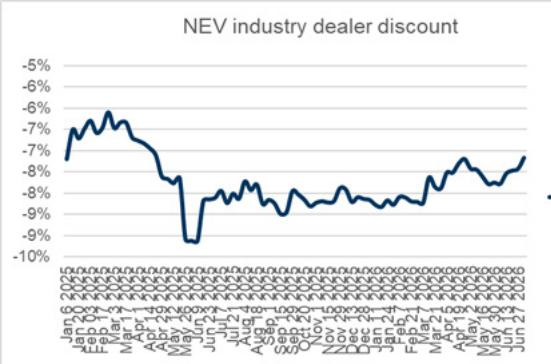
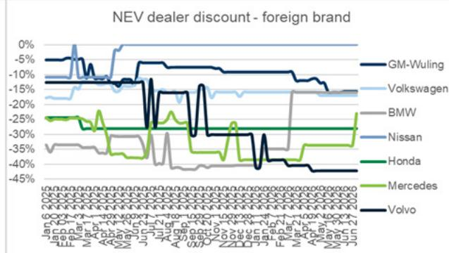
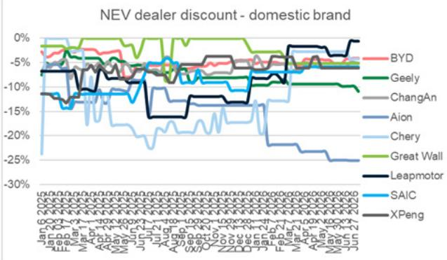
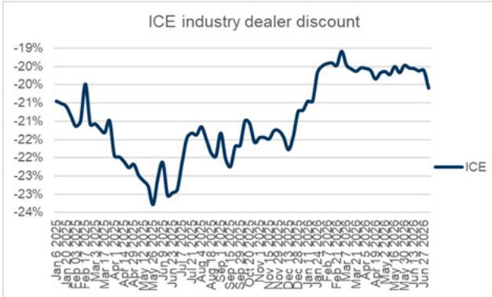
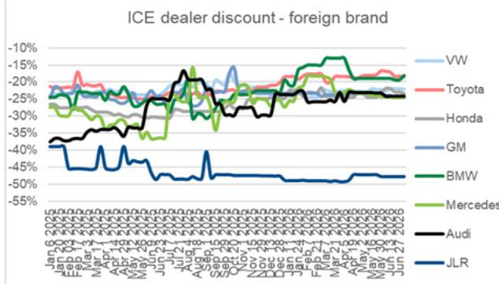
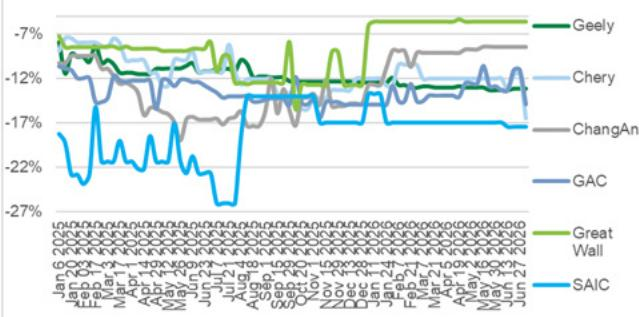

# 中国新能源汽车周度观察

# 2026年第27周 - 周度新能源车订单环比持平，比亚迪因海豹08上市环比增长23%

核心观察：本周新能源车订单环比持平，同比下降41%（剔除小米后同比下降13%，小米去年同期因YU7上市基数较高）。比亚迪受7月2日海豹08 DM和EV上市推动，环比增长23%表现突出。6月零售/批发新能源渗透率达63%/63%。

精选乘用车市场周度表现图表汇编，分为以下类别：(1) 主要新能源品牌周度订单量，(2) 关注事件，(3) 新能源/燃油车经销商价格折扣追踪，(4) 上游电池价格动态。

## 2026年第27周要点：

主要品牌订单：比亚迪/特斯拉/蔚来环比增长23%/-3%/-7%，比亚迪主要受新车型上市推动（即7月2日海豹08 DM和EV）。

■ 乘联会周度趋势：6月1-30日，乘用车零售165.1万辆（同比下降21%/环比增长9%），批发237.6万辆（同比下降4%/环比增长7%）。新能源车零售103.7万辆（同比下降7%/环比增长9%），批发150.6万辆（同比增长22%/环比增长11%），6月1-30日新能源渗透率62.8%/63.4%，5月为63%/61.1%。

■ 主要价格趋势：新能源车经销商折扣环比收窄，燃油车经销商折扣环比扩大。

上游电池价格动态：电池级碳酸锂价格升至16.5万元/吨（环比上涨8.9%），方形电池（LFP）和方形电池（NCM）价格环比持平。

## 周度订单汇总

2026年第27周（6/29-7/5）主要品牌周度订单趋势：

主要新能源车企合计订单环比持平，同比下降41%（剔除小米后同比下降13%，小米去年同期因YU7上市基数较高）。

比亚迪/特斯拉/蔚来环比增长23%/-3%/-7%，比亚迪主要受新车型上市推动（即7月2日海豹08 DM和EV）。

年初至今订单方面，蔚来/鸿蒙智行/特斯拉同比增长98%/+29%/0%。

<table><tr><td></td><td>2026年1月</td><td>2026年2月</td><td>2026年3月</td><td>2026年4月</td><td>2026年5月</td><td>2026年6月</td><td>2026年7月至今</td><td>2026年初至今</td></tr><tr><td colspan="9">月度订单（辆）</td></tr><tr><td>比亚迪（王朝&海洋）</td><td>123535</td><td>96547</td><td>252181</td><td>223899</td><td>197343</td><td>295514</td><td>86500</td><td>1250805</td></tr><tr><td>吉利（银河&极氪）</td><td></td><td></td><td>85343</td><td>125606</td><td>114161</td><td>110516</td><td>22700</td><td>451840</td></tr><tr><td>鸿蒙智行</td><td>26347</td><td>19574</td><td>45610</td><td>122320</td><td>143479</td><td>67232</td><td>8110</td><td>430355</td></tr><tr><td>零跑</td><td></td><td></td><td>50257</td><td>82036</td><td>67357</td><td>59173</td><td>13800</td><td>268680</td></tr><tr><td>特斯拉</td><td>30271</td><td>32614</td><td>60929</td><td>61914</td><td>57371</td><td>54214</td><td>10900</td><td>305100</td></tr><tr><td>蔚来</td><td>15817</td><td>13400</td><td>38190</td><td>44025</td><td>86183</td><td>76636</td><td>10800</td><td>281965</td></tr><tr><td>理想</td><td>18243</td><td>14614</td><td>26851</td><td>36401</td><td>43150</td><td>29609</td><td>5700</td><td>172940</td></tr><tr><td>小米</td><td>5529</td><td>10171</td><td>60587</td><td>33513</td><td>33980</td><td>27263</td><td>5400</td><td>174900</td></tr><tr><td>小鹏</td><td>16957</td><td>14597</td><td>41607</td><td>39394</td><td>54514</td><td>36059</td><td>6750</td><td>207950</td></tr><tr><td>合计</td><td>236699</td><td>201519</td><td>661556</td><td>769108</td><td>797539</td><td>756215</td><td>170660</td><td>3544535</td></tr><tr><td colspan="9">同比（%）</td></tr><tr><td>比亚迪（王朝&海洋）</td><td>-57%</td><td>-64%</td><td>-31%</td><td>-29%</td><td>-41%</td><td>-14%</td><td>11%</td><td>-37%</td></tr><tr><td>吉利（银河&极氪）</td><td></td><td></td><td></td><td></td><td></td><td></td><td></td><td></td></tr><tr><td>鸿蒙智行</td><td>-25%</td><td>-22%</td><td>-21%</td><td>14%</td><td>154%</td><td>58%</td><td>-18%</td><td>29%</td></tr><tr><td>零跑</td><td></td><td></td><td></td><td></td><td></td><td></td><td></td><td></td></tr><tr><td>特斯拉</td><td>-37%</td><td>-37%</td><td>2%</td><td>55%</td><td>55%</td><td>4%</td><td>-36%</td><td>0%</td></tr><tr><td>蔚来</td><td>-9%</td><td>-2%</td><td>97%</td><td>24%</td><td>190%</td><td>248%</td><td>96%</td><td>98%</td></tr><tr><td>理想</td><td>-47%</td><td>-46%</td><td>-20%</td><td>-9%</td><td>-19%</td><td>-21%</td><td>-40%</td><td>-26%</td></tr><tr><td>小米</td><td>-86%</td><td>-79%</td><td>-27%</td><td>-5%</td><td>51%</td><td>-91%</td><td>-93%</td><td>-71%</td></tr><tr><td>小鹏</td><td>-18%</td><td>-41%</td><td>-26%</td><td>7%</td><td>18%</td><td>-21%</td><td>-76%</td><td>-19%</td></tr><tr><td>合计</td><td>-51%</td><td>-56%</td><td>-22%</td><td>-8%</td><td>6%</td><td>-31%</td><td>-41%</td><td>-27%</td></tr><tr><td colspan="9">环比（%）</td></tr><tr><td>比亚迪（王朝&海洋）</td><td>-56%</td><td>-22%</td><td>161%</td><td>-11%</td><td>-12%</td><td>50%</td><td></td><td></td></tr><tr><td>吉利（银河&极氪）</td><td></td><td></td><td></td><td>47%</td><td>-9%</td><td>-3%</td><td></td><td></td></tr><tr><td>鸿蒙智行</td><td>-52%</td><td>-26%</td><td>133%</td><td>168%</td><td>17%</td><td>-53%</td><td></td><td></td></tr><tr><td>零跑</td><td></td><td></td><td></td><td>63%</td><td>-18%</td><td>-12%</td><td></td><td></td></tr><tr><td>特斯拉</td><td>-39%</td><td>8%</td><td>87%</td><td>2%</td><td>-7%</td><td>-6%</td><td></td><td></td></tr><tr><td>蔚来</td><td>-49%</td><td>-15%</td><td>185%</td><td>15%</td><td>96%</td><td>-11%</td><td></td><td></td></tr><tr><td>理想</td><td>-28%</td><td>-20%</td><td>84%</td><td>36%</td><td>19%</td><td>-31%</td><td></td><td></td></tr><tr><td>小米</td><td>-63%</td><td>84%</td><td>495%</td><td>-45%</td><td>1%</td><td>-20%</td><td></td><td></td></tr><tr><td>小鹏</td><td>-48%</td><td>-14%</td><td>185%</td><td>-5%</td><td>38%</td><td>-34%</td><td></td><td></td></tr><tr><td>合计</td><td>-51%</td><td>-15%</td><td>161%</td><td>16%</td><td>4%</td><td>-5%</td><td></td><td></td></tr></table>

来源：ThinkerCar，数据由GS全球研究汇编

图表1：新能源品牌周度订单汇总

<table><tr><td>2025年</td><td>2025年</td><td>2025年</td><td>2025年</td><td>2026年</td><td>2026年</td><td>2026年</td><td>2026年</td></tr><tr><td>第24周6/9-6/15</td><td>第25周6/16-6/22</td><td>第26周6/23-6/29</td><td>第27周6/30-7/6</td><td>第24周6/8-6/14</td><td>第25周6/15-6/21</td><td>第26周6/22-6/28</td><td>第27周6/29-7/5</td></tr><tr><td colspan="8">周度订单（辆）</td></tr><tr><td>84000</td><td>80000</td><td>82000</td><td>78000</td><td>45700</td><td>106800</td><td>70600</td><td>86500</td></tr><tr><td></td><td></td><td></td><td></td><td>26760</td><td>24180</td><td>28250</td><td>22700</td></tr><tr><td>9300</td><td>9000</td><td>10000</td><td>9900</td><td>18240</td><td>11675</td><td>10820</td><td>8110</td></tr><tr><td></td><td></td><td></td><td></td><td>11530</td><td>14100</td><td>15000</td><td>13800</td></tr><tr><td>13000</td><td>12000</td><td>11600</td><td>17000</td><td>13100</td><td>12600</td><td>11200</td><td>10900</td></tr><tr><td>5100</td><td>4900</td><td>5000</td><td>5500</td><td>19480</td><td>14450</td><td>11600</td><td>10800</td></tr><tr><td>9200</td><td>9000</td><td>7600</td><td>9500</td><td>5500</td><td>5930</td><td>9900</td><td>5700</td></tr><tr><td>5000</td><td>4000</td><td>283000</td><td>78500</td><td>5010</td><td>7200</td><td>6100</td><td>5400</td></tr><tr><td>9000</td><td>8800</td><td>9400</td><td>28600</td><td>8320</td><td>9000</td><td>7300</td><td>6750</td></tr><tr><td>134600</td><td>127700</td><td>408600</td><td>227000</td><td>153640</td><td>205935</td><td>170770</td><td>170660</td></tr><tr><td colspan="8">同比（%）</td></tr><tr><td></td><td></td><td></td><td></td><td>-46%</td><td>34%</td><td>-14%</td><td>11%</td></tr><tr><td></td><td></td><td></td><td></td><td>96%</td><td>30%</td><td>8%</td><td>-18%</td></tr><tr><td></td><td></td><td></td><td></td><td>1%</td><td>5%</td><td>-3%</td><td>-36%</td></tr><tr><td></td><td></td><td></td><td></td><td>282%</td><td>195%</td><td>132%</td><td>96%</td></tr><tr><td></td><td></td><td></td><td></td><td>-40%</td><td>-34%</td><td>30%</td><td>-40%</td></tr><tr><td></td><td></td><td></td><td></td><td>0%</td><td>80%</td><td>-98%</td><td>-93%</td></tr><tr><td></td><td></td><td></td><td></td><td>-8%</td><td>2%</td><td>-22%</td><td>-76%</td></tr><tr><td></td><td></td><td></td><td></td><td>-14%</td><td>31%</td><td>-69%</td><td>-41%</td></tr><tr><td colspan="8">环比（%）</td></tr><tr><td>12%</td><td>-5%</td><td>2%</td><td>-5%</td><td>-4%</td><td>134%</td><td>-34%</td><td>23%</td></tr><tr><td></td><td></td><td></td><td></td><td>8%</td><td>-10%</td><td>17%</td><td>-20%</td></tr><tr><td>-18%</td><td>-3%</td><td>11%</td><td>-1%</td><td>-25%</td><td>-36%</td><td>-7%</td><td>-25%</td></tr><tr><td></td><td></td><td></td><td></td><td>-21%</td><td>22%</td><td>6%</td><td>-8%</td></tr><tr><td>8%</td><td>-8%</td><td>-3%</td><td>47%</td><td>-8%</td><td>-4%</td><td>-11%</td><td>-3%</td></tr><tr><td>-6%</td><td>-4%</td><td>2%</td><td>10%</td><td>-30%</td><td>-26%</td><td>-20%</td><td>-7%</td></tr><tr><td>3%</td><td>-2%</td><td>-16%</td><td>25%</td><td>-17%</td><td>8%</td><td>67%</td><td>-42%</td></tr><tr><td>0%</td><td>-20%</td><td>6975%</td><td>-72%</td><td>-32%</td><td>44%</td><td>-15%</td><td>-11%</td></tr><tr><td>-20%</td><td>-2%</td><td>7%</td><td>204%</td><td>-18%</td><td>8%</td><td>-19%</td><td>-8%</td></tr><tr><td>4%</td><td>-5%</td><td>220%</td><td>-44%</td><td>-18%</td><td>34%</td><td>-17%</td><td>0%</td></tr></table>

## 关注事件

## 2026年第28周，7月6日-7月12日

■ 7月9日：蔚来正式发布5座版ES8。

7月10-11日：乘联会发布乘用车/新能源行业及分车型批发/零售数据。

## 2026年第29周，7月13日-19日

■ 7月16日：小鹏正式发布MONA L03。

■ 7月17日：WAIC在上海开幕。

## 2026年第30周，7月20日-26日

■ 7月：理想发布L6改款。

## 2026年第31-33周，7月27日-8月16日

■ 8月1日：新能源车企月度销量发布。

■ 8月10-11日：乘联会发布乘用车/新能源行业及分车型批发/零售数据。

## 零售终端价格

■ 新能源车：截至7月4日，经销商平均折扣相对于指导价为7.17%，2026年6月27日为7.43%，2025年7月7日为7.95%；比亚迪经销商平均折扣相对于指导价为4.10%，2026年6月27日为4.10%，2025年7月7日为5.56%。

燃油车：截至7月4日，经销商平均折扣相对于指导价为20.01%，2026年6月27日为19.61%，2025年7月7日为22.12%。

燃油车经销商折扣 - 自主品牌  
图表2：新能源车经销商折扣趋势  
  
各品牌经销商折扣基于畅销车型。

  
来源：汽车之家，数据由GS全球研究汇编

图表3：燃油车经销商折扣趋势  
  
各品牌经销商折扣基于畅销车型。

## 上游电池价格动态

电池级碳酸锂价格升至16.5万元/吨（环比上涨8.9%），方形电池（LFP）和方形电池（NCM）价格环比持平。

图表4：电池及电池原材料价格

<table><tr><td>材料</td><td>单位</td><td>2026/5/6</td><td>2026/5/11</td><td>2026/5/18</td><td>2026/5/25</td><td>2026/6/1</td><td>2026/6/8</td><td>2026/6/13</td><td>2026/6/22</td><td>2026/6/29</td><td>2026/7/6</td><td>环比</td><td>2025年Q3</td><td>2025年Q4</td><td>2026年Q1</td></tr><tr><td>正极材料</td><td>单位</td><td></td><td></td><td></td><td></td><td></td><td></td><td></td><td></td><td></td><td></td><td></td><td></td><td></td><td></td></tr><tr><td>碳酸锂（电池级）</td><td>万元/吨</td><td>17.7</td><td>19.0</td><td>19.1</td><td>18.1</td><td>17.95</td><td>16.85</td><td>17.45</td><td>16.75</td><td>15.15</td><td>16.5</td><td>8.9%</td><td>128%</td><td>88%</td><td>3%</td></tr><tr><td>电池</td><td>单位</td><td></td><td></td><td></td><td></td><td></td><td></td><td></td><td></td><td></td><td></td><td></td><td></td><td></td><td></td></tr><tr><td>方形电池（LFP）</td><td>元/Wh</td><td>0.35</td><td>0.35</td><td>0.35</td><td>0.35</td><td>0.35</td><td>0.35</td><td>0.35</td><td>0.35</td><td>0.35</td><td>0.35</td><td>0.0%</td><td>14%</td><td>14%</td><td>4%</td></tr><tr><td>方形电池（NCM）</td><td>元/Wh</td><td>0.47</td><td>0.47</td><td>0.47</td><td>0.47</td><td>0.47</td><td>0.47</td><td>0.47</td><td>0.47</td><td>0.47</td><td>0.47</td><td>0.0%</td><td>13%</td><td>10%</td><td>0%</td></tr></table>

来源：ICC鑫椤资讯，数据由GS全球研究汇编
