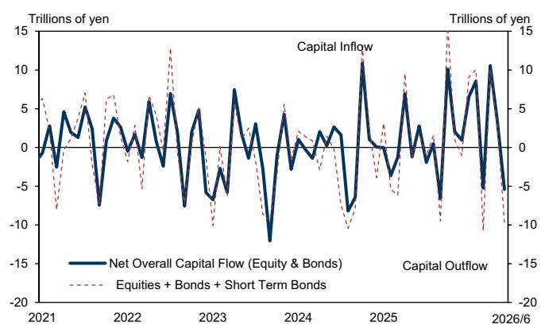
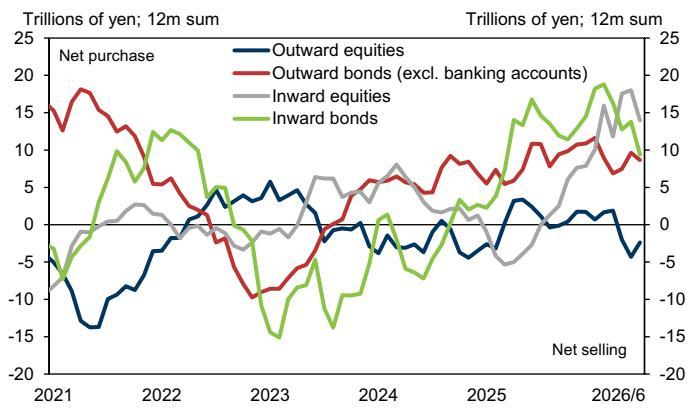
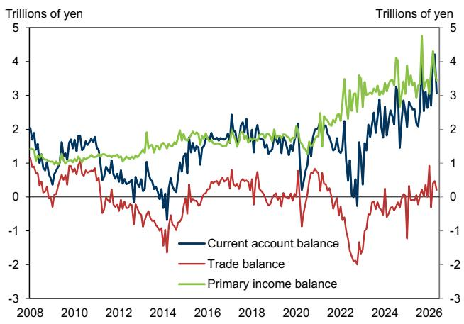

# 日本资本账户释放明确信号：旅游热潮掩盖全球资产配置的结构性转变

日本2025年5月和6月的国际收支数据揭示了一个深刻且未被充分认识的分化现象。表面上，经常账户盈余扩大至4.0万亿日元，同比增长19.5%，主要得益于强劲的初次收入盈余以及贸易收支从逆差转为小幅顺差。这看起来是一幅具有韧性的图景。但在总体数字之下，两个关键信号正在闪烁。首先，入境游客消费连续第二个月下降，同比减少11.2%。其次，外国读者在6月转为日本股票和债券的净卖方，而国内机构读者——尤其是养老基金——则继续积极转向海外资产。日本资本账户的故事不再是关于稳定的盈余，而是关于全球和国内资本如何看待日元、日本资产以及旅游驱动型服务盈余可持续性的结构性调整。

这一转变的时机至关重要。日本一直是疫情后旅游复兴的受益者，入境消费成为抵御日元疲软和国内需求不振的关键缓冲。曾经表现亮眼的旅游账户，如今正显现裂痕。来自中国大陆游客的消费下降——5月同比减少60.4%——是最明显的驱动因素，但并非相对少见因素。消费下降的构成表明，来自韩国、台湾和美国等其他地区的旅游反弹，已不足以弥补中国游客的缺口。这并非暂时现象，而是反映了中国出境游偏好的深层结构性变化、地缘政治紧张局势以及亚洲旅游市场的竞争动态。如果这一趋势持续，日本的服务账户盈余将收窄，给经常账户带来额外压力。

与此同时，6月的资本账户数据讲述了一个资产组合再平衡的故事，这对日本资产价格具有重要影响。外国读者净卖出3.0万亿日元日本股票——这是三个月来首次净卖出——以及2.5万亿日元日本中长期债券，这是九个月来首次净卖出。这并非一次性调整。与此同时，国内读者，尤其是代表养老基金的信托银行，继续以积极步伐净买入外国债券，而寿险公司和投资信托也显示出对外国股票的净买入。综合效应是6月出现9.7万亿日元的资本净流出，与5月2.9万亿日元的净流入形成鲜明逆转。信息很明确：国内外读者都在用行动投票，而资金流向的方向是远离日本资产。

关于日本经常账户盈余为日元和日本资产价格提供结构性支撑的传统观点正受到考验。初次收入盈余依然强劲，但越来越集中于证券投资的股息和债券利息收入，而海外子公司的直接投资收入则在下降。这种收入构成的变化很重要。当来自子公司的汇回收益下降——可能源于中东及其他地区状况恶化——收入盈余的质量就会改变。它变得更加依赖投资组合回报，而这些回报本身受市场波动和同样驱使外国读者远离日本的全球风险偏好影响。

对于观察者而言，关键问题是日本是否正在进入一个新阶段：经常账户盈余收窄、日元进一步走弱、国内资本外逃加速。5月和6月的数据表明，这种情况不仅可能，而且已经在发生。政策制定者和市场参与者面临的挑战是区分周期性噪音和结构性转变。如果地缘政治紧张局势缓解，中国旅游业的下降可能被证明是暂时的，但日本机构读者向海外多元化的更广泛趋势是一个多年甚至数十年的现象。同样，外国对日本债券和股票的抛售可能反映了对日本货币政策轨迹、日本央行正常化路径以及日本回报表现相对于全球替代方案吸引力的重新评估。

本文从五个维度剖析这些动态：旅游驱动型服务盈余的脆弱性、初次收入盈余构成的变化、国内资本外流的机构驱动因素、外国读者情绪的影响，以及报告留下的未解问题。每一部分都论证了日本外部账户正在经历结构性转变，需要对观察框架进行根本性重新评估。

## 入境消费下降不仅关乎中国——它标志着更广泛的旅游周期见顶

5月旅游收入同比下降11.2%，是连续第二个月下降，这不能简单归因于中国游客数量。虽然中国大陆游客数量下降60.4%是最引人注目的数据点，但重要的是要认识到，5月外国游客总数仅同比下降3.6%，继4月下降5.5%之后。这意味着消费的急剧下降不能完全用游客数量来解释。每位游客的平均消费也在下降，表明游客要么缩短停留时间，要么转向低成本住宿，要么减少可自由支配支出。这与疫情后全球旅游趋势一致，最初的报复性消费浪潮正让位于更具价格敏感性的行为。

游客增长的构成提供了一个细致的图景。韩国、台湾、新加坡、美国和英国在5月均显示出游客数量的同比增长。然而，这些增长不足以弥补中国游客的缺口。这意味着日本旅游业已过度依赖单一客源市场，而其他市场的复苏虽然可喜，但规模不足以弥补。这是一个结构性弱点。如果中国出境游未能恢复到疫情前水平——或者转向东南亚或欧洲等替代目的地——日本的旅游账户盈余将持续面临压力。

对观察者而言，这意味着服务账户——曾是日本外部账户中的亮点——正在成为阻力。这对经常账户盈余以及日元有直接影响。更窄的服务盈余意味着日本的经常账户将更加依赖贸易收支和初次收入，而这两者都面临各自的挑战。贸易收支在5月转为小幅顺差，但这只是因为出口增长14.7%超过了进口增长8.1%。这种动态是脆弱的。如果全球需求减弱或能源价格再次上涨，贸易收支可能迅速恢复逆差。如下文所述，初次收入盈余也显示出可能降低其稳定性的构成变化迹象。

## 初次收入盈余强劲，但其构成正转向更不稳定的组成部分

5月初次收入盈余为4.3万亿日元，略高于去年同期的4.2万亿日元。表面上看，这令人安心。但细分数据揭示了一个显著变化。证券投资的股息收入和债券利息收入均有所增加，而直接投资收入——特别是来自海外子公司的股息收入——从2.5万亿日元下降至2.2万亿日元。这是一个有意义的变化。直接投资收入通常比投资组合收入更稳定，与短期市场波动的相关性更低。当子公司汇回收益时，通常是由持续的业务运营驱动，而非战术性财务决策。相比之下，证券投资收入对利率变化、汇率波动和市场情绪更为敏感。

报告指出，中东局势导致海外子公司收益恶化，可能是汇回减少的一个因素。这提醒我们，日本的初次收入盈余并非不受地缘政治冲击影响。如果中东局势恶化或其他地区经历经济放缓，直接投资收入可能继续下降。与此同时，债券利息收入的增加表明日本读者从其外国债券投资组合中获得了更高收益，但这种收益面临再投资风险和货币对冲成本。如果日元进一步走弱，外国债券收入的日元计价价值将上升，但对冲成本也可能增加，从而降低净回报。

这意味着，初次收入盈余虽然规模仍然庞大，但正变得更加依赖金融市场状况。这降低了其作为经常账户缓冲的可靠性。那些依赖日本经常账户盈余结构性稳定假设的观察者需要重新评估。盈余现在更容易受到同样的全球风险因素影响，这些因素正驱使外国读者远离日本资产，并驱使国内读者转向外国资产。这形成了一个反馈循环：经常账户盈余减弱导致日元贬值，进而鼓励更多国内资本外流，这反过来又给日元带来额外压力。

## 国内机构读者正在执行结构性调整，而非战术性交易

6月的国际证券交易数据揭示了一种难以被视为暂时的模式。排除波动较大的银行账户交易后，国内读者净买入外国债券达2.0万亿日元。管理养老基金资产的信托银行在6月净买入1.5万亿日元外国债券，继5月净买入3.2万亿日元之后——这是自2005年有可比数据以来的最大月度金额。这不是对冲或战术性再平衡。这是资产配置的结构性转变。日本养老基金正在回应一个现实：即使在日本央行政策调整之后，国内回报表现相对于全球替代方案——尤其是美国国债和欧洲政府债券——仍然缺乏吸引力。

寿险公司和投资信托的行为强化了这一观点。寿险公司两个月来首次转为外国债券的净卖方，但这可能反映了投资组合再平衡，而非战略方向的改变。更具说明意义的是，寿险公司连续第三个月净买入外国股票，而投资信托自2023年4月以来持续净买入外国股票。这表明日本机构不仅向外国债券多元化，也在向外国股票多元化，寻求更高回报和地域分散化。信托银行连续第三个月净卖出外国股票，金额为1.3万亿日元，这看似矛盾，但可能反映了养老基金在资产类别之间进行再平衡的具体授权，而非减少整体海外敞口。

这意味着国内资本外流趋势深深植根于日本的机构结构之中。日本央行退出回报表现曲线控制并未逆转这一趋势；相反，它通过移除人为压低国内回报表现的隐性补贴，可能加速了这一趋势。随着日本读者继续在海外寻求更高回报，日元将面临持续的卖压。这不是对日元疲软的押注；这是日本人口和经济现实的必然结果。历史上为日元提供自然支撑的经常账户盈余，正被这种外流所侵蚀，形成了一个自我强化的循环。

## 外国读者正在重新定价日本资产，其影响超出股票范畴

6月数据显示，外国读者三个月来首次净卖出日本股票，金额为3.0万亿日元，并且九个月来首次净卖出日本中长期债券，金额为2.5万亿日元。这是情绪的重大转变。外国读者在今年早些时候曾是日本股票的净买方，受到公司治理改革、东京证券交易所推动更高股本回报率以及日元疲软对出口收益提振的吸引。这种逆转表明，这些因素已不足以抵消对全球经济前景、日本货币政策轨迹以及日元疲软可持续性的担忧。

日本债券的抛售尤其值得注意。外国读者此前一直是日本政府债券的稳定买方，受到日本央行政策正常化带来更高回报表现前景的吸引。6月的逆转表明，市场正在定价比先前预期更为渐进的正常化路径，或者日本债券的风险调整后回报已不再与其他主要市场具有竞争力。股票和债券抛售的结合为日本资产价格创造了双重阻力。如果外国读者继续减少敞口，日元可能进一步走弱，这反过来将降低日本股票对持有未对冲头寸的外国读者的吸引力。

这意味着日本正在失去其作为全球资本避风港的地位。日本作为一个拥有庞大经常账户盈余的稳定、可预测市场的叙事，正被一个更复杂的现实所取代：国内外资本都在外流。这对日本企业融资成本、政府债券市场的稳定性以及日本作为观察目的地的整体吸引力都有影响。持有日本资产的观察者需要考虑支撑这些头寸的结构性驱动因素是否仍然完好。

## 报告未完全解答的问题：货币对冲与投资组合流动之间的相互作用

报告提供了投资组合流动的详细数据，但未完全解决货币对冲在驱动这些流动中的作用。日本机构读者，尤其是寿险公司和养老基金，历史上曾对冲其大部分外汇敞口。随着美国利率相对于日本利率保持高位，对冲成本已大幅上升。这意味着，在扣除对冲成本后，外国债券的净回报可能远低于总回报表现。如果对冲成本继续上升，日本读者可能减少外国债券购买，或转向未对冲策略，这将放大对日元的影响。

相反，如果日元大幅走弱，未对冲的外国债券投资变得更具吸引力，但对冲成本也会动态变化。报告未提供对冲比率或对冲与未对冲流动的细分数据。这是一个关键缺口。如果不了解国内读者的对冲行为，就很难预测未来日元走势将如何影响投资组合流动。持续的日元贬值可能触发一个反馈循环：未对冲读者实现收益并减少敞口，而对冲读者面临成本上升也做同样的事情。净效应可能是外国债券购买急剧减少，这将消除对外币需求的一个关键来源，并可能稳定日元。

另一个未解决的问题是，外国对日本债券的抛售在多大程度上是由对日本央行政策变化的预期驱动，而非更广泛的投资组合再平衡。报告指出，外国读者九个月来首次成为净卖方，但未按读者类型或动机提供细分。如果抛售集中在投机性对冲基金，可能是暂时的。如果是由养老基金和主权财富基金等实钱账户驱动，则代表更结构性的转变。现有数据不允许进行这种区分，让观察者只能从其他市场信号中推断动机。

## 观察者的决策框架：三种情景及其影响

鉴于数据的复杂性，观察者需要一个解释未来发展的框架。以下三种情景涵盖了可能结果的范围。

**情景一：旅游复苏恢复，外国读者回归。** 在这种情景下，受地缘政治紧张局势缓和和消费者信心改善的推动，中国出境游在2025年下半年复苏。入境消费恢复增长，稳定了服务账户。外国读者受到日本央行渐进正常化和企业收益改善的安抚，恢复购买日本股票和债券。经常账户盈余扩大，日元稳定，国内资本外流放缓。这种情景对日本资产最为有利，但需要外部环境显著改善。

**情景二：经常账户盈余收窄，但国内资本外流加速。** 在这种情景下，入境消费持续下降，贸易收支依然脆弱，初次收入盈余增长放缓。经常账户盈余收窄至GDP的4-5%。国内机构读者面临低国内回报表现和疲软日元，加速外国债券和股票购买。外国读者保持谨慎，在日元走强时卖出日本资产。日元进一步走弱，达到开始吸引投机性购买但也增加进口成本的水平。这种情景短期内对日本债券和股票不利，但可能为耐心的观察者创造长期价值机会。

**情景三：资本账户信心危机。** 在这种情景下，外国对日本债券和股票的抛售加剧，引发日元急剧贬值。国内读者担心进一步损失，也加速资本外流。日本央行被迫干预汇市或更积极地调整货币政策立场。随着进口成本上升和旅游收入下降，经常账户盈余急剧收窄。这种情景最具破坏性，将对全球市场产生重大溢出效应，特别是如果日本读者被迫汇回外国资产以满足流动性需求。

每种情景都需要不同的观察策略。在情景一中，可关注日本股票和外国债券。在情景二中，保持防御姿态，关注出口商和对冲后的外国债券敞口。在情景三中，完全减少对日本资产的敞口，增加现金或短期政府债券头寸。关键是监测入境消费、外国投资组合流动和对冲成本的数据，以确定哪种情景正在展开。

## 加入社区阅读完整报告并查看原始图表

以上分析基于对5-6月国际收支数据的详细解读，但完整报告包含对全面理解至关重要的额外图表和细分数据。原始图表显示了经季节性调整的经常账户余额、旅游账户收入、对内和对外证券投资以及通过投资组合的资本流动。这些可视化揭示了仅靠文字难以捕捉的趋势和模式。要获取完整报告和原始图表，请加入社区，这些材料将在社区中进行深入讨论和分析。数据提出的问题与其回答的问题一样多，而社区为讨论其影响和完善观察框架提供了一个平台。

*仅供参考。部分内容可能基于源材料通过AI辅助生成、翻译、总结或编辑，可能存在遗漏或错误。请独立核实。这不构成专业建议。*

仅供参考。部分内容可能基于源材料通过AI辅助生成、翻译、总结或编辑，可能存在遗漏或错误。请独立核实。这不构成专业建议。

