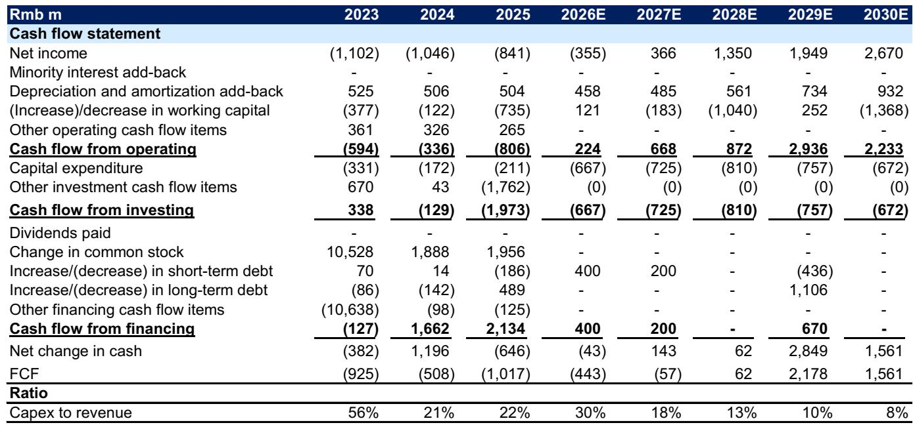
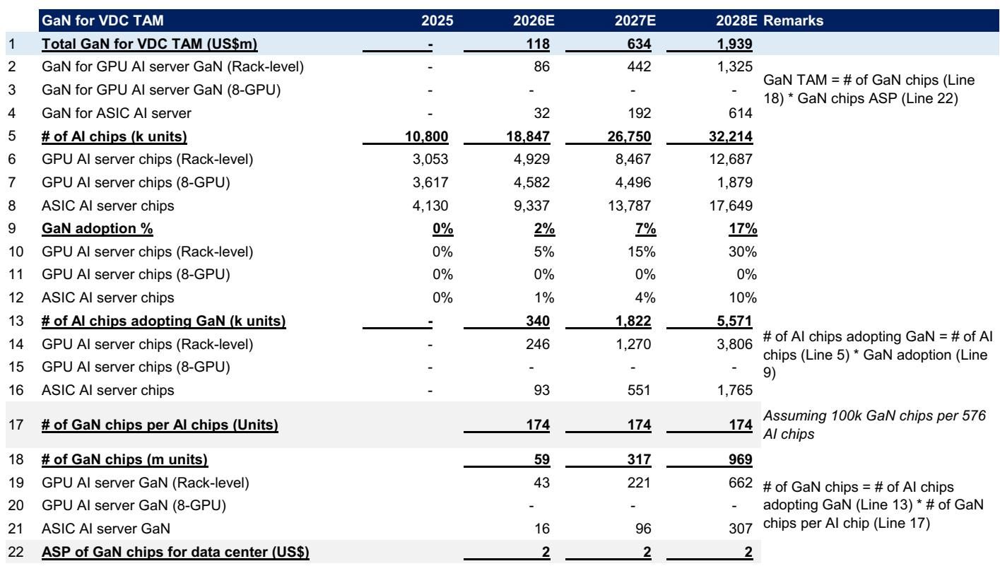
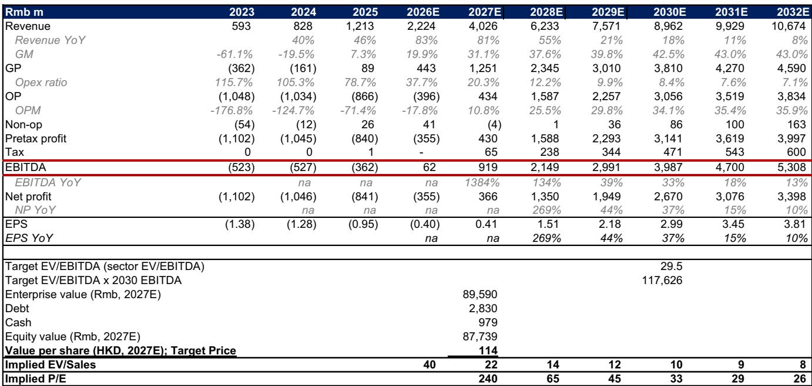

# GS：800V架构才是GaN在AI数据中心的真正催化剂

当业界还在争论氮化镓能否从消费电子快充跨入数据中心时，GS一份最新研报给出了一个更具体的判断：真正的转折点不是GaN替代硅，而是数据中心电源架构从传统的48V向800V直流高压转型。这一变化，正在将GaN从“可选项”变成“必需项”。

这份覆盖英诺赛科的首发报告，核心逻辑并不复杂：AI算力集群的功耗密度已经逼近传统供电架构的极限。800V高压直流架构虽然提升了系统设计的门槛，但也为GaN这种高频、低损耗材料打开了此前无法进入的市场。报告预计，该公司2025至2028年GaN收入年复合增长率可达73%，其中数据中心将成为增速最快的应用场景。

## 1. 800V高压架构是GaN进入数据中心的关键门槛

传统数据中心电源链路从交流输入到芯片级供电，中间经历多次电压转换，每次转换都伴随效率损失。当单机柜功耗从10kW向100kW以上演进时，这套架构的损耗和散热成本变得难以承受。

800V高压直流架构的核心优势在于减少转换级数、降低线损。但高压意味着对功率器件的耐压和开关频率提出更高要求。硅基器件在此频段下效率大幅衰减，而碳化硅虽然耐压出色，但在中低压段（54V及以下）的开关速度不及GaN。

英诺赛科的产品线覆盖15V至1200V，恰好可以完整覆盖800V到0.8V的全部转换节点。报告特别指出，其方案可将驱动器损耗降低80%，开关损耗降低50%。这组数据意味着，在800V架构下，GaN不是锦上添花，而是实现效率目标的关键拼图。

> **KC评论：** 市场此前关注GaN在数据中心的应用，更多是从“替代硅”的角度看渗透率。GS把视角拉到了“架构变革”层面——800V的普及节奏，可能比GaN本身的成本曲线更能决定这家公司的收入弹性。完整报告中的Exhibit 15直观展示了800V架构下各电压段的器件选型，值得细看。

## 2. 产品组合从消费电子向高价值场景迁移

英诺赛科的历史收入高度依赖消费电子快充，这是一个单价低、竞争激烈的市场。报告显示，其产品组合正在发生结构性转变：从快充向车载充电器、激光雷达、工业电源、数据中心乃至人形机器人拓展。

这种迁移的意义不仅在于市场规模的扩大，更在于单颗器件价值的提升。数据中心电源模块中的GaN器件单价远高于手机充电器，而汽车和机器人应用对可靠性和认证周期有更高要求，一旦进入供应链，替换成本极高。

报告预计，到2028年，数据中心将成为该公司最大的收入来源。这意味着，其估值逻辑正在从“消费电子周期股”转向“AI基础设施材料股”，市场愿意给予的远期倍数也会不同。

## 3. 产能扩张与盈利拐点的时间差

报告提供了清晰的产能规划：到2029年底，月产能将超过6.8万片晶圆。但产能爬坡期也是资本开支的高峰期。2025年公司仍处于净亏损状态，EBITDA预计为负3.6亿元人民币。盈利拐点出现在2026年，EBITDA转正至约6200万元，而净利润转正要等到2027年。

这个时间差意味着，读者需要提前消化未来两年的亏损和自由现金流为负。报告给出的估值锚点是2030年预期EBITDA的29.5倍，而非短期市盈率。这种估值方式在半导体制造类公司中常见，但要求市场对远期渗透率有足够信心。

> **KC评论：** 报告没有回避一个关键问题——GaN渗透率和竞争格局的不确定性。如果800V架构推广慢于预期，或者竞争对手（尤其是中国本土GaN厂商）在价格上发起冲击，收入假设和利润率都会面临不确定性。报告中的Exhibit 5展示了全球GaN市场规模预测，可以作为读者判断渗透率假设合理性的参考。

## 4. 报告尚未完全回答的关键问题

这份研报逻辑清晰，但仍有三个问题值得读者继续思考。

第一，800V架构在数据中心领域何时进入规模部署？目前主要超大规模云厂商的测试进度不一，标准化工作仍在推进。报告没有给出明确的渗透率时间表。

第二，GaN与碳化硅在数据中心场景的竞争边界在哪里？虽然报告强调GaN在中低压段的优势，但碳化硅也在向更低电压段延伸，未来的技术路线仍存在变数。

第三，英诺赛科的IDM模式在中国GaN生态中的护城河有多深？自建晶圆厂带来成本控制和定制化能力，但资本开支不确定性也更大。竞争对手采用Fabless模式是否会在价格上更具灵活性，需要持续跟踪。

对于关注AI基础设施和第三代半导体的读者，这份报告提供了一个重要的观察框架：不要只看GaN能否替代硅，更要看数据中心电源架构的演进方向。800V高压直流，或许才是真正决定GaN在AI时代角色的变量。

For informational purposes only. Portions may be generated,translated,summarized,or edited with AI assistance based on source materials and may contain omissions or errors. Please verify independently. This is not investment,legal,tax,accounting,or other professional advice.

For informational purposes only. Portions may be generated,translated,summarized,or edited with AI assistance based on source materials and may contain omissions or errors. Please verify independently. This is not investment,legal,tax,accounting,or other professional advice.

