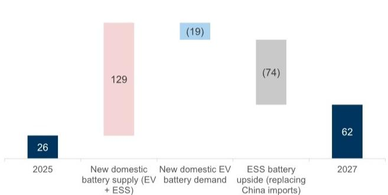
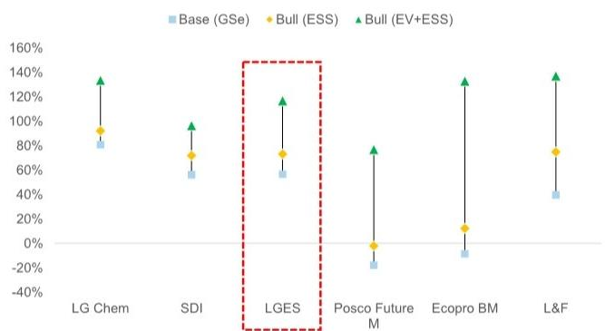

# LG Energy Solution (373220.KS): 2Q26核心运营利润率低于预期；分析师电话会议中ESS利润率展望或成焦点

LG Energy Solution (LGES) 于7月7日发布了2Q26初步业绩。剔除AMPC后的收入为7.3万亿韩元（环比+15%，同比+32%），与市场一致预期（7.0万亿/7.4万亿韩元）基本相符。AMPC为2410亿韩元，表明美国电池出货量环比恢复至约5 GWh（对比1Q26的约4 GWh和2Q25的约10 GWh）。我们认为，收入的环比增长主要得益于ESS的产能爬坡以及小型圆柱电池的持续强劲（特斯拉需求韧性），而美国EV软包电池的出货量可能仍受限于此前已提及的GM合资企业停产影响。

Nikhil Bhandari  
+65-6889-2867 |  
nikhil.bhandari@gs.com  
GS (Singapore) Pte

John Tsang  
+65-6654-5454 | john.tsang@gs.com  
GS (Singapore) Pte

LGES在2Q实现营业利润1130亿韩元（1Q26：-2080亿韩元，2Q25：4920亿韩元），但低于市场一致预期的2240亿/2040亿韩元。剔除AMPC后，运营利润率环比改善至-1.7%（对比1Q26的-6.2%和2Q25的0%）。在收入基本符合预期的情况下，我们认为核心利润率偏软可能由两个因素驱动：（1）OEM照付不议补偿的时间安排；（2）ESS产线同时转换带来的转换成本。

## 2Q26业绩电话会议（7月30日）展望

我们预计2Q26业绩电话会议将讨论以下关键议题和问题：

■ 核心盈利能力路径。对营业利润有增厚作用的补偿部分的时间安排，以及2H26复苏的形态。

■ ESS产能爬坡与固定成本吸收。已转换产线的启动成本中有多少已计入当前运行率，以及3Q可能面临的逆风。

■ ESS利润率与潜在产能过剩。随着福特及其他企业增加产能，两位数的ESS利润率能否维持。

■ GM合资企业重启。3Q重启的形态及其对4Q美国EV产能利用率的拉动作用。

- 欧洲战略。随着BEV注册量复苏，欧洲工厂的产能利用率能以多快速度提升并实现盈利。

■ 下一代化学体系与技术。干法电极和全固态电池相对于现有LFP和高镍体系的商业化时间表。

## 业绩、估值与主要风险：

我们维持报告评级，目标价52万韩元。主要下行风险：（1）市场份额低于预期；（2）新EV/ESS电池产线产能爬坡慢于预期；（3）全球EV渗透率低于预期

关键图表论点
图表1：LGES季度收入与营业利润趋势

<table><tr><td>(十亿韩元)</td><td>4Q23</td><td>1Q24</td><td>2Q24</td><td>3Q24</td><td>4Q24</td><td>1Q25</td><td>2Q25</td><td>3Q25</td><td>4Q25</td><td>1Q26</td><td>2Q26P</td></tr><tr><td>收入（剔除IRA）*</td><td>8,001</td><td>6,129</td><td>6,162</td><td>6,878</td><td>6,451</td><td>6,265</td><td>5,565</td><td>5,700</td><td>6,142</td><td>6,365</td><td>7,319</td></tr><tr><td>营业利润</td><td>338</td><td>157</td><td>195</td><td>448</td><td>(226)</td><td>375</td><td>492</td><td>601</td><td>(122)</td><td>(208)</td><td>113</td></tr><tr><td>营业利润（剔除IRA）</td><td>88</td><td>(32)</td><td>(252)</td><td>(18)</td><td>(603)</td><td>(83)</td><td>1</td><td>236</td><td>(455)</td><td>(398)</td><td>(128)</td></tr><tr><td>营业利润率</td><td>4.2%</td><td>2.6%</td><td>3.2%</td><td>6.5%</td><td>-3.5%</td><td>6.0%</td><td>8.8%</td><td>10.5%</td><td>-2.0%</td><td>-3.3%</td><td>1.5%</td></tr><tr><td>营业利润率（剔除IRA）</td><td>1.1%</td><td>-0.5%</td><td>-4.1%</td><td>-0.3%</td><td>-9.3%</td><td>-1.3%</td><td>0.0%</td><td>4.1%</td><td>-7.4%</td><td>-6.2%</td><td>-1.7%</td></tr></table>

\*公司自1Q26起将IRA AMPC计入报告收入。为便于与历史季度进行趋势比较，我们在图表中剔除了AMPC。
来源：公司数据，GS全球投资研究
美国电池过剩桥梁图（2025E—2027E），GWh

图表2：美国电池过剩桥梁图

图表3：当前LGES报价低于我们的基准情景，三种情景下均存在上行空间

  
\*剔除大众供应，并假设100% ESS目标市场由非中国电芯制造商供应。
来源：GS全球投资研究
基准/乐观(ESS)/乐观(EV+SS)估值情景相对于最近收盘价

  
报价截至2026年7月7日收盘。乐观(ESS)情景假设更高的长期ESS出货量/市场份额/利润率，乐观(EV + ESS)情景在乐观(ESS)基础上假设更高的长期EV出货量/市场份额/利润率。

图表4：LGES股价隐含的退出EBITDA倍数目前接近该股12个月远期历史区间的低端。

  
报价截至2026年7月7日收盘。
来源：GS全球投资研究

## 投资论点 - LG Energy Solution

LGES是中国以外最大的电池制造商，在高镍电池化学体系方面处于领先地位。鉴于其在电池领域不断扩大的全球技术领先地位，以及即将商业化生产的新型电池产品（如大尺寸圆柱4680电池、电芯到封装LFP电池（自2025年起）和干法电极工艺（自2028年起）），我们对LGES的基本面保持积极看法。同时，我们看到其在美国的市场份额增长，这得益于快速扩张的产能，我们预计公司在美国的市场份额增长将带来利润率和回报的提升（GS预计2026E-28E EBITDA年复合增长率为51%，同期CROCI扩张6.5个百分点）。

虽然市场关注于近期的EV电池需求变化，但我们认为市场低估了产能利用率复苏路径的日益清晰，我们估计产能利用率将从FY26E的约42%上升至2028E的约67%。我们还看到中期盈利可见度的提升（FY26E-28E EBITDA弹性较高），这得益于ESS需求和新产品的强劲订单势头。我们对LGES给予报告评级。

## 目标价风险与方法论 - LG Energy Solution

我们对LGES给予报告评级，12个月目标价为52万韩元，采用50%/50%的DCF（WACC：8.4%，TGR：3.3%）和2027E/28E EV/EBITDA混合估值法。我们对调整后（剔除合资企业份额）的2027E/28E EBITDA应用20倍的中周期倍数。

主要下行风险：（1）市场份额低于预期；（2）新EV/ESS电池产线产能爬坡慢于预期；（3）全球EV渗透率低于预期

<table><tr><td>373220.KS</td><td>12个月目标价：520,000韩元</td><td colspan="2">报价：332,000韩元</td><td colspan="2">上行空间：56.6%</td></tr><tr><td>买入</td><td>GS预测</td><td></td><td></td><td></td><td></td></tr><tr><td></td><td></td><td>12/25</td><td>12/26E</td><td>12/27E</td><td>12/28E</td></tr><tr><td rowspan="9">市值：77.7万亿韩元 / 507亿美元 企业价值：106.3万亿韩元 / 694亿美元 3个月日均交易量：2196亿韩元 / 1.462亿美元 韩国 韩国EV电池 M&A排名：3 租赁包含在净债务及企业价值中？：是</td><td>收入（十亿韩元）</td><td>23,671.8</td><td>28,297.7</td><td>39,259.1</td><td>50,283.8</td></tr><tr><td>EBITDA（十亿韩元）</td><td>5,037.4</td><td>5,418.3</td><td>8,522.5</td><td>12,415.1</td></tr><tr><td>每股收益（韩元）</td><td>(4,585)</td><td>(1,014)</td><td>8,438</td><td>19,333</td></tr><tr><td>市盈率（倍）</td><td>NM</td><td>NM</td><td>39.3</td><td>17.2</td></tr><tr><td>市净率（倍）</td><td>4.2</td><td>3.9</td><td>3.5</td><td>2.9</td></tr><tr><td>股息回报表现（%）</td><td>0.0</td><td>0.0</td><td>0.0</td><td>0.0</td></tr><tr><td>净债务/EBITDA（剔除租赁，倍）</td><td>3.7</td><td>3.1</td><td>1.8</td><td>0.8</td></tr><tr><td>CROCI（%）</td><td>6.6</td><td>9.4</td><td>12.5</td><td>15.9</td></tr><tr><td>自由现金流回报表现（%）</td><td>(6.5)</td><td>0.4</td><td>2.2</td><td>5.5</td></tr><tr><td></td><td></td><td>3/26</td><td>6/26E</td><td>9/26E</td><td>12/26E</td></tr><tr><td></td><td>每股收益（韩元）</td><td>(4,763,191)</td><td>1,428</td><td>1,500,493</td><td>2,247,338</td></tr></table>

来源：公司数据，GS估计，FactSet。报价截至2026年7月7日收盘。

## 披露附录

## Reg AC

我们，Nikhil Bhandari和John Tsang，特此证明本报告中表达的所有观点准确反映了我们对相关公司及其证券的个人观点。我们还证明，我们的薪酬中没有任何部分直接或间接地与报告中表达的具体建议或观点相关。

除非另有说明，本报告封面所列人员为GS全球投资研究部分析师。

撰稿作者：Nikhil Bhandari GS (Singapore) Pte, John Tsang GS (Singapore) Pte。

除非另有说明，本报告撰稿作者披露中列出的个人是GS全球投资研究部分析师。

## GS因子概况

GS因子概况通过将股票的关键属性与市场（即我们评级的股票池）及其行业同行进行比较，提供投资背景。所描绘的四个关键属性是：增长、财务回报、倍数（例如估值）和综合（增长、财务回报和倍数的组合）。增长、财务回报和倍数是通过使用每只股票特定指标的标准化排名来计算的。然后将指标的标准化排名进行平均，并转换为相关属性的百分位数。每个指标的具体计算可能因财年、行业和地区而异，但标准方法如下：

增长基于股票的前瞻性销售增长、EBITDA增长和每股收益增长（对于金融股，仅每股收益和销售增长），较高的百分位数表示增长较快的公司。财务回报基于股票的前瞻性ROE、ROCE和CROCI（对于金融股，仅ROE），较高的百分位数表示财务回报较高的公司。倍数基于股票的前瞻性市盈率、市净率、价格/股息（P/D）、EV/EBITDA、EV/FCF和EV/债务调整后现金流（DACF）（对于金融股，仅市盈率、市净率和P/D），较高的百分位数表示交易倍数较高的股票。综合百分位数计算为增长百分位数、财务回报百分位数和（100% - 倍数百分位数）的平均值。

财务回报和倍数使用分析师对未来至少三个季度后的财年末的预测。增长使用对未来至少七个季度后的财年与未来至少三个季度后的财年相比的输入数据（所有指标均基于每股）。

有关我们如何计算GS因子概况的更详细说明，请联系您的GS代表。

## M&A排名

在我们的全球覆盖范围内，我们使用M&A框架检查股票，考虑定性因素和定量因素（可能因行业和地区而异），以纳入某些公司可能被收购的潜力。然后，我们分配一个M&A排名，作为对我们评级覆盖范围内的公司从1到3进行评分的方法，其中1表示公司成为收购目标的可能性高（30%-50%），2表示可能性中等（15%-30%），3表示可能性低（0%-15%）。对于排名为1或2的公司，根据我们的标准部门指南，我们将M&A组成部分纳入我们的目标价。M&A排名为3被视为不重要，因此不计入我们的目标价，并且可能在研究中讨论或不讨论。

## Quantum

Quantum是GS的专有数据库，提供详细的财务报表历史、预测和比率的访问。它可用于对单个公司进行深入分析，或比较不同行业和市场的公司。

## 披露

LG Energy Solution的评级相对于其覆盖范围内的其他公司：Ecopro BM, L&F, LG Chem, LG Energy Solution, Posco Future M, SK Innovation, Samsung SDI Co.

## 公司特定监管披露

以下披露涉及GS集团（及其附属机构，“GS”）与GS全球投资研究所涵盖的公司之间的关系。

GS预计在未来3个月内将寻求或打算寻求投资银行服务报酬：LG Energy Solution (332,000韩元)

GS在过去12个月内与以下公司存在投资银行服务客户关系：LG Energy Solution (332,000韩元)

GS在过去12个月内与以下公司存在非投资银行证券相关服务客户关系：LG Energy Solution (332,000韩元)

GS在过去12个月内与以下公司存在非证券服务客户关系：LG Energy Solution (332,000韩元)

## 评级/投资银行关系分布

GS投资研究全球股票覆盖范围

<table><tr><td rowspan="2"></td><td colspan="3">评级分布</td><td colspan="3">投资银行关系</td></tr><tr><td>买入</td><td>持有</td><td>卖出</td><td>买入</td><td>持有</td><td>卖出</td></tr><tr><td>全球</td><td>50%</td><td>34%</td><td>16%</td><td>65%</td><td>60%</td><td>45%</td></tr></table>

截至2026年4月1日，GS全球投资研究对3,074只股票有投资评级。GS将股票指定为买入和卖出，纳入各个地区的投资清单；未如此指定的股票被视为中性。为满足FINRA规则要求的上述披露，此类分配等同于买入、持有和卖出。请参阅下面的“评级、覆盖范围和相关定义”。投资银行关系图反映了每个评级类别中GS在过去十二个月内提供过投资银行服务的公司所占的百分比。

## 目标价和评级历史图表

  
所示目标价应结合所有先前发布的GS报告（可能包含或不包含目标价）以及公司、其行业和金融市场的发展情况来考虑。

## 目标价历史表格 LG Energy Solution (373220.KS)

<table><tr><td>报告日期</td><td>目标价（韩元）</td><td>收盘价（韩元）</td></tr><tr><td>2026年6月1日</td><td>520,000</td><td>455,000</td></tr><tr><td>2026年2月11日</td><td>410,000</td><td>392,000</td></tr><tr><td>2026年1月11日</td><td>440,000</td><td>363,000</td></tr><tr><td>2025年10月13日</td><td>355,000</td><td>360,000</td></tr><tr><td>2025年10月3日</td><td>350,000</td><td>399,000</td></tr><tr><td>2025年8月28日</td><td>365,000</td><td>364,000</td></tr><tr><td>2025年7月27日</td><td>375,000</td><td>363,500</td></tr><tr><td>2025年6月8日</td><td>345,000</td><td>291,000</td></tr><tr><td>2025年4月10日</td><td>355,000</td><td>349,500</td></tr><tr><td>2025年3月2日</td><td>375,000</td><td>352,000</td></tr><tr><td>2024年10月8日</td><td>455,000</td><td>436,500</td></tr><tr><td>2024年9月4日</td><td>450,000</td><td>399,500</td></tr><tr><td>2024年7月25日</td><td>455,000</td><td>332,500</td></tr><tr><td>2024年7月8日</td><td>485,000</td><td>358,500</td></tr><tr><td>2024年4月25日</td><td>500,000</td><td>372,500</td></tr><tr><td>2024年3月25日</td><td>515,000</td><td>414,500</td></tr><tr><td>2024年1月28日</td><td>530,000</td><td>381,000</td></tr><tr><td>2024年1月9日</td><td>550,000</td><td>417,500</td></tr><tr><td>2023年10月25日</td><td>610,000</td><td>409,500</td></tr><tr><td>2023年10月3日</td><td>620,000</td><td>476,500</td></tr><tr><td>2023年7月27日</td><td>605,000</td><td>540,000</td></tr><tr><td>2023年7月9日</td><td>610,000</td><td>-</td></tr></table>

表格中显示的目标价未针对公司行动进行调整。

## 监管披露

## 美国法律法规要求的披露

请参阅上述公司特定监管披露，了解本报告中提及的公司所需的任何以下披露：待处理交易中的经理或联合经理；1%或其他所有权；特定服务的报酬；客户关系类型；先前期间的已管理/联合管理公开发行；董事职位；对于股票，做市和/或专家角色。GS可能作为本金交易本报告中讨论的发行人的债务证券（或相关衍生品）。

以下是额外的必要披露：所有权和重大利益冲突：GS政策禁止其分析师、向分析师报告的专业人员及其家庭成员持有分析师覆盖范围内任何公司的证券。分析师薪酬：分析师的薪酬部分基于GS的盈利能力，其中包括投资银行收入。分析师作为高级职员或董事：GS政策通常禁止其分析师、向分析师报告的人员或其家庭成员担任分析师覆盖范围内任何公司的高级职员、董事或顾问。非美国分析师：非美国分析师可能不是GS & Co. LLC的关联人员，因此可能不受FINRA规则2241或FINRA规则2242关于与主题公司沟通、公开露面以及交易所覆盖证券的限制。

## 美国以外司法管辖区法律法规要求的额外披露

以下披露是司法管辖区要求的披露，除非已根据美国法律法规在上文作出。澳大利亚：GS Australia Pty Ltd及其附属公司不是澳大利亚的授权存款机构（定义见《1959年银行法》（联邦）），在澳大利亚不提供银行服务，也不开展银行业务。除非GS另有约定，本研究及其任何访问权限仅适用于澳大利亚《公司法》含义内的“批发客户”。在编制研究报告时，GS Australia全球投资研究部门的成员可能会参加由研究报告所涵盖的公司和其他实体主办或组织的实地考察和其他会议。在某些情况下，如果GS Australia认为在实地考察或会议的具体情况下是适当和合理的，此类实地考察或会议的部分或全部费用可能由相关发行人承担。如果本文档内容包含任何金融产品建议，则仅为一般性建议，由GS在未考虑客户的目标、财务状况或需求的情况下编制。客户在根据任何此类建议采取行动之前，应考虑该建议是否适合其自身的目标、财务状况和需求。某些GS Australia和New Zealand的利益披露以及GS的澳大利亚卖方研究独立性政策声明副本可在以下网址获取：https://www.goldmansachs.com/disclosures/australia-new-zealand/index.html。巴西：有关CVM第20号决议的披露信息可在https://www.gs.com/worldwide/brazil/area/gir/index.html获取。在适用的情况下，根据CVM第20号决议第20条定义，对本研究报告内容负主要责任的巴西注册分析师是本报告开头指定的第一作者，除非文本末尾另有说明。加拿大：此信息仅供您参考，在任何情况下均不应被解释为GS & Co. LLC为在加拿大购买任何加拿大证券而进行的广告、要约或招揽。GS & Co. LLC未在加拿大任何司法管辖区根据适用的加拿大证券法注册为交易商，通常不允许交易加拿大证券，并且可能被禁止在加拿大某些司法管辖区销售某些证券和产品。如果您希望在加拿大交易任何加拿大证券或其他产品，请联系GS Canada Inc.（The GS Group Inc.的附属公司）或其他注册的加拿大交易商。香港：可向GS (Asia) L.L.C.索取本研究中涵盖的公司证券的进一步信息。印度：可从GS (India) Securities Private Limited获取本研究中提及的主题公司或公司的进一步信息，研究分析师 - SEBI注册号INH000001493，地址：10th Floor, Ascent-Worli, Sudam Kalu Ahire Marg, Worli, Mumbai-400 025, India，公司识别号U74140MH2006FTC160634，电话+91 22 6616 9000，传真+91 22 6616 9001。GS可能实益拥有本研究报告所提及的主题公司或公司1%或以上的证券（定义见印度《证券合约（监管）法》1956年第2(h)条）。SEBI的注册和NISM的认证绝不保证中介机构的业绩或向读者提供任何回报保证。GS (India) Securities Private Limited的合规官和读者投诉联系详情、年度合规审计报告副本以及其他相关信息和披露可在以下链接找到：https://www.goldmansachs.com/worldwide/india/research-analyst。日本：见下文。韩国：除非GS另有约定，本研究及其任何访问权限仅适用于《金融服务和资本市场法》含义内的“专业读者”。可从GS (Asia) L.L.C., Seoul Branch获取本研究中提及的主题公司或公司的进一步信息。新西兰：GS New Zealand Limited及其附属公司不是新西兰的“注册银行”或“存款接受者”（定义见《1989年新西兰储备银行法》）。除非GS另有约定，本研究及其任何访问权限适用于《2008年金融顾问法》含义内的“批发客户”。某些GS Australia和New Zealand的利益披露副本可在以下网址获取：https://www.goldmansachs.com/disclosures/australia-new-zealand/index.html。俄罗斯：在俄罗斯联邦分发的研究报告不是俄罗斯立法所定义的广告，而是不以产品推广为主要目的的信息和分析，并且不提供俄罗斯评估活动立法含义内的评估。研究报告不构成俄罗斯法律法规所定义的个性化研究交流，不针对特定客户，并且是在未分析客户的财务状况、投资概况或风险概况的情况下编制的。GS对客户或任何其他人可能基于本研究报告做出的任何投资决策不承担任何责任。新加坡：GS (Singapore) Pte.（公司编号：198602165W），受新加坡金融管理局监管，接受对本研究的法律责任，如有任何与本研究报告相关的事宜，应与其联系。台湾：此材料仅供参考，未经许可不得转载。读者应仔细考虑自身的投资风险。投资结果由个人读者自行负责。英国：在英国被归类为零售客户（定义见金融行为监管局规则）的人士，应结合先前GS关于本报告所涵盖公司的报告阅读本研究，并应参考GS International已发送给他们的风险警告。这些风险警告的副本以及本报告中使用的某些金融术语的词汇表，可应要求从GS International获取。

欧盟和英国：关于欧盟委员会授权条例(EU) (2016/958)第6(2)条（包括该授权条例在英国脱离欧盟和欧洲经济区后作为英国国内法律法规实施的情况）的披露信息，涉及研究交流或其他建议或暗示投资策略的信息的客观呈现技术安排以及特定利益或利益冲突迹象的披露，可在https://www.gs.com/disclosures/europeanpolicy.html获取，其中说明了与投资研究相关的利益冲突管理的欧洲政策。

日本：GS Japan Co., Ltd.是一家金融工具交易商，在关东财务局注册，注册号Kinsho 69，并且是日本证券交易商协会、日本金融期货协会、第二类金融工具交易商协会和日本投资管理协会的成员。股票买卖需支付与客户预先确定的佣金加上消费税。有关日本证券交易所、日本证券交易商协会或日本证券金融公司要求的任何适用披露，请参阅公司特定披露。

## 评级、覆盖范围和相关定义

买入 (B), 中性 (N), 卖出 (S) 分析师建议将股票作为买入或卖出纳入各个地区的投资清单。被指定为买入或卖出投资清单取决于股票相对于其覆盖范围的总回报潜力。任何未被指定为买入或卖出投资清单且具有有效评级（即，非评级暂停、未评级、早期生物技术、覆盖暂停或未覆盖的股票）的股票被视为中性。每个地区管理区域信念清单，这些清单选自各自地区投资清单中的报告评级股票，代表侧重于总回报潜力大小和/或在其各自覆盖范围内实现回报的可能性的研究交流。在此类信念清单中添加或移除股票由各自地区的投资审查委员会或其他指定委员会管理，并不代表分析师对此类股票的投资评级发生变化。

总回报潜力代表当前股价与目标价之间的上行或下行差异，包括目标价相关时间范围内预期支付或预期的所有股息。所有覆盖的股票都需要目标价。总回报潜力、目标价和相关时间范围在每份添加或重申投资清单成员资格的报告中有说明。

覆盖范围：每个覆盖范围的所有股票列表可通过主要分析师、股票和覆盖范围在https://www.gs.com/research/hedge.html获取。

未评级 (NR)。当GS在此公司的合并或战略交易中担任顾问角色时，当存在法律、监管或政策限制（由于GS参与交易）时，以及在某些其他情况下，根据GS政策，投资评级、目标价和盈利预测（如相关）将被移除。早期生物技术 (ES)。当此公司尚未拥有通过II期临床试验的药物、治疗或医疗设备，也未获得分销后II期药物、治疗或医疗设备的许可时，根据GS政策，不分配投资评级和目标价。评级暂停 (RS)。GS已暂停此股票的投资评级和目标价，因为没有足够的基本面基础来确定投资评级或目标价。之前的投资评级和目标价（如有）对此股票不再有效，不应依赖。覆盖暂停 (CS)。GS已暂停对此公司的覆盖。未覆盖 (NC)。GS不覆盖此公司。

## 全球产品；分销实体

GS全球投资研究为GS客户在全球范围内制作和分发研究产品。位于GS全球各办事处的分析师对行业和公司进行研究，并对宏观经济、货币、大宗商品和投资组合策略进行研究。本研究由以下机构在澳大利亚分发：GS Australia Pty Ltd (ABN 21 006 797 897)；在巴西：GS do Brasil Corretora de Títulos e Valores Mobiliários S.A.；GS巴西公共沟通渠道：0800 727 5764 和/或 contatogoldmanbrasil@gs.com。可用工作日（节假日除外），上午9点至下午6点。Canal de Comunicação com o Público GS Brasil: 0800 727 5764 e/ou contatogoldmanbrasil@gs.com. Horário de funcionamento: segunda-feira à sexta-feira (exceto feriados), das 9h às 18h；在加拿大：GS & Co. LLC；在香港：GS (Asia) L.L.C.；在印度：GS (India) Securities Private Ltd.；在日本：GS Japan Co., Ltd.；在韩国：GS (Asia) L.L.C., Seoul Branch；在新西兰：GS New Zealand Limited；在俄罗斯：OOO GS；在新加坡：GS (Singapore) Pte.（公司编号：198602165W）；以及在美国：GS & Co. LLC。GS International已批准本研究在英国的分发。

GS International (“GSI”)，由审慎监管局授权并由金融行为监管局和审慎监管局监管，已批准本研究在英国的分发。

欧洲经济区：GS Bank Europe SE (“GSBE”) 是一家在德国注册的信贷机构，在单一监管机制内，受欧洲中央银行直接审慎监管，并在其他方面受德国联邦金融监管局和德意志联邦银行监管，并在欧洲经济区内分发研究。

## 一般披露

本研究仅供我们的客户使用。除与GS相关的披露外，本研究基于我们认为可靠的当前公开信息，但我们不声明其准确或完整，并且不应依赖于此。本文所含信息、意见、估计和预测截至本文日期，如有更改，恕不另行通知。我们寻求在适当的时候更新我们的研究，但各种法规可能阻止我们这样做。除某些定期发布的行业报告外，大部分报告根据分析师的判断以不规则的间隔发布。

GS开展全球全方位服务的综合投资银行、投资管理和经纪业务。我们与全球投资研究所涵盖的相当大比例的公司存在投资银行和其他业务关系。GS & Co. LLC，美国经纪交易商，是SIPC成员（https://www.sipc.org）。

我们的销售人员、交易员和其他专业人员可能会向我们的客户和主要交易部门提供口头或书面的市场评论或交易策略，这些评论或策略反映了与本研究中表达的观点相反的观点。我们的资产管理部、主要交易部门和投资业务可能做出与本研究报告中的建议或观点不一致的投资决策。

本报告中指定的分析师可能不时与我们的客户（包括GS销售人员和交易员）讨论，或在本报告中讨论，涉及可能对本报告所讨论的股票市场价格产生短期影响的催化剂或事件的交易策略，这种影响可能在方向上与分析师的此类股票的已发布目标价预期相反。任何此类交易策略都不同于且不影响分析师对此类股票的基本股票评级，该评级反映了股票相对于其覆盖范围的总回报潜力，如本文所述。

我们和我们的关联公司、高级职员、董事和员工将不时持有本研究中提及的证券或衍生品（如有）的多头或空头头寸，担任本金，并买卖这些证券或衍生品，除非法规或GS政策另有禁止。

在GS安排的会议上归因于第三方演讲者（包括来自GS其他部门的个人）的观点不一定反映全球投资研究的观点，也不是GS的官方观点。

本文引用的任何第三方，包括任何销售人员、交易员和其他专业人员或其家庭成员，可能持有与分析师在本报告中表达的观点不一致的上述产品的头寸。

本研究不构成在任何司法管辖区出售或招揽购买任何证券的要约，如果此类要约或招揽在该司法管辖区是非法的。它不构成个人建议，也未考虑个别客户的特定投资目标、财务状况或需求。客户应考虑本研究中的任何建议或推荐是否适合其特定情况，并在适当的情况下寻求专业建议，包括税务建议。本研究中提及的投资的价值和价格及其收入可能会波动。过往表现并非未来表现的指引，未来回报不保证，并且可能发生原始资本损失。汇率波动可能对某些投资的價值、价格或收入产生不利影响。

某些交易，包括涉及期货、期权和其他衍生品的交易，会带来重大风险，并不适合所有读者。读者应查阅当前的期权和期货披露文件，这些文件可从GS销售代表处或通过以下网址获取：https://www.theocc.com/about/publications/character-risks.jsp 和 https://www.goldmansachs.com/disclosures/cftc_fcm_disclosures。在需要多次买卖期权（如价差）的期权策略中，交易成本可能很高。将应要求提供支持文件。

全球投资研究提供的不同服务水平：GS全球投资研究向您提供的服务水平和类型可能与向GS内部和其他外部客户提供的服务水平和类型不同，具体取决于各种因素，包括您个人对接收通信的频率和方式的偏好、您的风险状况和投资重点及视角（例如，市场范围、特定行业、长期、短期）、您与GS的整体客户关系的规模和范围，以及法律和监管限制。例如，某些客户可能希望在特定证券的研究发布时收到通知，某些客户可能希望将我们内部客户网站上提供的分析师基本面分析的特定数据通过数据馈送或其他方式以电子方式交付给他们。分析师基本面研究观点的任何变化（例如，对股票的评级、目标价或盈利预测的重大变化）将在通过电子方式广泛发布到我们的内部客户网站或通过其他必要方式向所有有权接收此类报告的客户发布之前，不会传达给任何客户。

所有研究报告同时通过电子方式发布到我们的内部客户网站，向所有客户提供。并非所有研究内容都会重新分发给我们的客户或提供给第三方聚合商，GS也不对第三方聚合商重新分发我们的研究负责。对于与一只或多只证券、市场或资产类别相关的研究、模型或其他数据（包括相关服务），请联系您的GS代表或访问https://research.gs.com。

披露信息也可在https://www.gs.com/research/hedge.html获取，或联系Research Compliance, 200 West Street, New York, NY 10282。

## © 2026 GS.

您仅可为您自己的目的存储、显示、分析、修改、重新格式化并打印通过此服务提供给您的信息。未经GS明确书面同意，您不得转售或逆向工程此信息以计算或开发任何用于披露和/或营销的指数，或创建任何其他衍生作品或商业产品、数据或产品。未经GS明确书面同意，您不得以任何形式向任何第三方发布、传输或以其他方式复制此信息的全部或部分。前述限制包括但不限于使用、提取、下载或检索此信息的全部或部分，以训练或微调机器学习或人工智能系统，或作为任何此类系统的提示或输入提供或复制此信息的全部或部分。
