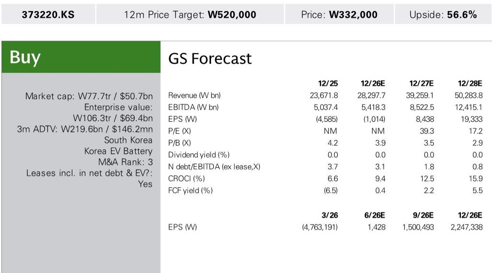
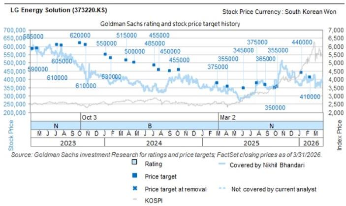
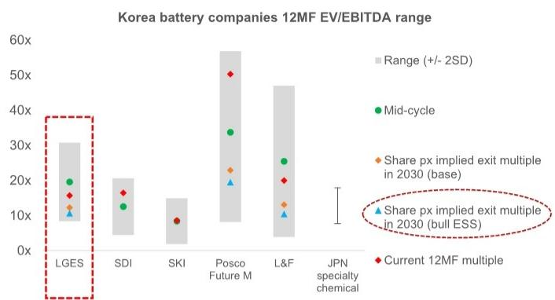

# GS：LG新能源盈利修复卡在哪？储能利润率是关键变量

韩国电池制造商LG新能源（LG Energy Solution）刚刚交出了一份“营收达标、利润不及预期”的季度成绩单。7月7日公布的2Q26初步财报显示，剔除AMPC后的营收为7.3万亿韩元，环比增长15%，基本符合市场预期。但营业利润仅1130亿韩元，大幅低于GS和彭博一致预期的2240亿和2040亿韩元。

核心问题出在利润率上。即便剔除AMPC补贴，2Q26的营业利润率也只是从1Q26的-6.2%修复至-1.7%，远未回到盈利区间。对于一家被视为“中国以外最大电池制造商”的公司，这个信号值得仔细拆解。

## 1. 营收修复靠的是储能和圆柱电池，但利润率卡在了两个短期因素上

营收的环比改善有明确的驱动因素：储能系统（ESS）的产能爬坡，以及特斯拉需求支撑下的小圆柱电池持续走强。这两个板块帮助LG新能源将美国电池出货量从1Q26的约4GWh提升至2Q26的约5GWh，但仍低于2Q25的约10GWh。美国电动车软包电池的出货量依然受到通用汽车合资工厂停产的制约。

利润率不及预期，GS认为主要源于两个短期扰动：一是OEM“照付不议”补偿的时间错位；二是储能产线同时切换带来的转换成本。这两个因素都带有一次性或过渡性质，但问题是，它们何时能消化完毕。

> **KC评论：** 营收修复的方向是对的，但利润率修复的节奏比市场预期慢。完整报告里值得继续看的是，GS对下半年补偿款确认时间和产线转换成本何时进入稳态的假设。这两个变量直接决定了2H26的盈利能见度。

## 2. 储能利润率是下半年最大的观察变量，但产能过剩的阴影已经浮现

7月30日的业绩电话会上，储能业务的利润率走向预计会成为讨论焦点。GS在报告里提出了一个尖锐的问题：双位数百分比的储能利润率，在福特等新进入者持续增加产能的背景下，能否维持？

这个问题之所以关键，是因为储能正在成为LG新能源中期盈利增长的核心引擎。如果储能利润率能守住高位，那么公司2026至2028年的EBITDA弹性较高路径就相对清晰。如果储能利润率因产能过剩而快速压缩，那么整个盈利修复故事的基础就会动摇。

报告尚未完全回答的是：储能产能过剩的临界点在哪里？以及LG新能源在非中国电池厂商中的技术护城河，能否帮助它在这一轮竞争中避免价格战。

## 3. 市场定价已接近历史低点，但估值修复需要更清晰的盈利路径

从估值角度看，LG新能源当前的隐含退出EBITDA倍数已接近其12个月历史区间的下沿。有观点认为当前价格低于其三种情景（基准、储能牛市、储能加电动车牛市）中的任何一种。

但估值低本身不是买入理由。市场真正需要看到的是：2H26的盈利复苏路径是否可预测。GM合资工厂的复产节奏、欧洲工厂的利用率改善速度、以及下一代技术（干电极、全固态电池）的商业化时间表，都是影响市场定价的关键变量。

> **KC评论：** 估值便宜和报价上涨之间，还隔着若干个“能否兑现”的季度。报告里最有价值的图表是那三张情景估值对比——它告诉你，在储能需求超预期和电动车出货恢复的不同组合下，公司值多少钱。但前提是，这些情景需要逐季验证。

## 4. 报告尚未完全回答的关键问题：美国电池产能过剩的消化速度

GS在报告中展示了一个“美国电池产能过剩桥接图”，但并未给出明确的过剩消化时间表。目前LG新能源的产能利用率约为42%，2028年预期提升至约67%。这个提升过程能否实现，取决于美国电动车需求的真实恢复节奏，以及储能需求的爆发程度。

对于产业决策者而言，真正值得持续跟踪的指标不是单季营收，而是：储能产线的利用率变化，以及非中国电池厂商在美国的市场份额能否如期提升。

For informational purposes only. Portions may be generated,translated,summarized,or edited with AI assistance based on source materials and may contain omissions or errors. Please verify independently. This is not investment,legal,tax,accounting,or other professional advice.

For informational purposes only. Portions may be generated,translated,summarized,or edited with AI assistance based on source materials and may contain omissions or errors. Please verify independently. This is not investment,legal,tax,accounting,or other professional advice.

