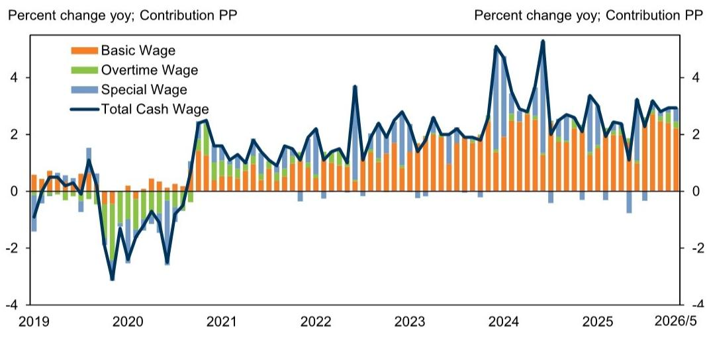
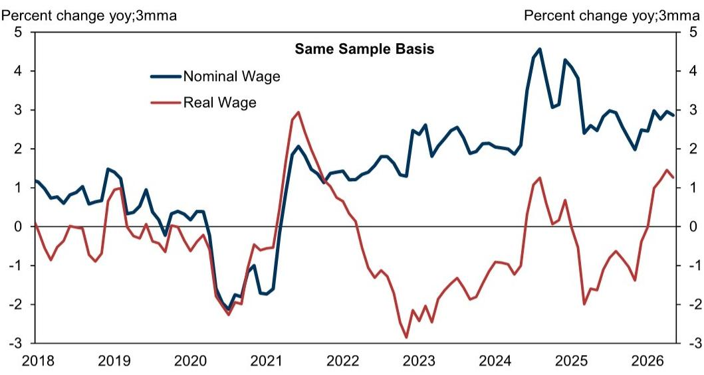
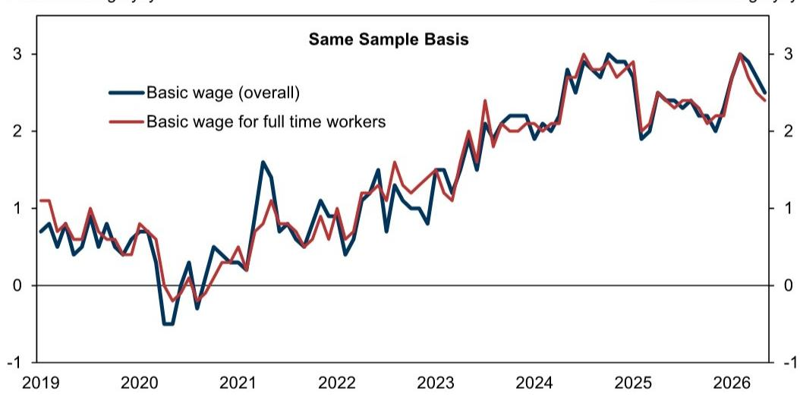

# Japan’s Wage-Inflation Cycle Is Real, But the Next Phase Depends on Services and Small Firms

The Bank of Japan’s most closely watched wage metric has maintained its upward trajectory, even as the headline figures show a modest deceleration. The May data from Japan’s Monthly Labour Survey, released in early July, reveals a labor market that is not merely recovering but undergoing a structural shift in wage-setting dynamics. Nominal cash wage growth slowed to +3.2% year-on-year in May from +3.6% in April, while basic wage growth for all workers eased to +3.0% from +3.3%. Yet the underlying story is more significant than the quarterly wobble. On the “same sample” basis — the methodology the Bank of Japan monitors to strip out compositional noise from the survey’s rotating panel — basic wage growth for full-time workers held steady at +2.4% in May, consistent with the upward trend that began in late 2025. This persistence matters because it validates the transmission mechanism from the 2026 shunto wage negotiations into actual paychecks. The final tabulation of the spring wage offensive, announced by JTUC-RENGO on July 3, showed an agreed base pay rise of 3.5%, only marginally below 2025’s 3.7%. The gap between large and mid-sized enterprises narrowed, suggesting that wage increases are broadening beyond Japan’s corporate giants. For observers and policymakers, the critical question is not whether wages are rising — they are — but whether this momentum can survive the coming slowdown in special and overtime pay, and whether it will translate into durable consumption and inflation.

The macro significance of the May wage data extends beyond the labor market itself. Real wages turned positive for the fifth consecutive month, printing at +1.4% year-on-year when deflated by CPI excluding imputed rent, and +1.7% using headline CPI. This marks a genuine inflection point after years of negative real wage growth that suppressed household spending. The combination of rising nominal wages and decelerating inflation — the CPI ex-imputed rent has fallen from a 2025 average of +3.7% to the mid-1% range since the start of 2026 — has created a window of purchasing power recovery. But the composition of wage growth is shifting in ways that carry implications for the sustainability of this cycle. Overtime pay growth slowed sharply to +2.9% in May from +4.8% in April, and special wage growth (bonuses) decelerated to +5.2% from +10.4%. These are cyclical components that reflect corporate profitability and economic activity. The structural component — basic wage growth — remains robust, but its sources are changing. Part-timers’ hourly wages accelerated to +4.9% year-on-year, up from +4.7% in April, and the shunto agreement for part-time workers reached 6.18%, exceeding last year’s 5.81%. This suggests that labor shortages are pushing up wages at the margin, but it also raises the question of whether base pay increases for full-time workers can sustain their current pace without a broader acceleration in productivity.

---

## The “Same Sample” Wage Trend Confirms the Shunto Transmission, But the Pace Is Decelerating at the Margin

The Bank of Japan has consistently emphasized the “same sample” basis as the cleanest measure of underlying wage momentum, precisely because it removes the distortion caused by the Monthly Labour Survey’s rotating sample structure. In this survey, establishments with 30 to 499 employees are sampled continuously for three years, with one-third replaced each January. This rotation creates a significant sample bias in the headline figures, as newly sampled companies’ wage growth is calculated against different companies from the prior year. The “same sample” approach, by focusing on a consistent set of firms, provides a more accurate read of wage dynamics within ongoing employment relationships. In May, nominal cash wage growth on this basis was unchanged from April at +2.9% year-on-year, while basic wage growth for full-time workers on the same basis eased only marginally to +2.4% from +2.5%. This stability is encouraging, but it masks divergence across sectors. Manufacturing basic wage growth on the same-sample basis stood at +2.7%, wholesale and retail trade at +3.3%, and medical and welfare services at only +1.2%. The dispersion matters because it reveals where labor market tightness is translating into wage pressure and where it is not. The services sector, particularly healthcare and social welfare, remains a laggard despite severe labor shortages. This is partly a function of public-sector budget constraints and regulated pricing, but it also reflects a structural challenge: productivity growth in services has been persistently lower than in manufacturing, limiting the capacity for wage pass-through. If the BOJ is relying on wage-driven inflation to normalize monetary policy, the services sector’s sluggishness is a risk factor that the headline data may understate.

---

## The Narrowing Gap Between Large and Mid-Sized Firms Is a Structural Positive, But It Creates a New Vulnerability

One of the most encouraging signals from the 2026 shunto final tabulation is the narrowing of the wage increase gap between large and mid-sized enterprises. In previous years, the shunto primarily benefited employees of large corporations with strong export earnings and pricing power, while small and medium-sized enterprises struggled to match the pace. This year’s agreement suggests that labor shortages are forcing even mid-sized firms to raise base pay, and that the tight labor market is beginning to function as a leveling mechanism. For the broader economy, this is a necessary condition for a self-sustaining wage-inflation cycle. If wage growth remains concentrated in large firms, the consumption boost is limited to a narrow segment of households, and the pass-through to aggregate demand remains insufficient to generate a virtuous circle. The broadening of wage increases to mid-sized firms increases the likelihood that higher labor costs will feed into services inflation and, eventually, into household spending patterns that support domestic demand. However, this broadening also introduces a new vulnerability. Mid-sized firms typically have thinner profit margins and less pricing power than large corporations. If the pace of wage growth outpaces their ability to raise prices or improve productivity, the result could be margin compression, reduced investment, and ultimately a slowdown in hiring. The data on overtime and special wage growth already suggests that firms are becoming more cautious about variable compensation. The next phase of the cycle will test whether base wage increases can be sustained without a corresponding acceleration in corporate earnings. Observers should watch the upcoming Tankan survey and corporate earnings releases for signs that mid-sized firms are managing the cost burden without cutting employment.

---

## Real Wages Are Positive, But the Sustainability Depends on Inflation Staying Contained

The fifth consecutive month of positive real wage growth is a milestone that should not be dismissed. After years of inflation outpacing nominal wage increases, Japanese households are finally experiencing a recovery in purchasing power. The real wage print of +1.4% in May (CPI ex-imputed rent) and +1.7% (headline CPI) provides a cushion for consumption, and early indicators of household spending have shown tentative improvement. Yet the arithmetic of real wages is fragile. Real wage growth is the difference between nominal wage increases and inflation. If inflation reaccelerates — whether due to yen depreciation, energy price shocks, or supply chain disruptions — the positive real wage trend could be reversed quickly. The Bank of Japan’s recent policy normalization has been predicated on the assumption that wage-driven inflation is becoming embedded, but the central bank’s own forecasts show inflation moderating toward 2% over the medium term. If inflation undershoots, real wage growth could persist even with slower nominal wage increases, which would support consumption but complicate the BOJ’s exit strategy. Conversely, if inflation overshoots due to external factors, the BOJ may be forced to tighten more aggressively, which could dampen economic activity and, ironically, undermine the very wage growth it seeks to encourage. The May data offers a snapshot of a favorable equilibrium, but it is an equilibrium that depends on a narrow set of assumptions about global commodity prices, exchange rates, and domestic demand momentum. The next six months will reveal whether this equilibrium is stable or transitory.

---

## What the Report Does Not Fully Answer: The Durability of the Part-Time Wage Acceleration and Its Impact on Structural Inflation

The report highlights that part-timers’ hourly wage growth accelerated to +4.9% in May, and that the shunto agreement for part-time workers reached 6.18%, exceeding last year’s rate. This is a significant development, because part-time workers represent a large and growing share of Japan’s labor force, particularly in retail, hospitality, and healthcare. Rising part-time wages could have a disproportionate impact on services inflation, since these sectors are labor-intensive and have limited scope for automation. However, the report does not fully address whether this acceleration is sustainable or whether it reflects a temporary catch-up effect. Part-time wages have historically been more volatile than full-time base pay, and the current surge may be driven by acute shortages in specific sectors rather than a broad-based re-pricing of labor. Furthermore, the pass-through from part-time wage increases to services prices is not automatic. Many employers in retail and hospitality operate on thin margins and may absorb higher labor costs rather than raise prices, particularly if they face competitive pressure from larger firms or online platforms. The report’s data on sectoral wage dispersion suggests that medical and welfare services, which rely heavily on part-time and contract workers, are experiencing the slowest wage growth. This implies that the part-time wage acceleration is not uniform, and that its macroeconomic impact will depend on which sectors are driving it. A deeper analysis of the composition of part-time employment — by industry, firm size, and region — would be necessary to assess whether this trend represents a structural shift or a cyclical spike. Without that granularity, the bullish interpretation of part-time wage growth carries significant uncertainty.

---

## A Decision Framework for Observers: Three Questions to Determine Whether Japan’s Wage Cycle Is Self-Sustaining

For those trying to understand Japan’s macroeconomic trajectory, the May wage data provides a useful stress test for three key questions that will determine whether the current cycle is self-sustaining or vulnerable to reversal. First, is basic wage growth for full-time workers on the same-sample basis maintaining its upward trend without relying on overtime and bonus components? The May data suggests yes, but the margin is thin. The deceleration in overtime and special pay means that total cash wage growth is increasingly dependent on base pay. If base pay growth falters in the coming months, the headline numbers could deteriorate quickly. Second, is the narrowing of the large-firm/mid-sized-firm wage gap translating into higher consumption among lower- and middle-income households? This is the transmission mechanism that matters most for domestic demand. If mid-sized firms are raising wages but also cutting hours or reducing hiring, the net effect on household income may be muted. Observers should monitor real consumption data, particularly for durables and services categories that are sensitive to discretionary spending. Third, is the part-time wage acceleration feeding into services inflation, or is it being absorbed by margins? The BOJ’s preferred measure of services inflation has been slow to respond to labor market tightness, partly because of structural factors such as regulated prices and competition from e-commerce. If part-time wage growth does not translate into higher services CPI, the central bank may need to revise its inflation narrative, which would have implications for interest rate expectations and the yen. Each of these questions can be tracked through publicly available data in the months ahead. The May report provides a baseline, but the next two releases — for June and July — will be critical in confirming or challenging the current trajectory.

---

## Join the community to read the full report and review the original charts.

The data on sectoral wage dispersion, the “same sample” methodology details, and the historical context of shunto outcomes are best understood through the original exhibits and accompanying analysis. The full report includes the breakdown of basic wage growth by industry, the contribution analysis of nominal cash wage growth, and the long-term trend in real wages that provides the backdrop for the current inflection point. For observers and policymakers who need to move beyond the headlines and assess the durability of Japan’s wage-inflation cycle, the underlying charts reveal patterns that summary statistics cannot capture. The community discussion also explores the implications for sector rotation, BOJ policy timing, and the yen’s trajectory — questions that the report’s data raises but does not fully resolve.

*For informational purposes only. Portions may be generated, translated, summarized, or edited with AI assistance based on source materials and may contain omissions or errors. Please verify independently. This is not professional advice.*

For informational purposes only. Portions may be generated, translated, summarized, or edited with AI assistance based on source materials and may contain omissions or errors. Please verify independently. This is not professional advice.

