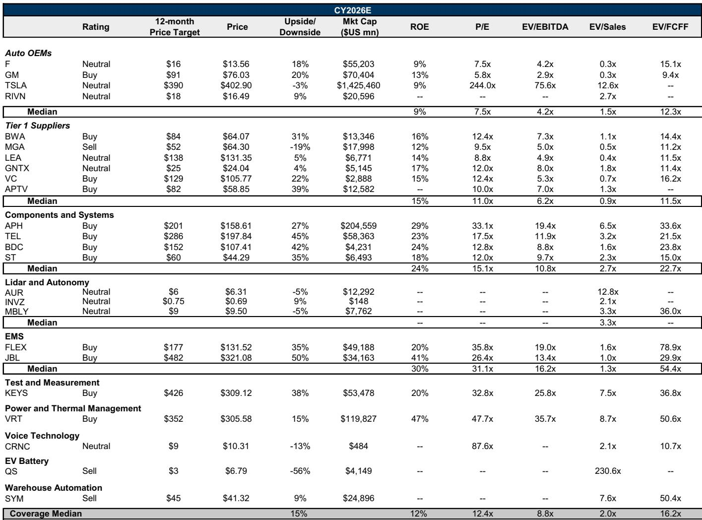
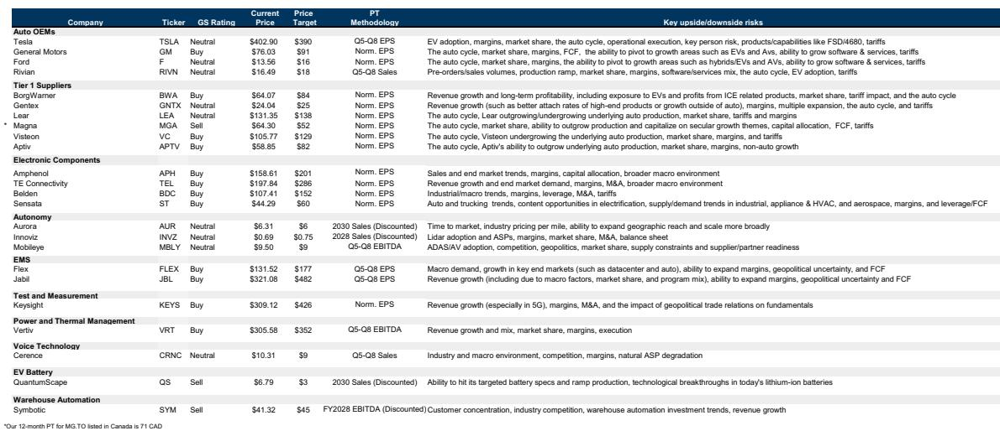
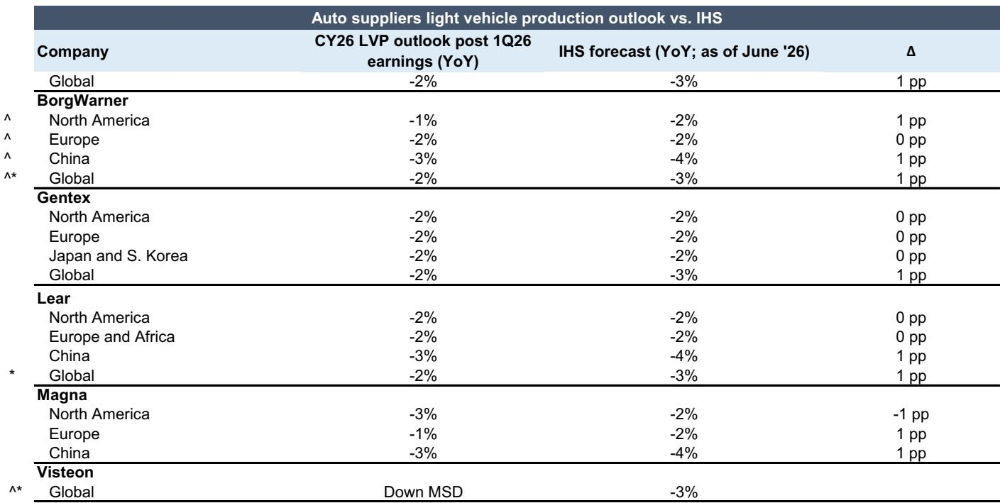

# GS：工业科技跑赢汽车33个百分点，GS看好数据中心与AI资本开支

二季度财报季即将开启，GS覆盖的汽车与工业科技板块内部分化已经相当明显。工业科技股自一季报以来中位数下跌5%，但年初至今累计上涨33%；汽车股则恰好相反——财报后上涨7%，年初至今仅涨3%。GS在最新发布的2Q26业绩预览中给出了一个关键判断：工业科技公司的业绩指引将普遍优于市场预期，而汽车厂商和供应商的指引更多是“符合预期”。

这一判断的核心驱动力并不复杂。工业科技受益于两股力量的叠加：超大规模云服务商和AI相关的资本开支仍在强劲增长，同时ISM制造业指数已连续六个月处于扩张区间。工业复苏不再是预期，而是正在兑现的趋势。相比之下，全球汽车产量和美国销量预计将同比小幅下滑，但这已在多数公司的假设范围内，算不上意外。

> **KC评论：** GS的意思很直白——工业科技处于“好且可能更好”的区间，汽车则处于“需要继续观察但已知”的状态。读者真正需要关注的，是那些已在高位被充分定价的工业科技股能否继续超预期，以及汽车股中是否存在被低估的个体机会。

## 1. 数据中心产业链的高门槛意味着超预期更难转化为报价上涨

过去几个财报季，数据中心相关的工业科技股在发布业绩后的首个交易日上涨难度越来越大。市场对这些公司的预期已经很高，即便业绩超预期，报价也未必有明显反应。GS特别提到，安费诺（APH）是近期争议较大、但该机构持正面看法的标的。如果这一趋势延续，真正值得关注的反而是那些尚未被充分定价、存在预期差的公司。

对于读者而言，这意味着工业科技板块的选股逻辑正在从“赛道型”转向“公司型”。不是所有沾上AI概念的工业科技公司都能获得同样的回报。

## 2. 汽车股的核心变量正在从宏观转向个体

美国汽车年化销量和全球产量均处于历史均值附近，这意味着行业贝塔已经很难提供超额收益。GS认为，本季度的焦点将转向个体增长驱动因素和每股盈利可持续性。部分汽车供应商已从数据中心和能源领域的机会中获益——博格华纳、安波福和福特汽车在季内均有不错表现，其中博格华纳被GS视为该主题下最受益的标的。

与此同时，特斯拉的二季度交付量强于预期，GS认为其市场预期存在上调空间。但需要注意，特斯拉的估值已处于极高水平，其报价表现更多取决于FSD渗透率、robotaxi推进节奏和Optimus进展等主题性因素，而非短期财务数据。

> **KC评论：** 汽车板块的机会正在从“行业整体”转向“谁能找到第二增长曲线”。数据中心和能源领域的跨界机会，可能是未来几个季度最值得跟踪的变量。

## 3. 报告没有完全回答的关键问题：贸易规则和成本传导的不确定性

GS列出了几个需要持续跟踪的不确定性因素，但并未给出明确结论。首先是USMCA（美墨加协定）的未来走向。白宫正寻求提高美国本土含量要求，但根据媒体报道，除非有国家决定退出，否则该协定在未来十年内仍将有效。企业普遍表示有能力与供应商和客户合作应对，但在规则明确之前，任何实质性行动都难以落地。

其次是投入成本通胀。铜和内存价格持续上涨，铝和原油虽从高位回落，但能否持续仍不确定。GS的基本假设是供应链能够最终传导这些成本，但存在时滞。对于通用汽车和福特等主机厂而言，如果铝和原油价格维持低位，2027年的原材料成本不确定性将显著缓解。

这两个问题本质上都指向同一个方向：企业的定价能力和供应链管理能力将在未来几个季度成为核心竞争优势，而非仅仅是成本控制。

## 4. 读者的观察框架：从行业叙事转向公司层面的验证

本季度的关键不在于判断行业方向，而在于验证公司层面的执行力。对于工业科技，需要关注的是数据中心业务占比、订单可见度和毛利率趋势；对于汽车，则需要关注非传统业务（如数据中心、能源）的收入贡献、中国市场的出口和份额变化，以及管理层对贸易政策和成本不确定性的应对措辞。

GS的报告提供了一张完整的估值和情景分析表，覆盖了从乐观到悲观的多重假设。，而是这些情景背后的逻辑——哪些变量会推动公司从一种情景切换到另一种情景。

> **KC评论：** 这份报告最有价值的部分并不是结论，而是它提供了一套思考框架：在分化加剧的市场中，如何识别哪些公司具备从“符合预期”跃升到“超预期”的能力。答案往往藏在那些与核心行业叙事无关的细分业务里。

For informational purposes only. Portions may be generated,translated,summarized,or edited with AI assistance based on source materials and may contain omissions or errors. Please verify independently. This is not investment,legal,tax,accounting,or other professional advice.

For informational purposes only. Portions may be generated,translated,summarized,or edited with AI assistance based on source materials and may contain omissions or errors. Please verify independently. This is not investment,legal,tax,accounting,or other professional advice.

