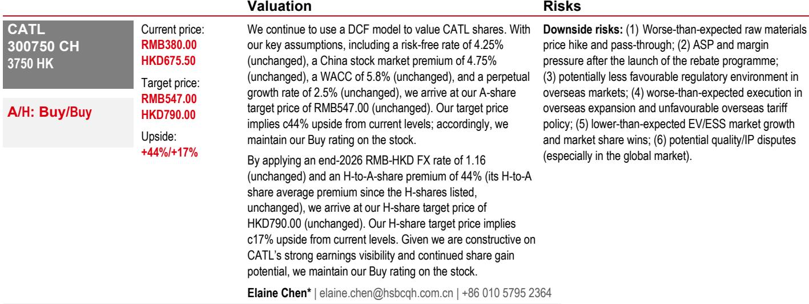
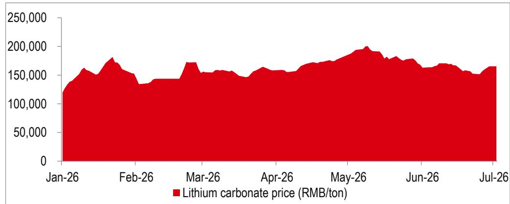
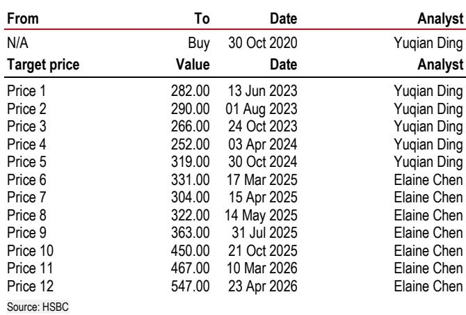

# 电池行业研究观点：市场情绪修正，而非基本面转折——下一轮催化因素已现

过去两个月，市场对中国电池行业的定价出现偏差，且这一偏差正日益明显。自5月以来，中国电池指数下跌13%，行业龙头公司报价下跌17%。然而同期，电池需求并未减弱。中国电池销售（含出口）在4月和5月均同比增长43%。6月和7月的生产计划显示环比持续增长。碳酸锂价格已稳定在一个区间，既未预示供应冲击，也未显示需求崩溃。价格走势与经营现实之间的背离十分显著，这是当前研究者必须面对的核心分析事实。

如果不是基本面恶化，那么是什么导致了这轮情绪修正？最合理的解释是，市场正在从一个前期涨幅较大的板块中轮动。今年前五个月，电池指数上涨21%，远超沪深300指数4%的回报表现。如此涨幅后的获利了结是常规操作。但相对于基础业务的稳定性而言，此次修正的幅度表明市场可能已过度反应。对于严肃的研究者而言，问题在于这是否在下一轮催化因素到来前创造了增加观察的机会。

这一催化因素已在日程上清晰可见。即将到来的第二季度财报季，由于去年同期基数较低且许多公司录得亏损，很可能为多数电池公司带来有意义的同比业绩回升。积极的业绩预告和已公布的业绩应开始改变市场情绪。但财报季不仅仅是短期的交易事件。它还标志着市场未来评估这些公司方式的转变。关注点将从业绩回升的幅度转向利润的质量和可持续性。这一转变对标的筛选具有重要影响。

## 上升周期后半段：回报表现更青睐业绩质量，而非贝塔敞口

电池行业目前正进入其当前上升周期的后半段。在第一阶段，需求上升和利润率回升提振了几乎所有参与者。这一阶段已在定价中基本反映。第二阶段则更具区分性。研究者开始关注哪些公司能够维持其业绩轨迹，哪些公司在本轮周期之外拥有可信的下一轮增长动力。这正是标的筛选变得关键的地方。

今年前五个月的证据已显示出分化。虽然总需求强劲，但需求的构成已发生有利于某些商业模式的变化。1至5月，储能电池同比增长88%，远超电动汽车电池的45%。储能已成为该行业主要的增量增长驱动力。在电动汽车和储能终端市场均有布局的公司，比集中于单一领域的公司更具优势。在原材料成本已稳定而非明显回落的环境中，规模也更为重要。当锂价快速下跌时，即使是较小的生产商也能从库存收益和利润率扩张中受益。在成本稳定的环境下，定价能力和运营效率成为真正的区分因素。

因此，上升周期后半段将回报表现给能够展示三点的公司：核心业绩的韧性、下一增长动力的可见性，以及通过原材料周期保护利润率的能力。这些标准大大缩小了选择范围。

## 需求强劲，但构成变化有利于多元化参与者

总体需求数据直接且积极。2026年前五个月，中国电池总销量达783 GWh，同比增长47%。其中，电动汽车电池528 GWh，储能电池256 GWh。储能板块目前增速几乎是电动汽车电池的两倍，正成为行业的主要增长引擎。

这一转变具有结构性根源。可再生能源基础设施的建设持续创造对电网级储能的需求。同时，一个新的需求向量正在出现：人工智能数据中心。人工智能计算集群的电力消耗需求，正在催生此前周期中不存在的现场储能部署需求。这是一个超越当前电动汽车周期的中期增长叙事，为纯电动汽车电池生产商无法触及的需求增加了可见性。

在电动汽车领域内，情况更为微妙。2026年前五个月，国内电动汽车电池装机量仅同比增长7%，较前几年的高速增长有所放缓。但这一总体数据掩盖了重要的结构性变化。单车电池容量正在快速上升——纯电动汽车增长16%，插电式混合动力汽车增长28%。商用车电动化正在加速，2026年5月商用车电动化渗透率达39%，远低于此前的水平。商用车电池装机量目前占电动汽车电池总装机量的25%。即使乘用车电动汽车销售增长放缓，这些趋势也支撑着电池需求。

对于研究者而言，启示是明确的。同时服务于乘用车电动汽车市场、商用车和储能市场的公司拥有多个需求驱动因素。过度依赖单一终端市场的公司更容易受到某一板块放缓的影响。

## 锂价稳定将竞争优势转向规模和定价能力

在经历了前期的极端波动后，第二季度碳酸锂价格已稳定在每吨15万至20万元人民币的区间。这种稳定性对行业整体是有利的，因为它消除了一个业绩不确定性来源。但它也改变了行业内的竞争格局。

当锂价明显回落时，收益广泛分布。几乎任何电池制造商都能在投入成本下降时捕捉到利润率改善。现在情况已不再如此。在稳定的原材料环境下，保护利润率的能力取决于采购规模、长期供应协议以及将成本变化传递给客户的能力。这些能力并非均匀分布。最大的参与者拥有专门的采购团队、多元化的供应商网络以及谈判有利条款的议价能力。较小的参与者缺乏这些优势，如果锂价对他们不利，他们的利润率更可能受到压缩。

规模在客户方面也很重要。拥有跨多个地区和终端市场的多元化客户群的电池制造商，不易受到单一客户定价压力的影响。最大的参与者几乎服务于全球所有主要汽车制造商和储能开发商，这赋予了小型竞争对手所缺乏的定价能力。在上升周期后半段，这种定价能力成为业绩质量的关键决定因素。

## 技术领先正成为有形的竞争护城河

电池行业长期以来以成本和规模上的激烈竞争为特征。技术一直很重要，但其商业影响往往被推迟到未来几年。这种情况正在改变。下一代电池技术的商业化正在加速，领先者与落后者之间的差距正在扩大。

几项技术正从实验室走向生产线。钠离子电池为能量密度不那么关键的应用（如电网级储能和低成本电动汽车）提供了锂离子电池的低成本替代方案。固态电池有望提供更高的能量密度和更好的安全性，尽管商业化时间表仍不确定。超快充电技术正成为竞争差异化因素，因为汽车制造商寻求解决续航焦虑。这些技术中的每一项都需要多年的研发投入、深厚的知识产权组合以及无法快速复制的制造专长。

在这些技术中领先的公司将能够获得溢价定价并确保长期供应协议。落后的公司将被迫仅靠价格竞争，在一个固定成本高昂的行业中，这是一场不可持续的逐底竞争。市场已开始认识到这种分化，随着上升周期后半段的展开，它将成为估值中越来越重要的因素。

## 报告未完全解答AI数据中心需求将如何规模化

研究报告将人工智能驱动的数据中心储能确定为新的中期增长叙事，这是该论点中最引人入胜的元素之一。但报告并未完全解决规模问题。相对于现有的电动汽车和电网储能市场，这一需求将有多大？部署的时间表是什么？数据中心储能的技术要求是否与电网储能不同，从而有利于某些电池化学体系或制造商？

这些都是开放性问题，对研究决策很重要。如果人工智能数据中心储能在未来两到三年内成为有意义的需求驱动因素，它可能会将上升周期延长至超出当前模型假设的范围。它还可能创造新的竞争格局，因为数据中心运营商的采购标准可能与汽车制造商或公用事业公司不同。能够服务于多个终端市场的公司可能不成比例地受益。

但时间表不确定。数据中心建设周期很长，现场储能的整合仍处于早期阶段。报告将其标记为未来的催化因素是正确的，但在部署速度更加明确之前，研究者应谨慎将激进的假设嵌入其估值模型。

## 上升周期后半段的决策框架

对于在这一阶段进行观察的研究者而言，分析挑战在于区分将从周期中受益的公司和将经历周期的公司。这种区分很重要，因为上升周期后半段是回报表现差异最显著的时期。

一个有用的框架涉及三个筛选条件。第一个筛选条件是业绩可见性。拥有长期供应协议、多元化客户群和利润率稳定性记录的公司，应比依赖现货市场定价或客户集中度高的公司得分更高。第二个筛选条件是增长可选性。同时涉足电动汽车和储能市场，并有可信途径进入人工智能数据中心储能领域的公司，比专注于单一终端市场的公司拥有更多可动用的杠杆。第三个筛选条件是技术定位。在钠离子、固态或超快充电技术方面展现出领导力的公司，拥有将随时间推移而扩大的竞争护城河。

某龙头公司在所有三个筛选条件上得分都很高。它拥有无与伦比的规模、跨电动汽车、商用车和储能的多元化终端市场敞口，以及行业领先的研发能力。其定价能力和采购优势赋予其小型竞争对手无法匹敌的利润率韧性。其技术储备是行业中最深厚的之一。对于寻求在电池行业上升周期后半段进行观察的研究者而言，它是一个自然的起点。

但该框架适用于任何单一标的之外的领域。行业中的每家公司都应依据这些相同标准进行评估。通过所有三个筛选条件的公司很可能表现优异。在一个或多个筛选条件上失败的公司，无论整体行业轨迹如何，都可能表现滞后。

## 完整报告包含使论点可视化的图表

此处提出的论点基于最好通过视觉理解的数据。需求趋势、终端市场构成的转变、锂价的稳定以及板块相对于其基本面的相对表现，均在研究报告的原始图表中有所说明。这些图表使价格与基本面之间的背离一目了然，这是纯文字无法完全传达的。

加入社区阅读完整报告并查看原始图表。

*仅供参考。部分内容可能基于源材料通过人工智能辅助生成、翻译、总结或编辑，可能存在遗漏或错误。请独立核实。本文不构成任何专业建议。*

仅供参考。部分内容可能基于源材料通过人工智能辅助生成、翻译、总结或编辑，可能存在遗漏或错误。请独立核实。本文不构成任何专业建议。

