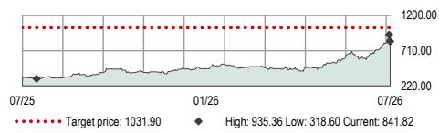
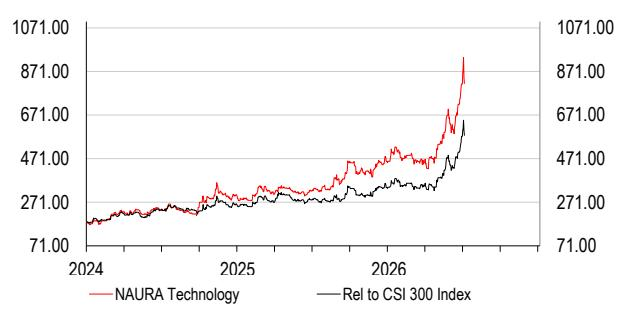
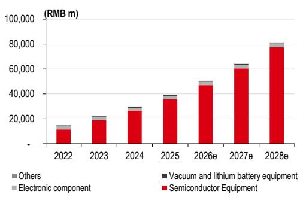
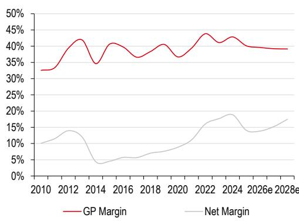
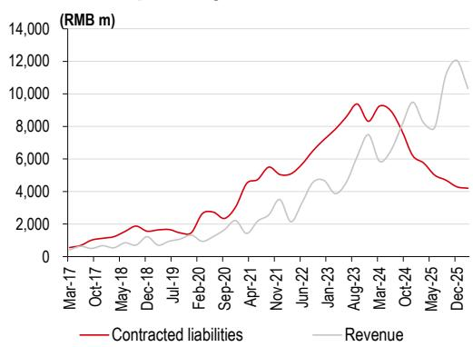
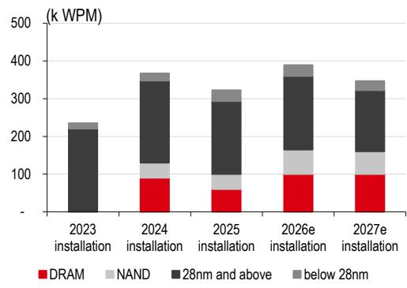
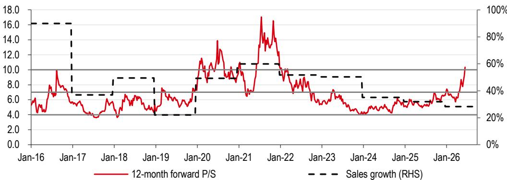
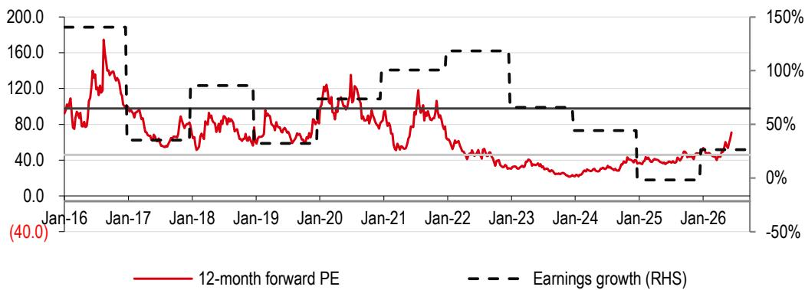

# 北方华创（002371 CH）

## 平台战略打开玻璃基板增长空间

**——国内半导体设备支出扩大支撑进一步增长**

◆ 平台战略打开玻璃基板增长空间

◆ 维持正面观点；目标价上调

**增长前景展望。** 随着国内存储厂商上调资本开支计划，公司股价近两个月上涨57%，但仍略低于Wind半导体设备指数72%的涨幅。相对表现差异主要源于：1）一季度业绩后市场对毛利率趋势的关注；2）与中微公司、拓荆科技等同业相比，公司来自存储客户的收入占比相对较低。展望未来，我们预计公司将凭借广泛的产品组合，在存储、逻辑和玻璃基板客户中获取增量订单，2026-2028年实现27%-28%的收入增长。因此，虽然我们将2026/2027年净利润预测下调30%/25%以反映扩张期较高的运营费用，但我们预计2026-2028年净利润复合增长率将达43%（此前2025-2027年净利润复合增长率为31%）。

**受益于存储和逻辑产能扩张。** 在存储领域，长鑫存储/长江存储约8%/约13%的全球DRAM/NAND份额仍远低于中国约25%/约30%的需求占比（数据来源：公司数据、TrendForce），国产替代空间显著；同时两家公司潜在的IPO融资可能支持其在存储价格上行周期中进一步扩张。在逻辑领域，据报道中国计划在2030年前将先进产能扩大约50万片晶圆（路透社，2026年2月25日），2025年荷兰光刻机进口额达98亿美元（同比增长3%，但平均售价同比增长37%，海关总署数据），均指向先进代工厂资本开支的提升。北方华创的广泛平台战略使其能够充分把握这一周期，跨工艺产品覆盖增强了设备层面的协同效应。因此，我们预计2026年公司来自存储/逻辑客户的订单将增长50%以上/30%以上。

**解锁玻璃基板市场的增量空间。** 我们估计，到2032年，设备和材料约占113亿美元玻璃基板市场的10%。向玻璃基板的转变需要物理气相沉积设备用于种子层沉积，北方华创在此领域已有商业化基础。此外，公司还提供对良率关键的descum和PIQ设备，即将推出的电镀工具将利用其现有的TSV技术专长（数据来源：公司数据）。北方华创正快速转型为综合解决方案提供商，我们相信其在玻璃基板市场有望获得更大份额。

**维持正面观点；上调目标价。** 我们继续使用市销率估值法。我们采用2027年预期11.7倍市销率目标倍数（此前为7.5倍），与全球同业平均水平一致，因为我们预计2026-2028年收入复合增长率为27%（此前2024-2027年收入复合增长率为29%），与全球同业平均收入复合增长率26%基本一致。基于我们2027年每股收入预测88.20元（此前2026年每股收入预测为70.88元），我们将目标价上调至1,031.90元（此前为528.40元），较当前水平约有23%的上行空间。公司TGV ECP设备的发布可能成为股价催化剂。主要下行风险详见第5页。

---

## 披露与免责声明

本报告必须与披露附录中的披露内容及分析师认证，以及构成报告一部分的免责声明一并阅读。

---

## 股票

半导体与设备

中国

**维持正面观点**

**目标价（人民币）** **此前目标价（人民币）**

1,031.90 528.40

**当前价格（人民币）** **上行/下行空间**

841.82 +22.6%

（截至2026年7月2日）

**市场数据**

| | |
|---|---|
| 市值（百万元人民币） | 610,900 |
| 市值（百万美元） | 89,983 |
| 三个月平均日交易量（百万美元） | 1,136 |

| | |
|---|---|
| 自由流通比例 | 78% |
| 彭博代码 | 002371 CH |
| 路透代码 | 002371.SZ |

**财务数据与比率（人民币）**

| 年度截至 | 2025年实际 | 2026年预测 | 2027年预测 | 2028年预测 |
|---|---|---|---|---|
| HSBC前海每股收益 | 7.64 | 9.62 | 13.41 | 19.57 |
| HSBC前海每股收益（此前） | 10.33 | 13.85 | 17.80 | 不适用 |
| 变化（%） | -26.0 | -30.6 | -24.7 | 不适用 |
| 市场一致预期每股收益 | 9.73 | 10.69 | 15.24 | 20.17 |
| 市盈率（倍） | 110.2 | 87.5 | 62.8 | 43.0 |
| 股息率（%） | 0.1 | 0.1 | 0.2 | 0.2 |
| 企业价值/EBITDA（倍） | 98.9 | 70.8 | 51.7 | 37.1 |
| 净资产回报表现（%） | 16.1 | 17.0 | 20.0 | 23.8 |

**52周价格（人民币）**

数据来源：LSEG IBES，HSBC前海证券预测

**苏姿（注册编号：S1700525070001）**
分析师，A股IT硬件研究
HSBC前海证券有限公司
cara.z.h.su@hsbcqh.com.cn
+86 21 50662080

*受雇于HSBC证券（美国）公司的非美国关联机构，未根据FINRA规定注册/取得资格

---

## 新兴市场情绪调查第24期
点击查看

报告发布机构：HSBC前海证券有限公司

查看HSBC前海证券：https://www.research.hsbc.com

| 年度截至 | 2025年实际 | 2026年预测 | 2027年预测 | 2028年预测 |
|---|---|---|---|---|
| **利润表摘要（百万元人民币）** | | | | |
| 收入 | 39,353 | 50,468 | 64,003 | 81,302 |
| EBITDA | 6,146 | 8,603 | 11,784 | 16,378 |
| 折旧与摊销 | -1,422 | -1,969 | -2,104 | -2,275 |
| 营业利润/息税前利润 | 4,724 | 6,634 | 9,680 | 14,102 |
| 净利息 | -229 | -271 | -278 | -281 |
| 税前利润 | 5,845 | 7,718 | 10,757 | 15,177 |
| HSBC前海税前利润 | 5,845 | 7,718 | 10,757 | 15,177 |
| 所得税 | -436 | -575 | -802 | -1,131 |
| 净利润 | 5,522 | 6,980 | 9,733 | 14,204 |
| HSBC前海净利润 | 5,522 | 6,980 | 9,733 | 14,204 |

| **现金流量表摘要（百万元人民币）** | | | | |
| 经营活动现金流 | 2,133 | 2,488 | 3,970 | 6,521 |
| 资本支出 | -2,262 | -2,900 | -3,678 | -4,672 |
| 投资活动现金流 | -3,929 | -2,900 | -3,678 | -4,672 |
| 股息 | -552 | -698 | -973 | -1,420 |
| 净债务变动 | 3,781 | 965 | 406 | -876 |
| 自由现金流（股权） | 713 | -412 | 292 | 1,849 |

| **资产负债表摘要（百万元人民币）** | | | | |
| 无形资产 | 10,520 | 8,987 | 7,454 | 5,921 |
| 有形固定资产 | 19,438 | 21,902 | 25,009 | 28,939 |
| 流动资产 | 59,321 | 69,376 | 82,387 | 100,199 |
| 现金及其他 | 17,337 | 16,373 | 15,966 | 16,842 |
| 总资产 | 89,801 | 100,787 | 115,372 | 135,581 |
| 经营性负债 | 31,029 | 35,587 | 41,138 | 48,116 |
| 总债务 | 14,844 | 14,844 | 14,844 | 14,844 |
| 净债务 | -2,493 | -1,528 | -1,122 | -1,998 |
| 股东权益 | 37,726 | 44,153 | 53,188 | 66,419 |
| 投入资本 | 40,913 | 48,305 | 57,746 | 70,101 |

| **环境指标** | **2024年实际** | **治理指标** | **2025年实际** |
|---|---|---|---|
| 温室气体排放强度* | 不适用 | 董事会成员人数 | 11 |
| 能源强度* | 不适用 | 董事会平均任期（年） | 不适用 |
| 二氧化碳减排政策 | 是 | 女性董事会成员比例（%） | 27.3 |
| **社会指标** | **2024年实际** | 独立董事比例（%） | 36.4 |
| 员工成本占收入比例 | 不适用 | | |
| 员工流动率（%） | 不适用 | | |
| 多元化政策 | 是 | | |

ESG指标

## 财务数据与估值：北方华创

正面观点

财务报表
估值数据

| 年度截至 | 2025年实际 | 2026年预测 | 2027年预测 | 2028年预测 |
|---|---|---|---|---|
| 企业价值/销售额 | 15.4 | 12.1 | 9.5 | 7.5 |
| 企业价值/EBITDA | 98.9 | 70.8 | 51.7 | 37.1 |
| 企业价值/投入资本 | 14.9 | 12.6 | 10.6 | 8.7 |
| 市盈率* | 110.2 | 87.5 | 62.8 | 43.0 |
| 市净率 | 16.2 | 13.8 | 11.5 | 9.2 |
| 自由现金流回报表现（%） | 0.1 | -0.1 | 0.0 | 0.3 |
| 股息率（%） | 0.1 | 0.1 | 0.2 | 0.2 |

*基于HSBC前海每股收益（稀释后）
数据来源：公司数据，HSBC前海证券
*温室气体排放强度和能源强度分别以千克和千瓦时计量，以千美元收入为基准

发行人信息

| | |
|---|---|
| 当前价格（人民币） | 841.82 |
| 目标价（人民币） | 1,031.90 |
| 路透代码 | 002371.SZ |
| 彭博代码 | 002371 CH |
| 市值（百万美元） | 89,983 |
| 自由流通比例 | 78% |
| 行业 | 半导体 |
| 国家/地区 | 中国 |
| 分析师 | 苏姿 |
| 联系方式 | +86 21 50662080 |

比率、增长与每股分析

| 年度截至 | 2025年实际 | 2026年预测 | 2027年预测 | 2028年预测 |
|---|---|---|---|---|
| **同比增长率（%）** | | | | |
| 收入 | 31.9 | 28.2 | 26.8 | 27.0 |
| EBITDA | -4.9 | 40.0 | 37.0 | 39.0 |
| 营业利润 | -14.4 | 40.4 | 45.9 | 45.7 |
| 税前利润 | -10.2 | 32.0 | 39.4 | 41.1 |
| HSBC前海每股收益 | -27.7 | 25.9 | 39.4 | 45.9 |

| **比率（%）** | | | | |
| 收入/投入资本（倍） | 1.2 | 1.1 | 1.2 | 1.3 |
| 投入资本回报率 | 15.8 | 16.9 | 19.6 | 22.6 |
| 净资产回报表现 | 16.1 | 17.0 | 20.0 | 23.8 |
| 总资产回报表现 | 7.2 | 7.8 | 9.4 | 11.4 |
| EBITDA利润率 | 15.6 | 17.0 | 18.4 | 20.1 |
| 营业利润率 | 12.0 | 13.1 | 15.1 | 17.3 |
| EBITDA/净利息（倍） | 26.9 | 31.7 | 42.3 | 58.2 |
| 净债务/权益 | -5.7 | -3.0 | -1.9 | -2.8 |
| 净债务/EBITDA（倍） | -0.4 | -0.2 | -0.1 | -0.1 |

| **每股数据（人民币）** | | | | |
| 报告每股收益（稀释后） | 7.64 | 9.62 | 13.41 | 19.57 |
| HSBC前海每股收益（稀释后） | 7.64 | 9.62 | 13.41 | 19.57 |
| 每股股息 | 0.76 | 0.96 | 1.34 | 1.96 |
| 每股账面价值 | 52.06 | 60.93 | 73.40 | 91.66 |

价格相对走势

数据来源：HSBC前海证券
注：价格为2026年7月2日收盘价

图表1. 北方华创收入构成

数据来源：公司数据，HSBC前海证券预测

图表2. 北方华创毛利率与净利率趋势

数据来源：公司数据，HSBC前海证券预测

图表3. 北方华创合同负债余额与季度销售额

数据来源：公司数据，HSBC前海证券

图表4. 国内晶圆厂产能扩张计划

数据来源：公司数据，HSBC前海证券预测

图表5. 预测调整

| （百万元人民币） | 2025年预测 | 2025年实际 | 差异 | 2026年预测（旧） | 2026年预测（新） | 差异 | 2027年预测（旧） | 2027年预测（新） | 差异 | 2028年预测（新） |
|---|---|---|---|---|---|---|---|---|---|---|
| **收入** | | | | | | | | | | |
| 半导体设备 | 36,310 | 35,776 | -1% | 48,428 | 47,042 | -3% | 61,044 | 60,434 | -1% | 77,582 |
| 电子元器件 | 2,094 | 2,579 | 23% | 2,199 | 2,708 | 23% | 2,309 | 2,844 | 23% | 2,986 |
| 真空-太阳能 | 564 | 955 | 69% | 649 | 669 | 3% | 746 | 669 | -10% | 669 |
| 其他 | 43 | 43 | 0% | 49 | 49 | 0% | 57 | 56 | 0% | 65 |
| 总收入 | 39,011 | 39,353 | 1% | 51,325 | 50,468 | -2% | 64,156 | 64,003 | 0% | 81,302 |

| **毛利率** | | | | | | | | | |
| 半导体设备 | 41% | 39% | -1.0ppt | 41% | 39% | -1.5ppt | 41% | 39% | -1.8ppt | 39% |
| 电子元器件 | 60% | 53% | -7.4ppt | 60% | 53% | -7.4ppt | 60% | 53% | -7.4ppt | 53% |
| 真空-太阳能 | 26% | 26% | 0.0ppt | 26% | 26% | 0.0ppt | 26% | 26% | 0.0ppt | 26% |
| 其他 | 66% | 61% | -4.5ppt | 66% | 61% | -4.5ppt | 66% | 61% | -4.5ppt | 61% |
| 综合毛利率 | 41.4% | 40.0% | -1.3ppt | 41.2% | 39.6% | -1.6ppt | 41.1% | 39.2% | -1.8ppt | 39.1% |

| **毛利润** | | | | | | | | | |
| 半导体设备 | 14,705 | 14,116 | -4% | 19,613 | 18,346 | -6% | 24,723 | 23,388 | -5% | 30,024 |
| 电子元器件 | 1,263 | 1,366 | 8% | 1,326 | 1,434 | 8% | 1,393 | 1,506 | 8% | 1,581 |
| 真空-太阳能 | 147 | 248 | 69% | 169 | 174 | 3% | 194 | 174 | -10% | 174 |
| 其他 | 28 | 26 | -7% | 32 | 30 | -7% | 37 | 35 | -7% | 40 |
| 毛利润合计 | 16,144 | 15,756 | -2% | 21,141 | 19,984 | -5% | 26,347 | 25,102 | -5% | 31,819 |
| 营业费用合计 | (9,093) | (11,058) | 22% | (11,232) | (13,351) | 19% | (13,349) | (15,422) | 16% | (17,717) |
| 财务费用 | (120) | (229) | 91% | (127) | (271) | 113% | (137) | (278) | 103% | (281) |
| 税前利润 | 7,982 | 5,845 | -27% | 10,832 | 7,718 | -29% | 13,913 | 10,757 | -23% | 15,177 |
| 净利润 | 7,478 | 5,522 | -26% | 10,029 | 6,980 | -30% | 12,891 | 9,733 | -25% | 14,204 |
| 每股收益（人民币） | 10.33 | 7.64 | -26% | 13.85 | 9.62 | -31% | 17.80 | 13.41 | -25% | 19.57 |

数据来源：公司数据，HSBC前海证券预测

我们将2026-2027年每股收益预测分别下调31%和25%，主要基于以下调整：

将2026年收入预测下调2%，主要考虑：1）国内存储和先进逻辑客户需求增长，但被太阳能电池制造商订单减少所抵消；2）电子元器件业务表现好于预期，受益于大型客户的稳定需求。

将2026年和2027年综合毛利率预测分别下调1.6个百分点和1.8个百分点，主要考虑：1）与芯源微的整合，因其半导体设备毛利率低于北方华创；2）部分领域市场份额竞争带来的价格压力。

将2026-2027年营业费用预测分别上调19%/16%，因北方华创今明两年正快速扩大人员规模。我们预计2028年营业费用占比将有所下降。

本报告同时引入2028年收入预测813.02亿元和净利润预测142.04亿元。

展望2026年第二季度业绩，我们预测销售额105亿元、净利润16亿元，销售额与市场一致预期基本持平，但净利润低于预期，因我们考虑了今年高于预期的营业费用，全年目标新增员工4000-5000人。虽然这可能给公司短期净利润带来压力，但我们认为这一决策将有助于北方华创提升研发能力和服务质量，从而在更长周期内受益。

图表6. HSBC前海证券预测与市场一致预期对比

| （百万元人民币） | 收入 | | | 净利润 | | |
|---|---|---|---|---|---|---|
| | 2026年预测 | 2027年预测 | 2028年预测 | 2026年预测 | 2027年预测 | 2028年预测 |
| HSBC前海预测 | 50,468 | 64,003 | 81,302 | 6,980 | 9,733 | 14,204 |
| 市场一致预期 | 50,455 | 63,971 | 80,369 | 7,731 | 10,762 | 14,075 |
| 差异 | 0% | 0% | 1% | -10% | -10% | 1% |

数据来源：HSBC前海证券预测

我们修订后的2026-2028年净利润预测相对于Wind一致预期分别为-10%、-10%和1%，主要考虑了2026-2027年扩张期行政费用和研发费用的上升。然而，我们认为这一因素已反映在北方华创过去两个月57%的股价涨幅（同期半导体设备指数涨幅为72%）中。

图表7. 2026年净利润对IC设备销售增长率和毛利率的敏感性分析

| | | IC设备销售增长率 | | | |
|---|---|---|---|---|---|
| | | 22% | 28% | 35% | 42% | 49% |
| IC设备毛利率 | 38.2% | -29% | -26% | -23% | -20% | -17% |
| | 40.2% | -18% | -15% | -11% | -8% | -4% |
| | 42.2% | -8% | -4% | 0% | 4% | 8% |
| | 44.2% | 2% | 7% | 11% | 16% | 21% |
| | 46.2% | 12% | 18% | 23% | 28% | 33% |

数据来源：HSBC前海证券预测

## 估值与风险

鉴于公司净利润将受扩张期运营费用上升的影响，我们继续使用市销率估值法。我们预测2026-2028年收入复合增长率为27%（此前2024-2027年收入复合增长率为29%），与全球同业平均收入复合增长率26%基本一致。我们现以全球同业平均水平为参考，因我们认为整个行业正经历一轮估值重估，受算力需求快速增长推动。因此，我们采用2027年预期11.7倍市销率目标倍数（与全球同业平均水平一致；此前为7.5倍）。基于我们2027年每股收入预测88.20元（此前2026年每股收入预测为70.88元），我们将目标价上调至1,031.90元（此前为528.40元），隐含约23%的上行空间。公司TGV ECP设备的发布可能成为股价催化剂。

## 主要下行风险

**国内半导体设备资本开支放缓。** IC设备是公司关键收入增长驱动力之一。半导体资本开支的任何放缓都将对北方华创的销售前景产生负面影响。

**新设备研发进展慢于预期。** 北方华创保持高水平的研发投入以扩大产品覆盖范围。研发项目进展缓慢可能阻碍收入增长。

**玻璃基板设计中标低于预期。** 我们预计北方华创将从国内玻璃基板技术投资中受益。投资或设计中标延迟或低于预期将对我们的收入假设构成下行风险。

图表8. 12个月远期市销率与销售增长图

数据来源：Wind，HSBC前海证券预测

图表9. 12个月远期市盈率与净利润增长图

数据来源：Wind，HSBC前海证券预测

图表10. 中国半导体行业估值对比

| 代码 | 公司 | 评级 | 货币 | 目标价 | 当前价 | 市值（百万美元） | 日均交易量（百万美元） | 2026年预测市销率（倍） | 2027年预测市销率（倍） | 2026-2028年收入复合增长率 | 2026年预测每股收益增长率 | 2027年预测每股收益增长率 | 2026-2028年净利润复合增长率 | 2027年预测PEG | 2026年预测市净率（倍） | 2026年预测净资产回报表现（%） |
|---|---|---|---|---|---|---|---|---|---|---|---|---|---|---|---|
| 002371 CH | 北方华创* | 正面 | 人民币 | 1,031.90 | 841.82 | 89,983 | 1,136 | 12.1 | 9.5 | 27% | 26% | 39% | 43% | 1.5 | 13.8 | 17.0 |
| 688012 CH | 中微公司* | 正面 | 人民币 | 344.50 | 408.90 | 57,402 | 1,030 | 15.5 | 11.4 | 29% | 62% | 45% | 37% | 1.4 | 9.9 | 14.2 |
| 688200 CH | 华峰测控* | 正面 | 人民币 | 223.38 | 450.00 | 13,300 | 192 | 35.4 | 29.1 | 不适用 | 29% | 21% | 不适用 | 不适用 | 13.9 | 16.8 |
| 688082 CH | 盛美上海 | 不适用 | 人民币 | 不适用 | 370.00 | 26,312 | 253 | 14.7 | 11.3 | 34% | 50% | 37% | 58% | 1.2 | 12.0 | 10.0 |
| 688037 CH | 芯源微 | 不适用 | 人民币 | 不适用 | 360.00 | 10,696 | 275 | 21.0 | 15.5 | 37% | 60% | 41% | 77% | 2.0 | 23.5 | 7.9 |
| 300604 CH | 长川科技 | 不适用 | 人民币 | 不适用 | 301.46 | 28,182 | 770 | 19.8 | 14.5 | 34% | -6% | 75% | 51% | 1.6 | 30.6 | 27.6 |
| 688072 CH | 拓荆科技 | 不适用 | 人民币 | 不适用 | 832.00 | 34,658 | 572 | 20.5 | 14.4 | 37% | 224% | 96% | 49% | 1.9 | 28.7 | 22.0 |
| 688120 CH | 华海清科 | 不适用 | 人民币 | 不适用 | 281.00 | 20,485 | 307 | 16.8 | 12.7 | 31% | -133% | 39% | 31% | 2.1 | 14.5 | 16.8 |
| LRCX US | 泛林半导体** | - | 美元 | - | 351.41 | 439,463 | 94,842 | 14.4 | 12.3 | 24% | 20% | 49% | 29% | 1.5 | 37.8 | 66.7 |
| AMAT US | 应用材料** | - | 美元 | - | 603.04 | 478,789 | 93,529 | 11.2 | 9.4 | 23% | 82% | 46% | 30% | 1.2 | 18.4 | 42.3 |
| ASML NA | 阿斯麦** | - | 欧元 | - | 1,577.80 | 700,485 | 92,088 | 12.9 | 11.3 | 19% | 48% | 28% | 27% | 1.4 | 26.3 | 55.5 |
| TER US | 泰瑞达 | 不适用 | 美元 | 不适用 | 369.09 | 57,778 | 141,237 | 10.4 | 8.6 | 22% | 36% | 41% | 33% | 1.1 | 16.3 | 36.2 |
| 8035 JP | 东京电子 | 不适用 | 日元 | 不适用 | 72,940.00 | 212,052 | 1,214 | 8.7 | 7.5 | 27% | 42% | 35% | 32% | 1.5 | 16.2 | 27.6 |
| 7735 JP | 迪思科 | 不适用 | 日元 | 不适用 | 18,055.00 | 21,394 | 206 | 3.9 | 3.5 | 17% | 28% | 35% | 27% | 1.1 | 7.4 | 19.8 |
| 6361 JP | 荏原制作所 | 不适用 | 日元 | 不适用 | 5,989.00 | 17,017 | 110 | 2.5 | 2.3 | 9% | 110% | 38% | 15% | 1.6 | 4.9 | 18.6 |
| | 平均 | | | | | | | 14.6 | 11.7 | 26% | 45% | 44% | 37% | 1.6 | 18.3 | 26.6 |

注：价格为2026年7月2日收盘价。*由HSBC前海证券覆盖，使用HSBC前海证券预测。**由HSBC全球投资研究覆盖。
数据来源：公司数据，彭博（未评级股票和HSBC全球投资研究覆盖股票），HSBC前海证券预测（HSBC前海证券覆盖股票）

---

# 披露附录

## 分析师认证

主要负责本报告的下述分析师、经济学家或策略师（包括任何以报告单个或多个章节作者身份出现的分析师，以及任何在分部加总估值中被列为子公司覆盖分析师的分析师）特此证明，对相关证券或发行人的观点、其作为作者章节中表达的任何观点或预测，以及本报告中表达的任何其他观点或预测（包括研究报告封底表达的任何观点），均准确反映了其个人观点，且其薪酬的任何部分过去、现在或将来均不直接或间接与本研究报告中的具体推荐或观点相关：苏姿

## 重要披露

## 股票：评级及财务分析基础

HSBC及其关联机构（包括本报告发行人）认为，读者买卖股票的决定应取决于个人情况，如现有持仓、风险承受能力及其他考虑因素，且读者在做出投资决策时采用不同的方法和投资周期。评级不应被单独使用或依赖作为研究交流。不同证券公司使用多种评级术语以及不同的评级体系来描述其建议，因此读者应仔细阅读每份研究报告中使用的评级定义。此外，读者应仔细阅读整个研究报告，而不应仅从评级推断其内容，因为研究报告包含分析师观点及评级基础的更完整信息。

**自2015年3月23日起，HSBC基于以下标准分配评级：**

目标价基于分析师对股票当前实际价值的评估，但我们预计市场价格需要6至12个月才能反映这一价值。当目标价高于当前股价20%以上时，股票将被归类为"买入"；当目标价高于当前股价5%至20%时，股票可能被归类为"买入"或"持有"；当目标价低于当前股价5%至高于5%时，股票将被归类为"持有"；当目标价低于当前股价5%至20%时，股票可能被归类为"持有"或"减持"；当目标价低于当前股价20%以上时，股票将被归类为"减持"。

我们的评级在发生"重大变化"（开始或恢复覆盖、目标价或预测变更）时重新校准至这些区间。

上行/下行空间是目标价与股价之间的百分比差异。

**在此日期之前，HSBC的评级结构基于以下标准：**

对于每只股票，我们设定一个必要回报率，该回报率由我们的策略团队根据该股票国内或区域市场的股权成本计算得出。股票的目标价代表分析师预期该股票在我们的表现期内将达到的价值。表现期为12个月。对于被归类为"增持"的股票，潜在回报（即当前股价与目标价之间的百分比差异，包括指示的预测股息回报表现）必须在未来12个月内超过必要回报率至少5个百分点（对于被归类为"波动性"的股票则为10个百分点）。对于被归类为"减持"的股票，预期其表现将在未来12个月内低于必要回报率至少5个百分点（对于被归类为"波动性"的股票则为10个百分点）。介于这些区间之间的股票被归类为"中性"。

*如果股票的历史波动率超过40%，或上市时间不足12个月（除非处于波动率较低的行业或板块），或分析师预期存在显著波动，则该股票被归类为波动性股票。然而，我们未视为波动性的股票实际上也可能表现出此类特征。历史波动率定义为过去一个月每日365天移动平均波动率的平均值。为避免评级变更过于频繁，波动率必须向任一方向移动超过40%基准2.5个百分点，股票的状态才会发生变化。

## 长期研究线索的评级分布

截至2026年3月31日，HSBC发布的所有独立评级分布如下：

买入 59%（其中12%在过去12个月内获得投资银行服务）

持有 36%（其中12%在过去12个月内获得投资银行服务）

卖出 6%（其中6%在过去12个月内获得投资银行服务）

为上述分布目的，在从先前评级模型向当前评级模型过渡期间使用以下映射结构：在我们的先前模型下，增持=买入，中性=持有，减持=卖出；在我们当前模型下，买入=买入，持有=持有，减持=卖出。两种模型下的评级定义请参见上文"股票评级及财务分析基础"。

对于HSBC发布的非独立评级分布，请参见披露页面：http://www.hsbc
