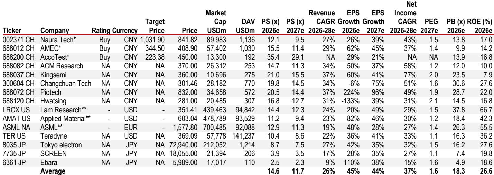
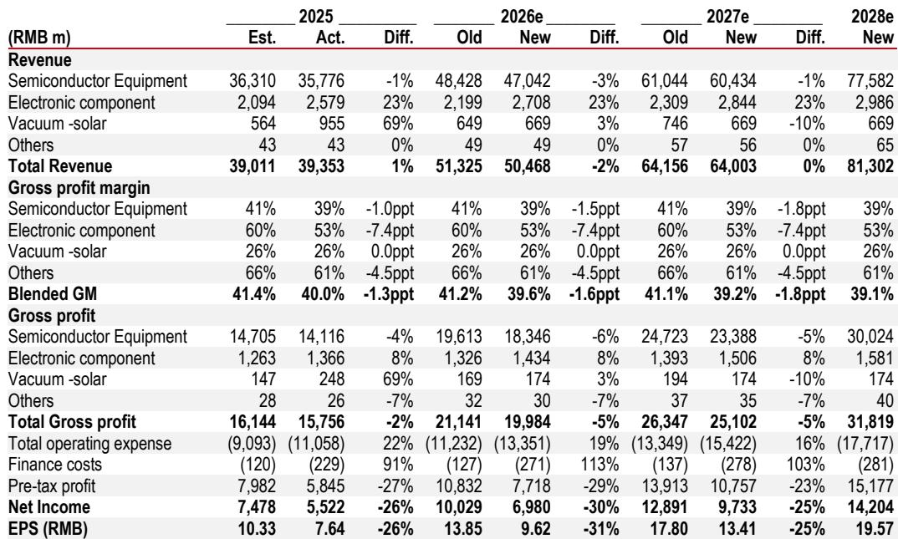

# NAURA Technology的平台战略：将周期性资本支出浪潮转化为结构性增长机遇

中国本土半导体设备市场正在经历根本性转变。多年来，市场叙事一直聚焦于成熟制程工具领域的进口替代。如今，这一故事正在改变。国内存储与逻辑晶圆厂正开启一轮比以往任何周期都更广泛、更深入、更持久的产能扩张周期。与此同时，围绕先进封装用玻璃基板，一个全新的设备市场正在兴起。NAURA Technology作为中国营收规模最大的半导体设备制造商，正处在这两大趋势的交汇点。其报价在过去两个月内上涨了57%，但仍跑输Wind半导体设备指数。这一差距反映出市场对其毛利率压力以及相对于同行而言存储客户敞口较低的担忧。但这些担忧忽略了更宏观的图景。

真正的问题不在于NAURA能否维持短期势头，而在于其涵盖刻蚀、沉积、清洗以及玻璃基板工具的广泛平台战略，能否将周期性上升转化为多年的复合增长。现有证据表明这是可能的。一份全球投行报告预测，到2028年其营收将实现27-28%的增长，2026年至2028年净利润年复合增长率达43%。这并非周期性脉冲，而是结构性的市场重估。

要理解其中缘由，需透过表面数据，审视推动这一转型的三大引擎：国内存储与逻辑资本开支的拓宽、玻璃基板设备作为新可寻址市场的开启，以及为构建长期竞争护城河而刻意做出的短期利润牺牲。每一个引擎都值得仔细审视。

## 存储与逻辑资本开支周期不仅规模更大，而且结构不同

传统观点认为，中国半导体设备需求由少数存储制造商断断续续的产能增加所驱动。这一观点已日益过时。国内存储产业仅占全球DRAM产能约8%和NAND产能约13%，而中国消耗了全球约25-30%的存储产出。仅这一差距就暗示着多年的追赶性投资。但近期变化在于投资的规模与确定性。

两个因素正在汇聚。首先，国内主要存储厂商的潜在IPO可能为晶圆厂扩张释放大量股权资本，减少对债务和政府补贴的依赖。其次，存储价格上涨周期正在产生内部现金流，使扩张能够自我融资。这些并非投机性的顺风，而是支撑多年资本开支轨迹的结构性条件。

在逻辑领域，情况同样引人注目。中国已宣布计划在2030年前将先进代工产能每年扩大约50万片晶圆。与此同时，2025年荷兰光刻机对华出口总额达98亿美元。虽然进口机器数量仅同比增长3%，但平均售价飙升37%，表明向更高价值、更先进工具的明确转变。这是代工产业向技术曲线高端迈进的足迹。

NAURA在这一周期中的定位与其同行不同。公司广泛的产品组合——涵盖刻蚀、沉积、清洗和热处理——使其能够服务于存储、逻辑和代工客户的多道工艺步骤。报告预测，NAURA来自存储客户的订单将在2026年增长超过50%，来自逻辑客户的订单将增长超过30%。这不是一个单一产品的故事，而是跨工艺、跨客户的多元化布局，降低了收入集中风险。

战略含义很明确：NAURA并非仅仅在搭乘国产替代的浪潮。它正利用其平台，在不断扩大的总可寻址市场中占据不成比例的份额。读者应思考的问题并非周期能否持续，而是随着周期成熟，NAURA的平台能否维持市场份额的增长。

## 玻璃基板代表一个被多数读者低估的、新的高毛利可寻址市场

报告中最被低估的增长向量是玻璃基板机遇。玻璃基板正成为高性能计算和AI芯片先进封装的关键赋能者。与传统有机基板相比，它们具有优异的尺寸稳定性、更低的热膨胀系数和更好的电气性能。该市场预计到2032年将达到113亿美元，其中设备和材料约占总额的10%。

这并非一个投机性的未来。NAURA已在玻璃种子层沉积所需的物理气相沉积（PVD）工具方面拥有商业立足点。它还提供对良率至关重要的descum和PIQ设备。更重要的是，公司正在开发一款利用其现有硅通孔（TSV）专业知识的电镀工具。该工具一旦发布，可能成为报价的催化剂。

这一机遇的战略意义在于其利润特征。玻璃基板设备处于早期阶段，技术要求高，且供应商数量有限。先行者可以设定溢价定价，并建立难以撼动的客户关系。如果NAURA能在此市场确立全面解决方案提供商的地位，它可能开辟一条高利润的收入流，该收入流在很大程度上独立于传统的存储和逻辑周期。

报告未量化玻璃基板的潜在收入贡献，这是一个刻意的留白。该市场尚处于萌芽阶段，无法进行精确预测。但方向是明确的。对读者而言，玻璃基板机遇提供了一个关于技术转型的真实选择权，该转型可能在五年内为NAURA的总可寻址市场增加5-10%。关键风险在于执行：NAURA能否按时交付电镀工具，并达到领先封装厂所要求的性能水平？

## 短期利润牺牲是刻意的长期投资，而非警示信号

报告最引人注目的特征之一是对近期盈利的下调。分析师将2026年和2027年的净利润预测分别下调了30%和25%，主要原因是运营费用增加。NAURA计划仅在2026年就招聘4000-5000名新员工。这是一次大规模的人员扩张，短期内将压缩利润率。

直觉反应是将其视为危险信号。但逻辑恰恰相反。NAURA正在其客户扩张产能之际，投资于研发人力和服务能力。公司正在建立支持多个并发晶圆厂项目、开发玻璃基板新工具以及随着装机量增长维持服务质量所需的工程实力。这些是在3-5年周期内产生回报的投资，而非单个季度。

报告自身的数字说明了这种权衡。虽然2026年净利润预计仅同比增长26%，但2026-2028年净利润年复合增长率预计为43%。这一加速由运营杠杆驱动：一旦研发和服务基础设施到位，增量收入将以更高利润率转化为利润。综合毛利率预计将从2025年的40%小幅下降至2028年的39%，部分原因是整合了Kingsemi较低利润率的产品线。但运营利润率预计将从2026年的13.1%扩大至2028年的17.3%。

关键洞察在于，NAURA正选择牺牲短期盈利能力来构建护城河。如果周期转向下行，公司将拥有研发管线和服务网络来维持市场份额，而竞争对手则需削减成本。这是结构性思维而非周期性思维公司的标志。

## 报告未完全解答的问题：估值倍数的可持续性

基于2027年营收的估值倍数。这是从之前7.5倍倍数的显著重估，并由2026年至2028年预计27%的营收年复合增长率所支撑，这与全球同行一致。但尚未解答的问题是，这一倍数是否可持续。

全球半导体设备同行在上升周期中的平均交易倍数约为前瞻销售额的11-12倍，但当增长放缓时，这些倍数往往会压缩。NAURA当前的报价已隐含了相对于报告目标价的显著溢价。如果公司实现其增长预测，该倍数可能被证明是合理的。但如果存储资本开支周期比预期更早见顶，或者玻璃基板采用所需时间比预期更长，该倍数可能急剧收缩。

报告未详细探讨下行情景。它在第5页承认了关键风险，但这些风险未被量化。对于严谨的读者而言，核心分析问题是：在包括增长放缓结果在内的多种情景下，概率加权回报是多少？报告提供了一个乐观情景，但基本未明确阐述悲观情景。这是读者应通过自身分析来填补的空白。

## 读者的决策框架：确定信心的三个问题

对于评估NAURA作为研究对象的读者，报告的分析可提炼为三个战略性问题。这构成了一个超越数字的决策框架。

首先，你是否认为国内存储和逻辑资本开支周期在结构上是可持续的，还是一个政策驱动的泡沫？如果答案是结构性的，那么NAURA广泛的产品组合赋予其明显优势。如果答案是泡沫，那么再多的平台战略也无法抵御下行。报告的论点基于结构性观点。

其次，NAURA能否在玻璃基板机遇上执行？这是一个具有中期时间线的二元问题。如果公司成功推出其TGV ECP电镀工具，并获得领先封装厂的初步认证，玻璃基板市场将成为有意义的增长驱动力。如果工具延迟或表现不佳，该机遇仍停留在理论层面。

第三，你是否能接受近期的盈利牺牲？报告对2026-2027年的盈利逆风是透明的。对于12个月投资期限的读者而言，利润率压缩可能令人不安。对于3年投资期限的读者而言，运营杠杆的故事颇具吸引力。决策最终取决于你的时间框架和对短期波动的容忍度。

这三个问题并不能取代详细的财务建模。但它们提供了一个战略框架，用于评估NAURA是否符合你的研究论点。报告提供了数据。框架帮助你解读数据。

## 为何本轮周期不同——以及为何NAURA是合适的载体

国内半导体设备行业此前曾出现过虚假的曙光。过去的周期由政策举措驱动，造成了需求激增随后产能过剩。本轮周期因两个原因而不同。

首先，需求来自终端用户——存储和逻辑晶圆厂——它们正在响应真实的市场缺口。中国的存储自给率远低于其消费份额。代工扩张是由对先进制程产能的需求驱动的，由于出口管制，这些产能无法从台湾或韩国获得。这些是结构性需求驱动因素，而非政策产物。

其次，设备供应链正在成熟。NAURA及其同行多年来一直在构建工艺专长、客户关系和服务网络。它们不再是填补西方公司留下的空白的二线供应商。它们正成为某些工艺步骤的主要供应商，特别是在成熟制程的刻蚀、沉积和清洗领域。

报告提出了一个令人信服的案例，即NAURA是捕捉这一结构性转变的最佳定位公司。其平台战略、对研发和服务能力的投资，以及对玻璃基板的早期介入，都指向一家为长期而构建的公司。近期的盈利噪音不应掩盖这一现实。

加入社区阅读完整报告并查看原始图表。

*仅供参考。部分内容可能基于源材料通过AI辅助生成、翻译、总结或编辑，可能存在遗漏或错误。请独立核实。本文不构成专业建议。*

仅供参考。部分内容可能基于源材料通过AI辅助生成、翻译、总结或编辑，可能存在遗漏或错误。请独立核实。本文不构成专业建议。

