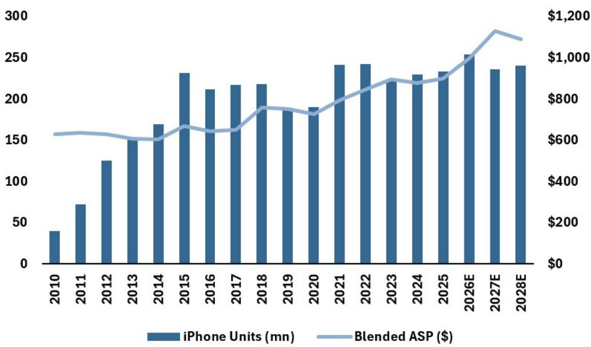
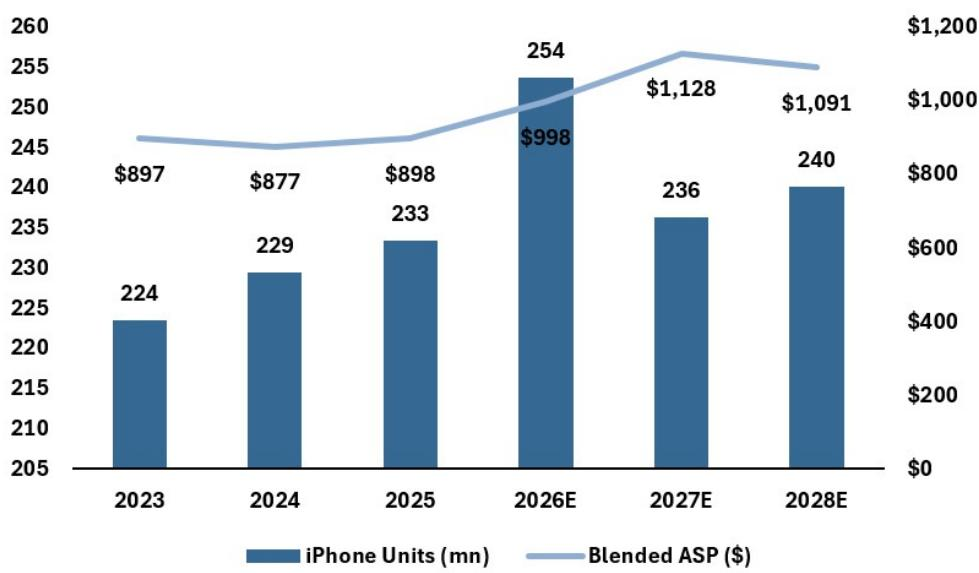
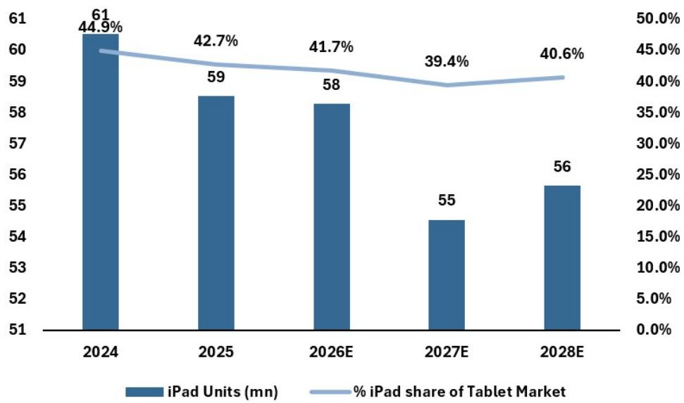

# JPM：JPM拆解苹果定价权，涨价49%销量反增10%

当市场因为iPad和Mac平均涨价约20%而担忧销量变化时，JPM这份最新研报给出了一个反直觉的判断：苹果的收入和利润韧性很可能远超读者当前的预期。原因不在于消费者对涨价不敏感，而在于历史数据揭示了一个更根本的结构性事实——苹果三大硬件产品线的销量与定价之间的相关性，在多年维度上远比直觉中弱。

这份报告的核心价值，在于它系统性地拆解了“价格弹性”这个模糊概念，并把它变成了可比较、可验证的判断框架。

## 1. 历史数据并不支持“涨价必然缩量”的线性逻辑

JPM用一组从FY15到FY26E的跨期对比，直接挑战了市场的主流叙事。在这十一年间，iPhone的ASP上涨了近49%，但销量反而增长了约10%；Mac的ASP几乎持平，销量却飙升了44%；即便是涨价幅度更温和的iPad，销量也录得正增长。

更关键的是，这三个市场本身都是成熟甚至调整的——智能手机行业在2016-17年见顶后进入节奏变化通道，PC和平板市场同样经历了长期停滞。苹果在这三个市场都实现了“量价齐升”或至少“量稳价升”，这背后是产品组合升级、用户生态锁定和品牌溢价共同作用的结果，而非单纯的定价能力。

> **KC评论：** 这份报告最有价值的部分不是结论本身，而是它提供的分析框架——把“价格弹性”拆解到三条产品线、不同价格带、不同用户群，而不是笼统地讨论“苹果贵不贵”。完整报告中的Figure 1和Figure 7值得仔细看，它们用十年的数据回答了“涨价到底有没有影响用户选择”这个问题。

## 2. Mac是弹性最低的防线，iPad是最脆弱的环节

研报对三条产品线做了明确的弹性排序：Mac最低，iPhone居中，iPad最高。

Mac之所以能抵御涨价冲击，有两个结构性原因。第一，苹果通过MacBook Neo等入门机型主动拓宽了价格区间，把ASP从FY25的约1378美元拉低到FY26E的约1256美元，用低价位产品对冲了高价位产品的涨价不确定性。第二，Edge AI驱动的换机需求正在成为新引擎——Gartner预计AI PC占比将从2025年的29%升至2027年的70%，而苹果的M系列芯片和统一内存架构在本地运行AI工作负载上具有差异化优势，这类需求对价格敏感度远低于普通的办公换机。

iPad的情况则完全不同。它缺乏AI驱动的换机逻辑，用户基数也更偏向消费型场景，价格敏感度天然更高。JPM预计iPad销量在FY27将出现约6%的同比下降，但即便如此，由于ASP提升，iPad收入仍能实现中单位数增长。

## 3. iPhone的弹性藏在Pro与非Pro的分化里

这是报告中最值得关注的洞察。iPhone整体弹性介于Mac和iPad之间，但内部存在巨大分化。Pro系列（Pro和Pro Max）的出货占比已从2020年的约37%升至2025年的约65%，而这一趋势发生在Pro机型持续涨价的背景下。JPM认为，高端用户的购买决策更多受功能驱动而非价格驱动，因此iPhone 18系列的涨价不确定性将主要落在基础款（iPhone 18和iPhone 18 Air）上，而非Pro和折叠屏机型。

这实际上意味着，苹果可以通过产品组合的持续高端化来对冲基础款可能的销量下滑。而报告还特别指出，苹果在内存采购上享有比竞争对手更有利的条件，因此其涨价幅度（JPM预计iPhone约为100美元）可能低于市场整体20%左右的ASP涨幅，这反而给了苹果进一步抢占份额的空间。

> **KC评论：** 报告没有完全回答的一个关键问题是：如果全球宏观环境进入更明显的节奏变化周期，高端用户的“功能驱动”逻辑是否还成立？苹果过去十年的定价策略是在一个利率持续走低、资产价格膨胀的环境中执行的，未来是否还能复现同样的“量价齐升”，可能需要更长时间来验证。

## 4. 报告没有完全回答的关键问题：服务收入能否继续撑住估值？

JPM对苹果的估值逻辑建立在“硬件周期+服务增长”的双轮驱动上。硬件端的韧性判断已经给出，但服务收入——尤其是App Store增长节奏变化的迹象——在报告中并未被充分讨论。苹果的服务业务目前贡献了约20%的收入和更高比例的利润，其增速能否维持在高位，直接决定了整体盈利增长的可视性。这是一个值得持续跟踪的变量。

对于关注苹果的读者而言，这份报告提供的观察框架比结论本身更有价值：不要把“涨价”等同于“缩量”，而是去拆解不同产品线、不同价格带、不同用户群的弹性差异；不要只看一个季度的出货数据，而是用五到十年的维度去理解苹果在成熟市场中的份额演进逻辑。

---

For informational purposes only. Portions may be generated,translated,summarized,or edited with AI assistance based on source materials and may contain omissions or errors. Please verify independently. This is not investment,legal,tax,accounting,or other professional advice.

For informational purposes only. Portions may be generated,translated,summarized,or edited with AI assistance based on source materials and may contain omissions or errors. Please verify independently. This is not investment,legal,tax,accounting,or other professional advice.

