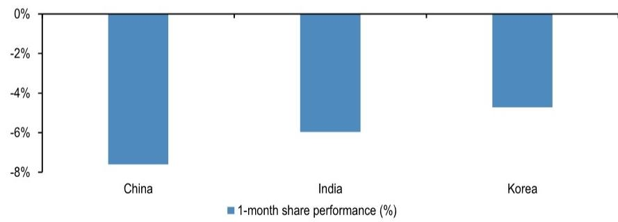
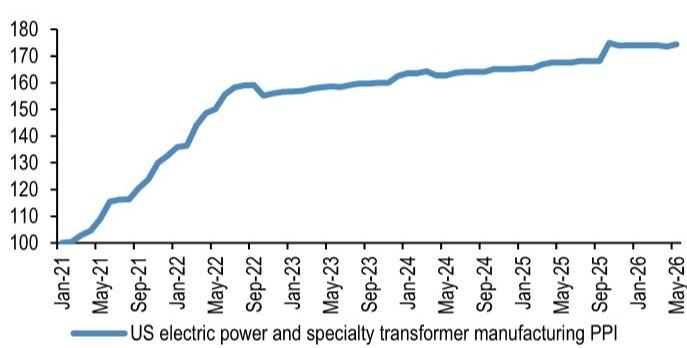
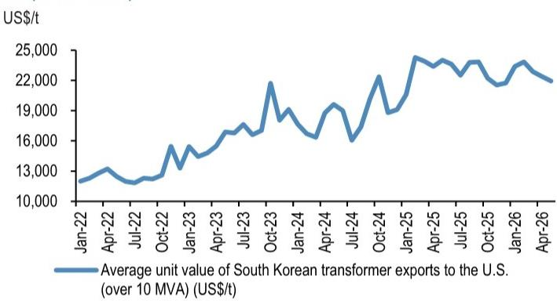
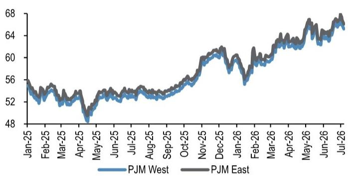
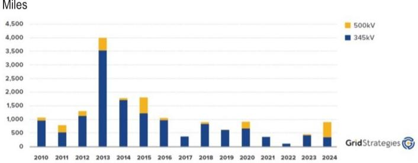
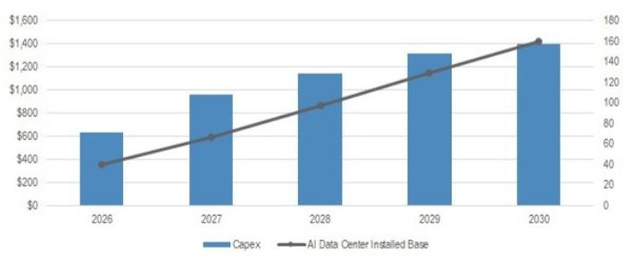
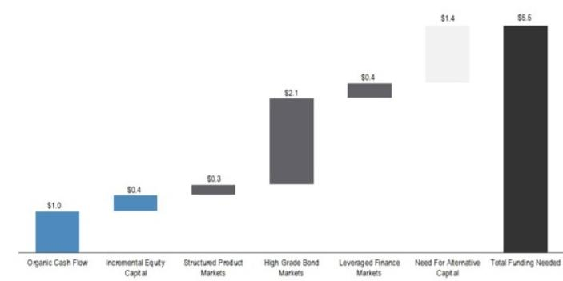

## Asia Power Equipment

## 关于定价、政策、产能及输电建设进度等市场关注问题的探讨

近期市场对亚洲电力设备企业上行周期的关注度有所提升。本篇笔记汇总了市场关注的核心问题及我们的观察。

对于韩国电力设备企业，市场主要关注点包括：近期输配电设备价格走势（如图2-图3所示）、美国超高压输电线路的进度安排，以及一季度新订单的高基数效应。我们的看法是，高压输配电设备的价格表现依然稳健，超高压产品的运营利润率维持在约40%或以上。这得益于部分企业的产能扩张计划有所延后、中国和印度等新兴市场企业进入美国受监管市场的难度较大，以及公用事业和数据中心领域的强劲需求。虽然美国超高压输电建设进度有所调整，但我们认为这更多是短期排期问题，而非输电需求的趋势性变化。近期热浪和电价波动（图5）凸显了电网约束问题，而输电线路领域长达数十年的投入不足问题依然存在（图6）。尽管受高基数及中东局势相关订单延迟影响，部分企业二季度业绩可能表现平淡，但我们认为这为关注优质标的提供了窗口。

图1：亚洲电力设备企业一个月股价表现（%）

来源：Bloomberg Finance L.P.，数据截至2026年7月6日。

**- 美国输配电设备价格是否已趋稳？** 近期市场关注燃气轮机/发动机领域可能出现的产能变化（参见美国机械行业相关报告），同时也有观点询问输配电设备价格是否因产能增加而出现调整。我们的观察是：（1）渠道调研显示，由于年内产能扩张节奏温和，高压输配电设备价格保持稳定；（2）尽管多家电力设备制造商宣布了产能扩张计划，但受制于漫长的监管审批流程和劳动力短缺，实际执行进度存在不确定性。供应增长受限，中国和印度供应商进入美国受监管市场的机会有限。美国变压器生产者价格指数看似趋平，但该指标为滞后数据，且涵盖各电压等级的输配电设备，可能未能充分反映高压变压器和开关设备的定价能力。此外，我们认为利润率提升也受益于更有利的地域组合（如美国销售占比提升）和产品组合（如超高压产品销售增加，其运营利润率较其他产品高5-10个百分点）。

图2：美国变压器PPI（以2021年1月为基准100）

来源：FRED, 圣路易斯联邦储备银行。

图3：韩国对美变压器出口平均单价（10MVA以上）

- 韩国对美变压器出口平均单价（10MVA以上）（美元/吨）
来源：韩国海关，TRASS。

**- 数据中心自发电是否会削弱输配电需求？** 美国政府已出台支持数据中心自发电的政策。这引发了市场对输电和电网投资需求可能减少的担忧。我们的看法是：（1）虽然自发电模式正在兴起，但输电投资需求依然存在。这主要源于可再生能源建设（及其相关的远距离输电需求）、用电量增长（制造业回流和电气化）以及更新换代需求；（2）自发电模式同样需要高压输配电设备，因为数据中心规模不断扩大，运行电压也在提升。例如，得克萨斯州的Stargate数据中心就需要包括一座345千伏变电站（含五台主变压器和多个高压断路器）在内的大量高压基础设施（图4）。

**- 在自发电模式普及的背景下，美国为何仍会持续增加输配电资本开支？** 近期事件表明，电网约束仍是关键风险。6月下旬热浪期间，美国最大电网运营商PJM指出存在严重的输电拥堵和批发电价飙升，现货电价升至约300美元/兆瓦时（而典型水平约为25-40美元/兆瓦时）。随着极端天气导致峰值负荷上升，以及发电结构向可再生能源转变，系统在负荷紧张时更容易出现拥堵和中断风险。这一压力因数据中心和电动汽车的结构性需求增长而进一步加剧。在此背景下，扩大高压输电是保障可靠性和经济性的务实选择：在远距离输送大容量电力时，超高压线路（如765千伏）在单位成本上具有显著优势。更广泛而言，高压交流和直流输电建设对于向增长中的负荷中心输送可靠电力、整合偏远地区的风能和太阳能资源，以及支持电网稳定运行至关重要。

图4：Abilene Stargate 1项目示意图（在建，1,200兆瓦）

来源：Lancium。

图5：PJM 2027年远期ATC电价（美元/兆瓦时）

图6：过去15年新建345千伏及以上输电线路里程

来源：Bloomberg Finance L.P. 来源：Grid Strategies。

**- 765千伏输电线路审批延迟是否会对设备需求构成风险？** 得克萨斯州公用事业委员会已推迟了多项765千伏输电项目的决策。这引发了市场对美国超高压输电建设可能普遍延迟的担忧。总体而言，我们认为时间上的推迟更多是“执行”层面的问题，而非“需求”层面的问题。此类超高压建设可能面临后续的许可/招标瓶颈，但我们认为这属于短期排期问题，而非超高压需求的趋势性变化。电网压力事件恰恰凸显了此类建设的必要性（见上文）。

表1：美国部分在建765千伏项目示例

| 项目 | 投资/项目成本（百万美元） | 长度（英里） |
|---|---|---|
| AEP Texas, CPS Energy, Oncor and CNP Texas 765-kV STEP Eastern Backbone Regional Planning Group (RPG) Project | 9,384 | 1,109 |
| Oncor and AEPSC Drill Hole to Sand Lake to Solstice 765-kV Line Regional Planning Group (RPG) Project | 742 | 104 |
| Phantom - Crossroads - Potter 765 kV Ckt 1 New Line, Two Crossroads 765 kV Reactors | 1,691 | 293 |
| Anthem – Seminole 765 kV New Lines | 1,277 | 131 |
| Crawfish Draw - Phantom 765 kV Single-Circuit New Line | 1,366 | 239 |
| Seminole – SW Shreveport 765 kV New Line | 2,372 | 315 |
| Woodward - Crawfish Draw 765 kV New Line | 1,790 | 264 |
| MISO Tranche 2.1 | 12,738 | 1,754 |
| Putnam County, West Virginia-Frederick County, Maryland | | 260 |
| Campbell County, Virginia-Fauquier County, Virginia | | 155 |
| John Amos to Welton Spring to Rocky Point | | 261 |
| Joshua Falls – Yeat | | 156 |
| Central Ohio | | 300 |
| Marshall County, West Virginia, to Perry County, in central Pennsylvania | 1,700 | 220 |

注：非详尽列表。
来源：公司数据。

**- 人工智能数据中心资本开支是否在放缓？** Meta正在探索创建人工智能基础设施业务，允许外部开发者租用其人工智能模型和底层计算能力。我们认为这引发了部分市场参与者对人工智能数据中心可能产能过剩的担忧。我们的分析认为，基础设施变现将为Meta提供更大的灵活性，并帮助其收回部分巨额投入，这与我们观察到的其他大型基础设施企业的情况类似。我们的分析师预测，人工智能资本开支将从2026年的约6000亿美元显著增长至2030年的约1.4万亿美元（图7）。人工智能基础设施投资的长期前景依然稳健：到2030年，人工智能资本开支总额预计将达到5.5万亿美元，高于此前预测的5.1万亿美元，预计将推动138吉瓦的新数据中心容量。

图7：2027年增长将显著加速

来源：JPM。

图8：预期的人工智能资本开支资金来源

来源：JPM。

**- 现代电气/晓星重工是否已达到估值高点？** 现代电气和晓星重工的平均估值约为2027年预期收益的25倍，而LS电气则超过40倍。我们认为这一估值差异反映了市场对两者数据中心直接敞口有限的看法。去年，现代电气/晓星重工近90%的新订单来自公用事业和电网领域；因此，市场可能将其视为更纯粹的输配电标的，而LS电气因其更高的数据中心直接敞口而享有估值溢价。不过，我们认为如果现代电气/晓星重工增加对数据中心的直接敞口，估值差距有望逐步收窄。有本地媒体报道，现代电气近期赢得了一份价值超过7亿美元的美国数据中心订单。晓星重工则宣布计划与Quanta Services成立合资企业，为数据中心、公用事业及其他客户供应断路器。这些进展表明其在数据中心订单方面取得进一步突破，我们认为随着企业获得更多数据中心项目，市场认知有望改善。

**- 国内市场的增长空间是否已被充分定价？** 韩国政府与主要人工智能企业近期分享了人工智能大型项目的长期愿景，包括超过47000万亿韩元的长期投资计划。投资时间跨度较长，实际产能建设执行高度依赖行业供需动态。然而，我们的科技分析师认为，这对电力基础设施供应商而言是长期积极因素。我们认为，市场目前仅反映了未来几年国内电力设备需求的个位数增长，一旦国内输配电资本开支计划及大型科技投资计划的更多细节公布，中期内可能带来盈利预期的修正。

**- 韩国电力设备企业是否会因国家集中度而面临风险？** 市场对韩国电力设备企业的一个主要担忧是地域集中度：我们所覆盖的企业新订单高度集中于美国市场。这引发了对其过度依赖美国订单动量的担忧。不过，我们观察到在美国以外市场获取订单的进展正在增加。例如，晓星重工已与澳大利亚维多利亚州输电网络运营商AusNet签署长期协议，供应超高压变压器和电抗器，合同价值3100亿韩元。此前，该公司还在昆士兰州赢得了一份1420亿韩元的储能系统订单。值得注意的是，晓星在印度超高压断路器市场拥有领先份额，去年印度市场约占其重工业务收入的5-10%。LS电气也计划加速拓展欧洲市场，该地区可能成为其下一个战略市场。现代电气一季度欧洲收入也实现了超过15%的增长。

**- 印度企业的产能扩张是否会导致输配电设备产能过剩？** 部分市场参与者担心，印度企业的大规模产能扩张计划可能改变美国输配电市场的供需格局。我们的看法是，目前并未观察到印度企业在美国数据中心相关订单方面有显著进展，因此印度企业似乎并未在美国数据中心电力设备领域获得实质性份额。虽然GE Vernova和日立旗下的印度子公司正在扩大输配电设备产能，但它们并不直接与数据中心客户签约，订单主要通过其母公司承接。印度国内需求也依然强劲。

表2：电力设备估值对比

|  | 代码 | 评级 | 股价（本币） | 市值（百万美元） | 日均流动性（百万美元） | PE（倍） | | PB（倍） | | 股息率（%） | | ROE（%） | | EV/EBITDA（倍） | |
|---|---|---|---|---|---|---|---|---|---|---|---|---|---|---|---|
| | | | | | | 2026E | 2027E | 2026E | 2027E | 2026E | 2027E | 2026E | 2027E | 2026E | 2027E |
| **全球** | | | | | | | | | | | | | | | |
| 日立 | 6501 JP | OW | 4,805.0 | 134,336 | 421.1 | 23.8 | 19.7 | 3.2 | 3.1 | 1.2 | 1.2 | 13.4 | 15.5 | 12.0 | 10.6 |
| ABB | ABBN SW | N | 85.3 | 192,992 | 243.2 | 34.1 | 33.1 | 11.3 | 9.4 | 0.9 | 1.0 | 33.8 | 31.0 | 22.3 | 21.6 |
| 西门子能源 | ENR GY | OW | 166.1 | 163,345 | 501.9 | 33.6 | 25.5 | 9.9 | 7.5 | 0.8 | 1.1 | 34.4 | 33.9 | 19.7 | 15.9 |
| GE Vernova | GEV US | OW | 1,113.1 | 299,115 | 2,781.8 | 33.4 | 40.8 | 17.5 | 12.9 | n.a. | n.a. | 39.8 | 36.1 | 46.2 | 28.6 |
| 施耐德电气 | SU FP | OW | 275.7 | 181,691 | 306.9 | 25.7 | 22.1 | 5.8 | 5.2 | 1.8 | 2.1 | 24.0 | 25.0 | 17.4 | 15.2 |
| **美洲** | | | | | | | | | | | | | | | |
| 伊顿 | ETN US | NC | 398.5 | 154,745 | 1,047.6 | n.a. | n.a. | n.a. | n.a. | n.a. | n.a. | n.a. | n.a. | n.a. | n.a. |
| 福陆 | FLR US | NC | 49.5 | 6,907 | 133.0 | 19.1 | 15.3 | 3.1 | 2.6 | 0.3 | 0.7 | 13.3 | 16.1 | 8.4 | 7.3 |
| MasTec | MTZ US | OW | 373.4 | 29,508 | 412.1 | 42.3 | 32.4 | 7.6 | 6.3 | n.a. | n.a. | 19.6 | 21.5 | 21.1 | 17.6 |
| MYR Group | MYRG US | NC | 433.0 | 6,742 | 128.0 | 37.9 | 33.0 | 8.0 | 6.4 | n.a. | n.a. | 23.6 | 21.4 | 20.7 | 18.3 |
| WEG S.A. | WEGE3 BZ | N | 46.5 | 37,748 | 354.9 | 31.2 | 26.1 | 9.4 | 7.8 | 1.8 | 1.6 | 32.8 | 32.6 | 20.8 | 17.6 |
| **欧洲** | | | | | | | | | | | | | | | |
| Nexans | NEX FP | N | 138.5 | 6,918 | 24.0 | 21.5 | 17.2 | 3.0 | 2.7 | 2.2 | 2.4 | 14.7 | 17.1 | 7.9 | 6.9 |
| NKT | NKT DC | N | 949.5 | 7,792 | 22.1 | 31.6 | 22.6 | 3.0 | 2.7 | 0.0 | 1.1 | 10.1 | 12.6 | 14.7 | 11.0 |
| Astor | ASTOR TI | NC | 319.5 | 6,810 | 227.1 | 28.2 | 15.7 | 7.6 | 4.9 | 1.2 | 2.4 | 32.5 | 44.6 | 17.8 | 10.7 |
| **中国大陆** | | | | | | | | | | | | | | | |
| 国电南瑞 | 600406 CH | OW | 23.2 | 27,382 | 334.7 | 20.1 | 18.1 | 3.3 | 3.1 | 3.0 | 3.3 | 16.8 | 17.4 | 15.1 | 13.8 |
| 青岛特锐德 | 300001 CH | OW | 34.4 | 5,349 | 199.9 | 23.4 | 19.8 | 3.7 | 3.2 | 0.7 | 0.8 | 16.8 | 17.4 | 15.8 | 13.9 |
| 许继电气 | 000400 CH | OW | 21.1 | 3,165 | 101.5 | 13.4 | 11.7 | 1.5 | 1.4 | 2.8 | 3.2 | 12.8 | 13.4 | 8.1 | 7.2 |
| 威胜控股 | 3393 HK | OW | 21.9 | 2,912 | 27.6 | 14.8 | 12.2 | 2.8 | 2.5 | 2.7 | 3.3 | 20.0 | 21.5 | 9.1 | 7.4 |
| 金杯电工 | 002533 CH | NC | 11.1 | 1,202 | 26.4 | 11.6 | 10.2 | 1.7 | 1.5 | 4.5 | 5.0 | 14.2 | 14.9 | 12.7 | 11.2 |
| 和兴电气 | 603556 CH | NC | 22.9 | 1,640 | 23.2 | 10.0 | 8.5 | 1.4 | 1.3 | 4.5 | 5.8 | 12.8 | 14.1 | 7.7 | 6.2 |
| 良信股份 | 002706 CH | NC | 10.4 | 1,725 | 106.5 | 33.5 | 25.3 | 2.6 | 2.5 | 2.0 | 2.5 | 7.6 | 10.1 | 17.0 | 14.3 |
| 伊戈尔 | 002922 CH | NC | 31.5 | 1,958 | 147.9 | 27.8 | 18.3 | 3.2 | 2.9 | 1.9 | 2.9 | 11.9 | 16.4 | 17.1 | 12.7 |
| 平高电气 | 600312 CH | NC | 17.6 | 3,522 | 80.1 | 17.1 | 14.1 | 1.9 | 1.7 | 1.9 | 2.1 | 11.4 | 12.6 | 10.2 | 8.6 |
| 四方股份 | 601126 CH | NC | 61.0 | 7,473 | 321.2 | 51.7 | 44.1 | 9.4 | 8.6 | 1.3 | 1.5 | 18.7 | 20.0 | 40.6 | 34.3 |
| 中国西电 | 601179 CH | NC | 14.0 | 10,575 | 486.4 | 46.1 | 37.5 | 3.0 | 2.8 | 0.7 | 0.9 | 6.5 | 7.6 | 24.6 | 21.2 |
| 神马电力 | 603530 CH | NC | 53.5 | 3,399 | 42.8 | 38.1 | 28.6 | 10.4 | 8.3 | 1.0 | 1.2 | 28.8 | 30.7 | 25.6 | 20.3 |
| 三星医疗 | 601567 CH | NC | 14.4 | 2,983 | 67.0 | 9.0 | 7.5 | 1.5 | 1.4 | 6.0 | 7.5 | 15.9 | 18.2 | 6.9 | 5.5 |
| **印度** | | | | | | | | | | | | | | | |
| ABB India | ABB IN | N | 7,073.0 | 15,713 | 33.4 | 84.3 | 66.9 | 17.2 | 15.1 | 0.6 | 0.7 | 21.5 | 24.0 | 69.8 | 53.8 |
| Bharat Heavy | BHEL IN | UW | 387.5 | 14,146 | 74.8 | 39.0 | 25.5 | 4.7 | 4.1 | 0.8 | 1.0 | 12.5 | 17.1 | 27.4 | 17.7 |
| CG Power | CGPOWER IN | OW | 925.1 | 15,274 | 42.6 | 89.4 | 69.3 | 15.6 | 13.0 | 0.2 | 0.2 | 18.3 | 20.0 | 66.6 | 50.8 |
| Hitachi Energy India | POWERIND IN | OW | 32,360.0 | 15,121 | 67.5 | 97.8 | 68.2 | 21.9 | 16.8 | 0.0 | 0.1 | 25.1 | 27.8 | 74.1 | 50.0 |
| Power Grid | PWGR IN | OW | 285.4 | 27,828 | 39.2 | 15.8 | 14.4 | 2.5 | 2.3 | 3.3 | 3.6 | 15.4 | 15.4 | 10.7 | 10.1 |
| Siemens India | SIEM IN | UW | 3,571.6 | 13,334 | 20.8 | 46.2 | 61.8 | 9.2 | 8.2 | 0.3 | 0.3 | 17.4 | 14.0 | 43.2 | 47.2 |
| Transformers & Rectifiers India | TARIL IN | NC | 341.3 | 1,074 | 18.8 | 32.5 | 26.2 | 5.5 | 4.5 | 0.1 | 0.1 | 17.3 | 17.6 | 20.6 | 16.2 |
| Voltamp Transformers | VAMP IN | NC | 9,847.0 | 1,044 | 8.4 | 29.6 | 25.3 | 4.9 | 4.3 | 1.1 | 1.2 | 17.7 | 18.2 | 25.1 | 21.4 |
| GEV T&D | GVTD IN | OW | 4,554.5 | 12,226 | 50.2 | 74.9 | 56.7 | 29.8 | 21.2 | 0.3 | 0.4 | 47.1 | 43.7 | 55.8 | 41.9 |
| Siemens Energy India | ENRIN IN | N | 3,420.3 | 12,769 | 24.2 | 63.5 | 52.6 | 16.3 | 12.7 | 0.1 | 0.2 | 29.0 | 27.1 | 46.2 | 37.7 |
| **日本** | | | | | | | | | | | | | | | |
| 三菱重工 | 7011 JP | NC | 4,110.0 | 85,432 | 599.1 | 33.7 | 28.4 | 4.2 | 3.8 | 0.7 | 0.9 | 13.0 | 14.1 | 18.1 | 15.7 |
| 三菱电机 | 6503 JP | OW | 6,043.0 | 78,682 | 247.6 | 23.8 | 21.4 | 2.7 | 2.5 | 1.0 | 1.1 | 11.1 | 11.5 | 14.3 | 13.3 |
| 富士电机 | 6504 JP | NC | 13,480.0 | 12,400 | 97.1 | 18.9 | 17.4 | 2.3 | 2.1 | 1.6 | 1.8 | 12.7 | 13.0 | 10.0 | 9.4 |
| 明电舍 | 6508 JP | NC | 9,510.0 | 2,668 | 15.2 | 19.4 | 17.2 | 2.4 | 2.2 | 1.6 | 1.8 | 12.3 | 12.9 | 10.4 | 9.2 |
| **韩国** | | | | | | | | | | | | | | | |
| LS电气 | 010120 KS | N | 217,500 | 21,292 | 440.7 | 64.1 | 46.2 | 13.0 | 10.7 | 0.5 | 0.7 | 22.2 | 25.4 | 38.0 | 28.2 |
| HD现代电气 | 267260 KS | OW | 923,000 | 21,713 | 195.7 | 33.1 | 25.3 | 12.4 | 9.4 | 1.1 | 1.4 | 42.7 | 42.3 | 22.7 | 17.9 |
| 晓星重工 | 298040 KS | OW | 3,124,000 | 19,011 | 210.0 | 36.7 | 25.7 | 9.5 | 7.1 | 0.4 | 0.5 | 29.2 | 31.6 | 26.0 | 18.5 |
| Sanil Electric | 062040 KS | NC | 206,000 | 4,116 | 155.1 | 29.6 | 23.7 | 8.2 | 6.3 | 0.7 | 0.9 | 31.9 | 31.4 | 23.0 | 18.5 |
| Iljin Electric | 103590 KS | NC | 71,200 | 2,216 | 81.8 | 21.7 | 18.2 | 4.8 | 3.9 | 0.9 | 1.0 | 23.9 | 23.3 | 14.6 | 12.6 |
| **台湾** | | | | | | | | | | | | | | | |
| 士林电机 | 1503 TT | NC | 241.5 | 3,927 | 34.0 | 27.6 | 17.7 | 3.2 | n.a. | n.a. | n.a. | 12.9 | 16.7 | 20.3 | 13.2 |
| 中兴电工 | 1513 TT | NC | 178.5 | 2,803 | 58.7 | 20.1 | 17.0 | 4.0 | 4.7 | 3.6 | 4.1 | 20.4 | 22.6 | 9.8 | 8.8 |
| 亚力电机 | 1514 TT | NC | 126.5 | 1,078 | 23.7 | 31.5 | 25.9 | 5.0 | 4.5 | 2.0 | 2.4 | 16.8 | 19.2 | 23.7 | 19.6 |
| 华城电机 | 1519 TT | NC | 773.0 | 7,621 | 97.4 | 38.1 | 28.4 | 20.2 | 14.5 | 1.9 | 2.4 | 52.9 | 54.5 | 29.5 | 22.0 |
| 东元电机 | 1504 TT | OW | 73.1 | 5,422 | 57.6 | 15.9 | 9.9 | 2.5 | 2.1 | 3.0 | 3.1 | 16.2 | 23.0 | 11.3 | 7.0 |

来源：Bloomberg Finance L.P.，JPM预测。

本报告讨论的公司（除非另有说明，本报告所有价格均为2026年7月6日收盘价）：
晓星重工（298040.KS/W3,107,000/OW）

分析师认证：封面标注“AC”的研究分析师证明：（1）本报告中表达的所有观点准确反映了该分析师对相关证券或发行人的个人看法；（2）分析师的薪酬中没有任何部分直接或间接与本报告中的具体推荐或观点相关。

重要披露
- 做市商/流动性提供者：JPM是晓星重工相关金融工具的做市商和/或流动性提供者。
- 客户：JPM目前或过去12个月内曾将晓星重工或其关联实体作为客户。
- 客户/非投行、证券相关：JPM目前或过去12个月内曾将晓星重工或其关联实体作为客户，并提供非投行、证券相关服务。
- 客户/非证券相关：JPM目前或过去12个月内曾将晓星重工或其关联实体作为客户，并提供非证券相关服务。
- 非投行补偿：JPM在过去12个月内曾因晓星重工或其关联实体的产品或服务（非投行业务）而获得补偿。
- 债务头寸：JPM可能持有晓星重工或其关联实体的债务证券头寸。

公司特定披露：JPM确实并寻求与其研究报告所覆盖的公司开展业务。因此，读者应注意，该公司可能存在利益冲突，可能影响本报告的客观性。读者应将本报告视为其决策的单一因素。重要披露，包括价格图表和信用意见历史表（如适用），可通过访问https://www.jpmm.com/research/disclosures、致电1-800-477-0406或发送电子邮件至research.disclosure.inquiries@JPM.com获取。

晓星重工（298040.KS, 298040 KS）价格图表

来源：Bloomberg Finance L.P. 和 JPM；价格数据已根据股票分割和股息进行调整。覆盖起始日期：2024年9月17日。所有股价均为前一个交易日收盘价。

| 日期 | 评级 | 价格（韩元） | 目标价（韩元） |
|---|---|---|---|
| 17-Sep-24 | OW | 289500 | 385,000 |
| 31-Oct-24 | OW | 405000 | 450,000 |
| 03-Dec-24 | OW | 386000 | 460,000 |
| 14-Jan-25 | OW | 421500 | 500,000 |
| 08-Apr-25 | OW | 393500 | 475,000 |
| 05-Jun-25 | OW | 648000 | 700,000 |
| 07-Jul-25 | OW | 889000 | 970,000 |
| 27-Jul-25 | OW | 1125000 | 1,350,000 |
| 05-Sep-25 | OW | 1209000 | 1,450,000 |
| 01-Oct-25 | OW | 1340000 | 1,500,000 |
| 31-Oct-25 | OW | 2125000 | 2,500,000 |
| 18-Nov-25 | OW | 2160000 | 2,800,000 |
| 30-Jan-26 | OW | 2535000 | 3,000,000 |
| 08-Apr-26 | OW | 2603000 | 3,300,000 |
| 24-Apr-26 | OW | 3260000 | 3,900,000 |
| 06-Jul-26 | OW | 3354000 | 4,100,000 |

图表显示了JPM对这些股票的持续覆盖；当前分析师可能并非在整个期间内都覆盖这些股票。JPM评级或名称：OW = 增持，N = 中性，UW = 减持，NR = 未评级。

## 股权研究评级、名称和分析师覆盖范围说明：

JPM使用以下评级系统：增持（在本报告所述目标价期间，我们预计该股票的表现将优于分析师或其团队覆盖范围内股票的平均总回报）；中性（在本报告所述目标价期间，我们预计该股票的表现将与分析师或其团队覆盖范围内股票的平均总回报一致）；减持（在本报告所述目标价期间，我们预计该股票的表现将逊于分析师或其团队覆盖范围内股票的平均总回报）。NR为未评级。在这种情况下，JPM已因缺乏足够的基本面依据或法律、监管或政策原因而移除了该股票的评级和（如适用）目标价。之前的评级和（如适用）目标价不应再被依赖。NR名称并非推荐或评级。部分覆盖的股票有评级但无目标价；在这种情况下，我们预计该股票的表现将优于/一致/逊于分析师或其团队覆盖范围内股票在相关区域内的平均总回报。在我们的亚洲（除澳大利亚和印度外）和英国中小盘股权研究中，每只股票的预期总回报是与基准国家市场指数的预期总回报进行比较，而非与分析师的覆盖范围进行比较。如果本报告的重要披露部分未显示，认证分析师的覆盖范围可在JPM研究网站https://www.JPMmarkets.com上找到。

覆盖范围：Tsui, Stephen T: 长江基建（1038.HK）、中电控股（0002）（0002.HK）、中国燃气（0384.HK）、华润燃气（1193.HK）、华润电力（0836.HK）、新奥能源（2688.HK）、新奥天然气-A（600803.SS）、HD现代电气（267260.KS）、杭氧股份（002430.SZ）、香港中华煤气（0003.HK）、华明装备-A（002270.SZ）、华能国际-H（0902.HK）、晓星重工（298040.KS）、昆仑能源（0135.HK）、LS电气（010120.KS）、国电南瑞-A（600406.SS）、电能实业（0006.HK）、青岛特锐德（300001.SZ）、思源电气-A（002028.SZ）、威胜控股-H（3393.HK）、许继电气-A（000400.SZ）

JPM股权研究评级分布，截至2026年7月4日

| | 增持（买入） | 中性（持有） | 减持（卖出） |
|---|---|---|---|
| JPM全球股权研究覆盖* | 53% | 36% | 12% |
| 投行客户** | 83% | 80% | 73% |
| JPMS股权
