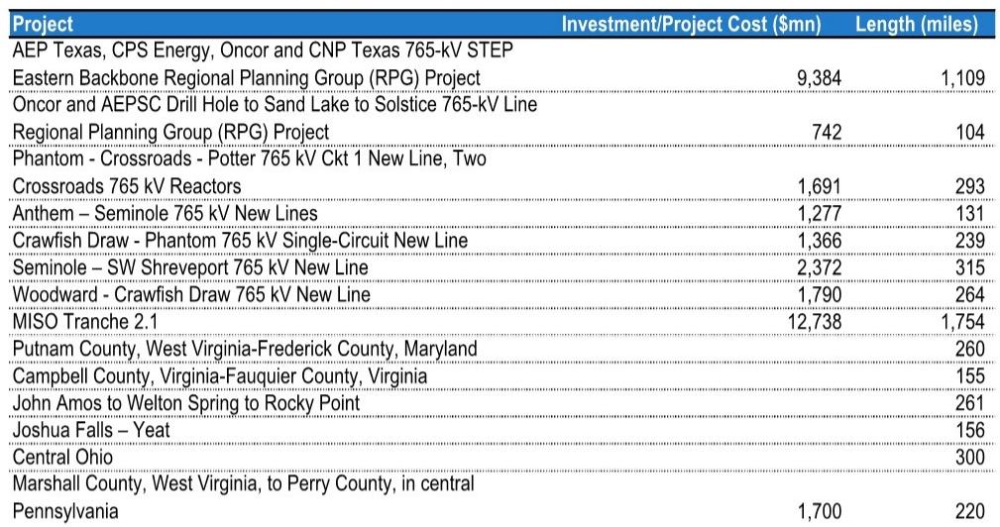
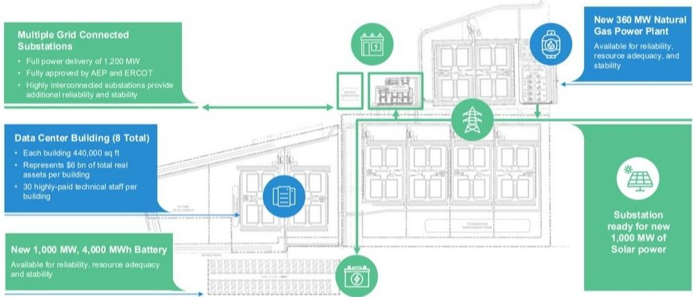
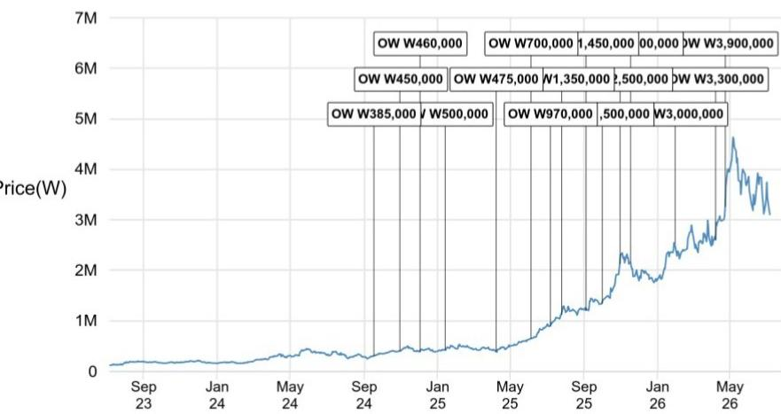

# The Asian Power Equipment Cycle Is Not Peaking—It Is Rotating

The market is misreading the signal. Recent flattening in transformer pricing data, a handful of U.S. transmission project delays, and high earnings bases have convinced many observers that the Asian power equipment upcycle is losing steam. That conclusion is premature and strategically risky for those who act on it. The evidence points not to a peak, but to a rotation—from order velocity to margin quality, from broad-based growth to selective winners, and from U.S.-only exposure to a genuinely global opportunity set. The window to build positions in quality Asian T&D names is narrowing, not closing.

The skepticism is understandable. Monthly export pricing data from South Korea shows transformer unit values leveling off after a two-year surge. U.S. ultra-high-voltage transmission projects in Texas have faced permitting delays. First-quarter order comparisons for Korean heavyweights like Hyosung Heavy are daunting. But these are cyclical noise points in a structural story that remains intact. The core drivers—decades of underinvestment in grid infrastructure, surging data center power demand, and the physical reality of renewable integration—have not reversed. They have intensified.

The critical insight is that the market is conflating price stabilization with demand saturation. High-voltage equipment margins remain robust, with UHV products still generating approximately 40 percent operating margins or higher. The flattening in headline PPI data reflects a mix shift toward lower-voltage products, not a collapse in pricing power at the top end. Meanwhile, capacity expansion by manufacturers is proceeding far more slowly than announced, constrained by regulatory bottlenecks and labor shortages that show no sign of easing. The supply-demand tension that has driven this cycle is not resolving; it is evolving.

## Pricing Fears Are Overstated Because Headline Data Masks a Favorable Mix Shift

The most frequently cited concern among observers is that U.S. transformer prices have plateaued. The evidence used—the U.S. transformer PPI rebased to January 2021 and the average unit value of South Korean transformer exports to the U.S.—does show a flattening trend. But this data is misleading for two reasons.

First, the PPI is a lagging indicator that aggregates across all voltage levels. It captures everything from small distribution transformers to massive UHV units. The pricing dynamics at these two ends of the spectrum could not be more different. Low-voltage equipment faces more competition and less differentiation. High-voltage and ultra-high-voltage equipment, by contrast, remains in acute shortage, with lead times stretching well beyond 24 months and limited new supply coming online. The aggregate PPI is being dragged down by the lower-voltage segment, obscuring the continued pricing strength at the top end.

Second, the Korean export data reflects a compositional shift. As manufacturers allocate more capacity to the U.S. market, the product mix is changing. The average unit value can flatten even if individual product categories maintain pricing, simply because the proportion of lower-unit-value products in the export basket increases. The real metric to watch is not the average but the margin trajectory for high-voltage products, which remains firmly upward.

The implication is clear: companies with greater exposure to UHV equipment and a higher share of U.S. sales are benefiting from a margin expansion that does not show up in headline pricing data. This is a stock-picker's cycle, not a rising-tide market.

## Transmission Project Delays Are Execution Issues, Not Demand Reversals

The recent decision by the Public Utility Commission of Texas to delay several 765-kilovolt transmission projects has triggered concerns that the entire U.S. UHV buildout is stalling. That is a misreading of the situation. These delays are about permitting timelines and regulatory sequencing, not about the underlying economic need for the lines.

The evidence for structural demand is overwhelming and growing. During the late-June 2026 heatwave, PJM—the largest U.S. grid operator—experienced major transmission congestion alongside wholesale power price spikes to approximately $300 per megawatt-hour, compared to a typical range of $25 to $40. PJM's wholesale power costs rose 68 percent year-on-year in the first five months of 2026 alone. These are not theoretical concerns. They are operational emergencies that underscore the physical constraints of the existing grid.

The multi-decade underinvestment in transmission is well documented. Miles of new 345-kilovolt-plus transmission lines built over the last 15 years have declined dramatically, even as load growth accelerates from data centers, manufacturing reshoring, and electrification. The arithmetic is simple: you cannot add 138 gigawatts of new data center capacity by 2030 without building the high-voltage infrastructure to support it. Behind-the-meter generation for data centers is gaining attention, but even these facilities require extensive high-voltage equipment. The Stargate data center in Texas, for example, requires a 345-kilovolt substation with multiple main power transformers and high-voltage circuit breakers.

The delay risk is real but tactical. It affects the timing of order recognition and earnings, not the total addressable market. Those who treat these delays as structural are likely to miss the entry point.

## The Valuation Discount for Pure T&D Players Creates a Structural Opportunity

One of the most striking features of the current market is the valuation dispersion within Asian power equipment. Hyundai Electric and Hyosung Heavy trade at an average of 25 times 2027 estimated earnings, while LS Electric trades at over 40 times. This gap is not arbitrary. It reflects the market's preference for companies with direct data center exposure over those perceived as pure T&D plays.

But this discount is becoming an anomaly. The distinction between T&D and data center exposure is blurring rapidly. Data centers are becoming the marginal driver of T&D demand. Utilities are ordering equipment to serve data center loads. The same high-voltage transformers and switchgear that support grid reliability are required for data center interconnection. The pure T&D label is a legacy categorization that no longer captures the underlying demand dynamics.

Evidence of this convergence is accumulating. Hyundai Electric recently won a U.S. data center order with a contract value exceeding $700 million. Hyosung Heavy has announced plans to establish a joint venture with a major U.S. infrastructure services provider to supply circuit breakers to data centers and utilities. These are not peripheral developments. They represent a strategic pivot that should gradually close the valuation gap.

The market is pricing these companies as if their T&D exposure is a liability. In reality, it is a structural advantage. Data center demand is cyclical and concentrated. T&D demand is broad-based, backed by utility capital plans, regulatory mandates, and replacement cycles. The pure T&D players offer a combination of data center upside and grid infrastructure resilience that the current valuation does not reflect.

## What the Report Does Not Fully Answer: The China and India Wild Card

The report addresses the risk of capacity expansion by Indian and Chinese players, but it leaves several critical questions unresolved. The analysis correctly notes that Chinese and Indian suppliers face significant barriers to penetrating the regulated U.S. market. Regulatory approvals, customer relationships, and certification requirements create meaningful moats. But the report does not fully explore the second-order implications of these players focusing on non-U.S. markets instead.

If Chinese and Indian manufacturers cannot access the U.S. market, they will compete aggressively in the rest of the world. This could compress margins for Korean and Japanese companies in markets like the Middle East, Southeast Asia, and Africa. The report acknowledges that Middle East conflicts may delay orders for Korean companies, but it does not quantify the competitive pressure from Chinese players in these regions.

Similarly, the report notes that Indian subsidiaries of global companies are expanding T&D capacity but do not contract directly with data center customers. This is correct, but it raises a question: if Indian manufacturing capacity increases significantly, will global parent companies shift more of their procurement to these lower-cost subsidiaries? The report suggests this is not happening meaningfully today, but the trajectory over the next three to five years is uncertain.

Observers need to monitor not just whether Indian and Chinese players win U.S. data center orders, but whether they reshape the global pricing landscape for T&D equipment outside the U.S. The report provides a useful framework for thinking about this risk but does not fully resolve it.

## A Decision Framework for Navigating the Rotation

For those trying to position in this environment, the key is to distinguish between companies that benefit from the cycle's rotation and those that are vulnerable to its risks. Three criteria matter most.

First, evaluate margin quality over order growth. The market is moving beyond the phase where any order win was good news. The next phase will reward companies that can convert orders into expanding margins, driven by favorable geographic and product mix. Companies with high U.S. exposure and a strong UHV product portfolio are best positioned. Those relying on lower-voltage equipment or non-U.S. markets face more margin pressure.

Second, assess data center exposure directly, not through proxies. The valuation gap between pure T&D players and data center-exposed names creates opportunity, but only if the T&D players are actually winning data center business. Look for specific contract announcements, joint ventures, and capacity allocation to data center customers. The market is not giving credit for potential data center exposure; it will require proof.

Third, watch the geographic diversification trajectory. Korean companies have high U.S. concentration, which is a strength today but a risk if U.S. order momentum slows. The report highlights wins in Australia and Europe as positive developments. Observers should favor companies that are actively diversifying their order books, even if the U.S. remains the largest market. Single-region concentration is a risk that will become more prominent as the cycle matures.

## The Full Picture Requires Deeper Data

This analysis has focused on the strategic logic underlying the Asian power equipment cycle, but the case depends on specific data points that cannot be fully explored here. The original report contains detailed charts on pricing trends, transmission buildout history, AI capex trajectories, and valuation comparisons that are essential for making informed decisions. The nuances of individual company positioning, the specific margin profiles by product category, and the timeline of capacity additions are all critical inputs that deserve careful study.

*For informational purposes only. Portions may be generated, translated, summarized, or edited with AI assistance based on source materials and may contain omissions or errors. Please verify independently. This is not professional advice.*

For informational purposes only. Portions may be generated, translated, summarized, or edited with AI assistance based on source materials and may contain omissions or errors. Please verify independently. This is not professional advice.

