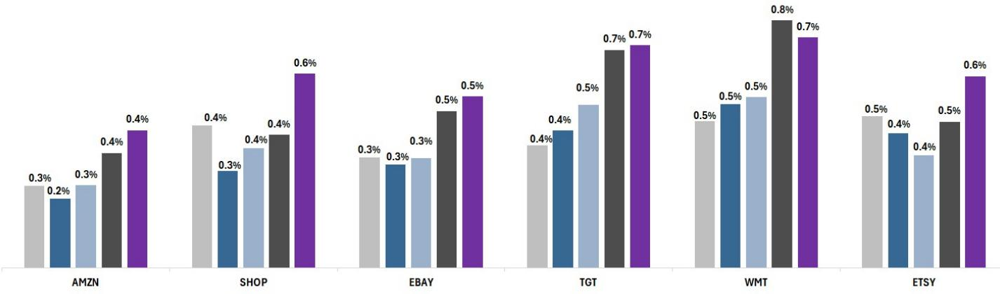
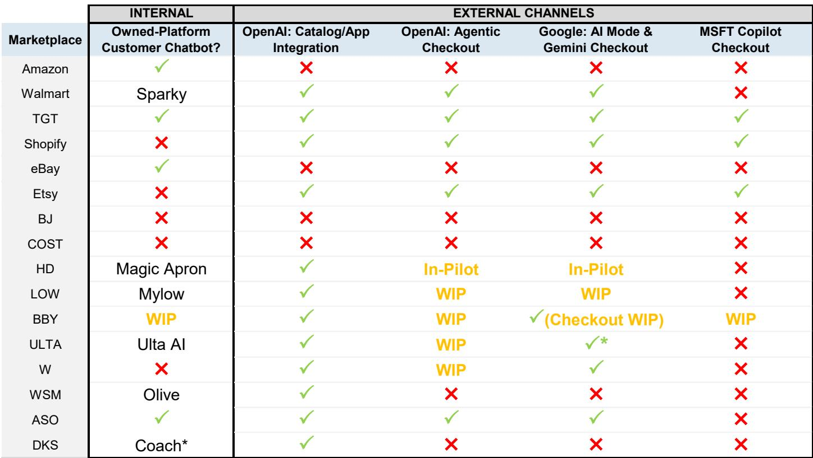
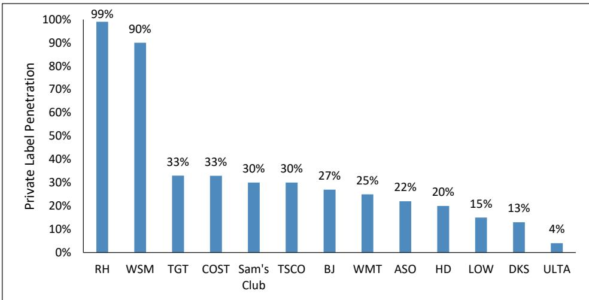

# Agentic Commerce Is a Net Opportunity for Retailers, Not a Threat—But Only for Those Who Invest Now

The narrative around agentic commerce has been dominated by a single concern: that AI agents will disintermediate retailers, strip them of customer relationships, and funnel all value to the large language model platforms. That concern is understandable but misplaced. A careful reading of the current evidence, combined with the structural realities of retail economics, suggests that agentic commerce will function more like an incremental discovery channel—one that expands the total addressable market—than a replay of the Amazon disruption. The real risk is not that LLMs will replace retailers, but that retailers will fail to invest in the two-pronged strategy that the moment demands: deep integration with external AI platforms and the development of proprietary on-platform agents.

This conclusion is not speculative. It is grounded in observable data. AI platforms currently drive less than 1% of web traffic across major e-commerce sites. Consumers are using LLMs primarily for product discovery and inspiration, not for completing transactions. When they do transact, conversion rates and average order values from AI-referred traffic are actually higher than from other sources. The early evidence points to an additive dynamic, not a zero-sum one. Retailers that treat agentic commerce as an existential concern will miss the more important strategic question: how to shape the emerging ecosystem in their favor.

The moment is urgent for a specific reason. The infrastructure for agentic commerce is being built now. Standards like Google's Universal Commerce Protocol and OpenAI's Agentic Commerce Protocol are being defined by a coalition of retailers, technology companies, and payment processors. Retailers that participate in these conversations—Walmart, Target, Best 报告观点, Home Depot, Lowe's, Ulta, and others—are gaining influence over how agents browse, build carts, and complete checkouts. Those that sit on the sidelines will inherit a system designed by others. The window for shaping the rules is open, but it will not remain open indefinitely.

## The Checkout Control Shift Is the Single Most Important Structural Protection for Retailers

The most significant development in agentic commerce over the past year has been the quiet but decisive shift of checkout control from AI platforms back to retailers. When OpenAI first launched its Instant Checkout offering, it controlled the transaction end-to-end, charging retailers an affiliate fee of approximately 4% on average. That model created a genuine disintermediation risk: if the LLM owns the checkout, it owns the customer relationship, the transaction data, and the advertising economics that flow from both.

That model has been deprecated. Retailers now control checkout through app integrations embedded within the LLM interfaces. When a consumer using ChatGPT decides to purchase, the transaction is completed through the retailer's own app or website, not through a proprietary OpenAI checkout flow. This shift is not trivial. It means the retailer retains access to customer data, loyalty program integration, real-time inventory visibility, and the ability to serve personalized promotions and advertising. The LLM becomes a discovery funnel, not a transaction intermediary.

This structural protection is reinforced by the fact that retailers still control fulfillment. Even in a fully agentic scenario where an LLM handles the entire shopping journey from query to cart, the physical distribution of goods remains the domain of retailers and their logistics networks. Walmart and Amazon have spent decades building supply chain advantages that cannot be replicated by a language model. The combination of checkout control and fulfillment ownership creates a meaningful moat that the original Amazon disruption did not offer.

## The Real Risk Is Concentrated in Two Specific Categories, Not Across Retail

The temptation is to treat agentic commerce as a uniform risk across all retail categories. The evidence suggests otherwise. Two categories stand out as genuinely exposed, and their exposure stems from fundamentally different dynamics.

The first is grocery and CPG. These categories are characterized by low-consideration, commoditized products with recurring purchase patterns. The core value proposition of agentic commerce is saving consumers time. Grocery replenishment is the ultimate use case for delegated, automated purchasing. If consumers trust an agent to reorder milk, eggs, and detergent on a weekly basis, the retailer risks being reduced to a fulfillment node. The margin pressure from enhanced price discovery is real, though partially offset by the strength of private label offerings where they exist.

The second risk category is branded goods with established direct-to-consumer capabilities. Apple and Nike are the canonical examples. These brands have the infrastructure, the customer data, and the brand power to 报告观点 directly. An LLM that can seamlessly route a consumer to the brand's own DTC channel rather than to a retailer creates a genuine disintermediation risk. This is not hypothetical. Nike has historically episodically disintermediated retail partners like Dick's Sporting Goods when it saw an opportunity to capture full retail margins. Agentic commerce lowers the friction for that kind of channel shift.

The low-risk categories are equally instructive. Beauty, pet supplies, and home furnishings are highly emotive categories where browsing, inspiration, and basket-building are central to the shopping experience. Consumers are unlikely to delegate the purchase of a new sofa or a birthday gift for a pet to an automated agent. These categories benefit from the discovery function of LLMs without facing the same risk of automated replenishment.

## The Two-Pronged Investment Strategy Separates Winners from Laggards

The retailers that will emerge strongest from the agentic commerce transition are those that simultaneously invest in two distinct capabilities: external integration with major LLM platforms and proprietary on-platform agents. These are not alternatives. They are complementary and mutually reinforcing.

External integration through protocols like Google's Universal Commerce Protocol ensures that retailers are discoverable when consumers use LLMs for shopping. It also ensures that when those consumers decide to purchase, the transaction flows through the retailer's own systems, preserving data collection and advertising revenue. Walmart is the clear leader here, with integrations across OpenAI, Google, and a proprietary agent called Sparky. Target is close behind. Best 报告观点, Home Depot, Lowe's, Ulta, and others are all participating in the UCP council.

The second prong is arguably more important over the long term. Proprietary on-platform agents—Walmart's Sparky, Home Depot's Magic Apron, Lowe's MyLow, Ulta AI, Williams-Sonoma's Olive, and Dick's Coach—serve multiple functions. They drive customer acquisition and retention by providing a superior search and discovery experience on the retailer's own site. They support basket-building by making personalized recommendations. They solve customer service pain points efficiently. And they generate proprietary data that feeds back into retail media networks and personalization algorithms.

Retailers that invest only in external integration risk becoming dependent on LLM platforms for traffic. Retailers that invest only in on-platform agents risk being invisible when consumers start their shopping journey outside the retailer's ecosystem. The winning strategy is to own both channels and use the data from each to strengthen the other.

## What the Report Does Not Fully Answer: The Monetization Question for AI Platforms

The report is clear about what retailers should do, but it leaves an important question unresolved: how will the major AI platforms ultimately monetize agentic commerce? The current answer is that they are shifting focus toward digital advertising, but this is a workaround, not a solution.

OpenAI's initial attempt to charge affiliate fees on transactions was abandoned. There is no established revenue model for LLMs that facilitate commerce without controlling the transaction. The platforms could attempt to charge retailers for premium placement in agentic search results, effectively creating a new form of paid discovery. They could build their own advertising networks that compete with retail media. They could charge consumers subscription fees for agentic shopping capabilities. Each of these paths has complications, and none has been proven at scale.

The uncertainty around monetization creates both risk and opportunity for retailers. If AI platforms fail to find a sustainable revenue model, their investment in agentic commerce infrastructure may slow, reducing the pace of change. If they succeed, the cost will likely be passed to retailers in some form. The key question that remains unanswered is whether the platforms will ultimately seek to capture value from transactions, from advertising, or from data. Each path implies a different competitive dynamic and a different set of strategic responses for retailers.

## A Decision Framework for Retailers Evaluating Their Agentic Commerce Strategy

For readers who are responsible for setting strategy at a retailer or brand, the following framework can help prioritize actions based on category exposure and current capabilities.

First, assess your category risk profile. If you operate in grocery or CPG, your primary focus should be on building proprietary on-platform agents that can handle automated replenishment before external LLMs capture that use case. If you carry brands with strong DTC capabilities, you need to deepen your partnership with those brands and demonstrate that you add value beyond transaction processing. If you operate in emotive or high-consideration categories, your priority should be optimizing for discovery and inspiration, both on your own platform and through LLM integrations.

Second, evaluate your data infrastructure. The retailers that will thrive in an agentic world are those that can provide accurate, real-time inventory and pricing data to both their own agents and external LLMs. This requires investment in omnichannel systems that track inventory at the store level, not just at the warehouse level. It also requires loyalty programs that generate rich customer data, which feeds both personalization and retail media revenue.

Third, decide your integration posture. The minimum viable move is to participate in the Universal Commerce Protocol or a comparable standard. The next step is to build direct integrations with the major LLMs, starting with OpenAI and Google. The advanced move is to develop a proprietary agent that can serve as the consumer's primary shopping interface, regardless of where they start their journey.

Fourth, monitor the monetization question. As AI platforms experiment with different revenue models, retailers need to understand the implications for their own economics. If platforms move toward charging for premium placement, retailers with strong brand equity and high-margin categories may have negotiating leverage. If platforms move toward building competing advertising networks, retailers with strong retail media businesses will need to defend their data advantage.

## Join the Community to Read the Full Report and Review the Original Charts

The analysis above captures the strategic logic of agentic commerce, but the full report contains the data, charts, and company-specific details that make the argument actionable. Figure 1 shows the current share of web traffic from AI platforms across major retailers, revealing which companies are already benefiting from agentic discovery. Figure 2 provides a comprehensive overview of which retailers have built on-platform agents and which have integrated with which external LLMs, creating a clear map of who is ahead and who is catching up. The report also includes detailed category-level risk assessments and a discussion of the technical standards—UCP, ACP, MCP—that will shape the infrastructure of agentic commerce. For the complete picture, including the original charts and the full set of company-by-company comparisons, join the community to access the original research.

*For informational purposes only. Portions may be generated, translated, summarized, or edited with AI assistance based on source materials and may contain omissions or errors. Please verify independently. This is not investment, legal, tax, accounting, or other professional advice.*

For informational purposes only. Portions may be generated, translated, summarized, or edited with AI assistance based on source materials and may contain omissions or errors. Please verify independently. This is not investment, legal, tax, accounting, or other professional advice.

