## 宏观环境研究笔记

## JPM AI专家电话会议要点：从基础模型到产业规模化应用

我们于7月3日举办了一场专家电话会议，邀请行业内部人士分享对中国AI生态系统的见解，涵盖从基础模型到产业应用的各个环节。主要观察如下：

1. 中国的大语言模型（LLM）公司若聚焦于企业级应用，在未来3-6个月内将展现出更清晰的增长前景。与美国同行在前沿突破和通用人工智能（AGI）方面竞争不同，中国企业在融资和硬科技资源方面面临更多约束，因此优先考虑成本效益高的模型迭代，商业化能力更为关键。智谱AI因其在企业级执行力和编码智能体方面的推进，是我们在大语言模型领域的首选观察对象。

2. 中国的超大规模云服务商可以通过生态系统控制、专有数据、用户流量以及企业/客户关系来实现AI的商业化。专家指出，阿里巴巴的Accio Work AI智能体在供应链管理行业获得了高度认可。同时，研究显示腾讯的微信智能体正在提升其AI商业前景。

3. AI在非科技行业的应用虽然稳健但进展较为渐进，受到复杂的行业知识和合规要求的制约，可能从小规模试点项目开始。因此，系统性的利润率提升可能是一个更长期的潜在机会，但将其反映在近期盈利预测中可能为时过早。

- **不同的AI发展路径：美国的前沿雄心 vs. 中国的回报导向商业化**。专家认为，美国和中国正在进行两场不同的AI竞赛：美国专注于前沿突破和AGI，得益于更充足的资本、顶尖人才和丰富的算力；而中国在资源约束下运营，因此优先考虑成本效益高的模型迭代、垂直应用场景和近期的企业回报。这种差异体现在商业化和定价上：中国实验室使用开放权重来构建开发者生态系统，但通过付费API、微调、私有化部署和托管服务来实现商业化，成本通常远低于美国产品。专家还指出，中国的成本优势得益于较低的数据采购成本和成熟的模型蒸馏实践，帮助国内模型在高容量企业工作负载中有效竞争。因此，中国的AI生态系统似乎更优化，适合广泛的经济部署。

- **商业化转变：从消费者流量到企业收入**。专家强调了中国AI商业化从消费者产品向企业服务的明显转变。尽管拥有大量用户流量，消费者AI产品的付费转化率有限，引入高级功能后用户参与度有所减弱。更具规模化的收入来源现在转向企业API、定制化微调、私有化部署、编码智能体和托管模型运营，阿里巴巴、腾讯和智谱AI都在推动企业编码工具，类似于Cursor。对于向企业商业化的战略转变，需要关注的关键指标包括API使用量、token量、企业客户留存率、部署能力和毛利率，而不仅仅是消费者日活跃用户数。

- **中国超大规模云服务商 vs. 独立实验室：各有所长**。我们的主要观察是，中国的互联网平台并非处于结构性劣势，而是在不同层面各有优势。DeepSeek、MiniMax、智谱AI和月之暗面等独立实验室在前沿模型迭代方面尤为活跃，而阿里巴巴、腾讯和字节跳动在产品化、分发、企业和实际部署方面保持高度竞争力。专家将模型层面的一些差异归因于大型平台的组织复杂性以及将AI嵌入现有业务的战略重点，包括电商、供应链、社交和企业工作流。独立实验室可以在模型层面实现价值捕获，而互联网平台可以通过生态系统控制、专有数据、用户流量和企业/客户关系来实现AI商业化。

- **互联网和软件现有企业 vs. AI：行业知识壁垒**。关于对现有软件或互联网服务提供商的替代，专家认为市场担心通用AI将完全取代传统参与者的看法可能过于悲观。大语言模型在传统行业的应用很可能是垂直的、工作流特定的和数据依赖的，而不是对现有企业软件或工业平台的全面替代。对于中小企业和标准化工作流，通用AI确实可以取代最基本的软件功能；然而，在大型复杂的企业场景中，核心竞争壁垒不在于任务执行，而在于行业知识整理、业务责任承担和定制化服务保障，这些是传统ERP供应商通过数十年积累的行业流程标准、合规经验和售后责任机制所建立的能力。同样，在在线旅游领域，AI提供了智能预订入口并简化了消费者操作，但核心交易的完成仍然依赖于人工验证、后端接口开放和平台责任承担。

- **实体经济的企业应用：专有数据和工作流控制驱动价值捕获**。专家认为，产业部署在不同行业可能不均衡，取决于合规强度、数据可用性、责任分配以及监管机构对劳动力市场变化的容忍度。中国的一个成功案例是阿里巴巴的Accio Work供应链AI智能体，其价值不仅来自通用模型本身，更来自阿里巴巴的专有商户数据、供应链网络、库存系统和特定场景的运营知识，这些资源是任何通用大模型都无法复制的。鉴于行业适配的重要性，中国大语言模型提供商的开源模型并不会损害其商业化。提供商能够在开源模式下展示其能力，以鼓励企业采用，同时与用户合作进行特定行业的部署。

- **宏观影响：政策引导的AI建设，带来生产力提升和可控的转型过程**。专家指出，中国政策制定者已采取务实、双轨的方法来应对AI的宏观影响，将AI定位为企业资本支出的核心驱动力，国家“AI+”政策加速了传统行业的认知、实验和早期部署。在增长方面，这种政策引导的扩散应能拓宽AI的应用范围，超越互联网平台和AI原生公司，涵盖制造业和其他传统行业，早期用例更多是生产力驱动而非行业驱动。AI应能带来长期生产力提升，因为自动化降低了劳动强度，就业影响可能在常规入门级岗位的压力与高技能AI基础设施和部署岗位的强劲需求之间分化。当局并非抑制技术进步，而是采取渐进、有针对性的政策调整来平滑经济波动，防止剧烈的产业冲击。在社会稳定方面，杭州的一个标志性司法判例已确定企业不能以AI替代为由裁员或降薪，有效禁止了AI成为企业削减成本的工具。试点城市北京和杭州也已为中小学生推出强制性每周AI工具培训课程，旨在帮助未来劳动力适应生产力变化。我们持有类似观点：中国的AI优势集中在规模化部署、基础设施建设和政策引导的扩散。近期提振体现在高科技资本支出、知识产权和选择性出口上，而整体生产力提升在利用率和企业应用扩大之前仍然有限。影响是K型的（AI基础设施和硬件赢家 vs. 对更广泛经济的温和溢出效应），主要社会风险是入门级就业不足。总体逻辑清晰：充分释放AI生产力红利，同时通过教育普及、就业保护和司法约束来对冲社会风险，实现稳健的产业迭代。

## 重点图表

图1：部分互联网公司远期市盈率标准差
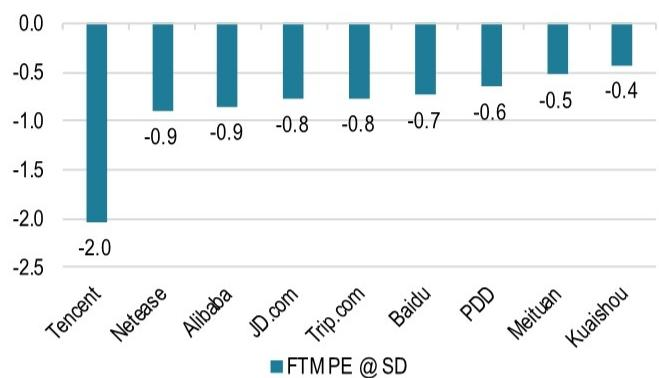
来源：LSEG Workspace（2026年6月30日）。注：远期市盈率标准差相对于各自最长的可用历史数据，排除异常值。

图2：主要大语言模型公司市值与年化经常性收入比
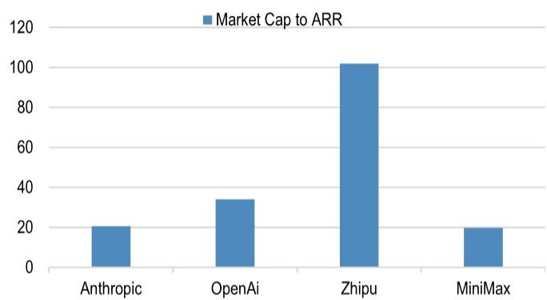
来源：LSEG Workspace（2026年6月30日），JPM估计。注：Anthropic和OpenAI的倍数基于最新一轮融资。智谱AI和MiniMax的倍数基于最新市值和截至2026年底的年化经常性收入，根据JPM估计。

图3：中国消费者AI应用情况
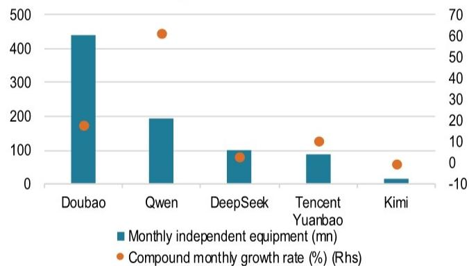
来源：36氪（2026年5月20日）。注：2026年4月中国排名前列的AI应用，根据mUserTracker。

图4：中国企业AI应用情况
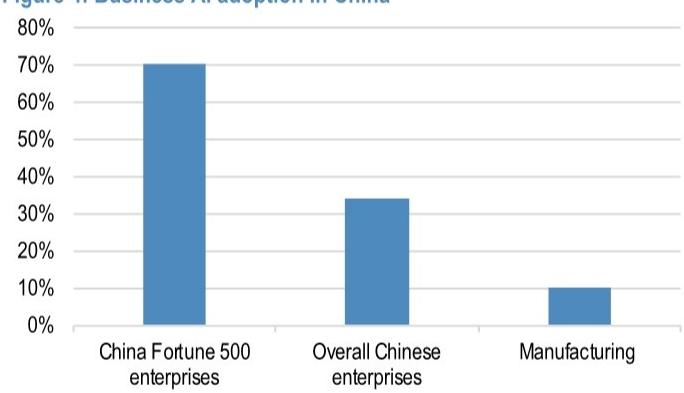
来源：新浪网（2025年9月15日），IT之家（2026年6月9日），财经网（2026年5月13日）。

图5：AI使用情况 – 中国 vs. 全球
受访人口或组织的百分比
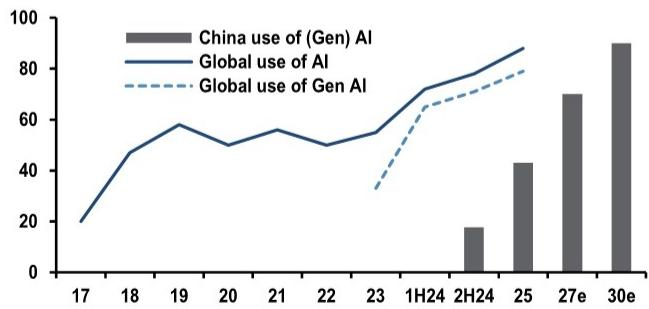
来源：JPM经济研究（2026年6月12日）。注：'27/30E为中国AI+目标。

图6：JPM对中国AI资本支出的预测（十亿美元）
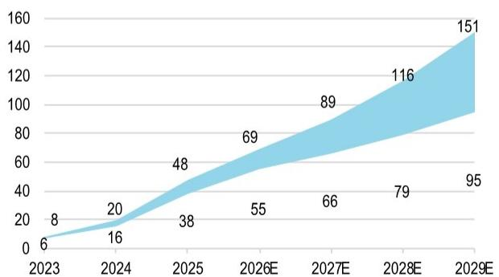
来源：彭博财经（2026年5月22日），JPM报告（日期2026年5月22日），JPM估计（2026年6月9日）。注：仅考虑中国超大规模云服务商在中国的AI资本支出。

图7：MSCI中国行业远期市盈率 – 估值对战术性反弹具有支撑，尤其是互联网板块
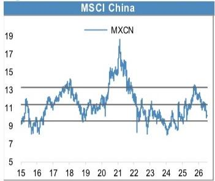

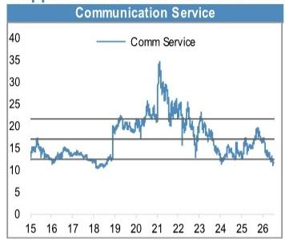

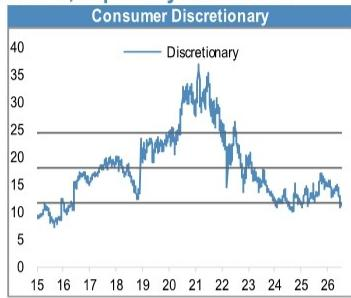

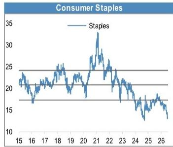

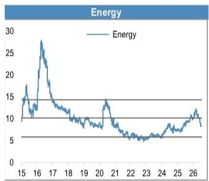

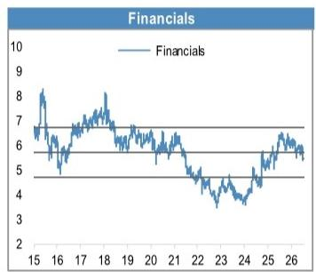

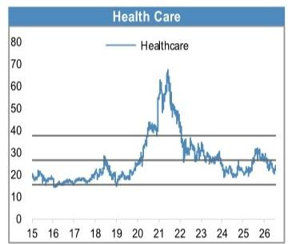

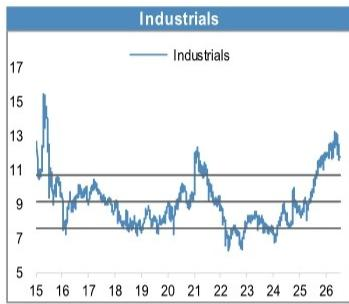

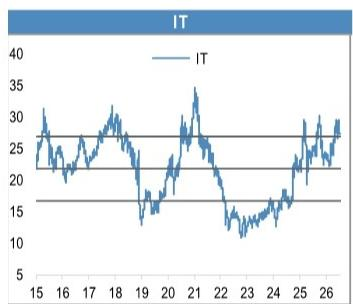
来源：彭博财经（2026年7月5日），JPM。

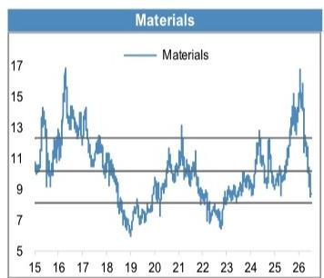

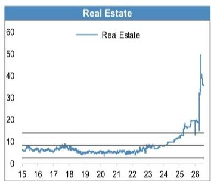

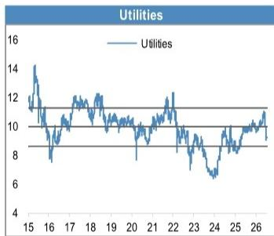

图8：MSCI中国A股行业远期市盈率 – 在岸估值吸引力相对较低，主要由信息技术板块驱动。2026年上半年科技公司业绩是关键观察点
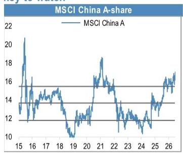

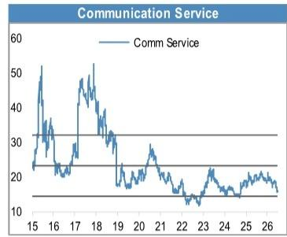

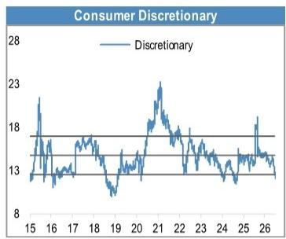

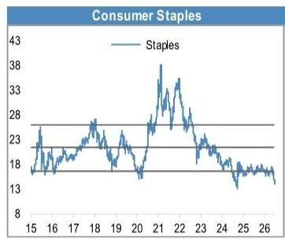

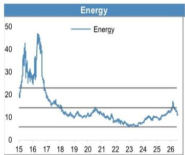

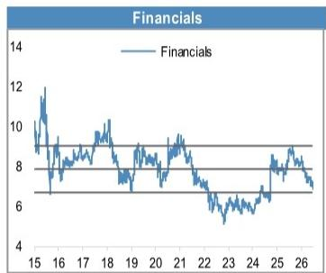

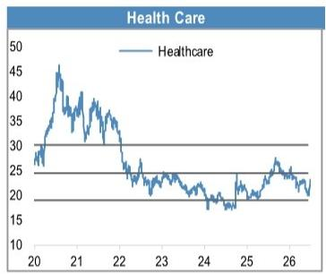

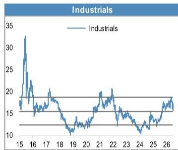

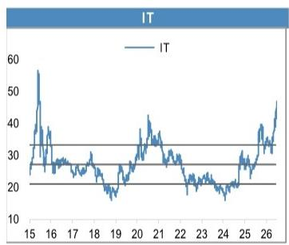
来源：彭博财经（2026年7月5日），JPM。

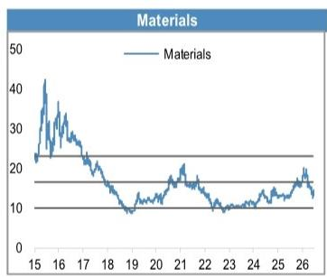

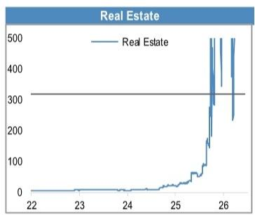

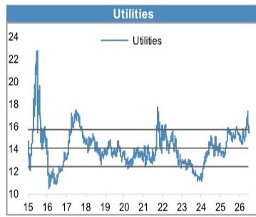

本报告中讨论的公司（除非另有说明，本报告中所有价格均为2026年7月6日收盘价）

阿里巴巴集团控股有限公司(9988.HK/HK\$95.95/OW), 阿里巴巴集团控股有限公司 (BABA)(BABA/\$96.14[2026年7月2日]/OW), 腾讯 (0700)(0700.HK/HK\$452.00/OW), 智谱AI(2513.HK/HK\$1530.00/OW)
