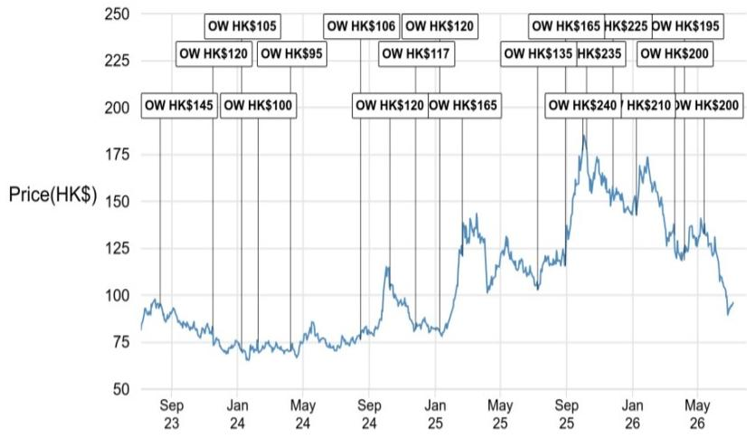
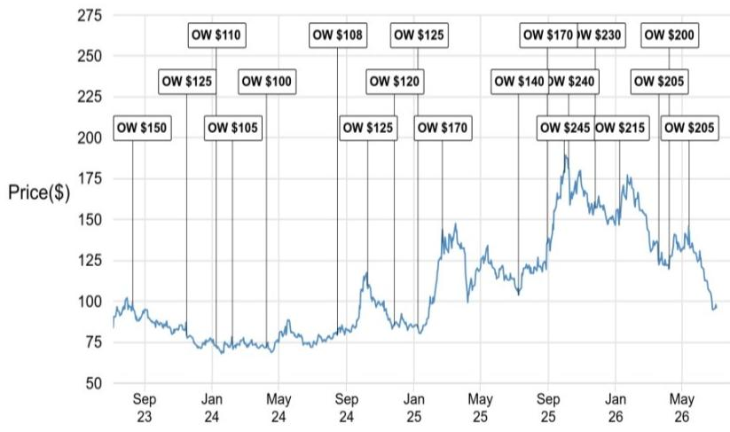
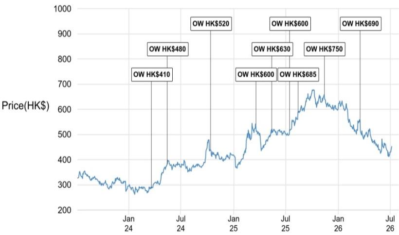

# China's AI Advantage Is Not About Frontier Breakthroughs—It Is About Cost-Controlled, Enterprise-Grade Deployment at Scale

The dominant narrative in global AI research has long been a single story: frontier models, massive compute clusters, and a race toward artificial general intelligence. That narrative, however, is increasingly a US-centric one. A growing body of evidence from China's AI ecosystem suggests that a different, and perhaps equally important, thesis is taking shape—one rooted not in benchmark supremacy but in cost-efficient, vertically integrated, enterprise-driven deployment. This is not a story about catching up. It is a story about a fundamentally different strategic logic.

Recent expert analysis from a global investment bank's AI call, drawing on insider perspectives from China's large language model (LLM) landscape, reinforces this divergence. The core argument is that China's AI players—from independent labs to hyperscale internet platforms—are operating under tighter financing, harder resource constraints, and a more pragmatic policy environment. The result is an ecosystem optimized for monetization, not moonshots. For observers, the implication is clear: the next 12 to 24 months of value creation in China AI will not come from who builds the smartest model, but from who controls the proprietary data, the enterprise workflow, and the cost structure to make AI actually work in the real economy.

This article synthesizes the report's findings into a strategic framework. It argues that observers should shift their focus from model-layer comparisons to the commercial layer—where ecosystem control, industry know-how, and policy-led diffusion are creating asymmetric opportunities. It also identifies critical open questions that the report leaves unresolved, and provides a decision framework for readers to evaluate their own exposure.

## China's AI Ecosystem Is Structurally Different from the US, and That Difference Creates a Distinct Logic

The first and most important insight from the expert call is that the US and China are running two different AI races, not a single one. The US race is defined by frontier ambition: deeper capital pools, top-tier research talent, abundant compute, and a collective fixation on AGI. Chinese players, by contrast, operate under tighter financing and hard-tech resource constraints. They cannot afford to burn capital on open-ended frontier research. Instead, they prioritize cost-efficient model iteration, vertical use cases, and near-term enterprise ROI.

This structural difference manifests in every layer of the stack. Chinese labs use open weights to build developer ecosystems, but monetize through paid APIs, fine-tuning, private deployment, and managed services—often at materially lower cost than US offerings. The cost advantage is not accidental. It is supported by lower-cost data procurement and mature model distillation practices, which allow domestic models to compete effectively for high-volume enterprise workloads.

The so-what for observers is direct: China's edge may lie less in matching the US on every frontier benchmark and more in scalable, cost-effective adoption. The market has largely priced Chinese AI stocks based on a US-comparable narrative of frontier risk. If the actual competitive dynamic is one of cost-efficient enterprise penetration, the valuation discount may be overdone.

## The Monetization Center of Gravity Has Shifted from Consumer Traffic to Enterprise Revenue, Changing Which Metrics Matter

A second critical insight is the clear shift in China's AI monetization model. Despite large user traffic, consumer AI products have seen limited paid conversion. User engagement weakened notably after premium features were introduced. The real revenue pools are now enterprise APIs, customized fine-tuning, private deployment, coding agents, and managed model operations.

This shift has profound implications for how observers should evaluate AI companies. The traditional consumer metrics—daily active users, session length, viral coefficients—are increasingly misleading. The key metrics to track are API usage, token volume, enterprise customer retention, deployment capability, and gross margin. Companies that can demonstrate traction in these enterprise metrics, even with modest consumer footprints, are likely to be undervalued relative to those with large consumer audiences but weak enterprise monetization.

The expert call specifically highlighted Alibaba's Accio Work AI agent, which has gained high recognition in the supply-chain management industry. Its value does not come from a generic model alone. It comes from Alibaba's proprietary merchant data, supply chain network, inventory systems, and scenario-specific operating know-how—resources no general-purpose large model can replicate. This is a pattern that will repeat across other verticals: the winner is not the best model, but the company with the best data and workflow integration.

## Chinese Hyperscalers and Independent Labs Are Splitting the Stack, Not Competing Head-to-Head

A common observer concern is that China's internet platforms are structurally disadvantaged against independent AI labs. The expert analysis suggests this is a false dichotomy. The two groups are splitting the stack, not competing directly.

Independent labs such as DeepSeek, MiniMax, Zhipu AI, and Moonshot AI are especially active in frontier model iteration. They can build model-layer value capture and are often more agile in pushing the state of the art. Hyperscalers like Alibaba, Tencent, and ByteDance, while also investing in model capability, remain highly competitive in productization, distribution, enterprise relationships, and real-world deployment. Their organizational complexity means they iterate more slowly at the model layer, but they compensate with ecosystem control, proprietary data, user traffic, and customer relationships.

This division of labor means that the thesis for each group is different. For independent labs, the key question is whether they can build sustainable model-layer margins before commoditization erodes their advantage. For hyperscalers, the question is whether their ecosystem moats are deep enough to capture a disproportionate share of enterprise AI spending. The report suggests the latter is more visible and nearer-term.

## The Fear That AI Will Displace Traditional Enterprise Software Providers Is Overblown, and the Real Moat Is Industry Know-How

One of the market's most persistent fears is that universal AI will completely displace traditional enterprise software and industrial platforms. The expert analysis pushes back hard on this narrative.

LLM adoption in traditional industries will likely be vertical, workflow-specific, and data-dependent, not a wholesale replacement of existing systems. For SMEs and standardized workflows, general AI can indeed replace basic software functions. But in large, sophisticated enterprise scenarios, the core competitive moat lies not in task execution, but in industry know-how sorting, business liability bearing, and customized service guarantees. These are competencies that traditional ERP vendors and industry-specific platforms have accumulated over decades through process standards, compliance experience, and after-sales liability mechanisms.

In the online travel sector, for example, AI provides intelligent booking entry points and simplifies consumer operations, yet the core transaction completion still relies on human verification, backend interface opening, and platform liability bearing. The pattern is consistent: AI augments, but does not replace, the institutional infrastructure of established players.

For observers, this means that the highest-conviction opportunities may not be in pure-play AI companies, but in incumbent platforms that can embed AI into their existing workflows and customer relationships. The winners will be those that own the data, the liability framework, and the industry-specific operating know-how.

## Policy-Led Diffusion Is Accelerating Adoption, but the Productivity Uplift Will Be K-Shaped and Gradual

The expert analysis also provides important macro context. China's policymakers have adopted a pragmatic, dual-track approach toward AI's macroeconomic impact. The national "AI+" policy push is accelerating awareness, experimentation, and early deployment across traditional sectors, including manufacturing. On the growth side, this policy-led diffusion should broaden AI adoption beyond internet platforms and AI-native companies.

However, the near-term lift shows up in high-tech capex, intellectual property, and selective exports, while aggregate productivity gains remain limited until utilization and enterprise adoption broaden. The impact is K-shaped: AI infrastructure and hardware winners benefit strongly, while spillovers to the wider economy remain modest.

On the social stability front, a landmark judicial precedent in Hangzhou has established that enterprises cannot lay off employees or cut salaries on the grounds of AI replacement, effectively prohibiting AI from becoming a corporate cost-cutting tool. Pilot cities have also launched mandatory weekly AI tool training courses for primary and secondary school students. The overarching logic is clear: fully release AI productivity dividends while hedging social risks through education, employment protection, and judicial constraints.

For observers, the macro implication is that a systematic net profit margin boost from AI is a longer-dated upside optionality. It is too early to reflect this into near-term earnings forecasts. But the policy environment is supportive enough to justify a structural view in AI-exposed names, particularly those with clear enterprise deployment paths.

## What the Report Does Not Fully Answer: Three Open Questions

Despite its depth, the expert analysis leaves several critical questions unresolved. First, how durable is the cost advantage of Chinese LLM providers? If US frontier model costs decline rapidly, or if Chinese players face rising data acquisition costs, the competitive gap could narrow. The report does not provide a sensitivity analysis on this point.

Second, what is the actual gross margin trajectory for enterprise AI services in China? The report notes that API pricing is materially lower than US offerings, but does not clarify whether this is a sustainable competitive strategy or a race to the bottom. If margins remain compressed, the equity value of pure-play model providers may be limited.

Third, how will the regulatory landscape evolve? The report highlights a supportive but cautious policy approach. However, the risk of more restrictive data localization, cross-border data flow limitations, or unexpected sector-specific regulations remains unquantified. Observers should monitor these developments closely.

These open questions are not weaknesses of the report. They are the natural boundaries of any forward-looking analysis. They also create the analytical space for deeper original research and community discussion.

## A Decision Framework for Observers Evaluating China AI Exposure

For readers looking to translate this analysis into actionable positioning, the following framework may be useful. It is not a recommendation, but a structured way to think about the trade-offs.

First, distinguish between model-layer and deployment-layer exposure. Model-layer investments (independent labs) offer higher optionality but lower visibility on monetization and margins. Deployment-layer investments (hyperscalers, enterprise software incumbents with AI integration) offer lower upside optionality but higher near-term revenue visibility and ecosystem moats. The report's analysis suggests a tilt toward the deployment layer for the next 3-6 months.

Second, evaluate enterprise traction using non-traditional metrics. Do not rely on consumer DAU or app store rankings. Instead, look for evidence of API token volume growth, enterprise customer retention rates, deployment capability, and gross margin trends. Companies that can demonstrate these metrics, even with modest consumer footprints, are likely undervalued.

Third, assess the quality of proprietary data and workflow integration. The most valuable AI assets in China are not the models themselves, but the proprietary data sets, supply chain networks, inventory systems, and industry-specific operating know-how that no general-purpose model can replicate. Companies with these assets are better positioned to capture value from AI deployment.

Fourth, consider the policy environment as a tailwind, not a risk. The dual-track approach of promoting AI adoption while hedging social disruption is supportive for long-term observation. However, near-term earnings expectations should remain conservative, as systematic productivity gains will take time to materialize.

Finally, be prepared for a K-shaped outcome. The winners in China AI are likely to be concentrated among infrastructure providers, hyperscalers, and incumbents with strong enterprise relationships. The broader market may see only modest spillovers for some time.

## Join the Community to Read the Full Report and Review the Original Charts

The analysis above draws on insights from a detailed expert call and proprietary research that includes valuation charts, adoption metrics, and capex forecasts. These are not available in a public summary. The full report contains the data and context that allow readers to make their own judgments on the specific names and timing.

If you found this framework useful, consider joining the community where the full report is discussed, the original charts are reviewed, and these open questions are debated in real time. The conversation is where the real value lies.

*For informational purposes only. Portions may be generated, translated, summarized, or edited with AI assistance based on source materials and may contain omissions or errors. Please verify independently. This is not professional advice.*

For informational purposes only. Portions may be generated, translated, summarized, or edited with AI assistance based on source materials and may contain omissions or errors. Please verify independently. This is not professional advice.

