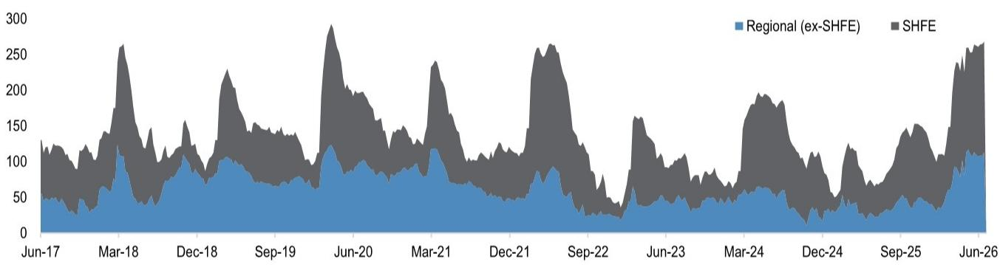
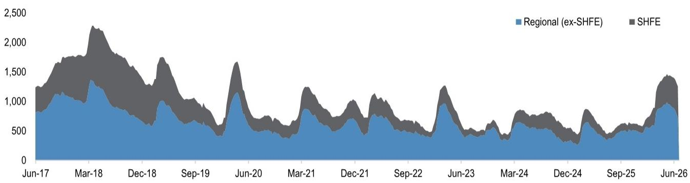
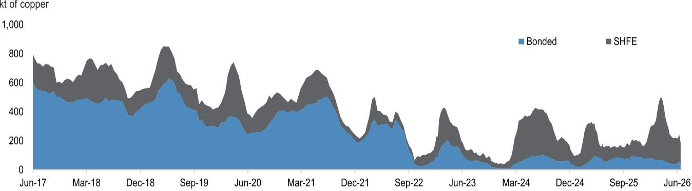

# JPM：铜铝锌三周去库存，JPM揭示中国工业金属消费新动向

中国工业金属市场正在出现一个多月来最清晰的需求信号。JPM在截至7月3日当周的中国金属库存追踪报告中指出，铜、铝、锌三大基本金属同时出现显著去库存，其中铜库存已降至年内同期多年低位。这一变化发生在中国固定资产研究增速仍在调整的背景下，使市场开始重新评估下游消费的真实强度。

报告的核心观察是：铜连续三周加速去库存，单周减少约1.3万吨，将中国总库存压至16.3万吨。铝的周度去库存规模达到7.5万吨，是2026年春节以来最大单周降幅。锌也出现了春节后首次明显的去库存，单周减少1.1万吨。这些高频数据作为消费的参考指标，正在发出与宏观数据不完全一致的声音。

## 1. 铜的库存信号最值得关注，因为它叠加了关税预期的外生变量

铜的去库存并非孤立发生在国内。JPM指出，美国商务部正在考虑是否对铜进口加征关税，这推动美国市场持续从COMEX吸收实物铜。中国铜现货溢价在过去一周回升至每吨70美元以上，说明区域需求也在改善。

> **KC评论：** 铜的库存下降不能完全归因于国内需求回暖，美国关税预期导致的跨市场套利同样在抽走库存。读者需要区分“中国需求改善”和“全球库存再分配”两种逻辑，完整报告中的图1（洋山铜溢价与LME铜价对比）是判断哪股力量更强的重要线索。

铜库存降至16.3万吨，与2025年同期低位持平。这一水平意味着如果需求继续改善，供应端将很快面临补库不确定性。但JPM的研究团队也提醒，需求复苏目前仍显狭窄，主要集中在高端制造供应链，而非广泛的消费驱动领域。

## 2. 铝的去库存节奏超出季节性，但库存总量仍在历史高位

铝的周度去库存7.5万吨，明显强于往年同期的温和去化。过去八周，中国铝库存累计下降超过30万吨，从年内高点快速回落。不过，JPM的数据也显示，当前1.1万吨的总库存仍处于五年区间的高位。

这意味着铝的供需再平衡才刚刚开始。去库存的持续性比单周幅度更重要。如果未来几周去库存速度能够维持，才意味着供给侧改革和下游高端制造需求正在形成有效共振。锌的情况类似，虽然出现了11万吨的去库存，但总库存26.5万吨仍是2022年以来最高水平。

> **KC评论：** 铝和锌的高库存基数意味着，单周去库存不足以改变市场定价。完整报告中的图5和图7分别展示了铝和锌的库存变化节奏，读者可以关注去库存是否连续三周以上加速，这比单周数据更有信号意义。

## 3. 报告尚未完全回答的关键问题：去库存能否持续，以及谁在真正买单

JPM的报告提供了高频库存数据，但并未深入拆解去库存的终端驱动力。当前中国固定资产研究增速仍在调整，宏观环境复苏集中在高端制造供应链，这为铜和铝提供了相对强劲的需求支撑。但钢铁和铁矿石的库存信号并不一致——钢铁库存同比上升11%，铁矿石港口库存仍在1.6亿吨高位，去库存速度已节奏变化。

这种分化指向一个尚未被充分回答的问题：基本金属的去库存是真实需求拉动，还是供应链在关税预期下的主动囤货？如果是后者，一旦关税政策落地或预期逆转，库存可能迅速回补。报告没有给出明确的因果判断，这恰恰是读者需要自行验证的关键变量。

## 4. 对产业决策者的观察框架：关注溢价和库存节奏的交叉验证

基于这份报告，可以建立一套简单的观察框架。第一，铜的洋山溢价是判断区域需求最直接的领先指标，持续高于70美元/吨意味着下游采购意愿真实存在。第二，铝和锌的去库存需要连续三周以上才能确认趋势反转，单周数据容易被季节性噪音干扰。第三，钢铁和铁矿石的库存不确定性是基本金属需求能否扩散到更广泛宏观环境领域的反向指标——如果钢铁去库存迟迟不启动，说明建筑和基础设施需求依然仍在调整。

JPM在报告中提供了完整的库存图表和季节性对比，这些数据本身比任何单周判断都更有价值。对于关注中国工业活动强度的读者而言，这份报告的核心贡献在于：它用高频数据指出，高端制造供应链正在产生可测量的实物需求，但这一需求能否扩大范围，仍需政策支持来拓宽需求基础。

For informational purposes only. Portions may be generated,translated,summarized,or edited with AI assistance based on source materials and may contain omissions or errors. Please verify independently. This is not investment,legal,tax,accounting,or other professional advice.

For informational purposes only. Portions may be generated,translated,summarized,or edited with AI assistance based on source materials and may contain omissions or errors. Please verify independently. This is not investment,legal,tax,accounting,or other professional advice.

