# 行业观察

# 集装箱运输

## 2026年年中供需更新

在我们近期关于集装箱运输的行业报告中，基于观察到5月/6月需求加速，我们更新了对集装箱运输公司2026年的预期。本报告展示了我们对2026年剩余时间的供需展望，以及对2027年和2028年的展望。我们认为，由于对集装箱即期运价持谨慎看法，该行业可能重新出现显著的运营亏损和现金流消耗。尽管近期运费短期上涨，但考虑到共识预期面临的下行风险，我们对集装箱运输公司的盈利前景仍持谨慎态度。我们预计，若无进一步的地缘事件干扰，集装箱即期运价将回归至疫情前平均每标准箱1000美元的水平，这将导致市场预期尚未充分反映的显著运营亏损和现金流消耗。2027年的供应前景看起来值得关注，同比增幅达16%，原因是红海航线恢复通航以及新船交付加速。在此背景下，我们认为，鉴于预期的负向供需差，运价没有结构性理由不会继续显著调整。

- **需求**。年初至今，海运量同比增长约5%，是实际GDP增速的两倍。自2023年第四季度以来，需求增长已加速，远超历史1倍实际GDP的倍数，部分受事件性因素支撑。尽管近期趋势高于平均水平，我们预计随着订舱模式正常化，未来几个季度需求将回归至2-3%的增速。我们预计2026年运量增长4%，2027-28年增长2.5%。

- **供应**。年初至今，名义供应同比增长6%，有效供应增长5%。考虑到新船交付的前景，以及集装箱运输最终恢复通过苏伊士运河航线，我们预计2026年有效供应增长3.5%，2027年大幅增长16%，2028年进一步增长12%。我们预计船舶交付不会出现重大延迟，尽管近期有观点认为超大规模数据中心建设可能将发动机从集装箱船分流至数据中心，但我们认为这一说法过于简化，因为发动机技术存在差异，且造船订单有定金承诺。事实上，过去六个月的交付水平不降反升。订单取消在历史上也较为罕见。订单簿与船队比率正迅速接近当前船队的40%，我们认为这是该行业未来“缺乏运力纪律”的关键前瞻指标。

- **运价**。年初至今，即期运价同比上涨17%，自年初以来趋势出现急剧逆转，最初由行业为弥补因伊朗局势导致的燃油成本大幅上涨所推动，但自5月初以来，订舱量激增，可能受前置出货、补库存和规避成本等因素驱动。鉴于近期运价上涨，我们预计2026年运价将同比上涨20%，而2027年预计将大幅下降约42%，回到略低于每标准箱1100美元的水平，2028年将进一步同比下降17%至每标准箱900美元。

## 欧洲运输与物流

Alexia Dogani AC
(44-20) 3493-3791
alexia.dogani@JPM.com
JPM Securities plc

Harry J Gowers
(44-20) 7134-7522
harry.gowers@JPM.com
JPM Securities plc

Shikha Khurana
(91-22) 6157-5022
shikha.khurana@jpmchase.com
JPM India Private Limited

Bhavpreet S Batra
(91-22) 6157-5046
bhavpreet.batra@JPM.com
JPM India Private Limited

见第7页分析师认证和重要披露，包括非美国分析师披露。

## 需求

年初至今运量增长5%，主要受事件性因素支撑，而非贸易背景的结构性改善，因为实际GDP活动或PMI基本未变。尽管近几个季度需求增长已加速至历史1倍实际GDP倍数以上，我们预计随着订舱模式正常化和贸易政策变化的影响被消化，需求将回归至2-3%的增速。近期主干航线增长有所放缓，而回程贸易稳步增长，尤其是在跨太平洋航线。我们预计2026年运量增长4%，2027-28年每年增长2.5%。

图1：自2023年第四季度以来，运量增长已加速至实际GDP的2倍，但我们预计这一趋势将从2026年第三季度开始收窄...
海运运量增长 vs. 实际GDP - 同比%（倍数 - 右轴）
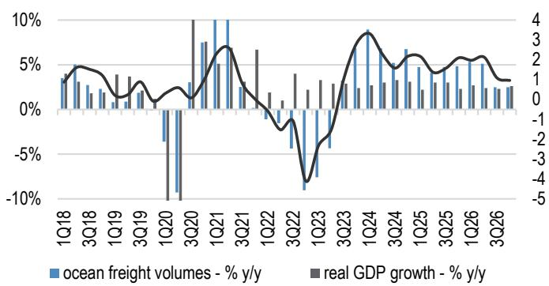
来源：CTS，JPM Economics Research。

图2：...贸易政策扰动已进入基数期，主干航线增长放缓
主干航线（亚洲至欧洲；亚洲至北美）和回程航线（欧洲至亚洲；北美至亚洲）- 同比%运量
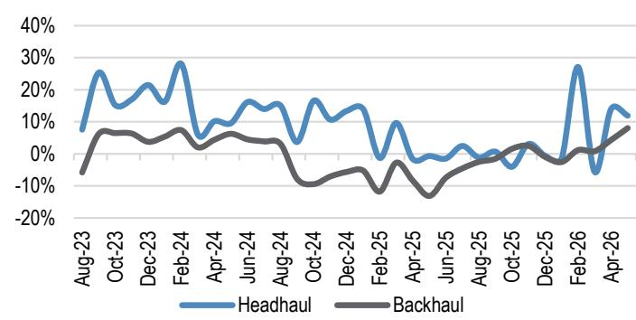
来源：CTS数据截至2026年5月。

图3：自2019年以来，海运运量增长落后于实际GDP，尽管过去两年有所加速，我们预计需求环境将趋于温和，2026年同比增长4%，2027-28年每年同比增长2.5%
集装箱船运力；海运运量和标准化海运运量（自2019年以来1倍实际GDP增长）以2011年为基准
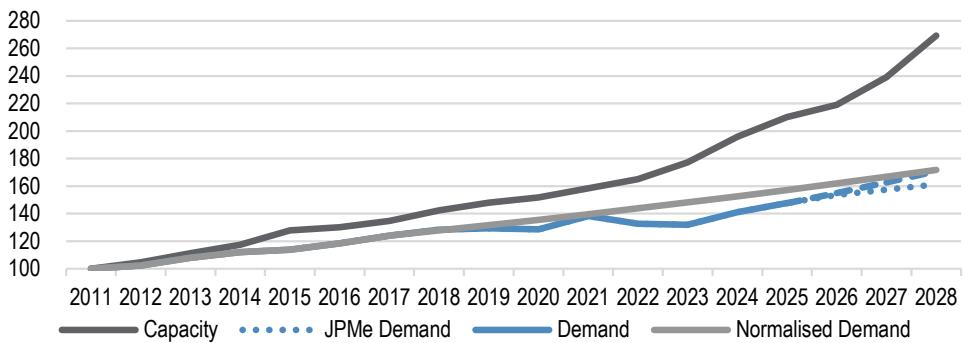
来源：CTS，Alphaliner，JPM估计。

## 供应

我们持续关注订单簿与船队比率的构建，以及在集装箱运输公司盈利能力提升的时期之后，该比率如何成为下一轮调整的领先指标，因为它预示着供应过剩的风险。交付计划预计将达到新的峰值，交付量从2027年下半年开始加速。我们认为，集装箱运输最终将从2027年第一季度起恢复通过苏伊士运河航线，马士基在7月初宣布，其一条亚欧地中海航线将结构性恢复通航，这标志着近期重返红海的最新努力。订单簿与船队比率正迅速接近当前船队的40%，而年初至今拆船活动有限。我们预计2026年名义供应增长4.6%，有效供应增长3.5%。我们预计2027年有效供应将大幅增长16%，2028年进一步增长12%，这由交付和航线正常化共同驱动。

图4：交付量在2027年下半年和2028年弹性较高，但拆船量极少，且船厂产能限制将制约行业加速拆船的能力
集装箱船运力（以标准箱计的交付量和拆船量）
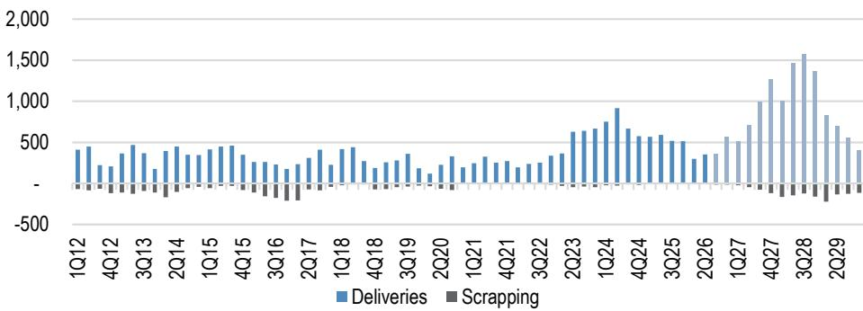
来源：Alphaliner；JPM对远期拆船活动的估计。

图5：名义运力持续增长，订单簿与船队比率继续构建，但尚未达到峰值比率，但远高于相对峰值订单量
名义运力 vs. 订单簿与船队比率（占全球标准箱运力的百分比）

来源：Alphaliner，Clarksons。

## 交付延迟或订单取消的可能性？

虽然两者都不能排除，但在过去六个月中，我们未观察到交付计划有任何延迟，事实上，自2026年1月以来交付量一直在增加。有一些讨论认为，数据中心基础设施的需求可能将产能从造船转向数据中心，尤其是发动机方面。我们迄今未看到任何证据，而且我们的理解是，发动机技术类型不同，最大的船用发动机制造商在数据中心领域规模较小。就取消订单而言，历史上很少发生，且更多与即期市场动态相关。

图6：自2026年1月以来，2027年的计划交付量有所增加，表明没有延迟
2026年7月与1月计划交付量的变化（按月的标准箱数）
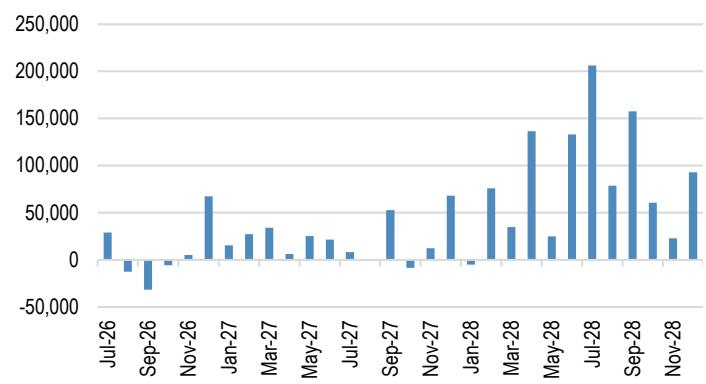
来源：Alphaliner。

图7：取消订单是可能的，但通常很少且数量较低
订单取消量 vs. 占订单簿的百分比
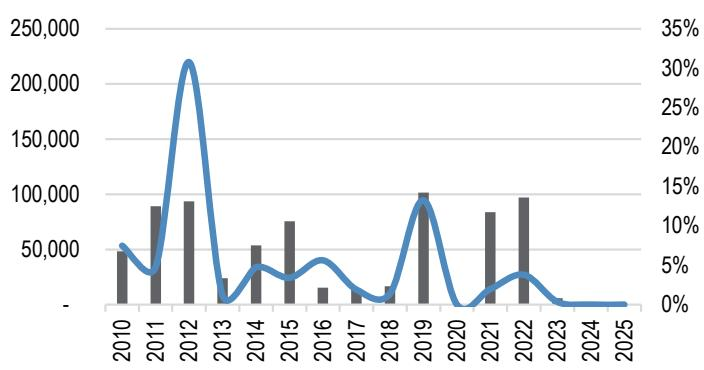
来源：Alphaliner。

图8：我们预计2026年有效供应增长为+3.5%...
海运运力展望 2025-26
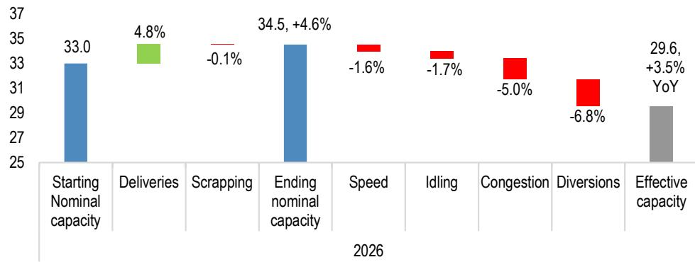
来源：Alphaliner，Sea-Intelligence，Clarksons，Bloomberg，JPM估计。

图9：...随后2027年大幅增长16%...
海运运力展望 2026-27
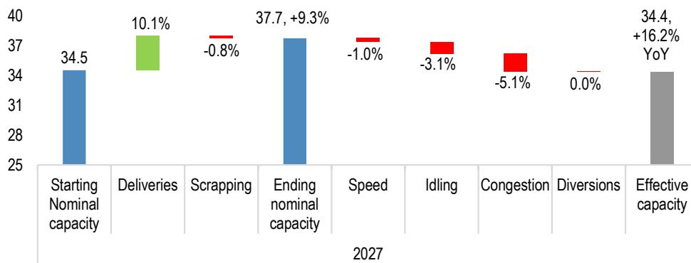
来源：Alphaliner，Sea-Intelligence，Clarksons，Bloomberg，JPM估计。

图10：...2028年进一步增长12%
海运运力展望 2027-28
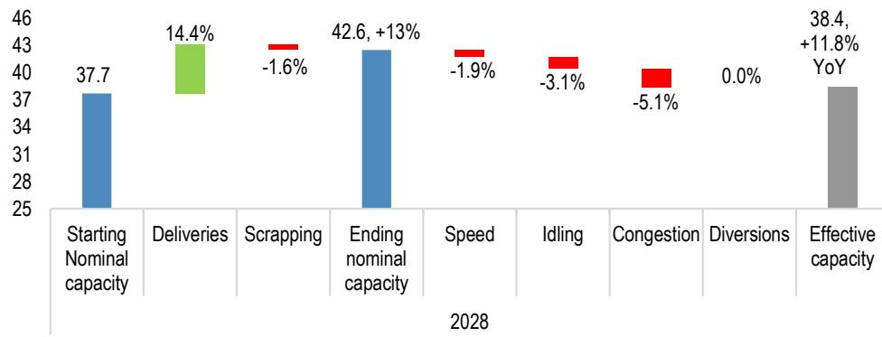
来源：Alphaliner，Sea-Intelligence，Clarksons，Bloomberg，JPM估计。

## 运价

集装箱运费是商品价格，通过SCFI等各种指数每周更新。这些价格是供需的实时反映。我们认为没有证据表明这种历史关系被打破，因此，从基本面来看，鉴于即将到来的大量供应，我们认为没有理由认为运价不能回归长期平均水平。鉴于近期运价强劲上涨，我们预计2026年即期运价将同比上涨20%，平均每标准箱1900美元，然后在2027年下降40%至略低于每标准箱1100美元，2028年进一步同比下降17%至每标准箱900美元。

图11：集装箱运费历史上在一个区间内波动，该区间在疫情期间被打破；但我们认为，一旦事件性因素消退，没有理由不回归长期平均水平
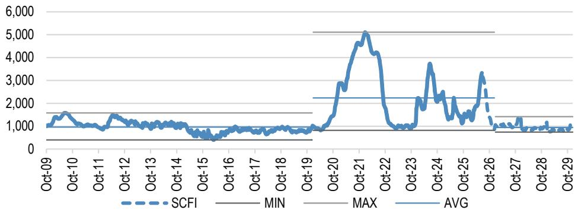
来源：Bloomberg Finance L.P.，基础数据来自上海航运交易所；JPM估计。

图12：运价与供需差的关系在方向上非常强，近期的偏离部分由燃油价格回升驱动... SCFI变化 vs. 月度需求与有效供应之差
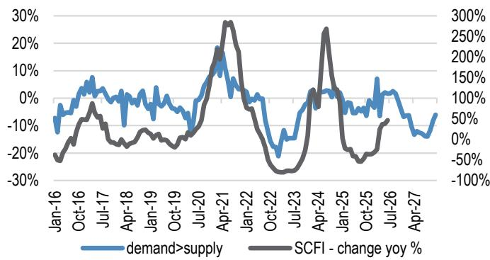
来源：Alphaliner，CTS，Clarksons，Sea-Intelligence，JPM估计。

图13：我们预计运价将回归历史均值1000美元，在所有扰动因素消退后，风险更偏向下行 SCFI vs. 年度需求大于供应之差
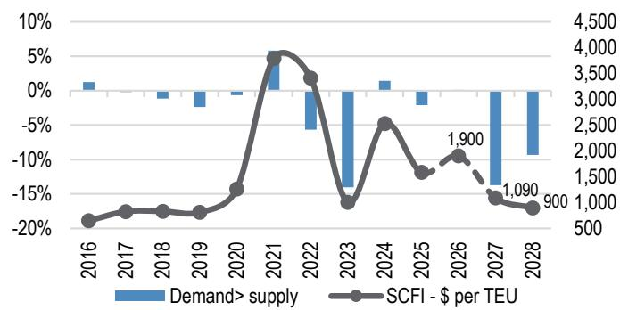
来源：Alphaliner，CTS，Clarksons，Sea-Intelligence，JPM估计。

分析师认证：本报告封面标注“AC”的研究分析师证明（或者，当多位研究分析师主要负责本报告时，封面或文件内标注“AC”的研究分析师分别就本研究中该研究分析师覆盖的每个证券或发行人证明）：(1) 本报告中的所有观点准确反映了研究分析师对任何及所有相关证券或发行人的个人观点；(2) 研究分析师薪酬的任何部分过去、现在或将来均不直接或间接与本报告中研究分析师提出的具体建议或观点相关。对于封面列出的所有韩国研究分析师（如适用），他们还根据KOFIA要求证明，研究分析师的分析是善意进行的，观点反映了研究分析师本人的意见，没有受到不当影响或干预。

除非另有说明，本报告中列出的所有作者均为制作独立研究的研究分析师。在欧洲，本报告中可能显示行业专家（销售和交易）为联系人，但他们不是本报告的作者，也不属于研究部门。

## 重要披露

公司特定披露：JPM寻求并确实与其研究报告所覆盖的公司开展业务。因此，读者应注意，该公司可能存在影响本报告客观性的利益冲突。读者应将本报告视为做出决策的单一因素。重要披露，包括价格图表和信用意见历史表（如适用），可通过访问https://www.jpmm.com/research/disclosures、致电1-800-477-0406或发送电子邮件至research.disclosure.inquiries@JPM.com获取。

## 股票研究评级、名称和分析师覆盖范围说明：

JPM使用以下评级系统：增持（在本报告所述价格目标期间，我们预计该股票将跑赢研究分析师或其团队覆盖范围内股票的平均总回报）；中性（在本报告所述价格目标期间，我们预计该股票将与研究分析师或其团队覆盖范围内股票的平均总回报表现一致）；减持（在本报告所述价格目标期间，我们预计该股票将跑输研究分析师或其团队覆盖范围内股票的平均总回报）。NR为未评级。在这种情况下，JPM已移除该股票的评级和（如适用）价格目标，原因是缺乏足够的基本面基础或出于法律、监管或政策原因。先前的评级和（如适用）价格目标不应再被依赖。NR名称不是建议或评级。一些被覆盖的股票有评级但没有价格目标；在这些情况下，我们预计该股票将在相关区域的相关期限内跑赢/表现一致/跑输研究分析师或其团队覆盖范围内股票的平均总回报。在我们的亚洲（除澳大利亚和印度外）和英国中小盘股票研究中，每只股票的预期总回报与基准国家市场指数的预期总回报进行比较，而非与研究分析师的覆盖范围进行比较。如果本报告的重要披露部分未显示，认证研究分析师的覆盖范围可在JPM研究网站https://www.JPMmarkets.com上找到。

覆盖范围：Dogani, Alexia：AP Moller-Maersk (MAERSKb.CO)，DHL Group (DHLn.DE)，DSV (DSV.CO)，Hapag-Lloyd (HLAG.DE)，InPost (INPST.AS)，Kuehne + Nagel (KNIN.S)，ZIM (ZIM)

JPM股票研究评级分布，截至2026年7月4日

<table><tr><td></td><td>增持（买入）</td><td>中性（持有）</td><td>减持（卖出）</td></tr><tr><td>JPM全球股票研究覆盖*</td><td>53%</td><td>36%</td><td>12%</td></tr><tr><td>投行客户**</td><td>83%</td><td>80%</td><td>73%</td></tr><tr><td>JPMS股票研究覆盖*</td><td>51%</td><td>37%</td><td>12%</td></tr><tr><td>投行客户**</td><td>95%</td><td>92%</td><td>87%</td></tr></table>

\*请注意，由于四舍五入，百分比可能不总和为100%。

\*\*JPM在过去12个月内提供投行服务的“买入”、“持有”和“卖出”类别中各标的公司的百分比。

就FINRA评级分布规则而言，我们的增持评级属于报告评级类别；我们的中性评级属于持有评级类别；我们的减持评级属于报告评级类别。请注意，标有NR的股票不包括在上表中。此信息截至最近一个日历季度末。

股票估值与风险：有关被覆盖公司或价格目标的估值方法和风险，请参阅最新的公司特定研究报告，联系主要分析师或您的JPM代表，或发送电子邮件至research.disclosure.inquiries@JPM.com。有关专有模型的重要信息，请参阅公司特定研究报告中的财务摘要和公司概况表，这些可在我们客户网站的公司页面上获取。本报告还阐述了其中使用的基本假设。

## 研究交流历史：

过去12个月内JPM研究交流的历史可通过研究评论页面访问，您也可以按分析师姓名、行业或金融工具进行搜索。

分析师薪酬：负责编制本报告的研究分析师的薪酬基于多种因素，包括研究的质量和准确性、客户反馈、竞争因素以及公司整体收入。

非美国分析师注册：除非另有说明，本报告封面上列出的非美国分析师是非美国关联公司的员工，可能未在FINRA注册为研究分析师，可能不是JPM Securities LLC的关联人士，并且可能不受FINRA规则2241或2242关于与被覆盖公司沟通、公开露面以及交易研究分析师账户持有的证券的限制。

## 其他披露

JPM是JPM Chase & Co.及其全球子公司和关联公司投行业务的营销名称。

英国MIFID FICC研究分拆豁免：英国客户应参考英国MIFID研究分拆豁免，了解JPM实施FICC研究豁免的详细信息以及相关FICC研究分类的指导。

除非相关法律特别允许，所有提供给客户的研究材料同时在我们的客户网站JPM Markets上提供。并非所有研究内容都重新分发、通过电子邮件发送或提供给第三方聚合商。有关特定股票的所有研究材料，请联系您的销售代表。

本研究材料中提及中国、香港、台湾和澳门的任何长格式名称分别为中国大陆、香港特别行政区（中国）、台湾（中国）和澳门特别行政区（中国）。

JPM可能不时撰写关于受美国、欧盟、英国或其他相关司法管辖区政府当局实施或管理的经济或金融制裁所针对的发行人或证券的文章。本报告中的任何内容均无意被解读为鼓励、促进、推动或以其他方式批准对这类受制裁证券的或交易。客户在做出决策时应了解自己的法律和合规义务。

本研究报告中讨论的任何数字或加密资产都受到快速变化的监管环境的影响。有关加密资产的相关监管建议，包括比特币和以太币，请参阅https://www.JPM.com/disclosures/cryptoasset-disclosure。

本研究报告的作者可能未获许可在您的司法管辖区开展受监管活动，如果未获许可，则不会声称自己能够这样做。

交易所交易基金：JPM Securities LLC作为几乎所有美国上市ETF的授权参与者。如果本报告中提及任何ETF，JPMS可能因分销这些ETF份额而赚取佣金和基于交易的补偿，并可能因执行其他与交易相关的服务（例如向ETF份额卖空者提供证券借贷）而赚取费用。JPMS还可能为ETF本身提供服务，包括担任ETF的经纪商或交易商。此外，JPMS的关联公司可能为ETF提供服务，包括信托、托管、管理、借贷、指数计算和/或维护以及其他服务。

期权和期货相关研究：如果本文包含的信息涉及期权或期货相关研究，则该信息仅提供给已收到适当期权或期货风险披露文件的人士。请联系您的JPM代表或访问https://www.theocc.com/components/docs/riskstoc.pdf获取期权清算公司的标准化期权的特征和风险副本，或访问https://www.finra.org/sites/default/files/2020-08/Security_Futures_Risk_Disclosure_Statement_2020.pdf获取证券期货风险披露声明副本。

银行间同业拆借利率和其他基准利率的变化：某些利率基准目前或将来可能受到持续的国际、国内和其他监管指导、改革和改革建议的影响。更多信息，请参阅：https://www.JPM.com/global/disclosures/interbank_offered_rates

私人银行客户：如果您作为JPM Chase & Co.及其子公司私人银行业务的客户接收研究，则研究由JPM私人银行提供，而非JPM的任何其他部门，包括但不限于JPM企业与投行及其全球研究部门。

负责制作和分发研究的法律实体：撰写本材料的Reg AC研究分析师姓名下方标识的法律实体是负责制作本研究的法律实体。如果多位Reg AC研究分析师撰写了本材料，其姓名下方标识了不同的法律实体，则这些法律实体共同负责制作本研究。如果分析师姓名下列出多个法律实体，则除非另有说明，第一个法律实体负责制作。来自不同JPM关联公司的研究分析师可能对本材料的制作做出了贡献，但可能未获许可在您的司法管辖区开展受监管活动。除非下文法律实体披露中另有说明，本材料已由负责制作的法律实体分发，或者如果分析师姓名下列出多个法律实体，则第一个法律实体将负责分发。如果您有任何疑问，请联系您所在司法管辖区的相关研究分析师或您所在司法管辖区分发本研究材料的实体。

法律实体披露和国家/地区特定披露：

阿根廷：JPM Chase Bank N.A Sucursal Buenos Aires受阿根廷共和国中央银行和阿根廷国家证券委员会监管。

澳大利亚：JPM Securities Australia Limited受澳大利亚证券和投资委员会监管，是ASX Limited的市场参与者、ASX Clear Pty Limited的清算和结算参与者以及ASX Clear (Futures) Pty Limited的清算参与者。本材料由JPMSAL或其代表在澳大利亚仅向“批发客户”发行和分发。所有被覆盖的金融产品列表可通过访问https://www.jpmm.com/research/disclosures获取。JPM寻求覆盖与国内外读者基础相关的所有GICS行业以及各种市值规模的公司。如适用，在对标的公司进行公开尽职调查的过程中，研究分析师团队可能通过公司访问、与公司代表讨论、管理层演示等公司接触方式执行此类尽职调查。JPMSAL发布的研究已按照JPM澳大利亚的研究独立性政策编制，该政策可在以下链接找到：JPM Australia - Research Independence Policy。

巴西：Banco JPM S.A.受巴西证券交易委员会和巴西中央银行监管。JPM监察员：0800-7700847 / 0800-7700810（听力障碍者）/ ouvidoria.jp.morgan@jpmchase.com。

加拿大：JPM Securities Canada Inc.是一家注册投资交易商，受加拿大投资监管组织和安大略省证券委员会监管，是加拿大交易所的参与成员。本材料由JPM Securities Canada Inc.或其代表在加拿大分发。

智利：Inversiones JPM Limitada是一家在智利注册的未受监管实体。

中国：JPM Securities (China) Company Limited已获中国证监会批准开展证券投资咨询业务。

哥伦比亚：Banco JPM Colombia S.A.受哥伦比亚金融监管局监管。本材料中对国外实体提供的产品或服务的任何引用仅用于描述目的。此类引用不构成也不应被解释为在哥伦比亚领土内的促销活动或提供金融产品或服务。

迪拜国际金融中心：JPM Chase Bank, N.A., Dubai Branch受迪拜金融服务管理局监管，其注册地址为迪拜国际金融中心。本材料已由JPM Chase Bank, N.A., Dubai Branch分发给根据DFSA规则被视为专业客户或市场对手方的人士。

欧洲经济区：除非另有说明，研究在EEA由JPM SE分发，JPM SE是一家信贷机构，由德国联邦金融监管局授权，并由BaFin、德国中央银行和欧洲央行共同监管。JPM SE总部位于法兰克福。本材料已在EEA分发给根据MiFID II及其在各自母国的实施被视为专业读者的人士。本材料不得由非EEA专业读者的人士依赖或依据其采取行动。本材料涉及的任何或活动仅适用于EEA相关人士，并且将仅与EEA相关人士进行。

香港：JPM Securities (Asia Pacific) Limited受香港金融管理局和香港证券及期货事务监察委员会监管，JPM Broking (Hong Kong) Limited受香港证券及期货事务监察委员会监管。JPM Chase Bank, N.A., Hong Kong Branch受香港金融管理局和证券及期货事务监察委员会监管，根据美国法律组建，责任有限。如果本材料的分发在香港是受监管活动，则本材料由JPM Securities (Asia Pacific) Limited和/或JPM Broking (Hong Kong) Limited在香港分发。

印度：JPM India Private Limited在印度证券交易委员会注册为研究分析师。JPM India Private Limited还在SEBI注册为国家证券交易所和孟买证券交易所的成员以及商人银行家。JPM Chase Bank, N.A. - Mumbai Branch由印度储备银行授权为印度境内表列商业银行。对于非本地研究材料，本材料不由JPM India Private Limited在印度分发。合规官：Ashutosh Sharma；申诉官：Ramprasadh K。SEBI的注册和NISM的认证不以任何方式保证中介机构的业绩或向读者提供任何回报保证。

印度尼西亚：PT JPM Sekuritas Indonesia是印度尼西亚证券交易所的成员，并受金融服务管理局注册和监管。

韩国：JPM Securities (Far East) Limited, Seoul Branch是韩国交易所的成员。JPM Chase Bank, N.A., Seoul Branch在韩国注册为外国银行分行。两个实体均受金融服务委员会和金融监督院监管。对于非宏观研究材料，该材料由JPM Securities (Far East) Limited, Seoul Branch在韩国分发。

日本：JPM Securities Japan Co., Ltd.和JPM Chase Bank, N.A., Tokyo Branch受日本金融厅监管。

马来西亚：本材料由JPM Securities (Malaysia) Sdn Bhd在马来西亚发行和分发，该公司是马来西亚交易所的参与组织，并持有马来西亚证券委员会颁发的资本市场服务许可证。

墨西哥：JPM Casa de Bolsa, S.A. de C.V., JPM Grupo Financiero是墨西哥证券交易所和机构证券交易所的成员，并获授权由全国银行和证券委员会作为经纪交易商。

新西兰：本材料由JPMSAL在新西兰仅向“批发客户”发行和分发。JPMSAL根据2008年金融服务提供商（注册和争议解决）法注册为金融服务提供商。

菲律宾：JPM Securities Philippines Inc.是菲律宾证券交易所的交易参与者，也是菲律宾证券清算公司和菲律宾读者保护基金的成员。它受证券交易委员会监管。

新加坡：本材料由JPM Securities Singapore Private Limited和/或JPM Chase Bank, N.A., Singapore branch在新加坡发行和分发，两者均受新加坡金融管理局监管。本材料仅向认可读者、专家读者和机构读者发行和分发。本材料不打算向任何零售读者或不属于“认可读者”、“专家读者”或“机构读者”类别的任何其他读者发行或分发。新加坡的接收者应就与本材料相关或相关的任何事宜联系JPMSS或JPMCB Singapore。

南非：JPM Equities South Africa Proprietary Limited和JPM Chase Bank, N.A., Johannesburg Branch是约翰内斯堡证券交易所的成员，并受金融服务行为监管局监管。

台湾：JPM Securities (Taiwan) Limited是台湾证券交易所的参与者，并受台湾证券期货局监管。与股票证券相关的材料由JPM Securities (Taiwan) Limited在台湾发行和分发，受许可证范围和适用法律法规的约束。如果JPM Securities (Taiwan) Limited制作关于非台湾上市证券的研究材料，这些材料不构成台湾适用法规下的证券建议，并且为免生疑问，JPM Securities (Taiwan) Limited不担任非台湾上市证券的经纪商。根据相关法规，本材料的接收者不得从事可能产生利益冲突的与本材料相关的任何活动，除非本材料的“重要披露”中另有披露。

泰国：本材料由JPM Securities (Thailand) Ltd.在泰国发行和分发，该公司是泰国证券交易所的成员，并受财政部和证券交易委员会监管。注册地址为548 One City Center Building, 50th Floor, Ploenchit Road, Lymphini, Pathum Wan, Bangkok 10330。

英国：研究由JPM Securities plc在英国制作，该公司是伦敦证券交易所的成员，由审慎监管局授权并由金融行为监管局和审慎监管局监管，或由JPM Markets Limited制作，该公司由金融行为监管局授权和监管。除非另有说明，本材料由JPMS plc在英国分发，并仅针对英国相关人士。本材料不得由非英国相关人士的人士依赖或依据其采取行动。本材料涉及的任何或活动仅适用于英国相关人士，并且将仅与英国相关人士进行。JPM EMEA关于预防和避免与研究制作相关的利益冲突的政策描述可在以下链接找到：JPM EMEA - Research Independence Policy。

美国：JPM Securities LLC是NYSE、FINRA、SIPC和NFA的成员。JPM Chase Bank, N.A.是FDIC的成员。非美国关联公司发布的材料由JPMS在美国分发，JPMS对其内容承担责任。

一般信息：可根据要求提供更多信息。本材料中的信息来自被认为可靠的来源。尽管已采取一切合理谨慎措施确风险自担材料中陈述的事实准确且其中包含的预测、意见和预期公平合理，但JPM Chase & Co.或其关联公司和/或子公司对本材料的完整性或准确性不作任何陈述或保证，但有关JPM和研究分析师与作为材料主题的发行人相关的披露除外。因此，不应依赖本材料中包含的信息的准确性、公平性或完整性。本材料中可能存在因计算、调整、翻译成不同语言和/或当地监管限制而导致的数据差异和/或内容有限。这些差异不应影响可能在本材料中讨论的标的公司的整体分析、观点和/或建议。人工智能工具可能已用于本材料的准备，包括协助数据分析、模式识别和研究材料的内容起草。JPM对因使用本材料或其内容而产生的任何损失不承担任何责任，JPM及其各自的董事、高级职员或员工均不对本内容负责，但相关监管机构在相关司法管辖区或该司法管辖区下的监管制度可能施加的责任和义务除外。本材料中包含的意见、预测或项目仅代表JPM截至材料日期的当前意见或判断，因此如有更改，恕不另行通知。可能会根据公司特定发展或公告、市场状况或任何其他公开信息提供公司/行业的定期更新。无法保证未来的结果或事件将与任何此类意见、预测或项目一致，这些仅代表一种可能的结果。此外，此类意见、预测或项目受某些风险、不确定性和假设的影响，这些尚未得到验证，未来的实际结果或事件可能存在重大差异。本材料中提及的任何的价值或收入可能会波动和/或受汇率变化的影响。除非另有说明，所有定价均为所讨论证券的市场收盘价指示性价格。过去的表现并不预示未来的结果。因此，读者可能收回少于最初投资的金额。本材料不构成购买或出售任何金融工具的要约或招揽。本文中的意见和建议不考虑个别客户的情况、目标或需求，也不构成对特定客户推荐特定证券、金融工具或策略的建议。本材料可能包括关于结构化证券、期权、期货和其他衍生品的观点。这些是复杂的工具，可能涉及高风险，可能仅适合能够理解和承担所涉及风险的成熟读者。本材料的接收者必须就本文提及的任何证券或金融工具做出自己的独立决定，并应寻求他们认为必要的独立财务、法律、税务或其他顾问的建议。JPM可能基于研究分析师的观点和研究作为主体进行交易，也可能以与本材料中观点不一致的方式为其自身账户或客户账户进行交易，JPM没有义务确保此类其他沟通引起本材料任何接收者的注意。JPM内部的其他人员，包括策略师、销售人员和其他研究分析师，可能持有与本材料中观点不一致的观点。未参与本材料编制的JPM员工可能持有本材料中提及的证券（或此类证券的衍生品）并以与本材料中讨论的方式不同的方式进行交易。本材料不是任何发行人、其产品或服务或其证券在任何司法管辖区的广告或营销。

保密和安全通知：此传输可能包含根据适用法律享有特权、保密、法律特权且/或免于披露的信息。如果您不是预期的接收者，特此通知您，披露、复制、分发或使用本文所含信息是严格禁止的。尽管此传输和任何附件被认为不含任何可能影响接收和打开它的任何计算机系统的病毒或其他缺陷，但接收者有责任确保其不含病毒，JPM Chase & Co.及其子公司和关联公司（如适用）对因使用它而产生的任何损失或损害不承担任何责任。如果您错误地收到此传输，请立即联系发件人并完全销毁该材料，无论是电子版还是硬拷贝格式。此消息受电子监控：https://www.JPM.com/disclosures/email

MSCI：本文中的某些信息经MSCI Inc.、其关联公司和信息提供商许可复制。未经适当许可，不得复制或传播该信息。MSCI对该信息不作任何明示或暗示的保证，并在法律允许的范围内免除所有责任。任何信息均不构成建议，除非是MSCI ESG Research的任何适用信息。另请参阅msci.com/disclaimer

Sustainalytics：本文中包含的某些信息、数据、分析和意见经Sustainalytics许可复制，并且：(1) 包括Sustainalytics的专有信息；(2) 除非特别授权，不得复制或重新分发；(3) 不构成建议或对任何产品或项目的认可；(4) 仅用于信息目的；(5) 不保证完整、准确或及时。Sustainalytics不对任何交易决策、损害或其他损失负责。数据的使用受限于https://www.sustainalytics.com/legal-disclaimers上的条件。©2026 Sustainalytics。保留所有权利。

“其他披露”最后修订于2026年7月4日。

版权所有2026 JPM Chase & Co.保留所有权利。未经JPM书面同意，不得转载、出售或重新分发本材料或其任何部分。未经JPM事先书面同意，严禁在任何第三方人工智能系统或模型中使用或共享从JPM或授权第三方收到的任何研究材料，当此类JPM数据可供第三方访问时。

完成于2026年7月7日 下午2:15 BST

发布于2026年7月7日 下午2:15 BST
