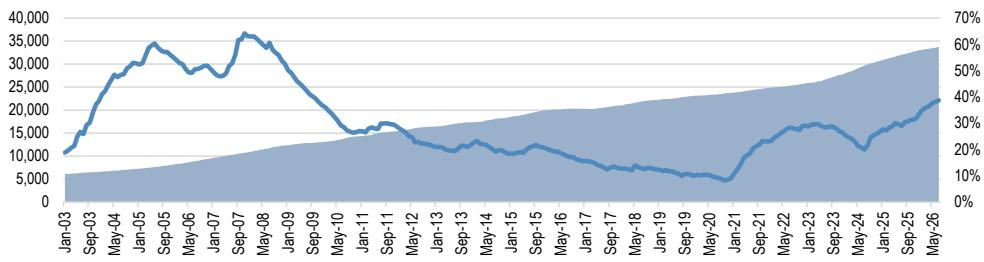

# JPM：不是短期抢运，而是供给洪峰，JPM看2027年集运

集装箱航运市场正经历一个罕见的“时间差”窗口。短期运费因补库和前置订单而上升，但JPM最新发布的2026年中供需更新报告提出了一个与市场情绪截然不同的判断：2027年，有效运力将同比扩张16%，叠加红海航线回归，运费将回落至疫情前均值附近。这不是一个周期性波动，而是一个结构性拐点的逼近。

报告的核心逻辑并不复杂：当前运费上涨的驱动力——抢运、补库、地缘扰动——都是暂时性的。而运力供给端的不确定性，正在以一种市场尚未充分定价的方式累积。

## 1. 运力交付节奏正在加速，而非延迟

市场上有一种观点认为，数据中心建设需求可能分流船用发动机产能，从而延缓新船交付。JPM明确否定了这一假设。报告指出，过去六个月的实际交付量不降反升，2027年的计划交付量自2026年初以来已进一步上调。发动机技术路径不同、造船订单已支付大额保证金，使得大规模延期或取消的历史概率极低。

更关键的数据是：当前手持订单占现有船队比例正快速逼近40%。在航运业历史上，这一比率一直是产能纪律的“反向指标”。当订单比超过30%，往往预示着未来2-3年的运力过剩不确定性。

> **KC评论：** 市场往往高估了供给端的“柔性”。造船订单的取消率历史上极低，而交付延期更多是船厂产能瓶颈导致的被动结果，而非主动调节。这份报告提醒读者，真正需要关注的是订单比这个前置指标，而非短期运费波动。

## 2. 红海回归与交付高峰叠加，2027年有效供给增长16%

红海绕航是过去两年支撑高运费的核心变量之一。JPM预计，从2027年一季度开始，集装箱船将逐步恢复通过苏伊士运河。马士基已在7月初宣布其Gemini联盟的一条亚欧航线结构性回归红海，这被视作行业转向的信号。

当绕航结束与交付高峰同步到来，有效运力增速将从2026年的3.5%跳升至2027年的16%，2028年再增加12%。而需求端，报告预计2026年运量增长4%，2027-2028年进一步节奏变化至2.5%。供需增速差将在2027年显著转负。

这里有一个尚未被充分讨论的问题：如果红海回归的时间点比预期更晚，或者交付出现局部延迟，2027年的供给冲击会被平滑多少？报告没有给出精确的不确定性测试，但方向判断是清晰的——即便出现延迟，相对增量依然巨大。

## 3. 运费回落路径：2028年可能低于疫情前均值

基于上述供需推演，JPM给出了明确的运费预测路径：2026年SCFI均价约1900美元/TEU（同比+20%），2027年降至约1100美元（同比-42%），2028年进一步降至900美元。疫情前SCFI的长期均值约为1000美元。

这意味着，除非出现新的、规模足够大的地缘事件，运费将从当前高位经历一个“阶梯式下移”的过程。报告特别强调，运费与供需差的统计关系在历史上非常稳健，没有证据表明这一关系已经断裂。

> **KC评论：** 900美元/TEU的2028年预测，隐含的前提是所有地缘溢价完全消失。但航运业从来不是“均衡市场”，尾部事件往往在预期最一致时出现。这份报告的价值不在于预测的精确度，而在于它清晰地展示了“没有新事件”情况下的基准路径——这对任何依赖运费定价的合同、库存和研究决策，都是一个必须正视的参照系。

## 报告尚未完全回答的关键问题

一个值得追问的维度是：船公司是否会通过主动拆船、减速航行或联盟运力管理来对冲供给冲击？JPM指出，今年迄今拆船量极低，而减速航行的空间在上一轮周期中已被大量使用。联盟的运力管控能力在手持订单高企时是否依然有效？报告没有给出明确结论，但这恰恰是读者需要持续跟踪的变量。

另一个未解问题是：需求端的“正常化”是否可能比预期更慢？如果全球贸易政策变化或补库周期延长，2027年的供需差可能没有报告假设的那么极端。但报告的逻辑链是自洽的——它假设的是回归长期趋势，而非调整情景。

对于关注航运市场定价、运费衍生品或相关供应链合约的读者而言，这份报告提供了一个清晰的基准情景。真正的考验不在于2026年的运费能涨多高，而在于2027年供给洪峰来临时，行业是否有足够的财务纪律和商业弹性来消化它。

For informational purposes only. Portions may be generated,translated,summarized,or edited with AI assistance based on source materials and may contain omissions or errors. Please verify independently. This is not investment,legal,tax,accounting,or other professional advice.

For informational purposes only. Portions may be generated,translated,summarized,or edited with AI assistance based on source materials and may contain omissions or errors. Please verify independently. This is not investment,legal,tax,accounting,or other professional advice.

