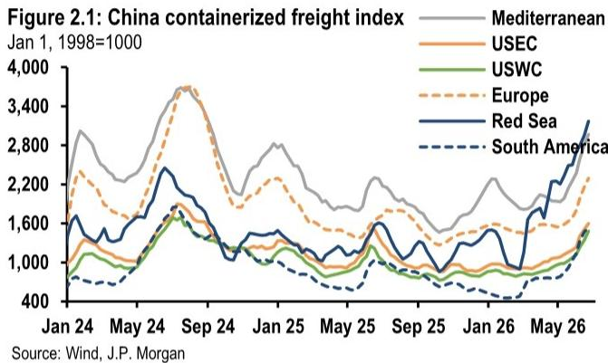
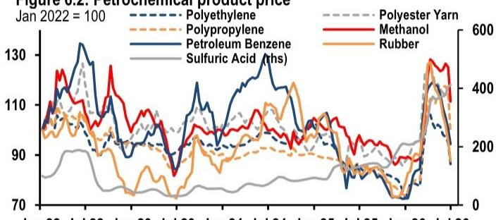
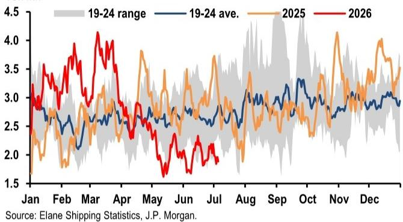

# JPM：降息窗口何时打开？JPM看出口超预期与汇率韧性

6月的高频数据呈现一幅“外热内温”的图景。JPM最新一期中国高频数据追踪报告显示，出口集装箱和散货船运量双双提速，但汽车销售、新房成交和部分工业品产量仍在调整。真正值得关注的，不是单月数据的起伏，而是政策节奏与实体需求之间正在形成的“时间差”。

这份报告覆盖了6月全月的港口、生产、销售、财政、货币、地产和通胀数据，信息密度极高。以下是我们提炼的三个核心洞察，以及一个报告尚未完全回答的关键问题。

## 1. 出口的“量价齐升”正在从假设变为现实

报告中最清晰的信号来自港口追踪。6月离港集装箱船载重吨同比增长8.5%，散货船增长10.1%，均较5月明显加速。剔除油轮后的离港总载重吨同比增速从5月的7.7%跃升至17.2%。

> **KC评论：** 这个数字比市场预期的更强劲。此前市场对出口的判断偏谨慎，主要担心价格竞争和需求走弱。但JPM的高频数据表明，6月出口量增长正在与运费上涨同时出现——CCFI至美西、美东航线两周内分别上涨20.6%和14.3%——这暗示出口企业正在获得更强的定价权。

但报告也留了一个伏笔：油轮到港量连续两个月下降超过30%，与能源价格回落形成对照。这究竟是需求结构变化还是短期扰动，需要后续数据验证。

## 2. 财政发力的“加速度”与“到位率”之间存在张力

6月政府债券发行1.138万亿元，与5月基本持平。但结构变化值得拆解：特别长期国债发行量从5月的1610亿元猛增至5720亿元，同比超过上年同期。这意味着财政部正在加速使用3月全国人大批准的剩余财政资源。

然而，报告明确指出“不确定性仍在于资金能否及时拨付到项目”。截至6月，中央国债发行进度仅为全年目标的40.2%，低于去年同期的50.8%。这暗示：财政子弹已经上膛，但扣动扳机的速度取决于项目储备和地方政府执行力。

> **KC评论：** 这不是一个“有没有钱”的问题，而是“项目能不能接得住”的问题。如果近期宏观环境变化趋势持续，JPM预计三季度财政部署将明显加快。对基建、设备更新相关行业而言，这是下半年最值得跟踪的变量。

## 3. 汽车与地产：两个“影响项”的修复轨迹正在分化

报告中的两组数据值得并列来看。乘用车零售6月同比下降21%，新能源车降幅收窄至7%。新房销售在30个主要城市同比下降7.3%，降幅较5月的1.4%明显扩大。但二手房销售同比增长12.3%，虽较5月的18%有所节奏变化，仍保持两位数增长。

汽车销售的下滑部分归因于以旧换新补贴降低、购置税减免退坡和燃料成本上升。新房与二手房的背离则暗示：市场并非没有购买力，而是买家对期房交付不确定性的担忧仍未消退。

## 报告尚未完全回答的关键问题：降息窗口何时打开？

报告提到，如果增长不确定性持续超过通胀不确定性，下半年降息的可能性在上升。但央行在6月底启动的隔夜逆回购操作并未披露利率，这被解读为政策利率仍将聚焦7天逆回购利率的信号。

一个值得追问的假设是：如果出口在量价两方面持续超预期，是否会削弱降息的紧迫性？报告没有给出明确判断，但指出美联储更偏鹰派的立场可能复杂化外部环境，而人民币汇率韧性为国内决策保留了空间。这意味着，降息与否的决定，最终取决于三季度初的宏观环境数据是否“足以触发政策反应”。

对读者而言，这份报告最有价值的不是单月预测，而是提供了一套跟踪逻辑：出口看港口吨位和运费，财政看专项债发行进度与项目到位率，货币看逆回购利率信号，地产看二手房成交量能否带动新房信心。用这套框架去观察7月的数据，会比等待官方统计更早看到方向。

For informational purposes only. Portions may be generated,translated,summarized,or edited with AI assistance based on source materials and may contain omissions or errors. Please verify independently. This is not investment,legal,tax,accounting,or other professional advice.

