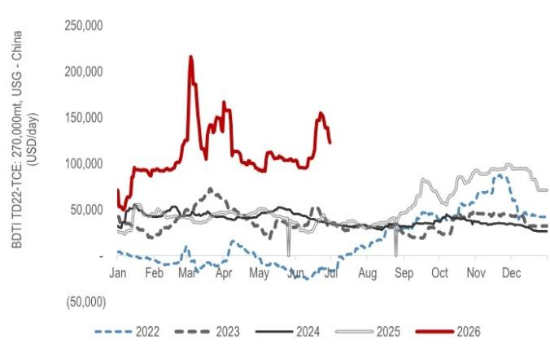
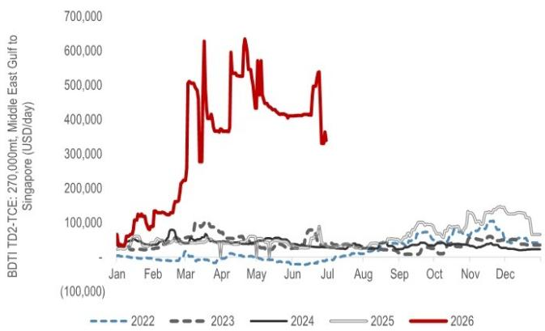
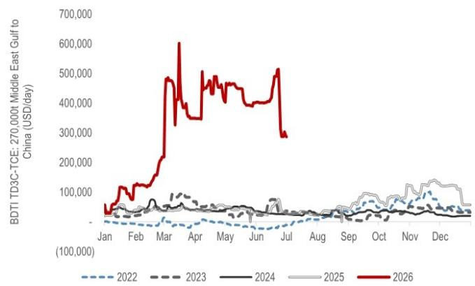
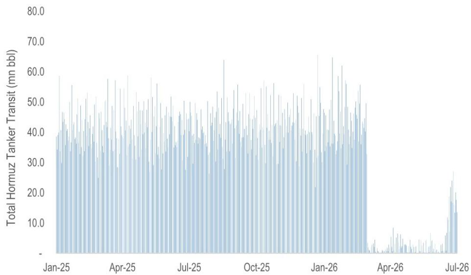
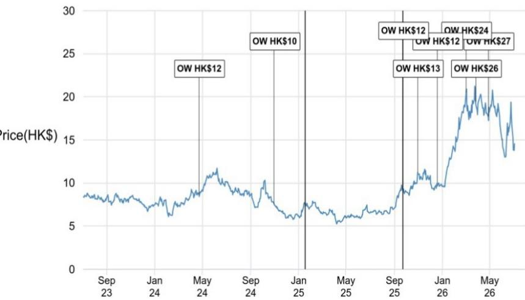

本材料无意向中国大陆读者分发，亦不构成在中国大陆境内提供证券投资咨询服务。未经JPM书面同意，不得转载、出售或重新分发本材料或其任何部分。

## 中国油轮运输观察

中国因素：需求节奏调整，而非趋势逆转

我们维持对中远海能（H股/A股）的积极观察，并继续关注其阶段性价格调整后的机会。本周，中远海能H股和A股分别回调14%和13%，表现弱于恒生指数（+3%）和沪深300指数（-1%），主要由于霍尔木兹海峡重新开放后，超大型油轮运价继续回归常态。尽管运价已从近期高点回落，但仍显著高于历史均值，且油轮总通行量仅恢复至冲突前水平的44%（10日移动平均），表明实物市场的正常化尚未完成。我们认为，近期的运价调整反映了海湾地区出口恢复与中国原油需求之间的暂时性错配，而非油轮基本面出现结构性变化。JPM大宗商品研究团队将此视为近期关键讨论点，但其基准情形仍预计中国原油进口将在2026年下半年逐步恢复。因此，在关注中国需求复苏节奏的同时，我们对中期油轮前景保持建设性看法。

- **运价继续回归常态，但仍处历史高位**：本周超大型油轮运价进一步走软，TD3C（霍尔木兹-中国）周环比下降32%至每日28.5万美元，TD2（霍尔木兹-新加坡）周环比下降42%至每日31.5万美元。大西洋航线也有所缓和，TD15（西非-中国）周环比下降27%至每日12.9万美元，TD22（美国湾-中国）下降22%至每日11.8万美元。尽管有所回调，所有主要超大型油轮航线运价仍较冲突前及中期历史均值（自2024年以来）高出1.7至7倍，表明运价市场基本面依然健康。

- **霍尔木兹海峡重新开放进程缓慢**：根据10日移动平均数据，通过霍尔木兹海峡的油轮总通行量（以桶计）已恢复至冲突前水平的44%，其中原油油轮通行量达到48%，成品油油轮通行量为26%。尽管船舶通行量持续改善，但仍远低于历史水平，表明海湾地区出口物流仍在正常化过程中，额外的运输能力尚未完全回归。

- **中国因素成为运价讨论焦点**：JPM大宗商品研究团队认为，中国通过减少原油进口和消耗库存，吸收了冲突带来的大部分供应中断。随着霍尔木兹海峡重新开放和海湾地区出口恢复，回归的原油量暂时超过了中国需求，形成了短期供应过剩，这或许可以解释为何原油价格和油轮运价均比预期更快走软。然而，该团队仍预计，随着中东官方售价下调、炼油利润改善以及战略石油储备补充，中国进口将在2026年下半年逐步恢复。

- **我们保持建设性看法**：我们认为，当前的运价疲软反映了时间上的错配，而非油轮基本面的结构性恶化。此后的关键催化因素应是中国原油进口的恢复，这很可能与海湾出口的进一步正常化同步发生。随着库存重建和海运原油贸易逐步恢复，我们预计运价将结构性高于历史均值，尽管短期内存在波动。

分析师认证及重要披露，包括非美国分析师披露，请参见第6页。

基础设施、工业与运输

Beatrice Lam AC

(852) 2800-8738

beatrice.lam@JPM.com

Karen Li, CFA

(852) 2800-8589

karen.yy.li@JPM.com

JPM证券（亚太）有限公司 / JPM经纪（香港）有限公司

- **主要风险**：中国原油进口出现更长时间的放缓，或炼厂开工率低于预期，可能延迟超大型油轮运价的恢复，尽管海湾出口有所改善。反之，更快的战略石油储备采购、更强的中国炼厂需求，或原油进口的更快反弹，将对运价和油轮公司估值形成支撑。

图1：超大型油轮即期收益：BDTI TD15-TCE：26万吨西非-中国，美元/天  
  
来源：克拉克森研究

图2：超大型油轮即期收益：BDTI TD22-TCE：27万吨，美国湾-中国，美元/天  
  
来源：克拉克森研究

图3：超大型油轮即期收益：BDTI TD2-TCE：27万吨，中东湾-新加坡，美元/天  
  
来源：克拉克森研究

图4：超大型油轮即期收益：BDTI TD3C-TCE：27万吨中东湾-中国，美元/天  
  
来源：克拉克森研究

图5：霍尔木兹海峡油轮（原油+成品油）通行量持续逐步恢复  
  
来源：克拉克森研究

## 其他相关报告：

- 中远海能（1138.HK/600026.SH）：有效运力偏紧支撑2026年盈利；风险转向2027年；关注中远海能H股阶段性机会（2025年12月19日）
- 中国油轮运输：委内瑞拉流量转移与霍尔木兹风险重估油轮运价——重申2026年强劲展望（2026年1月17日）
- 中国油轮运输：超大型油轮运价波动与伊朗相关消息下的公司估值波动——市场已计入哪些因素？（2026年2月2日）
- 中国油轮运输：如何看待年初至今的油轮TCE与公司估值热潮？印度和中国会回归旧有模式吗？（2026年2月24日）
- 中国油轮运输：伊朗冲突：约50%的海运原油面临风险——油轮市场即时收紧，持续时间决定结果（2026年3月2日）
- 中远海能（1138.HK/600026.SH）：炉边谈话要点（2月27日）：Sinokor、制裁与伊朗（2026年3月3日）
- 中远海能（1138.HK/600026.SH）：黑天鹅叠加：伊朗、合规收紧与市场整合重置超大型油轮盈利潜力；上调中远海能H/A股目标价并升级中远海能A股至积极观察（2026年3月3日）
- 中国油轮运输：霍尔木兹中断监测——第1周：运价因原油流动暂停而飙升（2026年3月10日）
- 中国油轮运输：专家电话会要点：霍尔木兹中断——船队收紧、航程延长、正常化放缓（2026年3月11日）
- 中国油轮运输：霍尔木兹中断监测——第2周：运价从极端高位回落，但结构性偏紧依然存在（2026年3月16日）
- 中国油轮运输：霍尔木兹中断监测——第2.7周：需求正在吸收成本冲击，支撑油轮盈利持续强劲（2026年3月20日）
- 中国油轮运输：霍尔木兹中断监测——第3周：市场低估了此次原油贸易中断的结构性程度（2026年3月23日）
- 中远海能（1138.HK/600026.SH）：2025年第四季度业绩因减值低于预期；核心业务符合预期，霍尔木兹驱动的盈利上行空间保持不变（2026年3月27日）
- 中远海能（1138.HK/600026.SH）：2025年第四季度业绩后简报要点——安全因素减少运力，运价上涨范围扩大至超大型油轮以外（2026年3月27日）
- 中国油轮运输：霍尔木兹中断监测——第4周：整合加强，运力受限——关注中远海能盈利兑现机会（2026年3月30日）
- 中国油轮运输：霍尔木兹中断监测——第5周：前往沙特的超大型油轮减少——中远海能零参与表明主动撤离，而非局势缓和（2026年4月6日）
- 中国油轮运输：停火是喘息，而非解决——油轮运输上行空间在各种情景下均存在，幅度因基准情形而异（2026年4月8日）
- 中国油轮运输：霍尔木兹中断监测——第6周：复活节期间事件频发——一周内从停火到封锁（2026年4月13日）
- 中国油轮运输：霍尔木兹中断监测——第7周：不拥挤，仍偏紧——选择性参与下的油轮市场（2026年4月19日）
- 中国油轮运输：霍尔木兹中断监测——第8周：霍尔木兹关闭持续——滞后阶段掩盖了潜在的收紧（2026年4月27日）
- 中国油轮运输：阿联酋放弃配额——油轮将在霍尔木兹重新开放后获得增量原油（2026年4月29日）
- 中国油轮运输：霍尔木兹中断监测——第9周：恐慌消退，运价回落——期权价值构建（2026年5月4日）
- 中国油轮运输：霍尔木兹中断监测——第10周：下一步走势取决于原油需求能否保持（2026年5月11日）
- 中国油轮运输：霍尔木兹中断监测——第11周：中远海能回升，影子船队风险积聚（2026年5月19日）
- 中国油轮运输：全球中国峰会要点：招商轮船认为霍尔木兹重新开放后超大型油轮TCE为每日13-15万美元（2026年5月21日）
- 中国油轮运输：霍尔木兹重新开放重回议程；是时候重新审视中远海能（2026年6月15日）

本报告讨论的公司（除非另有说明，本报告所有价格均为2026年7月3日收盘价）中远海能 - A股（600026.SS/人民币17.37元/积极观察），中远海能 - H股（1138.HK/港币14.55元/积极观察）

分析师认证：本报告封面以“AC”标注的研究分析师证明（或，若多位研究分析师主要负责本报告，则以“AC”标注的研究分析师分别就其在研究中涵盖的每个证券或发行人证明）：(1) 本报告中表达的所有观点准确反映了研究分析师对任何及所有标的证券或发行人的个人观点；(2) 研究分析师的薪酬中没有任何部分直接或间接地与本研究报告中表达的具体建议或观点相关。对于封面列出的所有韩国研究分析师（如适用），他们还根据KOFIA要求证明，研究分析师的分析是善意进行的，且观点反映了研究分析师本人的意见，未受到不当影响或干预。

除非另有说明，本报告中列出的所有作者均为独立撰写研究报告的研究分析师。在欧洲，本报告中可能显示行业专家（销售和交易）为联系人，但他们并非报告作者或研究部门成员。

## 重要披露

- 做市商/流动性提供者：JPM是中远海能 - A股、中远海能 - H股或相关实体金融工具的做市商和/或流动性提供者。
- 做市商/流动性提供者（香港）：JPM证券（亚太）有限公司和/或JPM经纪（香港）有限公司和/或其关联公司是中远海能 - A股、中远海能 - H股或相关实体及/或其权证或期权的做市商和/或流动性提供者，这些证券在香港联合交易所有限公司上市或交易。
- 实益所有权（1%或以上）：JPM实益拥有中远海能 - A股、中远海能 - H股或相关实体一类普通股股本的1%或以上。
- 客户：JPM目前拥有，或在过去12个月内拥有，以下实体作为客户：中远海能 - A股、中远海能 - H股或相关实体。
- 客户/非投资银行、证券相关：JPM目前拥有，或在过去12个月内拥有，以下实体作为客户，且提供的服务为非投资银行、证券相关：中远海能 - A股、中远海能 - H股或相关实体。
- 潜在投资银行报酬：JPM预计在未来三个月内从中远海能 - A股、中远海能 - H股或相关实体收取或寻求投资银行服务报酬。
- 非投资银行报酬已收：JPM在过去12个月内已从中远海能 - A股、中远海能 - H股或相关实体收取非投资银行产品或服务报酬。
- 债务头寸：JPM可能持有中远海能 - A股、中远海能 - H股或相关实体的债务证券头寸（如有）。

公司特定披露：JPM确实并寻求与其研究报告涵盖的公司开展业务。因此，读者应注意，该公司可能存在利益冲突，可能影响本报告的客观性。读者应将本报告仅视为做出投资决策的单一因素。重要披露，包括价格图表和信用意见历史表（如适用），可通过访问https://www.jpmm.com/research/disclosures、致电1-800-477-0406或发送电子邮件至research.disclosure.inquiries@JPM.com获取，适用于汇编报告及所有JPM涵盖的公司及某些非涵盖公司。

中远海能 - A股（600026.SS，600026 CH）价格  

<table><tr><td>日期</td><td>评级</td><td>价格（人民币）</td><td>目标价（人民币）</td></tr><tr><td>2024年4月23日</td><td>中性</td><td>16.51</td><td>18</td></tr><tr><td>2024年7月26日</td><td>中性</td><td>14.76</td><td>16</td></tr><tr><td>2024年10月31日</td><td>中性</td><td>13.19</td><td>13</td></tr><tr><td>2025年9月23日</td><td>中性</td><td>12.23</td><td>13</td></tr><tr><td>2025年10月31日</td><td>中性</td><td>13.53</td><td>14</td></tr><tr><td>2025年12月19日</td><td>中性</td><td>11.85</td><td>13</td></tr><tr><td>2026年3月3日</td><td>积极观察</td><td>22.64</td><td>28</td></tr><tr><td>2026年3月27日</td><td>积极观察</td><td>23.90</td><td>30</td></tr><tr><td>2026年4月28日</td><td>积极观察</td><td>21.50</td><td>32</td></tr></table>

来源：彭博财经有限合伙及JPM；价格数据已根据股票分割和股息进行调整。覆盖起始日期：2024年4月23日。所有股价均为前一个交易日收盘价。覆盖中断期：2025年1月17日至2025年9月22日。

中远海能 - H股（1138.HK，1138 HK）价格图表  

<table><tr><td>日期</td><td>评级</td><td>价格（港币）</td><td>目标价（港币）</td></tr><tr><td>2024年4月23日</td><td>积极观察</td><td>8.70</td><td>12</td></tr><tr><td>2024年10月31日</td><td>积极观察</td><td>7.57</td><td>10</td></tr><tr><td>2025年9月23日</td><td>积极观察</td><td>9.20</td><td>12</td></tr><tr><td>2025年10月31日</td><td>积极观察</td><td>11.22</td><td>13</td></tr><tr><td>2025年12月19日</td><td>积极观察</td><td>9.92</td><td>12</td></tr><tr><td>2026年3月3日</td><td>积极观察</td><td>20.50</td><td>24</td></tr><tr><td>2026年3月27日</td><td>积极观察</td><td>19.42</td><td>26</td></tr><tr><td>2026年4月28日</td><td>积极观察</td><td>17.73</td><td>27</td></tr></table>

来源：彭博财经有限合伙及JPM；价格数据已根据股票分割和股息进行调整。  
覆盖中断期：2025年1月17日至2025年9月22日。

图表显示JPM对这些股票的持续覆盖；当前分析师可能并未在整个期间内覆盖这些股票。JPM评级或指定：积极观察 = 预期该股票将跑赢研究分析师或研究分析师团队覆盖范围内的股票平均总回报；中性 = 预期该股票将与研究分析师或研究分析师团队覆盖范围内的股票平均总回报表现一致；消极观察 = 预期该股票将跑输研究分析师或研究分析师团队覆盖范围内的股票平均总回报。NR为未评级。在此情况下，JPM已移除该股票的评级及（如适用）目标价，原因包括缺乏充分的基本面依据，或出于法律、监管或政策原因。先前的评级及（如适用）目标价不应再被依赖。NR指定并非推荐或评级。部分覆盖股票有评级但无目标价；在此情况下，我们预期该股票将跑赢/表现一致/跑输研究分析师或研究分析师团队在相关区域覆盖范围内的股票平均总回报。在我们的亚洲（除澳大利亚和印度）及英国中小盘股研究中，每只股票的预期总回报是与基准国家市场指数的预期总回报进行比较，而非与研究分析师的覆盖范围进行比较。如果本报告的重要披露部分未显示，认证研究分析师的覆盖范围可在JPM网站https://www.JPMmarkets.com上找到。

覆盖范围：Lam, Beatrice：中集安瑞科（3899.HK）、中远海能 - A股（600026.SS）、中远海能 - H股（1138.HK）、亿航智能 - ADR（EH）、德昌电机 - H股（0179.HK）、太平洋航运 - H股（2343.HK）、卧龙电驱 - A股（600580.SS）、扬子江船业（控股）有限公司（YAZG.SI）

JPM股票研究评级分布，截至2026年4月4日

<table><tr><td></td><td>积极观察（买入）</td><td>中性（持有）</td><td>消极观察（卖出）</td></tr><tr><td>JPM全球股票研究覆盖*</td><td>51%</td><td>37%</td><td>12%</td></tr><tr><td>投行客户**</td><td>83%</td><td>79%</td><td>74%</td></tr><tr><td>JPMS股票研究覆盖*</td><td>49%</td><td>39%</td><td>13%</td></tr><tr><td>投行客户**</td><td>94%</td><td>93%</td><td>85%</td></tr></table>

\*请注意，由于四舍五入，百分比可能未加总至100%。

\*\*JPM在过去12个月内提供投资银行服务的“买入”、“持有”和“卖出”类别中各标的公司的百分比。

仅就FINRA评级分布规则而言，我们的积极观察评级属于报告评级类别；我们的中性评级属于持有评级类别；我们的消极观察评级属于报告评级类别。请注意，标有NR的股票未包含在上述表格中。此信息截至最近一个日历季度末。

股票估值与风险：有关涵盖公司或目标价的估值方法和风险，请参阅最新的公司特定研究报告，网址为http://www.JPMmarkets.com，联系主要分析师或您的JPM代表，或发送电子邮件至research.disclosure.inquiries@JPM.com。有关所用专有模型的重大信息，请参阅公司特定研究报告中的财务摘要和公司概况表，这些可在我们客户网站的公司页面上下载，网址为http://www.JPMmarkets.com。本报告还阐述了其中使用的重要基本假设。

## 研究交流历史：

过去12个月内JPM交流的历史记录可在http://www.JPMmarkets.com的研究与评论页面访问，您也可以按分析师姓名、行业或金融工具进行搜索。

分析师薪酬：负责编写本报告的研究分析师的薪酬基于多种因素，包括研究的质量和准确性、客户反馈、竞争因素以及公司整体收入。

非美国分析师注册：除非另有说明，本报告封面列出的非美国分析师是非美国JPM关联公司的员工，可能未在FINRA规则下注册为研究分析师，可能不是JPM证券有限责任公司的关联人士，并且可能不受FINRA规则2241或2242关于与涵盖公司沟通、公开露面以及研究分析师账户持有证券交易的限制。

## 其他披露

JPM是JPM及其全球子公司和关联公司的投资银行业务的营销名称。

英国MiFID FICC研究分拆豁免：英国客户应参考英国MiFID研究分拆豁免，了解JPM实施FICC研究豁免的详细信息以及相关FICC研究分类的指导。

除非相关法律特别允许，所有研究材料在提供给客户的同时，均可在我们的客户网站JPM Markets上获取。并非所有研究内容都会重新分发、通过电子邮件发送或提供给第三方聚合商。如需获取特定股票的所有研究材料，请联系您的销售代表。

本研究材料中对中国的任何长格式参考为：中国大陆；香港特别行政区（中国）；台湾（中国）；澳门特别行政区（中国）。

JPM可能不时撰写关于受美国、欧盟、英国或其他相关司法管辖区政府当局实施或管理的经济或金融制裁所针对的发行人或证券（受制裁证券）的文章。本报告中的任何内容均无意被解读为鼓励、促进、推动或以其他方式批准对受制裁证券的投资或交易。客户在做出投资决策时应了解自己的法律和合规义务。

本研究报告中讨论的任何数字或加密资产均受快速变化的监管环境影响。有关加密资产（包括比特币和以太坊）的相关监管建议，请参阅https://www.JPM.com/disclosures/cryptoasset-disclosure。

本研究报告的作者可能未获许可在您的司法管辖区开展受监管活动，如果未获许可，则不会声称自己能够这样做。

交易所交易基金（ETF）：JPM证券有限责任公司（“JPMS”）是几乎所有美国上市ETF的授权参与者。如果本报告中提及任何ETF，JPMS可能因分销这些ETF股份而赚取佣金和基于交易的报酬，并可能因执行其他交易相关服务（例如向ETF股份的卖空者提供证券借贷）而赚取费用。JPMS还可能为ETF本身提供服务，包括担任ETF的经纪商或交易商。此外，JPMS的关联公司可能为ETF提供服务，包括信托、托管、管理、借贷、指数计算和/或维护及其他服务。

期权和期货相关研究：如果本文所含信息涉及期权或期货相关研究，则该信息仅提供给已收到适当期权或期货风险披露文件的人士。请联系您的JPM代表或访问https://www.theocc.com/components/docs/riskstoc.pdf获取期权清算公司的标准化期权的特征和风险副本，或访问https://www.finra.org/sites/default/files/2020-08/Security_Futures_Risk_Disclosure_Statement_2020.pdf获取证券期货风险披露声明副本。

银行间拆借利率（IBOR）及其他基准利率的变更：某些利率基准目前或未来可能受到持续的国际、国内及其他监管指导、改革和改革提案的影响。更多信息，请查阅：https://www.JPM.com/global/disclosures/interbank_offered_rates

私人银行客户：如果您作为JPM及其子公司（“JPM私人银行”）提供的私人银行业务的客户接收研究，则研究由JPM私人银行提供给您，而非JPM任何其他部门，包括但不限于JPM企业与投资银行及其全球研究部门。

负责制作和分发研究的法律实体：在编写本材料的Reg AC研究分析师姓名下方标识的法律实体是负责制作本研究的法律实体。如果多位Reg AC研究分析师编写了本材料，且其姓名下方标识了不同的法律实体，则这些法律实体共同负责制作本研究。如果分析师姓名下列出了多个法律实体，则除非另有说明，第一个法律实体负责制作。来自不同JPM关联公司的研究分析师可能对本材料的制作做出了贡献，但可能未获许可在您的司法管辖区开展受监管活动（并且不会声称自己能够这样做）。除非下文法律实体披露中另有说明，本材料已由负责制作的法律实体分发，或者如果分析师姓名下列出了多个法律实体，则第一个法律实体将负责分发。如果您有任何疑问，请联系您所在司法管辖区的相关研究分析师或您所在司法管辖区已分发本研究材料的实体。

## 法律实体披露及国家/地区特定披露：

阿根廷：JPM银行布宜诺斯艾利斯分行受阿根廷中央银行（BCRA）和阿根廷国家证券委员会（CNV - ALYC y AN Integral N°51）监管。

澳大利亚：JPM证券澳大利亚有限公司（JPMSAL）（ABN 61 003 245 234/AFS牌照号：238066）受澳大利亚证券和投资委员会监管，是ASX有限公司的市场参与者、ASX Clear Pty Limited的清算和结算参与者以及ASX Clear（Futures）Pty Limited的清算参与者。本材料由JPMSAL或其代表在澳大利亚仅向“批发客户”（定义见2001年公司法第761G条）发行和分发。涵盖的所有金融产品列表可通过访问https://www.jpmm.com/research/disclosures获取。JPM寻求覆盖与国内外读者基础相关的所有全球行业分类标准（GICS）行业以及各种市值规模的公司。如适用，在对标的公司进行公开尽职调查过程中，研究分析师团队有时可能通过公司接触（如实地考察、与公司代表讨论、管理层演示等）进行此类尽职调查。JPMSAL发布的研究已按照JPM澳大利亚研究独立性政策编制，该政策可通过以下链接获取：JPM澳大利亚 - 研究独立性政策。

巴西：JPM银行受巴西证券交易委员会（CVM）和巴西中央银行监管。JPM监察员：0800-7700847 / 0800-7700810（听障人士）/ ouvidoria.jp.morgan@jpmchase.com。

加拿大：JPM证券加拿大有限公司是一家注册投资交易商，受加拿大投资监管组织和安大略省证券委员会监管，是加拿大交易所的参与会员。本材料由JPM证券加拿大有限公司或其代表在加拿大分发。

智利：Inversiones JPM Limitada是一家在智利注册的未受监管实体。

中国：JPM证券（中国）有限公司已获中国证监会批准开展证券投资咨询业务。

哥伦比亚：JPM银行哥伦比亚分行受哥伦比亚金融监管局（SFC）监管。本材料中提及由哥伦比亚境外实体提供的产品或服务，仅用于描述目的。此类引用不构成，也不应被解释为在哥伦比亚境内进行促销活动或提供金融产品或服务，定义见适用的哥伦比亚法规。

迪拜国际金融中心（DIFC）：JPM银行迪拜分行受迪拜金融服务管理局（DFSA）监管，其注册地址为迪拜国际金融中心 - The Gate，西翼，3层和9层，PO Box 506551，迪拜，阿联酋。本材料由JPM银行迪拜分行向根据DFSA规则被视为专业客户或市场对手方的人士分发。

欧洲经济区（EEA）：除非另有说明，研究在EEA由JPMSE（“JPM SE”）分发，JPM SE是一家由联邦金融监管局（BaFin）授权作为信贷机构的实体，并受BaFin、德国中央银行（Deutsche Bundesbank）和欧洲中央银行（ECB）共同监管。JPM SE是一家总部位于法兰克福的公司，注册地址为TaunusTurm, Taunustor 1, Frankfurt am Main, 60310, Germany。本材料已在EEA向根据MiFID II第4条第1款第10项及附件II及其在各自母国的实施被视为专业读者（或同等资格）的人士（“EEA专业读者”）分发。非EEA专业读者不得依据或依赖本材料。本材料相关的任何投资或投资活动仅面向EEA相关人士，并将仅与EEA相关人士进行。

香港：JPM证券（亚太）有限公司（CE编号AAJ321）受香港金融管理局和香港证券及期货事务监察委员会监管，JPM经纪（香港）有限公司（CE编号AAB027）受香港证券及期货事务监察委员会监管。JPM银行香港分行（CE编号AAL996）受香港金融管理局和证券及期货事务监察委员会监管，根据美国法律组建，承担有限责任。如果本材料的分发在香港属于受监管活动，则本材料由JPM证券（亚太）有限公司和/或JPM经纪（香港）有限公司在香港分发。

印度：JPM印度私人有限公司（企业识别号 - U67120MH1992FTC068724），注册办事处位于JPM大厦，Off. C.S.T. Road, Kalina, Santacruz - East, Mumbai – 400098，在印度证券交易委员会（SEBI）注册为“研究分析师”，注册号INH000001873。JPM印度私人有限公司还在SEBI注册为印度国家证券交易所和孟买证券交易所的会员（SEBI注册号 – INZ000239730）以及商人银行家（SEBI注册号 - MB/INM000002970）。电话：91-22-6157 3000，传真：91-22-6157 3990，网站：http://www.jpmipl.com。JPM银行孟买分行已获得印度储备银行（RBI）许可（许可证号53/许可证号BY.4/94；SEBI - IN/CUS/014/ CDSL : IN-DP-CDSL-444-2008/ IN-DP-NSDL-285-2008/ INBI00000984/ INE231311239），作为印度的持牌商业银行，这是其允许在印度开展银行业务及其他印度银行分行可从事活动的主要许可证。对于非本地研究材料，本材料不由JPM印度私人有限公司在印度分发。合规官：Ashutosh Sharma；ashutosh.j.sharma@jpmchase.com；+912261575002。投诉官：Ramprasadh K，jpmipl.research.feedback@JPM.com；+912261573000。SEBI授予的注册和NISM的认证绝不保证中介机构的业绩或向读者提供任何回报保证。请访问条款和条件及最重要条款和条件（MITC）。年度合规审计报告可在http://www.jpmipl.com/#research获取。

印度尼西亚：PTJPM证券印度尼西亚是印度尼西亚证券交易所的会员，并受金融服务管理局（OJK）注册和监管。

韩国：JPM证券（远东）有限公司首尔分行是韩国交易所（KRX）的会员。JPM银行首尔分行是外国银行（JPM银行）在韩国的分行。两家实体均受金融服务委员会（FSC）和金融监督院（FSS）监管。对于非宏观研究材料，该材料由JPM证券（远东）有限公司首尔分行在韩国分发。

日本：JPM证券日本有限公司和JPM银行东京分行受日本金融厅监管。

马来西亚：本材料由JPM证券（马来西亚）有限公司（18146-X）在马来西亚发行和分发，该公司是马来西亚交易所的参与组织，并持有马来西亚证券委员会颁发的资本市场服务牌照。

墨西哥：JPM金融集团旗下JPM证券公司是墨西哥证券交易所（Bolsa Mexicana de Valores）和机构证券交易所（Bolsa Institucional de Valores）的会员，并获授权由国家银行和证券委员会（Comisión Nacional Bancaria y de Valores）作为经纪交易商。

新西兰：本材料由JPMSAL在新西兰仅向“批发客户”（定义见2013年金融市场行为法）发行和分发。JPMSAL已根据2008年金融服务提供商（注册和争议解决）法注册为金融服务提供商。

菲律宾：JPM证券菲律宾公司是菲律宾证券交易所的交易参与者，也是菲律宾证券清算公司和菲律宾读者保护基金的会员。它受证券交易委员会监管。

新加坡：本材料由JPM证券新加坡私人有限公司（JPMSS）[MDDI (P) 057/08/2025 及公司注册号：199405335R] 和/或JPM银行新加坡分行（JPMCB Singapore）在新加坡发行和分发，两者均受新加坡金融管理局监管。JPMSS是新加坡交易所证券交易有限公司的会员。本材料仅向符合证券及期货法（第289章）第4A条定义的认可读者、专家读者和机构读者在新加坡发行和分发。本材料无意向任何零售读者或不符合“认可读者”、“专家读者”或“机构读者”定义的其他读者发行或分发。新加坡的接收者应就本材料引起或与之相关的任何事宜联系JPMSS或JPMCB Singapore。

南非：JPM南非股票有限公司和JPM银行约翰内斯堡分行是约翰内斯堡证券交易所的会员，并受金融服务行为监管局（FSCA）监管。

台湾：JPM证券（台湾）有限公司是台湾证券交易所的参与者（公司型），并受台湾证券期货局监管。与股票证券相关的材料由JPM证券（台湾）有限公司在台湾发行和分发，受限于台湾适用法律法规的许可范围。如果JPM证券（台湾）有限公司制作关于非台湾证券交易所或台北交易所上市证券（“非台湾上市证券”）的研究材料，这些材料不构成台湾适用法规下的证券推荐，并且为免生疑问，JPM证券（台湾）有限公司不担任非台湾上市证券的经纪商。根据证券商受托买卖有价证券管理规则第7-1条第2项（经修订或补充）和/或其他适用法律法规，请注意，除非本材料“重要披露”中另有披露，本材料的接收者不得从事与本材料相关的可能产生利益冲突的任何活动。

泰国：本材料由JPM证券（泰国）有限公司在泰国发行和分发，该公司是泰国证券交易所的会员，并受财政部和证券交易委员会监管。注册地址为548 One City Center Building, 50th Floor, Ploenchit Road, Lymphini, Pathum Wan, Bangkok 10330。

英国：研究由JPM证券有限公司（“JPMS plc”）在英国制作，JPMS plc是伦敦证券交易所的会员，并受审慎监管局授权及受金融行为监管局和审慎监管局监管；或由JPM市场有限公司（“JPMML Ltd”）制作，JPMML Ltd受金融行为监管局授权和监管。除非另有说明，本材料由JPMS plc在英国分发，并在英国仅面向：(a) 具有投资相关事务专业经验的人士，属于2005年金融服务和市场法（金融促销）命令（“FPO”）第19(5)条；(b) FPO第49条所述人士（高净值公司、非法人协会或合伙企业、高价值信托的受托人等）；或(c) 可以合法接收此通讯的任何其他人；所有此类人士称为“英国相关人士”。非英国相关人士不得依据或依赖本材料。本材料相关的任何投资或投资活动仅面向英国相关人士，并将仅与英国相关人士进行。JPMEMEA关于预防和避免研究制作相关利益冲突的政策描述可在以下链接找到：JPMEMEA - 研究独立性政策。

美国：JPM证券有限责任公司（“JPMS”）是纽约证券交易所、FINRA、SIPC和NFA的会员。JPM银行是FDIC的会员。非美国关联公司发布的材料由JPMS在美国分发，JPMS对其内容承担责任。

一般信息：可根据要求提供更多信息。本材料中的信息来自被认为可靠的来源。尽管已采取一切合理谨慎措施确风险自担材料中陈述的事实准确，且其中包含的预测、意见和预期公平合理，但JPM及其关联公司和/或子公司（统称“摩根
