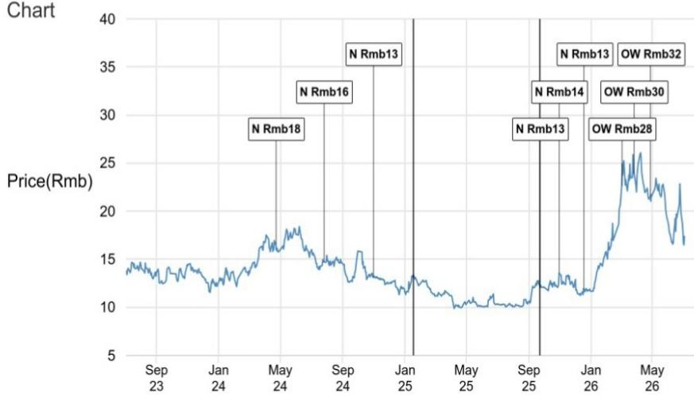
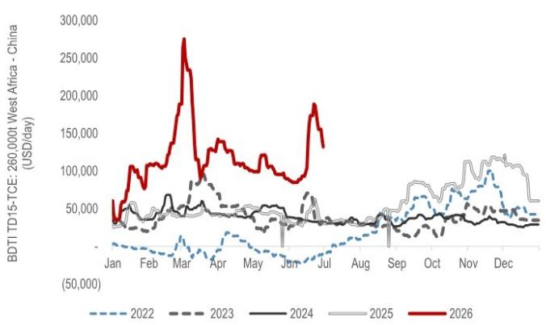

# The China Tanker Thesis Is Delayed, Not Derailed — Why the Current Freight Correction Is a Timing Mismatch, Not a Structural Breakdown

The sharp correction in VLCC freight rates over the past week has triggered a disproportionate selloff in tanker equities, with Cosco Shipping Energy Transport (CSET) shares falling 13-14% even as broader equity markets held steady. This divergence reflects a market that has conflated short-term normalization with long-term deterioration. The thesis is not broken; it is merely experiencing a temporal dislocation between supply normalization and demand recovery.

For observers who understand the mechanics of the tanker market, the current weakness is precisely the kind of dislocation that creates opportunities in structurally tight markets. The reopening of the Strait of Hormuz has allowed Gulf export volumes to recover faster than Chinese crude import demand, creating a temporary surplus of available barrels that has pushed spot rates down from their crisis peaks. But this is a mismatch of timing, not a collapse of fundamentals.

The evidence is clear: total tanker traffic through Hormuz has recovered to only 44% of pre-conflict levels by barrel capacity, with crude tanker transits at 48% and product tanker transits at just 26%. Physical market normalization remains incomplete. Meanwhile, the structural factors that drove rates to historic highs — fleet constraints, sanctions tightening, and the permanent removal of shadow fleet capacity — have not reversed. They have simply been temporarily masked by the lag in Chinese demand.

This article argues that the current freight correction represents an opportunity for those who can distinguish between cyclical noise and structural change. The bull case for tanker shipping rests on the interaction of three forces: the incomplete normalization of Gulf export logistics, the inevitable recovery in Chinese crude imports, and the enduring tightness in effective fleet supply. Each of these forces remains intact.

## The Hormuz Reopening Has Created a False Sense of Normalization in Freight Markets

The most dangerous mistake an observer can make in the current environment is to extrapolate the past week's rate declines into a permanent trend. VLCC spot earnings on the benchmark TD3C route from Hormuz to China fell 32% week-over-week to $285,000 per day, while the TD2 route to Singapore declined 42% to $315,000 per day. Atlantic Basin routes also moderated, with West Africa-to-China rates easing 27% and US Gulf-to-China rates declining 22%.

These percentage declines sound dramatic, and they are — relative to the extreme highs of the crisis period. But context is everything. Every major VLCC route remains between 1.7 and 7 times above pre-conflict historical averages and well above the medium-term averages since 2024. A rate of $285,000 per day is not a sign of market weakness; it is a sign of a market that has moved from extraordinary to merely excellent.

The real story is not the decline from crisis peaks but the persistence of rates far above what would be expected in a normalized market. This persistence indicates that the underlying supply-demand balance remains structurally tight. The Hormuz reopening has allowed some vessels to return to service, but the flow of traffic remains constrained by the cautious behavior of shipowners, the lingering effects of sanctions enforcement, and the permanent loss of shadow fleet capacity that cannot be easily replaced.

What the market is witnessing is a normalization from panic pricing to equilibrium pricing, not a collapse from equilibrium to distress. The distinction is critical for decision-making.

## China's Demand Recovery Is the Missing Catalyst, and It Is Coming — But on a Different Timeline Than Markets Expect

The central analytical question for tanker observers has shifted from supply disruption to demand recovery. The commodities research team at the global investment bank behind this report identifies China as "the key freight debate," and for good reason. During the height of the Hormuz disruption, China absorbed much of the supply shock by reducing crude imports and drawing down inventories. This was a rational response to crisis conditions, but it created a demand hole that now must be filled.

As Hormuz reopens and Gulf exports recover, returning barrels are temporarily outpacing Chinese demand, creating a near-term surplus that explains why both crude prices and tanker freight have softened more quickly than many expected. This is the classic pattern of a supply recovery that runs ahead of demand normalization — a timing mismatch that will correct itself as Chinese import demand recovers.

The base case from the commodities research team expects Chinese crude imports to recover through the second half of 2026. Several specific catalysts support this view: lower Middle East official selling prices are improving the economics of seaborne crude relative to domestic alternatives; improving refinery margins are incentivizing higher runs; and the strategic petroleum reserve remains a potential source of incremental demand as China replenishes stocks drawn down during the crisis.

The key insight is that the recovery in Chinese demand is not a question of "if" but "when." The mechanisms that will drive it are already in place. What remains uncertain is the precise timing and magnitude of the rebound. This uncertainty creates volatility, but it also creates opportunity for those who can look through the near-term noise.

## The Structural Tightness in Effective Fleet Supply Has Not Reversed — It Has Been Temporarily Masked

Perhaps the most underappreciated aspect of the current market is that the structural factors supporting elevated freight rates have not changed. The Hormuz reopening has allowed some vessels to transit the strait, but the effective supply of tanker capacity remains constrained by multiple forces that will not quickly reverse.

First, the shadow fleet — vessels operating outside the conventional insurance and regulatory framework — has been permanently disrupted. Many of these vessels were used to transport Iranian, Venezuelan, and Russian crude under sanctions. The combination of tighter enforcement, higher compliance costs, and the reputational risk of operating in the shadow market has removed a significant portion of the global tanker fleet from effective service. These vessels will not return to the compliant market quickly, if at all.

Second, the consolidation trend in the tanker industry continues to accelerate. Larger, better-capitalized operators are acquiring smaller players, and the resulting market structure is more disciplined in terms of capacity deployment. This consolidation reduces the likelihood of a destructive price war and supports higher equilibrium freight rates.

Third, the experience of the Hormuz crisis has fundamentally changed the risk calculus for shipowners. Even as the immediate threat recedes, the memory of the disruption and the possibility of future geopolitical shocks will keep owners cautious about deploying vessels into high-risk areas or committing to long-term charters at rates that do not adequately compensate for tail risk.

The current freight correction reflects a temporary release of pent-up supply as vessels that were trapped outside the strait finally reach their destinations. It does not reflect a fundamental easing of the supply constraints that will define the market through 2026 and into 2027.

## What the Report Does Not Fully Answer: The Duration of the Demand-Supply Mismatch and the Role of Strategic Reserves

For all its analytical rigor, the report leaves several critical questions unresolved — and these are precisely the questions that will determine whether the current correction is an opportunity or a warning sign.

The most important unknown is the duration of the timing mismatch between Gulf export recovery and Chinese demand recovery. The report's base case expects Chinese imports to recover through the second half of 2026, but this is a forecast, not a certainty. What happens if Chinese refinery runs remain weak for longer than expected? What if the strategic petroleum reserve replenishment is delayed or scaled back? What if lower Middle East official selling prices do not translate into higher import volumes as quickly as modeled?

The report also does not fully address the second-order effects of the demand recovery on tanker market structure. If Chinese imports recover strongly, will the additional barrels be sourced from the Atlantic Basin, lengthening voyage distances and absorbing more tanker capacity? Or will the incremental supply come from the Middle East, keeping voyage distances shorter and potentially limiting the positive impact on ton-mile demand?

Finally, the report leaves open the question of how the market will rebalance if the timing mismatch persists. Will freight rates need to fall further to encourage storage and discourage vessel supply? Or will the structural tightness in effective fleet capacity prevent rates from declining below a certain floor? The answer to this question has profound implications for the risk-reward profile of tanker equities at current valuations.

These are not weaknesses in the report's analysis. They are honest acknowledgments of the uncertainty inherent in forecasting a market that is being reshaped by geopolitical forces, policy decisions, and behavioral changes that have no clear historical precedent.

## A Decision Framework for Observers: How to Navigate the Current Dislocation

For those trying to make sense of the current market, the following framework can help distinguish between noise and signal.

First, separate the cyclical from the structural. The current freight correction is cyclical — it reflects the temporary oversupply of barrels as Gulf exports recover faster than Chinese demand. The structural factors supporting the tanker market — fleet constraints, shadow fleet disruption, industry consolidation, and geopolitical risk premia — remain intact. If you believe the structural factors are more durable than the cyclical mismatch, the current correction is an opportunity.

Second, focus on the catalysts that will resolve the timing mismatch. The most important leading indicator is Chinese crude import data. Watch for signs of inventory rebuilding, higher refinery runs, and strategic reserve purchases. The second most important indicator is the pace of Gulf export normalization. As Hormuz traffic continues to recover, the incremental supply of barrels will eventually be absorbed by recovering demand. The question is whether the absorption happens smoothly or with further volatility.

Third, assess the downside protection. At current equity valuations, how much of the freight correction is already priced in? If the market has already discounted a prolonged period of weak rates, then even a modest recovery in Chinese demand could trigger a significant re-rating. Conversely, if the market is still assuming a rapid recovery, further downside is possible.

Fourth, consider the asymmetry of outcomes. In the bullish scenario — Chinese demand recovers as expected, Gulf exports normalize fully, and structural supply tightness persists — freight rates could re-accelerate significantly from current levels. In the bearish scenario — Chinese demand remains weak, Gulf exports continue to grow, and supply loosens — rates could fall further, but the structural factors provide a floor that did not exist in previous cycles. The asymmetry favors the upside.

## The Full Picture Requires Deeper Data — Join the Community to Read the Report and Review the Original Charts

The analysis presented here draws on the detailed research of a global investment bank's transport and commodities teams, but it cannot capture the full richness of the data and the nuance of the scenarios that are essential for informed decision-making. The original report includes charts showing VLCC spot earnings across all major routes, the gradual recovery of Hormuz tanker transits, and the historical context that puts the current correction in perspective.

These charts are not decorative. They are analytical tools that reveal patterns invisible in the raw data. The recovery in Hormuz transits, for example, looks different when viewed as a 10-day moving average of barrel capacity than when viewed as a simple vessel count. The relationship between Gulf exports and Chinese imports becomes clearer when plotted against the trajectory of official selling prices and refinery margins.

For serious observers who want to build their own conviction on the tanker thesis, the full report provides the granularity that this article necessarily compresses. It includes the detailed assumptions behind the commodities team's base case, the scenario analysis that tests the sensitivity of the thesis to different demand outcomes, and the specific valuation framework that supports the report's view on CSET.

Join the community to read the full report and review the original charts.

---

*For informational purposes only. Portions may be generated, translated, summarized, or edited with AI assistance based on source materials and may contain omissions or errors. Please verify independently. This is not professional advice.*

For informational purposes only. Portions may be generated, translated, summarized, or edited with AI assistance based on source materials and may contain omissions or errors. Please verify independently. This is not professional advice.

