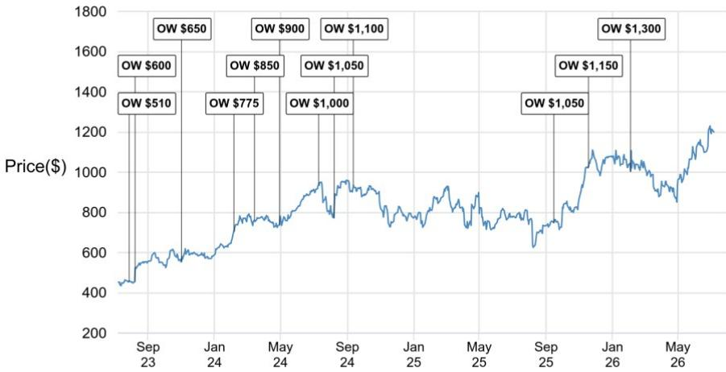
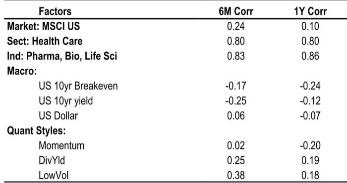
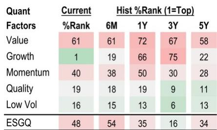

# Eli Lilly Is Not Just Beating Estimates: It Is Reshaping the Incretin Market's Center of Gravity

The second quarter of 2026 is shaping up to be a defining inflection point for Eli Lilly, and the numbers only tell part of the story. With total sales expected to reach $20.7 billion — approximately $300 million above consensus — and earnings per share of $8.85, Lilly is demonstrating something more significant than operational excellence. It is proving that the incretin market's growth has not peaked but rather shifted geography.

The conventional narrative holds that Lilly's obesity franchise is maturing in the United States and that international expansion will be gradual. A careful reading of the data suggests the opposite is true. The international ramp of Mounjaro is accelerating faster than consensus models anticipate, and the US obesity market is entering a new phase of expansion driven by Medicare coverage that began on July 1. These two forces, operating simultaneously, create a compound effect that most forecasts have not fully captured.

This matters because the market is pricing Lilly as if its best days are behind it. The stock trades at roughly 33 times forward earnings — a premium to large-cap pharma but a discount to what a company compounding at 30% revenue growth with expanding margins should command. The gap between where estimates sit and where the business is heading is the source of the next leg of upside.

## The International Mounjaro Ramp Is Being Systematically Underestimated by Consensus

The most consequential analytical error in current sell-side models concerns the trajectory of Mounjaro outside the United States. Consensus projections assume a dramatic deceleration in sequential quarterly growth — roughly $200 million per quarter for the remainder of 2026, compared to the $1 billion per quarter of sequential growth the product has delivered over the past year. This assumption is not conservative; it is structurally inconsistent with the product's current trajectory.

Lilly has already captured more than 50% market share in the ex-US incretin market. Yet global penetration rates remain in the single digits. The combination of dominant market position and massive untapped addressable demand creates a growth dynamic that linear forecasting models will systematically miss. The international business is not entering a plateau phase; it is entering the steepest portion of its adoption curve.

For the second quarter, international Mounjaro sales are estimated at $4.6 billion, a figure that the analysis itself describes as conservative. The full-year estimate of $18.7 billion implies a second-half acceleration that is plausible given the product's demonstrated momentum. The question observers should be asking is not whether Lilly will hit these numbers but whether the consensus ramp is too slow by a factor of two or three.

## The US Obesity Market Has a Structural Growth Catalyst That Most Models Ignore

The domestic obesity market has been the primary driver of Lilly's valuation, and for good reason. Injectable market prescription growth is running at nearly 90% year-over-year. Zepbound is estimated to generate $4.7 billion in second-quarter sales, $140 million above consensus, with pricing remaining stable at approximately $540 per prescription.

What the market has not fully priced is the Medicare coverage change that took effect on July 1. Zepbound is now available to Medicare beneficiaries, and while the initial pricing is expected to be lower at roughly $245 per prescription, the volume implications are enormous. The Medicare population represents the largest concentrated pool of untreated obesity patients in the developed world. Even modest penetration rates will generate revenue volumes that offset the pricing compression.

The second-half pricing dynamics are worth watching closely. The analysis assumes Zepbound pricing declines to approximately $490 per prescription by the fourth quarter, reflecting Medicare mix, CVS formulary inclusion starting October 1, and normal seasonal patterns. But the volume response to Medicare coverage may exceed expectations, creating a scenario where total revenue accelerates even as per-unit pricing moderates. This is the opposite of a margin squeeze; it is a volume-driven earnings expansion.

## Operating Margin Expansion Is the Unappreciated Earnings Driver

The revenue story is compelling, but the earnings story is even more powerful. Gross margins are expected to contract approximately 180 basis points year-over-year in the second quarter, driven by manufacturing infrastructure slack returning to normal levels and lower pricing in the incretin business. This sounds like a headwind. It is not.

The gross margin contraction is more than offset by operating leverage in selling, general, and administrative expenses. The result is an operating margin expansion to approximately 47.5%, representing 160 basis points of improvement year-over-year. This pattern — gross margin compression paired with operating margin expansion — is the hallmark of a business that has crossed the scale threshold where fixed cost absorption becomes a structural advantage.

For the full year, operating margins are expected to reach 47.6%, expanding to 50.7% by 2027 and 52.4% by 2028. These are pharmaceutical industry best-in-class margins, and they are achievable because Lilly's incretin franchise has a cost structure that improves with volume rather than deteriorating. The manufacturing investments that depressed gross margins in the near term are creating the capacity that will drive margin expansion for years.

The implication is straightforward: if revenue exceeds consensus by even a modest margin, the earnings upside will be disproportionate because the incremental revenue flows through to the bottom line at very high contribution margins. The analysis explicitly notes that top-line upside would largely fall to the bottom line, and the full-year EPS estimate of $36.60 is already $0.27 above consensus.

## The Pipeline Creates a Multi-Product Incretin Franchise That Extends the Growth Runway

The most strategically significant development in the second half of 2026 will be the clinical data readouts that could redefine the competitive landscape. The elora plus tirzepatide data, expected at the European Association for the Study of Diabetes meeting in late September, has the potential to be the most impactful catalyst of the year.

Abstract data suggests very impressive efficacy at 16 to 32 weeks, though tolerability data is pending. If the safety profile is acceptable, this combination therapy could represent a meaningful improvement over Zepbound's current best-in-class profile. Combined with the recent retatrutide phase 3 results and strong monotherapy eloralintide data, Lilly is assembling a portfolio of next-generation incretin programs that extend its competitive moat well beyond the patent life of Zepbound.

This is not a single-product story with a known expiration date. It is a platform story where each successive generation of therapy builds on the learnings and manufacturing capabilities of the previous one. The $200 billion plus incretin market is expanding, and Lilly is positioned to capture the majority of that expansion across multiple product cycles.

## What the Report Does Not Fully Answer: The Foundayo Trajectory and the Medicare Pricing Overhang

For all its analytical rigor, the analysis leaves two critical questions unresolved. The first concerns Foundayo, Lilly's next-generation obesity therapy. The second-quarter contribution is expected to be minimal at roughly $100 million, including modest stocking benefits. The analysis assumes Foundayo will ramp steadily throughout the year, with a more significant inflection in 2027 and beyond as the product launches in over 40 international markets.

But the early launch dynamics are opaque. The number of patients currently on therapy, the conversion rate from sampling to paid prescriptions, and the promotional intensity are all unknown variables that could swing the outlook significantly. If Foundayo demonstrates faster-than-expected adoption, the revenue estimates for 2027 and 2028 could prove conservative. If adoption is sluggish, the pipeline story loses some of its luster.

The second unresolved question concerns Medicare pricing dynamics for Mounjaro in 2027. The Centers for Medicare and Medicaid Services' BRIDGE program for Zepbound has been extended through the end of 2027, potentially delaying lower price dynamics for Mounjaro with Part D plan sponsors. This creates a favorable near-term tailwind, but it also introduces uncertainty about the pricing trajectory once the program ends. The market will need clarity on how Lilly manages the transition from the BRIDGE program to standard Medicare pricing before it can fully discount the long-term margin profile.

## A Decision Framework for Observers Assessing Lilly's Risk-Reward

The analysis supports a clear framework for evaluating Lilly. There are three variables that will determine whether the story unfolds as the analysis suggests.

The first variable is the international Mounjaro ramp. The key question is whether sequential quarterly growth re-accelerates in the second half of 2026 or continues to decelerate as consensus expects. The second-quarter earnings call on August 5 will provide the first data point. If management signals that international demand is accelerating, the consensus estimates for 2027 will need to be revised upward significantly.

The second variable is the Medicare volume response. The July 1 coverage change means that third-quarter results will be the first to reflect Medicare demand. If Zepbound prescriptions in the Medicare population exceed internal expectations, the volume-driven revenue story will gain credibility. If the response is tepid, the pricing headwinds will become more problematic.

The third variable is the clinical data from the elora plus tirzepatide program. The September data release will determine whether Lilly's next-generation pipeline is a meaningful extension of the franchise or an incremental improvement. Strong efficacy combined with acceptable tolerability would validate the multi-product platform thesis. Disappointing tolerability data would raise questions about the pipeline's potential.

Observers who believe all three variables break positively have a clear path to above-consensus returns. Those who see risk in one or more variables should size their position accordingly. The framework is simple, but the stakes are high.

## Join the Community to Read the Full Report and Review the Original Charts

The analysis above draws on a detailed research report that includes quarterly financial estimates, margin projections, pipeline timelines, and valuation methodology. The original report contains charts on revenue growth drivers, margin expansion trajectories, and market share dynamics that provide critical visual context for the research thesis.

To access the full report with the original data and charts, join the community. The complete analysis includes the specific assumptions. The charts alone are worth the read — they tell a story of a company that is not just growing but compounding its competitive advantages across multiple dimensions.

*For informational purposes only. Portions may be generated, translated, summarized, or edited with AI assistance based on source materials and may contain omissions or errors. Please verify independently. This is not professional advice.*

For informational purposes only. Portions may be generated, translated, summarized, or edited with AI assistance based on source materials and may contain omissions or errors. Please verify independently. This is not professional advice.

