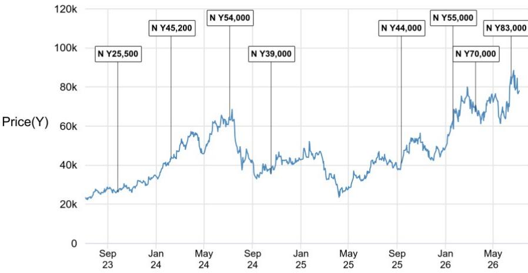
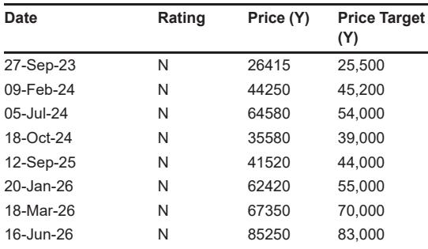

# JPM：Disco耗材业务才是半导体周期韧性的真正锚点

当市场目光聚焦于生成式AI对先进封装设备的拉动时，一份来自JPM的Disco季度快报揭示了一个更值得关注的信号：耗材业务的持续强劲，而非设备出货的波动，才是判断本轮半导体周期韧性的核心指标。

7月6日，Disco披露了2026财年第一季度的母公司销售额与出货额初步数据。出货额同比增长25%、环比增长19%至1165亿日元，略高于公司此前约1100亿日元的指引。报告明确指出，耗材表现略好于预期，而设备出货基本符合预期。这一结构性的差异，值得产业链参与者深入拆解。

> **KC评论：** 市场习惯用Disco的设备出货额来度量后道设备景气度，但耗材的稳定性才是客户产能利用率最真实的“温度计”。设备出货可能受项目周期、客户资本开支节奏影响而波动，耗材消耗则直接对应产线的实际运转率。

## 1. 耗材强劲的背后是客户产线满载，而非库存回补

JPM分析师指出，Disco的耗材需求坚实，暗示客户产能利用率处于高位。这与单纯由补库驱动的需求有本质区别。补库需求往往在1-2个季度内消退，而产线满载带来的耗材消耗具有持续性和刚性。报告还透露，Disco在7-9月期间将继续向客户派驻100名员工提供生产支持——这一人员部署规模本身，就是客户产线繁忙程度的侧面佐证。

## 2. 设备出货的“平淡”恰恰说明了AI需求的真实分布

出货额环比增长19%，略超市场共识区间中值，但并未出现超预期爆发。值得关注的是，报告提到AI相关需求强劲，包括向多家HBM制造商出货，同时向OSAT（外包封测）企业的出货同样坚挺。JPM认为，这反映了部分封装工序外包的进展，以及中国OSAT企业强劲的研究意愿。换句话说，AI需求并非集中在少数头部厂商，而是正在沿着产业链向外扩散——这对设备市场的广度是积极信号。

## 3. 报告尚未完全回答的关键问题：产能瓶颈何时成为约束

Disco目前面临的核心矛盾，不是需求不足，而是产能扩张能否跟上。报告将此列为需要持续观察的不确定性点。公司计划在7月23日的正式财报中公布更详细的按应用和区域划分数据，并给出7-9月的出货额指引。届时，市场将能更清晰地判断：产能扩张的节奏是否能支撑耗材和设备出货的同步增长，还是会在某个时点成为制约。

> **KC评论：** 对于关注半导体设备产业链的读者，7月23日的财报电话会需要重点关注两个数字：一是7-9月出货额指引，二是管理层对产能扩张的最新表态。如果出货指引继续超预期，同时产能约束没有明显缓解，那么Disco的定价权和议价能力可能进一步强化。

## 4. 一个更务实的观察框架：从“设备出货”转向“耗材+人员部署”

传统的半导体设备研究框架往往以设备出货额作为领先指标。但Disco这一季度的数据提示我们，在产能紧张、客户产线满载的周期阶段，耗材消耗趋势和客户现场支持人员规模，可能比设备出货本身更具前瞻性。耗材收入占比的提升，不仅意味着更高的盈利质量，也意味着公司与客户之间的粘性在增强——因为耗材的替换决策权往往掌握在一线工程师手中，而非采购部门。

对于产业决策者而言，如果Disco在7-9月继续维持甚至扩大客户现场支持的人员规模，这将是比任何季度出货数字都更有说服力的景气信号。

For informational purposes only. Portions may be generated,translated,summarized,or edited with AI assistance based on source materials and may contain omissions or errors. Please verify independently. This is not investment,legal,tax,accounting,or other professional advice.

For informational purposes only. Portions may be generated,translated,summarized,or edited with AI assistance based on source materials and may contain omissions or errors. Please verify independently. This is not investment,legal,tax,accounting,or other professional advice.

