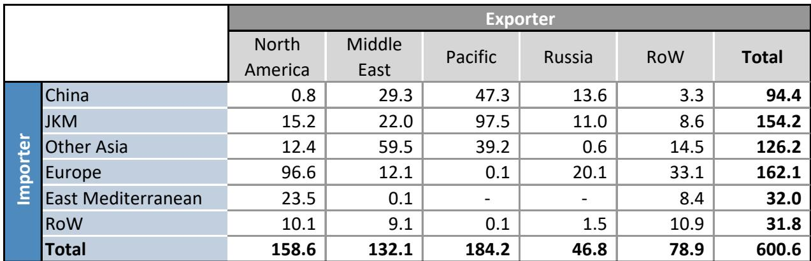
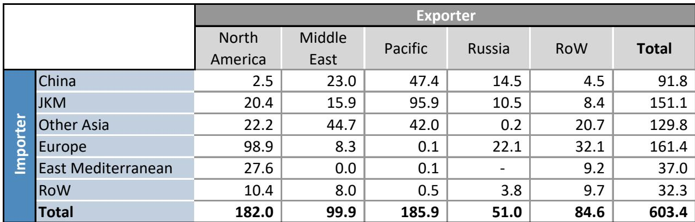
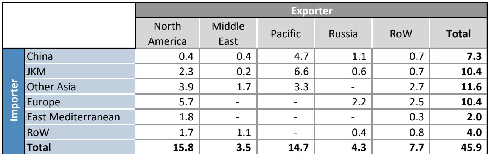

# 全球液化天然气市场进入结构性再平衡：亚洲相对欧洲优势显现，欧洲修正储气缺口的窗口正在关闭

传统观点认为，欧洲在需要时总能比亚洲更具竞争力地获取现货液化天然气货物，这一看法正受到市场现实的检验。2026年6月，全球液化天然气进口表现远好于预期，但构成揭示了显著差异：亚洲进口飙升至新高，而欧洲进口量同比下降20%。这并非暂时现象。它反映了卡塔尔和阿联酋供应中断后，全球液化天然气市场再平衡的根本性转变，对欧洲今冬能源安全影响深远。

关键驱动因素是JKM对TTF的持续溢价，该溢价并未因停火导致的现货价格下跌而消失。约每百万英热单位1.3美元的溢价，继续将边际美国现货货物引向亚洲而非欧洲。6月，欧洲在美国现货液化天然气进口中的份额降至近50%，而一年前为65%。亚洲吸收更多现货量并非因为需求迫切，而是因为经济性对其有利，且其国内能源系统已在日本和韩国等关键市场适应了更高的煤炭使用量。

与此同时，欧洲正成为全球液化天然气的剩余平衡市场。其储气轨迹相比去年逐日恶化，而去年已是2022年以来的最低水平。欧洲大陆6月进入储气季时储气量为30%，去年同期为43%，差距正在扩大。市场目前正在为修正定价，但问题在于，这种修正是通过更高的TTF价格（从而超越亚洲出价）来实现，还是通过今冬被迫的需求破坏来实现。

使本轮周期不同于以往的是供应侧。全球液化天然气供应恢复速度快于预期，主要因为美国设施（尤其是萨宾帕斯）在6月有效跳过了季节性维护。这推动美国出口量达到每天5.05亿立方米，同比增长31%。但这种供应增长可能是暂时的。维护被推迟而非避免，随着普拉克明斯和加拿大液化天然气等新项目接近投产一周年，其同比贡献将逐渐减弱。金德帕斯继续表现不及预期。2026年下半年的计算很明确：供应增长将放缓，欧洲将需要为更少的可用货物展开更激烈的竞争。

## 亚洲需求复苏广泛且具结构性，并非仅由天气驱动

亚洲液化天然气进口的复苏常被归因于厄尔尼诺现象和更热的天气，但数据表明其更具持久性。中国6月液化天然气进口同比增长2%，这是数月持平或下降趋势后的首次增长。更重要的是，除中国、日本和韩国外，亚洲其他地区的需求复苏是广泛的。印度和泰国领涨，进口分别同比增长22%和38%。即使是印度尼西亚和越南等较小买家也在增加进口。

这不仅仅是制冷需求。JKM对TTF的持续溢价——第二季度平均约每百万英热单位2美元，停火后仍接近每百万英热单位1.3美元——表明亚洲买家愿意为现货货物支付更高价格。他们并非仅仅在填充储气设施，而是在满足持续需求。该地区6月现货液化天然气进口达到近每天3亿立方米的历史新高，而欧洲现货进口降至每天2亿立方米以下。

对欧洲而言，这意味着令人不安的局面。传统观点认为亚洲是价格上涨时调整的边际需求，这一观点正在被颠覆。亚洲正被证明是更具韧性的买家，而欧洲进口则是让位的变量。部分原因是亚洲经济体已对其发电结构进行了重大调整，特别是在日本和韩国，更高的煤炭使用弥补了液化天然气进口的减少。但这同时也反映了全球液化天然气贸易流动的结构性转变，这种转变不会迅速逆转。

## 美国推迟维护带来的供应增长是暂时的，掩盖了市场趋紧

6月美国液化天然气出口的强劲表现由萨宾帕斯推动，该设施有效跳过了通常的季节性维护，同比增加约每天3500万立方米。科珀斯克里斯蒂和普拉克明斯也超出预期，分别额外贡献每天2700万立方米和3900万立方米。这帮助将6月全球液化天然气出口的同比降幅限制在仅约每天1500万立方米，而4月和5月约为每天1亿立方米。

但这种供应增长不可持续。历史模式表明，维护被推迟而非避免。萨宾帕斯可能需要在7月或8月进行停机维护，这将在亚洲需求高峰期从市场中移除一个重要供应来源。更重要的是，新项目的同比贡献正在迅速减弱。普拉克明斯仍是2026年供应增长的最大单一贡献者，但其预期年度增长的75%已在今年迄今实现。加拿大液化天然气和北极液化天然气2号项目在接近投产周年时也将出现类似的基数效应。

金德帕斯继续令人失望，其运行率约为产能的30%，而夏季预期为80%。这代表了对供应增长的持续拖累，市场尚未完全对此定价。推迟维护、新项目贡献减弱以及金德帕斯持续表现不佳的综合作用意味着，支撑2026年上半年市场的供应增长将不会持续到下半年。

## 卡塔尔增产步伐缓慢且不确定，年底前将留下巨大供应缺口

卡塔尔液化天然气出口的恢复速度远慢于许多市场参与者预期。根据装船数据，卡塔尔6月利用率平均接近16%，考虑到月底通过霍尔木兹海峡的交通有限，基于出口的利用率更接近10%。增产轨迹假设不再发生关闭或进一步事件，利用率在7月达到50%，8月达到62%，9月起达到83%。

即使在这些假设下，卡塔尔2026年的年均利用率将接近58%，相当于年出口量较2025年下降500亿立方米。这是一个巨大的供应缺口，替代来源仅部分填补。面对卡塔尔和阿联酋每天3亿立方米的供应下降，截至6月，替代来源抵消了近每天2亿立方米，主要由美国和加拿大-墨西哥引领。这好于最初一半的估计，但仍留下约每天1亿立方米的结构性缺口，必须通过需求减少或更高价格来吸收。

风险在于，卡塔尔的增产可能因地区事件而进一步延迟。报告指出，当前地区事件可能带来进一步的延迟风险。增产时间表的任何中断都将显著收紧市场，尤其是在进入欧洲需求高峰的冬季供暖季时。

## 欧洲面临艰难权衡：现在接受更高价格，还是今冬面临严重风险

亚洲需求韧性、供应增长放缓以及卡塔尔复苏不确定性的结合，使欧洲处于困境。欧洲大陆需要在冬季前重建储气，但在现货货物竞争中正输给亚洲。实际与所需欧洲进口之间的差距正在扩大，储气轨迹相比去年正在恶化。

市场已开始对此定价。与停火后继续走弱的石油和煤炭不同，天然气价格已从停火后低点回升12%。这种分化反映了液化天然气市场特定的供需动态，其紧张程度高于其他化石燃料。

报告指出了两种可能结果。第一种是市场通过更高的TTF价格进行修正，缩小JKM溢价，使欧洲能在现货货物竞争中超越亚洲。这需要TTF升至足够水平，使欧洲净回值比亚洲净回值对墨西哥湾货物更具吸引力。根据运输成本估算，可见的欧洲溢价预计仅从10月开始出现，这可能为时已晚，无法修正储气轨迹。

第二种结果是欧洲未能修正储气缺口，以有记录以来最低的储气量进入冬季。这将使欧洲大陆极易受到任何天气驱动的需求激增或供应中断的影响。去年冬季，欧洲依赖冬季液化天然气可用性，而非在供暖季前建立储气，这导致1月短暂寒流期间价格飙升近50%。今年冬季，储气量可能处于历史低位，霍尔木兹风险上升，加上厄尔尼诺不确定性，价格波动可能更大。

## 报告提出关于亚洲需求弹性及欧洲储气真实成本的关键未解问题

分析是严谨的，但它留下了几个重要问题。首先，亚洲需求对更高价格的弹性如何？报告指出，尽管现货价格高企，亚洲进口仍保持强劲，但它并未充分说明亚洲买家会减少采购的条件。如果亚洲需求比假设的更具刚性，欧洲可能需要比当前定价高得多的价格来吸引货物。

其次，重建欧洲储气的真实成本是多少？报告暗示更高的TTF价格是解决方案，但并未量化修正储气轨迹所需的价格水平。实际与所需进口之间的差距正在扩大，市场可能需要看到TTF价格持续远高于当前水平，才能激励必要的货物流动。

第三，欧洲还有多少煤炭转换能力？报告指出，更高的煤炭使用帮助平衡了亚洲市场，但它并未评估欧洲类似转换的空间，特别是考虑到监管限制和燃煤电厂退役。有记录以来最热的夏季也增加了电力系统风险，可能增加对燃气发电的需求，以弥补风能、水能和核能等热敏感来源的较弱出力。

这些并非对报告的批评。它们是深入分析自然引发的问题，指向需要进一步研究的领域。市场正进入一个真正不确定的时期，结果将取决于本质上难以预测的因素。

## 当前环境下液化天然气市场参与者的决策框架

对于需要基于此分析做出决策的读者，以下框架可能有用。第一个问题是您是液化天然气的买方还是卖方，以及您的风险敞口是面向亚洲还是欧洲市场。

对于欧洲天然气买家和储气运营商，关键决策是现在以当前价格锁定供应，还是等待可能的修正。分析表明，等待风险显著。美国推迟维护带来的供应增长是暂时的，亚洲需求可能在夏季保持强劲，卡塔尔增产不确定。修正储气轨迹的窗口正在关闭，价格可能需要进一步上涨以吸引必要的货物。

对于亚洲买家，计算方式不同。只要欧洲储气问题持续存在，JKM对TTF的溢价可能持续。问题在于现在锁定供应还是以后依赖现货采购。亚洲买家的风险在于欧洲需求最终会超越他们，特别是随着冬季临近和TTF溢价出现。报告表明，可见的欧洲溢价仅从10月开始出现，这意味着亚洲买家仍有时间在当前价差下确保供应，但窗口很窄。

对于液化天然气生产商和项目开发商，分析强化了灵活性的价值。根据净回值差异在亚洲和欧洲之间重新定向货物的能力是一个显著的竞争优势。当前市场也凸显了可靠运营的价值，因为新项目的供应增长正在减弱，维护推迟正在造成暂时但显著的可用供应波动。

最重要的结论是，全球液化天然气市场并非处于稳定均衡状态。它正处于再平衡过程中，可能产生显著的价格波动，特别是随着我们进入第三季度和冬季。报告提供了理解作用力的清晰框架，但结果将取决于本质上不确定的因素。相对少见确定的是市场将进行修正，问题在于这种修正是通过价格还是通过物理短缺来实现。

加入社区阅读完整报告并查看原始图表。

*仅供参考。部分内容可能基于源材料通过AI辅助生成、翻译、总结或编辑，可能存在遗漏或错误。请独立核实。这不构成专业建议。*

仅供参考。部分内容可能基于源材料通过AI辅助生成、翻译、总结或编辑，可能存在遗漏或错误。请独立核实。这不构成专业建议。

