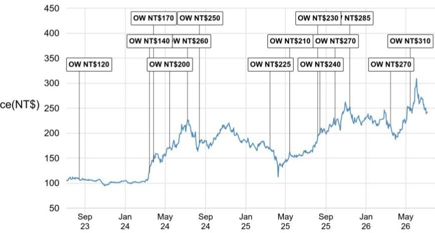

# JPM：鸿海AI服务器增速超预期，JPM指出定价权与ASIC是关键

当多数目光仍停留在苹果供应链的季度波动上时，一份来自JPM的最新研报揭示了一个更重要的信号：鸿海精密正在从“代工组装”走向“AI基础设施的关键集成商”。这份报告的核心判断并非关于iPhone 17的拉货动能——尽管那确实贡献了超预期——而是关于GB300机柜的定价改善和Vera Rubin新客户带来的结构性增量。

报告指出，鸿海2026年AI服务器收入预计将同比增长110%，其中AI GPU机柜增速约165%。这个数字本身已经超出市场普遍预期，但真正值得关注的不是增速，而是驱动因素的变化。

**KC评论：** 市场此前对鸿海的担忧集中在毛利率天花板，认为代工AI机柜的利润空间有限。但JPM看到的是定价权的转移——当组件成本上升时，鸿海有能力对GB300机柜提价，这改变了“量增利薄”的叙事。

## 1. 超预期的2Q26背后，是AI机柜和iPhone的双重拉动

鸿海6月营收8220亿新台币，同比增52%，环比下降4%。环比下滑的主因是PC和智能手机进入产品过渡期，拉货动能减弱。但云与网络业务环比持平，受限于AI机柜组装的组件供应瓶颈——PCB、被动元件等。

真正超预期的是第二季度整体表现：营收环比增18%，同比增40%，高于彭博一致预期的12%环比增长。JPM此前已提示过潜在上行，但实际落地仍由三个因素驱动：AI服务器机柜出货强于预期、iPhone 17需求超预期、MacBook Neo和Air持续放量。

值得注意的是，报告确认第二季度机柜级出货量已达到管理层指引的高双位数环比增长。这意味着AI基础设施的部署节奏并未变化，反而在加速。

## 2. GB300提价和Vera Rubin新客户，是2026年AI收入上行的两个支点

JPM对2026年AI收入上行的判断，建立在两个具体事件上。

第一，GB300机柜近期已实现提价，以覆盖内存和其他组件成本上升。这看似是成本转嫁，但本质上反映了鸿海在高端AI机柜市场的议价能力——不是所有代工厂都能在大客户面前实现提价。

第二，鸿海已获得一个额外的Vera Rubin客户，报告认为很可能是谷歌，在原有的微软和甲骨文基础上。这意味着鸿海在下一代AI芯片机柜的市场份额正从双寡头向多客户扩展。JPM预计Vera Rubin将在第三季度开始出货，第四季度放量，行业2026年VR200 NVL72机柜出货量可能达到约1万台。

**KC评论：** 客户多元化是估值逻辑升级的关键。当鸿海从依赖单一超大规模客户变成多个客户的AI基础设施伙伴，其收入稳定性和增长可见度都会提升。报告原文中关于Vera Rubin份额的假设和出货时间表，值得仔细看。

## 3. 毛利率不确定性仍在，但营业利润率有支撑

报告没有回避不确定性。Vera Rubin的机柜级平均售价将大幅提升60-70%，这会继续对毛利率形成不确定性。但JPM认为，营业利润率在未来2-3年仍能维持在3%以上，背后有三个支撑：ASIC占比提升（毛利率结构优化）、组件自供比例增加（垂直整合）、以及更高营收规模带来的运营杠杆。

这三个因素中，ASIC占比提升是最值得跟踪的。与GPU机柜相比，ASIC定制化程度更高，鸿海在其中的价值捕获空间也更大。如果谷歌TPU等ASIC项目持续放量，鸿海的利润率结构可能逐步改善。

## 4. 报告没有完全回答的问题

这份研报清晰勾勒了鸿海AI业务的上行逻辑，但仍有几个关键变量需要市场进一步验证。

一是组件供应瓶颈何时缓解。报告提到PCB和被动元件短缺限制了AI机柜出货，但没有给出明确的缓解时间表。如果瓶颈持续到第四季度，Vera Rubin的放量节奏可能不及预期。

二是定价权能否持续。GB300提价成功，但这是否可持续？如果组件成本趋于稳定，客户是否会要求降价？这取决于鸿海在下一代产品中的不可替代性。

三是Vera Rubin的客户份额。报告假设鸿海在2027年获得接近50%的份额，但竞争对手也在积极布局。份额能否兑现，取决于鸿海的交付能力和成本控制。

对于关注AI硬件产业链的读者，这份报告提供了一个清晰的观察框架：不要只看AI服务器出货量增速，要跟踪机柜定价趋势、客户多元化进度和ASIC占比变化。这三个指标，比季度营收超预期更能说明鸿海是否正在完成从“代工厂”到“AI基础设施集成商”的跃迁。

For informational purposes only. Portions may be generated,translated,summarized,or edited with AI assistance based on source materials and may contain omissions or errors. Please verify independently. This is not investment,legal,tax,accounting,or other professional advice.

For informational purposes only. Portions may be generated,translated,summarized,or edited with AI assistance based on source materials and may contain omissions or errors. Please verify independently. This is not investment,legal,tax,accounting,or other professional advice.

