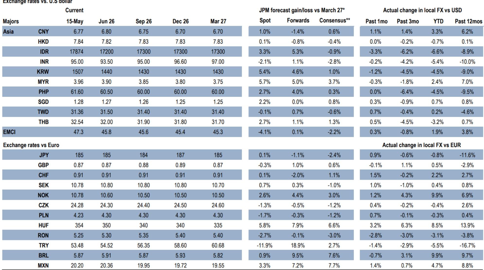
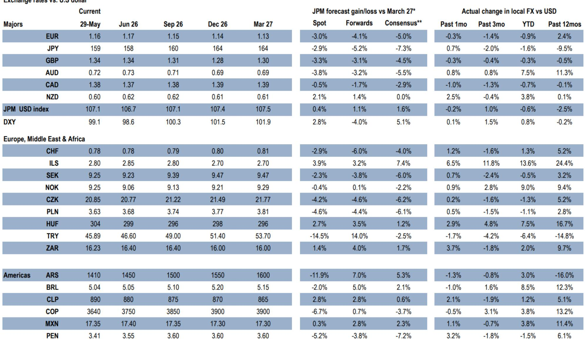
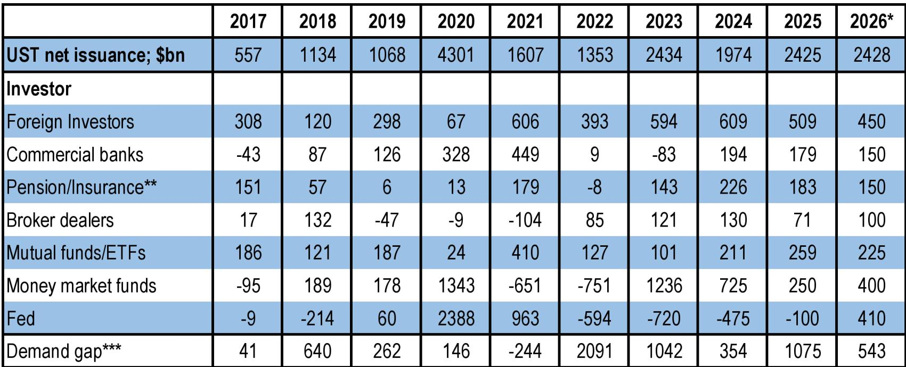

# JPM：美联储2027年或重启加息，美债市场面临重估

这份JPM年中宏观展望的核心判断，值得每一个关注全球资金流向的人认真对待：10年期美债回报表现目前比其模型公允值低了27个基点，这是2023年3月以来最大的负向偏离。换句话说，市场正在为一个“不会发生”的降息叙事定价，而JPM认为，这个价差本身就是不确定性。

报告的逻辑链条清晰而凌厉。美联储在2026年全年按兵不动，甚至可能在2027年三季度重启加息，而当前市场仅定价了未来一年35个基点的紧缩。在就业市场依然强劲、核心PCE维持在3.4%的背景下，这个预期差意味着美债利率的中期方向是向上，而不是向下。

## 1. 回报表现曲线的中间段是不确定性最集中的地方

JPM用一张公允值模型图点明了问题的核心。10年期美债利率比模型隐含水平低了27个基点，这个缺口在过去十年中只出现过几次，而每一次都被随后的利率上行所填补。报告特别指出，前端利率已经跌至六周低点，如果下一份就业数据继续强劲，市场将被迫重新定价更激进的紧缩路径。

这里的关键变量不是美联储何时降息，而是市场何时放弃降息预期。JPM预计2年期和10年期国债回报表现在2026年底分别达到4.20%和4.70%，这意味着当前水平有大约30-40个基点的上行空间。对于持有长久期资产的机构而言，这不是一个可以忽视的信号。

> **KC评论：** 这张公允值模型图是整份报告最有价值的分析工具。它告诉我们，当前美债的“便宜”不是基本面驱动的错杀，而是市场对政策路径的误判。读者可以重点关注报告中对模型变量的拆解：OIS利率、盈亏平衡通胀率、美联储资产负债表占比和贸易政策不确定性，这四个因子共同解释了近98%的回报表现波动。

## 2. 需求端的结构性变化正在为更高利率“背书”

报告的需求分析部分值得反复阅读。外国读者对美国国债的购买速度已经降至2021年以来最慢，商业银行的需求也因贷款增长和估值吸引力下降而减弱。与此同时，养老金和保险公司的久期需求因资金比率超过100%而明显回落。

这意味着什么？美债的买家结构正在从“价格不敏感”的外国央行和养老金，转向“价格敏感”的共同产品和对冲产品。JPM的测算显示，2026年将有约5430亿美元的额外供给需要由这些价格敏感型读者吸收。这个数字本身就是一个定价锚——为了吸引这些买家，回报表现必须维持在足够高的水平。

报告还点出了一个尚未被充分讨论的细节：美国财政部可能在2027年2月之前维持拍卖规模不变，但如果政治因素（如中期选举）导致指引调整推迟，短期国库券的发行比例将被迫上升。这会进一步扭曲回报表现曲线形态，增加中期债券的供给不确定性。

## 3. 美元和商品：两个被低估的“配角”

在货币方面，JPM维持“看多beta、看多美元”的立场，并将欧元兑美元的节奏变化目标修正至1.10。报告特别指出，美联储加息周期的启动通常伴随美元指数约5%的趋势性走强，而当前市场只定价了3%的低强度升值。如果美国就业数据持续强劲，美元的上涨可能才刚刚开始。

商品部分最有趣的判断是关于黄金。报告认为，美联储的耐心将阻止黄金出现持续大幅下跌，但短期需求预测的下调意味着金价更可能区间波动，而非趋势上行。2026年三季度和四季度的均价预测分别为4300美元和4500美元——这是一个“有底但无顶”的框架，前提是通胀预期不出现新的上行不确定性。

> **KC评论：** 黄金的叙事正在从“避险”转向“利率预期博弈”。报告没有展开的是，如果核心PCE在3.4%附近粘住，实际利率的上行将对黄金构成持续不确定性。读者可以留意报告中关于中国石油需求的讨论，那可能是理解2026-2027年商品市场整体走势的另一条线索。

## 4. 报告没有完全回答的关键问题

这份报告在逻辑上自洽，但仍有几个问题悬而未决。第一，如果美国宏观环境在2026年下半年出现意外节奏变化，美联储的“耐心”会否变成“观望”？JPM给出了1.9%的GDP增速预测，但这个数字本身处于一个“软着陆”和“轻度调整”的模糊地带。第二，外国读者的需求节奏变化是否已经触底？如果欧洲和日本的利率曲线开始陡化，资本回流的速度可能比报告预期的更快。第三，美国财政赤字的路径高度依赖关税收入的节奏——报告假设2026年关税收入为3250亿美元，但这个数字在政策执行层面存在较大不确定性。

这些未解问题恰恰是这份报告的真正价值所在：它提供了一个清晰的基准情景，同时也留下了足够多的变量，供读者自行推演和验证。对于专业读者而言，真正需要做的不是接受JPM的结论，而是用它的分析框架去测试自己的假设。

---

For informational purposes only. Portions may be generated,translated,summarized,or edited with AI assistance based on source materials and may contain omissions or errors. Please verify independently. This is not investment,legal,tax,accounting,or other professional advice.

For informational purposes only. Portions may be generated,translated,summarized,or edited with AI assistance based on source materials and may contain omissions or errors. Please verify independently. This is not investment,legal,tax,accounting,or other professional advice.

