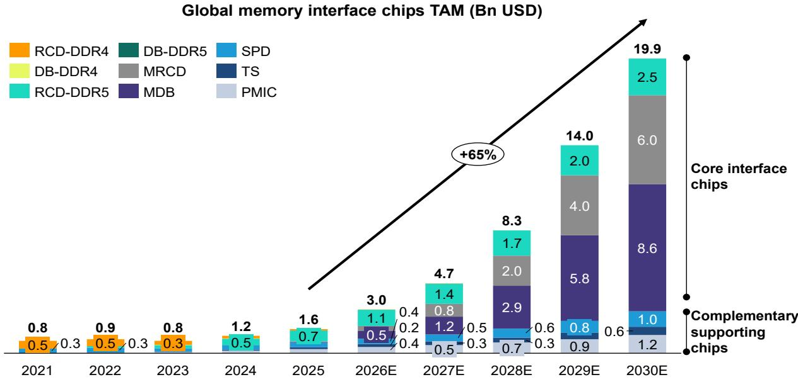
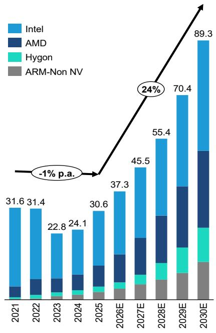
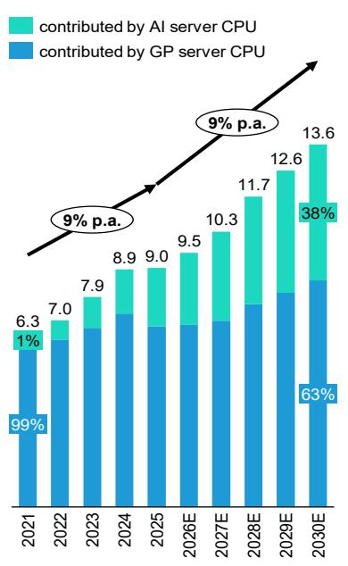
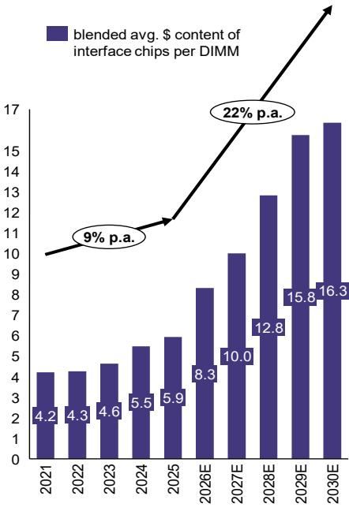

# 中国与日本半导体行业

# 内存接口芯片入门：受益于智能体AI发展

Qingyuan Lin, Ph.D.
+852 2123 2654
qingyuan.lin@bernsteinsg.com

+852 2918 5704
david.dai@bernsteinsg.com

Francis Ma
+852 2123 2626
francis.ma@bernsteinsg.com

Kai Zhang
+852 2123 2665
kai.zhang@bernsteinsg.com

Jack Lin
+852 2123 2683
jack.lin@bernsteinsg.com

+81 3 6777 6980

juho.hwang@bernsteinsg.com

Carmine Milano, CFA
+44 20 7762 1857
carmine.milano@bernsteinsg.com

我们在4月发布了澜起科技的首次覆盖报告（启动报告和演示文稿），讨论了由智能体AI驱动的内存接口芯片供应商的机会。在本入门报告中，我们全面概述了该行业的增长驱动因素、竞争格局以及研究启示，以帮助读者了解该领域。更新后的模型可在此处下载：内存接口芯片行业模型和澜起科技模型。维持对澜起科技的优于大市评级，目标价从H股320港元上调至520港元，A股从220元人民币上调至400元人民币。维持对瑞萨电子的优于大市评级。

内存接口芯片是智能体AI驱动的服务器CPU复兴的直接且放大的受益者。随着行业从以GPU为中心的训练转向以推理为主的智能体AI部署——CPU重新成为多步骤、顺序任务的协调者——服务器CPU出货量有望实现结构性更快增长（我们的CPU报告），而当每颗CPU的DRAM容量和带宽增长时，内存接口芯片的作用变得越来越重要。我们预计，到2030年，全球内存接口芯片总可寻址市场将达到200亿美元（是我们此前预测的3倍），复合年增长率为65%（此前为32%），这得益于三个相互加强的推动因素：服务器CPU出货量增加、每颗CPU的DRAM封装数量增加，以及通过MRDIMM升级带来的每封装接口芯片价值提升。

MRDIMM渗透率是一个重要的驱动因素，因为每个MRDIMM模块的接口芯片价值大约是RDIMM的10倍。每个MRDIMM采用"1个MRCD+10个MDB"架构，而标准DDR5 RDIMM仅使用一个RCD。我们预计，到2030年，MRDIMM渗透率将达到全球服务器DDR DIMM出货量的25%（此前为20%），这得益于MRDIMM带来的带宽提升。采用门槛是可控的：MRDIMM溢价仅约为当前128GB RDIMM价格的10%，并且随着DRAM芯片价格上涨，这一差距将进一步缩小。

核心内存接口芯片的竞争格局是一个教科书式的寡头垄断，推动了高利润率。澜起科技、瑞萨电子和Rambus（RMBS，未覆盖）合计控制着全球90%以上的份额，受到严格的JEDEC认证周期以及与DRAM IDM和CPU平台的深度共同开发关系的保护。该芯片对封装性能至关重要，但仅占封装价格的较低个位数百分比，客户转向新供应商的意愿非常低，并愿意提供高利润率以确保质量。这三家供应商在RDIMM路线图上竞争激烈，而瑞萨电子和澜起科技在MRDIMM方面拥有先发优势。互补支持芯片领域则更为分散，瑞萨电子凭借其模拟技术传统处于领先地位。

我们看好所有三家领先供应商，因为市场尚未完全反映CPU加速和MRDIMM采用带来的上行空间。我们将澜起科技A股/港股目标价上调至400元人民币/520港元，这得益于CPU驱动的内存接口和PCIe业务需求，以及来自长鑫存储扩张的市场份额增长。瑞萨电子的内存接口业务规模与澜起科技相似，尽管仅占其收入的6%，但其市值仅比澜起科技高25%；这看起来被显著低估，管理层对该业务20-30%的复合年增长率指引过低。Rambus受益于接口芯片产品和内存控制器IP版税；其较小的收入基础和市值使其拥有最大的潜在上行弹性。

## BERNSTEIN股票代码表

<table><tr><td rowspan="2">股票代码</td><td rowspan="2">评级</td><td rowspan="2">货币</td><td rowspan="2">2026年7月8日收盘价</td><td rowspan="2">目标价</td><td rowspan="2">过去12个月相对表现</td><td colspan="4">报告每股收益</td><td colspan="3">报告市盈率（倍）</td></tr><tr><td>当前</td><td>2025A</td><td>2026E</td><td>2027E</td><td>2025A</td><td>2026E</td><td>2027E</td></tr><tr><td>688008.CH (澜起科技)</td><td>O</td><td>人民币</td><td>247.15</td><td>400.00</td><td>169.8%</td><td>人民币</td><td>1.97</td><td>3.21</td><td>5.68</td><td>125.5</td><td>77.1</td><td>43.5</td></tr><tr><td>旧目标价</td><td></td><td></td><td></td><td>220.00</td><td></td><td></td><td></td><td>3.00</td><td>4.77</td><td></td><td></td><td></td></tr><tr><td>6809.HK (澜起科技)</td><td>O</td><td>港元</td><td>321.40</td><td>520.00</td><td>不适用</td><td>人民币</td><td>1.97</td><td>3.21</td><td>5.68</td><td>141.4</td><td>86.9</td><td>49.1</td></tr><tr><td>旧目标价</td><td></td><td></td><td></td><td>320.00</td><td></td><td></td><td></td><td>3.00</td><td>4.77</td><td></td><td></td><td></td></tr><tr><td>6723.JP (瑞萨电子)</td><td>O</td><td>日元</td><td>4,662.00</td><td>6,300.00</td><td>93.0%</td><td>日元</td><td>181.61</td><td>244.76</td><td>298.54</td><td>25.7</td><td>19.0</td><td>15.6</td></tr><tr><td>ASIAX</td><td></td><td></td><td>1,945.70</td><td></td><td></td><td></td><td></td><td></td><td></td><td></td><td></td><td></td></tr><tr><td>JPL</td><td></td><td></td><td>2,651.83</td><td></td><td></td><td></td><td></td><td></td><td></td><td></td><td></td><td></td></tr></table>

目标价变更/预测变更以粗体显示
O - 优于大市，M - 与大市同步，U - 弱于大市，NR - 未评级，CS - 暂停覆盖
6723.JP预测为调整后每股收益；6723.JP估值为调整后市盈率（倍）；
来源：彭博，Bernstein预测和分析

## 研究启示

自4月以来，澜起科技、Rambus和瑞萨电子的股价已连续数月上涨，反映出随着CPU供应商评论服务器CPU需求强劲，读者对内存接口芯片领域的浓厚兴趣。然而，在过去一个月中，其股价已从峰值水平回调10-30%，因为读者越来越质疑估值是否已过高。我们预计短期内市场情绪仍将偏弱，反映出内存相关情绪的持续疲软、股价强劲上涨后的获利了结，以及澜起科技和Rambus因基板短缺导致的近期盈利担忧。从战术角度看，读者短期内可能更倾向于观望。然而，我们预计在12个月的时间范围内，随着MRDIMM渗透率持续提升，当读者开始关注2028年的潜在上行空间时，这些股票可能再次表现良好，因此长期读者应在市场回调时关注逢低布局的机会。

澜起科技：我们给予澜起科技优于大市评级，并将A股目标价上调至400元人民币，基于50倍2BF市盈率（27年第三季度至28年第二季度盈利）。我们认为2BF框架更好地反映了由2027-2028年产品周期（包括MRDIMM接口芯片的放量）驱动的即将到来的盈利拐点，且市盈率低于5年复合年增长率，因此应具有更大的上行空间。由于对CPU周期和MRDIMM渗透率的展望更为强劲，我们将2027/2028年每股收益预测分别上调19%/73%。我们还将目标倍数从44倍提高至50倍，这得益于ESP业务的快速增长（2025-2028年复合年增长率76.5%）。对于H股，我们设定目标价为520港元，较A股目标价溢价15%（我们使用人民币兑港元汇率1:1.13）。H股溢价反映了全球读者将澜起科技视为稀缺的中国AI相关标的，且不像许多其他面临实体清单限制或出口管制挑战的中国半导体公司那样存在直接的地缘政治风险。在我们的目标价下，H股2BF每股收益的隐含市盈率倍数为58倍。由于锁定期导致H股自由流通量有限，因此我们预计短期内H股溢价将维持在高位。锁定期结束后，H股溢价可能开始收窄。

瑞萨电子：我们看好AI数据中心半导体（参考《人工智能 - 为AI数据中心的未来注入活力》和《全球半导体：CPU复兴？2230亿美元总可寻址市场的受益者》）。在瑞萨电子的AI基础设施产品组合中，我们认为功率半导体和内存接口IC都是有吸引力的增长驱动力。我们预测，到2028年，AI基础设施收入将占瑞萨电子总收入的27%，而2025年为11%（参考《英飞凌/瑞萨电子：CPU复兴成为功率半导体需求的第二引擎，有望超过供应》）。我们给予瑞萨电子优于大市评级，目标价=6,300.00日元。

图表1：澜起科技 Bernstein预测 vs. 市场一致预期 vs. Bernstein旧预测

<table><tr><td>收入（百万元人民币）</td><td>2023</td><td>2024</td><td>2025</td><td>2026E</td><td>2027E</td><td>2028E</td><td>2029E</td><td>2030E</td></tr><tr><td>Bernstein</td><td>2,286</td><td>3,639</td><td>5,456</td><td>7,733</td><td>13,552</td><td>25,211</td><td>41,966</td><td>58,298</td></tr><tr><td>同比增长</td><td>(38%)</td><td>59%</td><td>50%</td><td>42%</td><td>75%</td><td>86%</td><td>66%</td><td>39%</td></tr><tr><td>市场一致预期</td><td>2,286</td><td>3,639</td><td>5,456</td><td>7,448</td><td>10,752</td><td>13,656</td><td></td><td></td></tr><tr><td>同比增长</td><td></td><td></td><td>50%</td><td>36%</td><td>44%</td><td>27%</td><td></td><td></td></tr><tr><td>Bernstein vs. 市场一致预期</td><td></td><td></td><td></td><td>3.8%</td><td>26.0%</td><td>84.6%</td><td></td><td></td></tr><tr><td>Bernstein旧预测</td><td></td><td></td><td></td><td>7,793</td><td>11,688</td><td>14,941</td><td>20,420</td><td>25,508</td></tr><tr><td>新预测 vs. 旧预测</td><td></td><td></td><td></td><td>(0.8%)</td><td>16.0%</td><td>68.7%</td><td>105.5%</td><td>128.6%</td></tr><tr><td colspan="9">毛利润</td></tr><tr><td>Bernstein</td><td>1,347</td><td>2,115</td><td>3,395</td><td>5,233</td><td>8,988</td><td>16,378</td><td>26,537</td><td>35,832</td></tr><tr><td>同比增长</td><td></td><td>57%</td><td>61%</td><td>54%</td><td>72%</td><td>82%</td><td>62%</td><td>35%</td></tr><tr><td>毛利率</td><td>58.9%</td><td>58.1%</td><td>62.2%</td><td>67.7%</td><td>66.3%</td><td>65.0%</td><td>63.2%</td><td>61.5%</td></tr><tr><td>市场一致预期</td><td>1,347</td><td>2,115</td><td>3,395</td><td>5,264</td><td>7,817</td><td>9,969</td><td></td><td></td></tr><tr><td>同比增长</td><td></td><td>57%</td><td>61%</td><td>55%</td><td>48%</td><td>28%</td><td></td><td></td></tr><tr><td>毛利率</td><td></td><td></td><td>62.2%</td><td>70.7%</td><td>72.7%</td><td>73.0%</td><td></td><td></td></tr><tr><td>Bernstein vs. 市场一致预期 - 毛利润</td><td></td><td></td><td></td><td>(0.6%)</td><td>15.0%</td><td>64.3%</td><td></td><td></td></tr><tr><td>Bernstein vs. 市场一致预期 - 毛利率</td><td></td><td></td><td></td><td>(301bps)</td><td>(638bps)</td><td>(804bps)</td><td></td><td></td></tr><tr><td>Bernstein旧预测</td><td></td><td></td><td></td><td>5,168</td><td>7,828</td><td>10,191</td><td>14,183</td><td>18,004</td></tr><tr><td>新预测 vs. 旧预测</td><td></td><td></td><td></td><td>1.3%</td><td>14.8%</td><td>60.7%</td><td>87.1%</td><td>99.0%</td></tr><tr><td colspan="9">营业利润</td></tr><tr><td>Bernstein</td><td>199</td><td>1,046</td><td>1,971</td><td>3,531</td><td>6,943</td><td>13,962</td><td>23,681</td><td>32,491</td></tr><tr><td>同比增长</td><td></td><td>426%</td><td>88%</td><td>79%</td><td>97%</td><td>101%</td><td>70%</td><td>37%</td></tr><tr><td>营业利润率</td><td>8.7%</td><td>28.8%</td><td>36.1%</td><td>45.7%</td><td>51.2%</td><td>55.4%</td><td>56.4%</td><td>55.7%</td></tr><tr><td>市场一致预期</td><td>199</td><td>1,046</td><td>1,971</td><td>3,534</td><td>5,185</td><td>6,960</td><td></td><td></td></tr><tr><td>同比增长</td><td></td><td>426%</td><td>88%</td><td>79%</td><td>47%</td><td>34%</td><td></td><td></td></tr><tr><td>营业利润率</td><td></td><td></td><td>36.1%</td><td>47.5%</td><td>48.2%</td><td>51.0%</td><td></td><td></td></tr><tr><td>Bernstein vs. 市场一致预期 - 营业利润</td><td></td><td></td><td></td><td>(0.1%)</td><td>33.9%</td><td>100.6%</td><td></td><td></td></tr><tr><td>Bernstein vs. 市场一致预期 - 营业利润率</td><td></td><td></td><td></td><td>(179bps)</td><td>301bps</td><td>441bps</td><td></td><td></td></tr><tr><td>Bernstein旧预测</td><td></td><td></td><td></td><td>3,517</td><td>5,868</td><td>7,931</td><td>11,576</td><td>15,010</td></tr><tr><td>新预测 vs. 旧预测</td><td></td><td></td><td></td><td>0.4%</td><td>18.3%</td><td>76.0%</td><td>104.6%</td><td>116.5%</td></tr><tr><td colspan="9">归属于股东的净利润</td></tr><tr><td>Bernstein</td><td>451</td><td>1,412</td><td>2,236</td><td>3,721</td><td>6,594</td><td>12,706</td><td>21,071</td><td>28,545</td></tr><tr><td>同比增长</td><td>(65%)</td><td>213%</td><td>58%</td><td>66%</td><td>77%</td><td>93%</td><td>66%</td><td>35%</td></tr><tr><td>净利润率</td><td>19.7%</td><td>38.8%</td><td>41.0%</td><td>48.1%</td><td>48.7%</td><td>50.4%</td><td>50.2%</td><td>49.0%</td></tr><tr><td>市场一致预期</td><td>451</td><td>1,412</td><td>2,236</td><td>3,562</td><td>5,246</td><td>7,383</td><td></td><td></td></tr><tr><td>同比增长</td><td></td><td></td><td>58%</td><td>59%</td><td>47%</td><td>41%</td><td></td><td></td></tr><tr><td>净利润率</td><td>19.7%</td><td>38.8%</td><td>41.0%</td><td>47.8%</td><td>48.8%</td><td>54.1%</td><td></td><td></td></tr><tr><td>Bernstein vs. 市场一致预期 - 净利润</td><td></td><td></td><td></td><td>4.5%</td><td>25.7%</td><td>72.1%</td><td></td><td></td></tr><tr><td>Bernstein vs. 市场一致预期 - 净利润率</td><td></td><td></td><td></td><td>30bps</td><td>(13bps)</td><td>(366bps)</td><td></td><td></td></tr><tr><td>Bernstein旧预测</td><td></td><td></td><td></td><td>3,628</td><td>5,769</td><td>7,645</td><td>10,877</td><td>13,908</td></tr><tr><td>新预测 vs. 旧预测</td><td></td><td></td><td></td><td>3%</td><td>14%</td><td>66%</td><td>94%</td><td>105.2%</td></tr><tr><td colspan="9">基本每股收益</td></tr><tr><td>Bernstein</td><td></td><td>1.25</td><td>1.97</td><td>3.21</td><td>5.68</td><td>10.82</td><td>17.93</td><td>24.04</td></tr><tr><td>同比增长</td><td></td><td></td><td>58%</td><td>63%</td><td>77%</td><td>91%</td><td>66%</td><td>34%</td></tr><tr><td>市场一致预期</td><td></td><td>1.25</td><td>1.97</td><td>3.02</td><td>4.36</td><td>6.09</td><td></td><td></td></tr><tr><td>同比增长</td><td></td><td></td><td>58%</td><td>53%</td><td>44%</td><td>40%</td><td></td><td></td></tr><tr><td>Bernstein vs. 市场一致预期</td><td></td><td></td><td></td><td>6.2%</td><td>30.3%</td><td>77.8%</td><td></td><td></td></tr><tr><td>Bernstein旧预测</td><td></td><td></td><td></td><td>3</td><td>5</td><td>6</td><td>9</td><td>11</td></tr><tr><td>新预测 vs. 旧预测</td><td></td><td></td><td></td><td>7%</td><td>19%</td><td>73%</td><td>102%</td><td>113.7%</td></tr></table>

来源：彭博，Bernstein分析和预测

## 目录

内存接口芯片：智能体AI时代核心受益者....4
产品入门：内存模块和内存接口芯片....8
核心接口芯片....9
互补芯片....12
PC DDR模块格式和CKD....13
总可寻址市场规模及增长驱动因素分析....15
服务器CPU出货量增长....15
每颗CPU的DIMM模块数量增加....17
MRDIMM迁移带来的每模块内存接口芯片价值提升....20
各DDR代际和DIMM格式的配置对比....20
竞争格局与行业护城河....26
核心内存接口芯片市场：整合的寡头垄断....26
互补支持芯片：更为分散的市场....27
三大核心内存接口芯片厂商评估....28
行业护城河....31
未来技术路线图....33
DDR6及其对内存接口芯片的影响....33
CXL：内存接口的下一个前沿....33
SOCAMM2 - NVIDIA为其CPU平台定制的DRAM格式....36

## 详细信息

## 内存接口芯片：智能体AI时代核心受益者

智能体AI正在结构性重塑对服务器CPU、DDR内存以及连接它们的接口芯片的需求。三个叠加的推动因素——CPU出货量增加、每颗CPU的DRAM容量提升以及通过MRDIMM升级带来的芯片组价值增长——推动内存接口芯片总可寻址市场在2025-2030年以约65%的复合年增长率增长。

AI行业正在进入一个新阶段。随着工作负载从训练转向推理和智能体应用，计算强度正重新向服务器CPU迁移。在训练中，GPU处理大规模并行计算工作负载，而CPU基本处于闲置状态。随着AI从推理转向行动，工作负载变得多步骤、顺序性和时间敏感，这正是CPU擅长的领域。CPU成为关键的协调者：它每秒调度数千个小计算任务给GPU，管理模型的工作内存（KV缓存），执行实时安全检查，并协调对外部工具的API调用。在这些工作负载中，CPU端处理可能占总任务完成时间的50-90%。CPU与GPU的比例发生显著变化，在智能体架构中达到约1:1-2。AMD最近将其对全球（x86）服务器CPU总可寻址市场的预测弹性较高，至2030年达到1200亿美元，相比上一季度财报中的预测，反映出对CPU需求的预期正在快速上升。每增加一台服务器CPU出货，就需要多个DDR内存模块，每个模块都配备内存接口芯片组。

图表2：随着AI从以训练为主的时代（GPU主导）转向以推理为主的时代，CPU的角色正在扩展。训练需要并行处理，但推理，特别是智能体工作流程，需要CPU的顺序性和延迟敏感能力

## 不断演变的AI范式：从原始计算到复杂编排

随着AI从推理转向行动，集群级别的计算强度正迅速重新向CPU转移。

CPU角色：支持

AI训练（过去/现在）

CPU:GPU ~1:12-16

CPU角色：核心

AI推理（现在/未来）

CPU:GPU ~1:4-8

智能体AI（未来）

CPU:GPU ~1:1-2

工作负载性质

• 权重调整，大规模并行批处理

• 思维链推理，扩展推理循环，文档合成

• API调用，网页抓取，代码执行，多智能体扇出

主要计算约束 - 并行计算（原始FLOPs）

• 内存带宽和KV缓存路由

• 控制流、编排和系统I/O

CPU的角色

- 基本数据馈送和排队

- 分词（提示预处理）和高频内核调度

• 实时决策，内存池化，外部工具协调

从训练到智能体，CPU从支持角色转变为战略中心。为AI的未来进行架构设计意味着要以CPU优先的编排为设计方向。

此处的CPU与GPU比例仅为示意，可能因不同的服务器架构而有所变化。来源：公开报告，Bernstein分析和预测

智能体AI工作负载需要比前几代产品更高的内存带宽和容量，用于KV缓存存储、上下文窗口以及随任务复杂性增长的工作内存。行业正在通过增加每颗CPU的DDR通道数量（从8通道迁移到12通道，最终到16通道）以及在AI服务器中完全填充DIMM插槽以最大化加速器利用率来应对。每台服务器更多的DRAM模块意味着每台服务器成比例地增加内存接口芯片——这是一个在CPU出货量增长基础上的结构性乘数效应。

智能体AI的带宽需求正在加速从DDR5 RDIMM向DDR5 MRDIMM的过渡，这将每个模块的内存接口芯片价值提高了约10倍。当数据传输速率超过8800 MT/s时——同样由需要更高内存带宽的AI工作负载驱动——传统的RDIMM架构遇到了基本的信号完整性限制。MRDIMM通过主动信号重定时解决了这一问题，每个模块需要一个MRCD加上十个MDB芯片，而RDIMM只需要一个RCD。这不是渐进式的改进；这是每台服务器硅含量的阶跃变化，改变了整个内存接口芯片市场的格局。

这三个力量是乘数效应，而非加法效应。总可寻址市场是CPU出货量、每颗CPU的DRAM模块数量和每模块芯片组价值的乘积，而这些因素几乎都在同时上升。这种结构性对齐解释了为什么我们预测全球DDR模块芯片组总可寻址市场到2030年将达到200亿美元（约65%复合年增长率），显著超过服务器CPU出货量的增长（约24%复合年增长率），使该行业在CPU出货量增长基础上的弹性几乎是其三倍。请注意，总可寻址市场对CPU出货量和MRDIMM渗透率都很敏感，正如我们在图表5中强调的，因此如果CPU市场增长不及预期且MRDIMM渗透率低于预测，我们的预测存在下行风险。

图表3：我们将全球内存接口总可寻址市场预测上调至2030年200亿美元，其中MRDIMM的MRCD和MDB贡献73%，由每模块芯片组价值显著提升驱动

全球内存接口芯片总可寻址市场（十亿美元）

我们的总可寻址市场预测不包括用于NVIDIA专有CPU的内存接口芯片，如电压调节器和PMIC。我们预计影响仅为较低个位数百分比，因为NVIDIA CPU占服务器CPU出货量的比例较小，且相关组件价值相对较低。
来源：Mercury，TrendForce，Gartner，Bernstein分析和预测

图表4：总可寻址市场的扩张由三个核心因素驱动，每个因素预计在本十年后半段相对于过去5年将加速

驱动因素1：全球服务器CPU出货量（百万台）

驱动因素2：每颗CPU平均DIMM封装数量（个）

来源：Gartner，Mercury，Bernstein分析和预测

驱动因素3：每个DIMM模块接口芯片平均价值（美元）

图表5：2030年总可寻址市场敏感性分析：即使在悲观情景下，全球内存接口芯片总可寻址市场仍达到我们此前版本的预测，强化了澜起科技在当前股价下的下行保护

<table><tr><td rowspan="2" colspan="2">2030年总可寻址市场敏感性分析（十亿美元）</td><td colspan="7">2030年服务器CPU出货量（不含NV，百万台）</td></tr><tr><td>60</td><td>70</td><td>80</td><td>89</td><td>100</td><td>110</td><td>120</td></tr><tr><td rowspan="7">2030年MRDIMM渗透率</td><td>10%</td><td>8</td><td>9</td><td>10</td><td>12</td><td>13</td><td>14</td><td>16</td></tr><tr><td>15%</td><td>10</td><td>11</td><td>13</td><td>14</td><td>16</td><td>18</td><td>19</td></tr><tr><td>20%</td><td>12</td><td>13</td><td>15</td><td>17</td><td>19</td><td>21</td><td>23</td></tr><tr><td>25%</td><td>13</td><td>16</td><td>18</td><td>20</td><td>22</td><td>24</td><td>27</td></tr><tr><td>30%</td><td>15</td><td>18</td><td>20</td><td>23</td><td>25</td><td>28</td><td>30</td></tr><tr><td>35%</td><td>17</td><td>20</td><td>23</td><td>25</td><td>28</td><td>31</td><td>34</td></tr><tr><td>40%</td><td>19</td><td>22</td><td>25</td><td>28</td><td>32</td><td>35</td><td>38</td></tr></table>

来源：Bernstein分析和预测

## 产品入门：内存模块和内存接口芯片

DDR模块芯片组是一系列安装在服务器DIMM模块上的专用IC。它们分为两个层级——高价值的内存接口芯片（RCD、DB、MRCD、MDB）和互补
