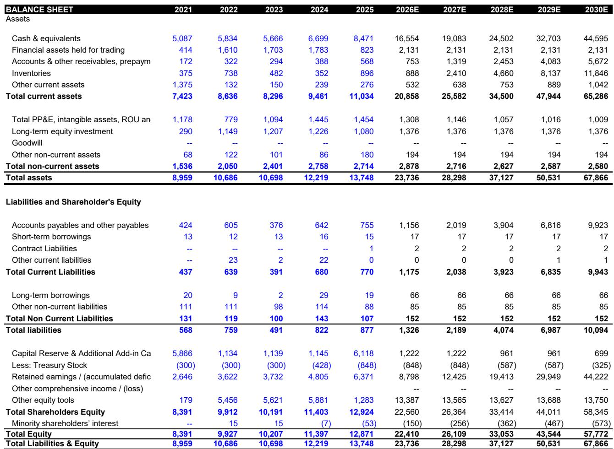
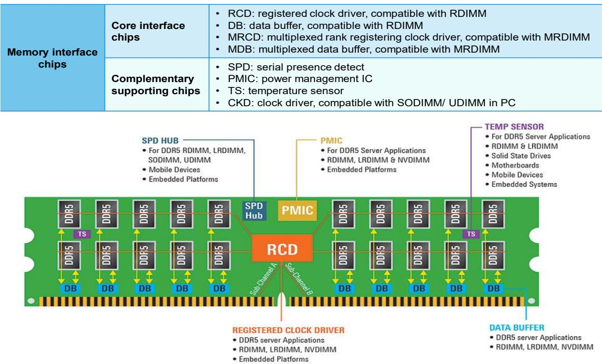
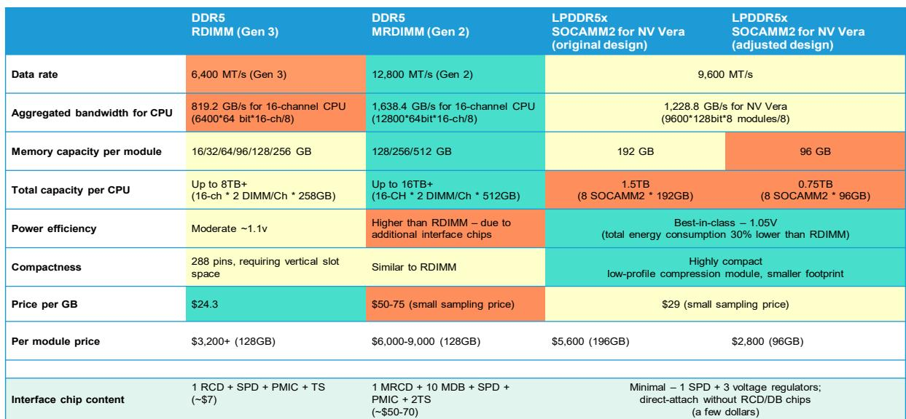

# Bernstein：AI基础设施新受益者并非GPU，而是CPU与内存接口芯片

当市场还在讨论AI资本开支的走向时，一份来自Bernstein的深度报告提出了一个反直觉的判断：AI的下一个结构性受益者不是GPU，而是CPU，以及连接CPU与内存的那块接口芯片。报告的核心结论是，全球内存接口芯片的可触达市场（TAM）到2030年将达到200亿美元，是此前预测的3倍，复合年增长率从32%跳升至65%。这个数字背后，是三个相互强化的驱动力：服务器CPU出货量的结构性增长、单颗CPU搭载的DRAM模组数量增加，以及MRDIMM升级带来的单模组接口芯片价值量跃升。

这份报告的价值不在于简单的“看好”，而在于它提供了一个理解AI基础设施演进的新框架。当AI从训练走向推理，再走向自主智能体（Agentic AI），计算模式正在发生根本性转变。训练阶段是GPU的天下，但推理和智能体任务——尤其是那些需要多步骤、序列化、低延迟响应的任务——CPU重新成为核心。Bernstein估算，在智能体架构中，CPU与GPU的比例可以达到1:1至1:2，远高于当前训练集群中的1:8甚至更低。AMD最近将其对全球x86服务器CPU TAM的预测弹性较高至1200亿美元，恰恰印证了这一趋势。

## 1. 三股驱动力叠加，TAM的爆发不是线性而是指数级

Bernstein的TAM模型建立在三个独立且可验证的驱动力之上。首先是服务器CPU出货量的加速增长。报告引用了一个关键数据点：在智能体工作负载中，CPU侧处理可以占到任务完成时间的50%到90%。这意味着数据中心需要部署更多的CPU服务器，而不是简单地增加GPU。每一颗新增的服务器CPU，都需要配套多个DDR内存模组，而每个模组都需要接口芯片。

第二层驱动力是单颗CPU搭载的DRAM模组数量在上升。随着LLM模型的上下文窗口不断扩展、KV缓存需求激增，单颗CPU需要管理的内存容量和带宽都在快速增长。这直接推动了每颗CPU配套的DIMM插槽数量从传统的6-8个向12-16个演进。

第三层，也是最核心的变量，是MRDIMM的渗透。MRDIMM是DDR5时代的一个关键升级方向。与标准RDIMM仅需一颗RCD芯片不同，MRDIMM采用了“1颗MRCD+10颗MDB”的架构，单模组接口芯片价值量是RDIMM的约10倍。Bernstein预测，到2030年MRDIMM在全球服务器DDR DIMM出货量中的渗透率将从20%提升至25%。这个数字看起来不高，但考虑到价值量的跃升，对TAM的拉动是巨大的。

> **KC评论：** 报告给出的TAM数字（200亿美元，65% CAGR）看起来非常激进，但它的逻辑链条是清晰的。关键在于MRDIMM渗透率的假设——如果渗透率超预期，TAM还会更高。读者在阅读完整报告时，可以重点关注报告中对MRDIMM成本溢价的分析：目前MRDIMM的溢价仅相当于128GB RDIMM价格的约10%，且随DRAM裸片价格上涨，这个价差还在收窄。这意味着采用门槛比市场想象的低。

## 2. 寡头格局下的高壁垒：为什么这三位玩家值得关注

报告指出，核心内存接口芯片市场是一个教科书式的寡头市场。澜起科技、瑞萨电子和Rambus三家合计占据了全球90%以上的份额。这个格局的形成不是偶然的，而是由几个结构性壁垒共同塑造的。

首先是JEDEC认证周期。每一代内存接口芯片都必须通过JEDEC标准的严格认证，这个周期通常需要12-18个月。新进入者即便有技术能力，也需要等待下一个产品代际才能切入。其次是深度绑定关系。接口芯片供应商与DRAM IDM（如三星、SK海力士、美光）以及CPU平台厂商（如英特尔、AMD）之间，存在多年的联合开发和验证关系。客户更换供应商的意愿极低——接口芯片虽然对模组性能至关重要，但其成本只占模组总价的低个位数百分比，客户没有动力为了节省一点成本去冒质量不确定性。

报告特别强调了澜起科技在MRDIMM领域的先发优势。作为首批通过MRDIMM认证的供应商，澜起已经在与瑞萨的竞争中占据了有利位置。而瑞萨的优势则在于其模拟芯片的深厚积累，在互补性支持芯片市场（如SPD Hub、温度传感器等）中占据领先地位。

> **KC评论：** 报告对竞争格局的分析值得仔细阅读。它揭示了为什么这个行业能够维持高利润率——不是因为没有竞争，而是因为客户主动愿意支付溢价以换取供应稳定性。完整报告中对三家公司的技术路线图对比和客户关系分析，是理解未来市场份额变化的关键。

## 3. 报告没有完全回答的关键问题：短期波动与长期趋势的错位

Bernstein在报告中坦率地承认，短期来看，市场情绪可能偏弱。过去一个月，三家公司的报价从高点回调了10%到30%。原因包括：内存相关情绪的持续调整、获利了结、以及澜起和Rambus面临的基板短缺问题。报告建议战术性读者短期内保持观望，但长期读者应该利用回调进行布局。

这里有一个报告没有完全展开的张力：市场对估值是否过高的担忧，与Bernstein对2027-2028年盈利爆发的预期之间存在巨大差距。澜起科技的营收预测显示，Bernstein对2028年的营收预期（252亿人民币）是市场共识（136亿人民币）的1.85倍，净利润预期（127亿人民币）更是市场共识（74亿人民币）的1.72倍。这种差异来自于报告对MRDIMM渗透率和CPU出货量的乐观假设——而这些假设能否兑现，取决于智能体AI的落地速度。

另一个未解的问题是H股溢价。澜起科技的H股相对相关市场有约15%的溢价，报告解释为全球读者将其视为稀缺的中国AI标的，且不受实体清单限制。但H股流通盘极小，锁定期结束后溢价可能收窄。这个时间点和幅度，报告没有给出明确判断。

## 4. 对产业观察者的框架：从三个维度跟踪逻辑验证

对于希望自己验证报告逻辑的读者，Bernstein的报告实际上提供了一个清晰的跟踪框架。

第一个维度是CPU出货量的结构性变化。跟踪AMD和英特尔的数据中心CPU营收指引，以及云厂商的资本开支结构变化。如果CPU在AI服务器中的占比持续上升，报告的第一个驱动力就在兑现。

第二个维度是MRDIMM的渗透节奏。关注JEDEC标准的更新、DRAM厂商的产能规划、以及服务器OEM的导入时间表。报告认为2027-2028年是MRDIMM渗透率加速的拐点，这个时间点是否提前或推迟，将直接影响TAM预测。

第三个维度是竞争格局的稳定性。三家寡头能否维持高利润率，取决于新进入者是否能够突破认证壁垒。报告提到CXL（Compute Express Link）可能是下一个前沿领域，这为现有的竞争格局引入了新的变量——CXL接口芯片的市场结构可能与DDR接口芯片不同，值得持续关注。

For informational purposes only. Portions may be generated,translated,summarized,or edited with AI assistance based on source materials and may contain omissions or errors. Please verify independently. This is not investment,legal,tax,accounting,or other professional advice.

For informational purposes only. Portions may be generated,translated,summarized,or edited with AI assistance based on source materials and may contain omissions or errors. Please verify independently. This is not investment,legal,tax,accounting,or other professional advice.

