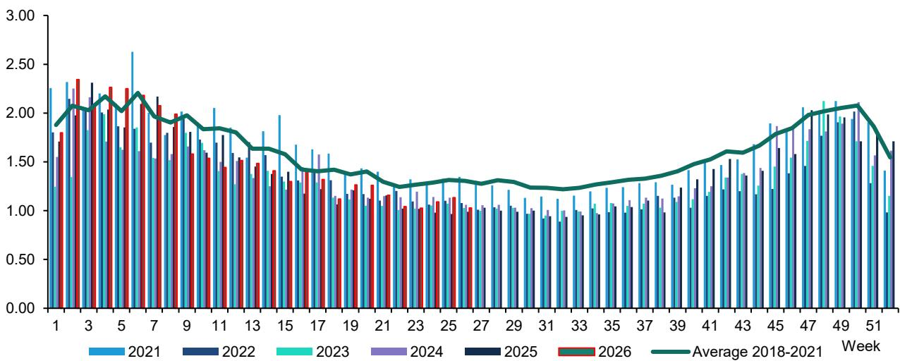
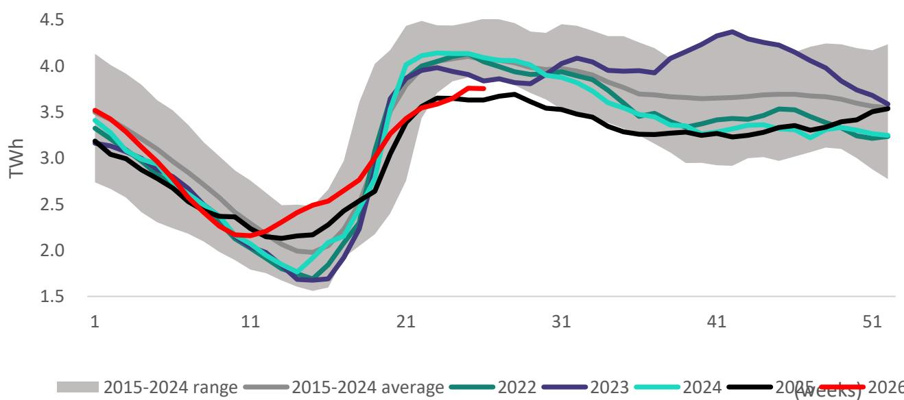
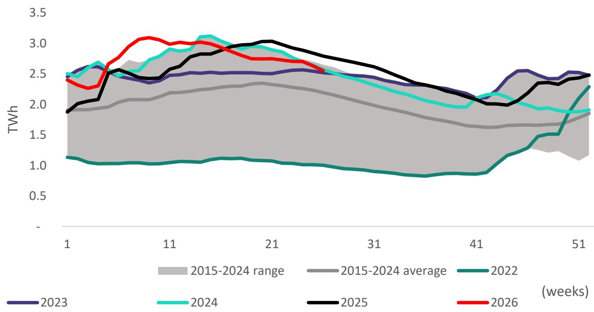

# 欧洲电力市场进入结构性分化阶段，需从组合层面重新审视

2026年第二季度为关注欧洲公用事业基本面的人士发出了明确信号：广泛相关的可再生能源发电时代已经结束。多年来首次，主要清洁能源技术在不同地区的表现出现分化，形成了一幅复杂的图景，这更考验个股选择能力，而指数层面的思维则可能失效。在我们追踪的所有市场中，太阳能发电量均有所上升，这几乎完全由新增装机容量驱动，而非天气因素改善。相比之下，除瑞典外，所有国家的水力发电量均出现下降，降幅从德国温和的0.4%到葡萄牙显著的42.7%不等。风电的分化最为明显，海上风电和北欧市场表现强劲，而陆上风电和南欧市场则有所回落。

这种分化并非统计上的偶然现象。它反映了三种短期内不太可能逆转的结构性力量：太阳能装机容量的持续扩张、与降水模式变化相关的水文变率增加，以及海上风电作为与陆上风电截然不同的资产类别的成熟。对于那些将欧洲公用事业视为由电价和利率驱动的同质化板块的观察者而言，2026年第二季度的数据应是一个警示。产量数据中已可见其对盈利的影响，并且随着时间推移，这种影响将愈发显著。

这一时刻之所以具有特别的战略意义，是因为它恰逢欧洲天然气市场出现更广泛的转变。我们的分析显示，第二季度欧洲天然气需求同比增长3.1%，其中燃气发电需求增长5.8%。然而，天然气储气量仅为总容量的50%，处于历史区间的低端。这种需求上升与低库存的组合，可能在2026年下半年造成供应紧张，推高电价，使火电和核电运营商受益，但对面临发电量逆风的可再生能源密集型公用事业公司帮助有限。这些趋势之间的相互作用将决定今年剩余时间的相对表现。

## 太阳能增长纯粹是产能故事，这对利润率可见性具有深远影响

太阳能发电量的总体数据令人印象深刻：奥地利产量增长27.4%，西班牙增长22.3%，法国增长19.0%，德国增长6.9%。但其背后的驱动因素在所有市场中都是一致的。以法国为例，2026年第二季度太阳能发电量同比增长19.0%，但负荷率实际上下降了3.2个百分点。全部增长来自23%的装机容量增加。这一模式在所有地区都成立。太阳能增长是因为更多光伏板接入电网，而非阳光照射更充足。

这是观察者需要把握的关键洞察。太阳能收入正成为装机容量增长率和捕获价格的函数，而非天气变化。好消息是，装机容量增长未见放缓迹象。法国数据显示，截至2026年第一季度末，太阳能装机容量达到32.3吉瓦，高于一年前的26.3吉瓦。对于一个已有相当渗透率的市场而言，这是23%的年增长率，相当可观。坏消息是，随着太阳能渗透率提高，捕获价格面临结构性压力。每增加一吉瓦太阳能容量，都会压低午间电价，压缩现有资产的利润率。

其战略意义在于，最有价值的太阳能资产不再是那些辐照条件最好的，而是那些拥有最佳商业结构的。已锁定固定价格合同、上网电价或企业购电协议的公用事业公司将保持利润率稳定。而那些依赖市场电价敞口的公司则将面临日益增长的逆风。2026年第二季度的数据并未直接衡量捕获价格，但负荷率的下降可作为日益加剧的“自噬效应”的代理指标。观察者需要区分太阳能敞口中的“量”的增长与“值”的增长。

## 水电产量下降范围更广、更具结构性，而非表面所见

2026年第二季度的水电数据在广度上令人瞩目。葡萄牙产量同比下降42.7%，西班牙下降27.2%，意大利下降25.1%，芬兰下降14.8%，奥地利下降10.9%，法国下降2.4%，德国下降0.4%。只有瑞典录得增长，为2.6%。通常的解释指向与2025年异常高的水电水平相比的基数效应，尤其是在西班牙和葡萄牙。这在一定程度上是正确的，但忽略了更深层次的故事。

重要的不仅是同比降幅，还有相对于历史正常水平的相对产量。以法国为例，2026年第二季度水电产量为14.64太瓦时，低于2024年的20.94太瓦时，甚至低于2021年的16.40太瓦时。这并非在异常湿润的2025年之后回归正常。而是一个多年模式的延续，即水电产量波动性日益增加，且普遍低于2020年代初的水平。水库数据证实了这一担忧：法国水库和水电蓄能水平一直在下降，且这一趋势并不仅限于法国。

对公司层面的影响是直接且实质性的。在意大利，Enel面临水电产量下降，这将对其国内盈利构成压力。在西班牙和葡萄牙，Iberdrola、EDP和Engie受影响最大，Endesa也受到波及。Verbund作为奥地利水电主导型公用事业公司，因其本土市场产量下降10.9%而面临尤为严峻的挑战。这些并非边际影响。对于水电密集型公用事业公司而言，关键季度10-25%的产量下降将直接转化为盈利修正，尤其是在电价涨幅不足以弥补的情况下。

数据提出的但未解答的开放问题是，这种水文疲软是周期性的还是结构性的。如果它反映了气候变化导致的降水模式永久性转变，那么水电资产的估值就需要重新评估。目前市场对这些公用事业公司的定价似乎并未计入水电产量的结构性下降。观察者应密切关注冬季蓄水季。若水电产量连续第二年处于低位，将证实结构性论点，并可能引发显著的盈利下调。

## 风电不再是单一资产类别，陆上-海上分化是组合信号

2026年第二季度的风电产量讲述了两种截然不同技术的故事。海上风电表现强劲，法国海上产量增长22.1%，德国海上增长1.3%，尽管两者的负荷率均有所下降。增长完全由新增装机容量驱动，尤其是在法国，海上装机容量同比激增49.6%。相比之下，陆上风电在南欧地区表现挣扎。德国陆上产量下降12.0%，法国陆上下降5.9%，葡萄牙下降5.4%，西班牙微降0.6%。负荷率下降是主要原因，降幅从西班牙的0.5个百分点到德国的2.8个百分点不等。

这种分化并非巧合。海上风电受益于更稳定的风速以及经过多年延迟后终于交付的建设管道。陆上风电则面临来自社区反对、许可瓶颈以及最佳陆上站点已被开发的日益严峻的挑战。对观察者的启示是，海上风电敞口正成为一个差异化因素。拥有大量海上风电组合的公用事业公司，例如那些参与法国和德国海上风电建设的公司，正在获得相对于依赖陆上风电的公司的竞争优势。

这种混合表现也凸显了更广泛的组合风险。在南欧集中配置风电的公用事业公司正面临发电量逆风，而这些逆风并未被更高的电价所抵消。2026年第二季度的数据显示，西班牙和葡萄牙的风电产量下降，即使太阳能产量激增，这给在这些市场同时拥有两种技术的公用事业公司带来了双重负面影响。组合层面的教训是明确的：地理多样化与技术多样化同等重要，而南欧地区风电与太阳能产量的相关性可能高于许多模型的假设。

## 法国核电产量正在恢复，这改变了整个地区的竞争格局

法国核电产量在2026年第二季度同比增长9.0%，达到85.59太瓦时，而2025年同期为78.51太瓦时。这是一个显著的恢复，尽管仍低于2022-2023年困扰该机队的腐蚀问题出现之前的水平。这一增长与法国电力公司对2026和2027年全年350-370太瓦时的指引一致，这意味着下半年将持续改善。

法国核电恢复的战略重要性远不止于法国电力公司自身的财务状况。更高的法国核电产量压低了整个欧洲大陆的批发电价，尤其是与法国电网相连的德国和意大利。这对所有市场化的电力生产商都构成了逆风，包括那些在核电可用性低时期受益于高电价的可再生能源运营商。2026年第二季度的数据显示，法国总发电量同比增长7.7%，其中核电贡献了大部分增长。这种额外的供应是燃气发电需求在核电产量增加的情况下仍增长5.8%的原因之一，这一看似矛盾的结果反映了欧洲电力市场动态的复杂性。

对于观察者而言，核电的恢复强化了理解每家公用事业公司对批发电价敞口的重要性。拥有高套期保值比率或受监管收益的公用事业公司能够免受价格压缩的影响。而那些拥有大量市场敞口，尤其是在进口法国电力的市场中的公司，则面临日益增长的逆风。2026年第二季度的数据未提供直接的价格信息，但产量故事是清晰的：更多的法国核电意味着其他所有人的电价更低。

## 天然气需求上升而库存下降，2026年下半年或将由天然气市场紧张局势主导

报告中的天然气需求分析为发电故事增添了一个关键维度。欧洲天然气需求在2026年第二季度同比增长3.1%，其中工业需求增长3.0%，居民和商业需求增长2.0%，燃气发电需求激增5.8%。德国工业天然气消费在2026年上半年增长3.1%，但仍比2018-2021年平均水平低7.4%。天然气储气量为总容量的50%，处于历史区间低端。

这是整个报告中最令人关注的数据点。进入下半年时库存水平偏低，造成了冬季天然气价格飙升的结构性风险，尤其是在天气寒冷或液化天然气供应面临中断的情况下。燃气发电需求5.8%的增长尤其值得注意，因为它是在核电产量增加和可再生能源发电量上升的背景下发生的。这表明电力潜在需求的增长速度超过了清洁能源供应的能力，迫使燃气发电来填补缺口。

需求上升、库存偏低以及围绕俄罗斯管道天然气的持续地缘政治不确定性，这些因素共同构成了可能导致2026年第四季度和2027年第一季度电价大幅波动的局面。拥有燃气发电资产或天然气交易业务的公用事业公司可能从这种波动中受益。而为其自身运营净购买天然气的公司则面临利润率压缩。2026年第二季度的数据提供了早期预警信号；完整报告将考察对特定公司套期保值策略和燃料采购的影响。

## 报告未完全解答的问题：产量效应与价格效应之间的相互作用

2026年第二季度的产量数据提供了关于产量趋势的出色图景，但它无法完全回答公用事业观察者最重要的问题：当产量下降且价格也面临逆风时，盈利会发生什么变化？报告指出了受水电产量下降影响最大的公司，但它并未模拟水电产量下降、太阳能捕获价格下降以及法国核电恢复导致的批发电价下降这三重压力的综合效应。这种三维压力是许多欧洲公用事业公司在2026年下半年面临的真正风险。

一个相关的开放问题是，在不同电价水平下，公用事业盈利对产量变化的弹性。当电价高企时，产量下降部分被更高的单位收入所抵消。当电价低或下降时，产量下降会完全体现在盈利中。当前环境——法国核电恢复压低基荷电价，太阳能自噬效应压低峰荷电价——表明产量下降将对盈利产生超比例的影响。完整报告可能包含能够确认或反驳这一假设的精细模型。

## 当前环境下欧洲公用事业观察者的决策框架

基于2026年第二季度的数据，观察者应从四个维度评估其公用事业持仓。首先，评估技术组合：太阳能敞口高的公司面临捕获价格风险，水电敞口高的公司面临产量风险，而拥有海上风电敞口的公司则具有相对优势。其次，评估地理组合：南欧公用事业公司面临低水电和陆上风电下降的双重负面影响，而北欧公用事业公司则受益于瑞典水电的强劲表现和海上风电的增长。第三，评估商业结构：拥有高套期保值比率、受监管收益或长期购电协议的公用事业公司能够免受影响市场化参与者的产量和价格逆风。第四，评估天然气敞口：作为天然气净卖方或拥有燃气发电能力的公用事业公司可能从趋紧的天然气市场中受益，而净买方则面临利润率风险。

在这种环境下最可能表现稳健的公司是那些结合了低水电敞口、高海上风电敞口、强套期保值覆盖和天然气净卖方头寸的公司。风险最高的公司是那些拥有高水电敞口、高市场化太阳能敞口和天然气净买方头寸的公司。2026年第二季度的数据为这一分析提供了原材料；完整报告将其应用于具体公司，并附有详细的财务模型。

## 加入社区阅读完整报告并查看原始图表

2026年第二季度的产量数据包含数十个本文未能涵盖的额外洞察，包括按国家、技术和公司的详细细分。完整报告包含所有九个地区的太阳能、风电、水电和核电产量的完整图表，以及详细的天然气需求分析和库存数据。它还包含Bernstein的专有分析。对于需要准确理解这些产量趋势如何转化为盈利修正的观察者而言，完整报告是值得读材料。加入社区以获取完整分析和支撑本文每项结论的原始图表。

*仅供参考。部分内容可能基于源材料通过人工智能辅助生成、翻译、总结或编辑，可能存在遗漏或错误。请独立核实。本文不构成研究、法律、税务、会计或其他专业建议。*

仅供参考。部分内容可能基于源材料通过人工智能辅助生成、翻译、总结或编辑，可能存在遗漏或错误。请独立核实。本文不构成研究、法律、税务、会计或其他专业建议。

