# Americas Energy & Transition
## Exxon Mobil Corp

**Rating**

Outperform

**Price Target**

XOM

182.00 USD

Bob Brackett, Ph.D.
+1 917 344 8422
bob.brackett@bernsteinsg.com

Minnie Xu
+1 917 344 8574
minnie.xu@bernsteinsg.com

Raphael Lee
+1 917 344 8355
raphael.lee@bernsteinsg.com

# Americas Oil: Observing the relationship between crude and refined product prices

Crude oil in its raw state has limited direct utility. However, it holds value through its transformation into refined products that power the global economy. Currently, the price of crude is below \$70 per barrel, while the prices of its primary refined products—gasoline and diesel—have risen significantly from the start of the year.

We observe a notable divergence between the price of crude oil (the "input") and the prices of refined products (the "output") (Exhibit 1). We use the crack spread to describe this difference. Traditionally, a 3-2-1 crack spread based on Nymex contracts represents the normalized per-barrel difference between the revenue from two barrels of gasoline and one barrel of diesel, minus the input cost of crude (WTI).

Historical data shows that average crack spreads have exhibited a degree of predictability (Exhibit 2). For decades, the typical crack spread was around 20% of the oil price. Over the last decade or more, this ratio has been approximately 33%.

Given this observed relationship, we can estimate an implied oil price using only gasoline and diesel prices. The model shows a reasonable fit (Exhibit 3).

<table><tr><td>Close Date</td><td></td><td></td><td colspan="2">6 Jul 2026</td></tr><tr><td>XOM Close Price (USD)</td><td></td><td></td><td colspan="2">136.44</td></tr><tr><td>Price Target (USD)</td><td></td><td></td><td colspan="2">182.00</td></tr><tr><td>Upside/(Downside)</td><td></td><td></td><td colspan="2">33%</td></tr><tr><td>52-Week Range</td><td></td><td></td><td colspan="2">176.41/105.53</td></tr><tr><td>SPX</td><td></td><td></td><td colspan="2">7,503.85</td></tr><tr><td>FYE</td><td></td><td></td><td colspan="2">Dec</td></tr><tr><td>Div Yield</td><td></td><td></td><td colspan="2">2.9%</td></tr><tr><td>Market Cap (USD) (M)</td><td></td><td></td><td colspan="2">579,188</td></tr><tr><td>EV (USD) (M)</td><td></td><td></td><td colspan="2">625,029</td></tr><tr><td>Performance</td><td>YTD</td><td>1M</td><td>6M</td><td>12M</td></tr><tr><td>Absolute (%)</td><td>16.1</td><td>(6.8)</td><td>17.9</td><td>25.8</td></tr><tr><td>SPX (%)</td><td>9.6</td><td>1.6</td><td>8.4</td><td>20.4</td></tr><tr><td>Relative (%)</td><td>6.5</td><td>(8.4)</td><td>9.5</td><td>5.3</td></tr><tr><td colspan="5">Source: Bloomberg, Bernstein estimates and analysis.</td></tr></table>

Price Performance, 1YR

Focusing on the post-2020 period (Exhibit 4), we see that the Russia-Ukraine conflict disrupted transport and supply chains, leading to wider crack spreads and an increase in the model's error term. The current observation (Exhibit 5) shows a notable disconnect—spot prices are trading below \$70/bbl, while the crack-implied price is over \$20/bbl higher, at more than \$90/bbl.

<table><tr><td>Adjusted EPS</td><td>F25A</td><td>F26E</td><td>F27E</td></tr><tr><td>XOM (USD)</td><td>7.37</td><td>16.37</td><td>14.49</td></tr></table>

<table><tr><td>Financials</td><td>F25A</td><td>F26E</td><td>F27E</td><td>CAGR</td></tr><tr><td>EBITDA (M)</td><td>63,948</td><td>108,033</td><td>96,410</td><td>22.8%</td></tr><tr><td>CFO (M)</td><td>51,970</td><td>78,969</td><td>94,585</td><td>34.9%</td></tr><tr><td>CapEx (M)</td><td>28,358</td><td>27,330</td><td>28,461</td><td>0.2%</td></tr><tr><td>FCF (M)</td><td>26,043</td><td>59,045</td><td>73,530</td><td>68.0%</td></tr></table>

<table><tr><td>Valuation Metrics</td><td>F25A</td><td>F26E</td><td>F27E</td></tr><tr><td>Adjusted P/E (x)</td><td>18.5</td><td>8.3</td><td>9.4</td></tr><tr><td>EV/EBITDA (x)</td><td>9.8</td><td>5.8</td><td>6.5</td></tr><tr><td>EV/FCF (x)</td><td>24.0</td><td>10.6</td><td>8.5</td></tr></table>

While disrupted supply chains can explain part of the current disconnect, another factor is the release of government strategic reserves, which has affected commercial inventories (Exhibit 6). Additionally, there may be some influence from policy communications aimed at influencing prices.

Some observations: (1) A mid-cycle price of oil around \$75/bbl Brent (\$72/bbl WTI) appears reasonable. (2) An implied oil price of \$90/bbl may not necessarily lead to demand destruction. (3) The situation in key transit routes remains dynamic. (4) Companies with refining operations may see notable returns from the current divergence between crude and product prices. (5) Crack spreads can remain elevated for extended periods following supply disruptions. (6) The influence of government actions on crude prices may not be permanent. (7) The eventual need to rebuild strategic inventories could provide a degree of support for prices.

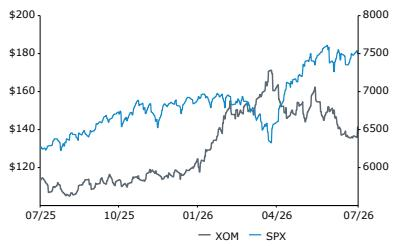

Despite the timing, we continue to see potential in integrated oil companies (with XOM as a preferred name) and certain E&P companies (DVN and FANG).

## Observations

We believe integrated companies may benefit from the current divergence between crack spreads and oil prices, with a preference for XOM. For E&Ps, we favor FANG and DVN.

## DETAILS

We note that oil prices and crack spreads vary over time. Current crack spreads remain near record levels while oil prices have moved lower.

A 3-2-1 crack spread based on Nymex contracts is the normalized per-barrel difference between the revenue from two barrels of gasoline and one barrel of diesel, minus the input cost of crude (WTI).

## EXHIBIT 1: Oil price and crack spreads over time

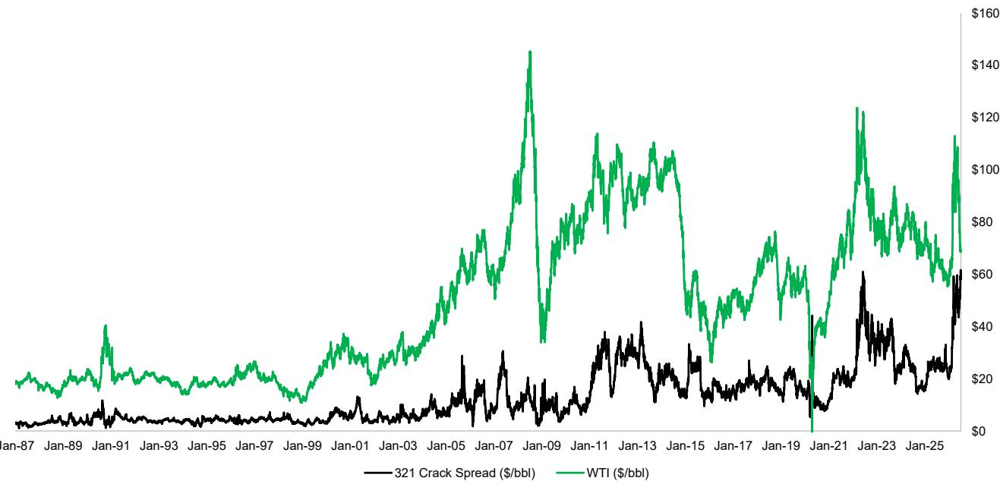

## Source: Bloomberg; Bernstein analysis

The value of the dollar changes over time. We can apply a CPI deflator to convert nominal data to real terms, or alternatively, consider ratios.

We show ratios below. If we arbitrarily select the start of 2012 as a reference point, we find that the average crack spread before was 20% and the average after was 33%. This period coincides with the rise of shale production, the Arab Spring, and a period of sustained high oil prices. It also marks the end of a period of low crack spreads. Regardless of the specific choice, crack spreads have been roughly a third of oil prices over the last decade or so.

EXHIBIT 2: Pre-shale crack spreads were a fifth (20%) and post-shale crack spreads are a third (33%)  
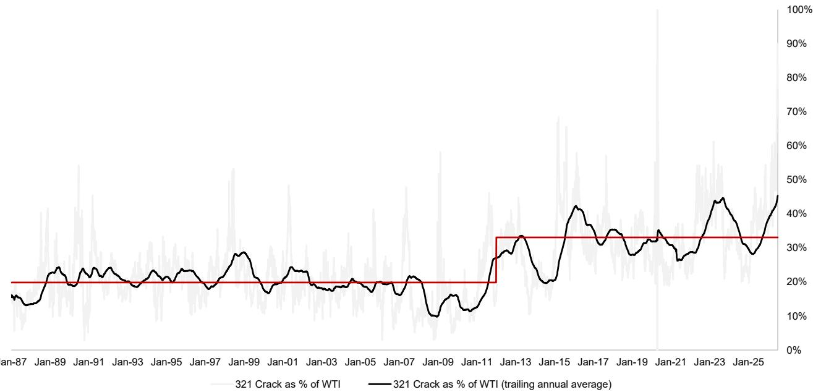

Source: Bloomberg; Bernstein analysis

If crack spreads are defined as:

$$
\text { Crack } = (2 \times \text { Gas } + 1 \times \text { Diesel } - 3 \times \text { Oil }) / 3
$$

then we can (Crack / Oil) = a third, we can show easily:

$$
\mathrm{Oil} = (2 \times \text { Gas } + 1 \times \text { Diesel }) / 4
$$

We can plot that formula against actual oil price. The fit is less accurate prior to 2012 but quite consistent afterwards.

EXHIBIT 3: Back-solving for oil price from gasoline and diesel yields good fit  
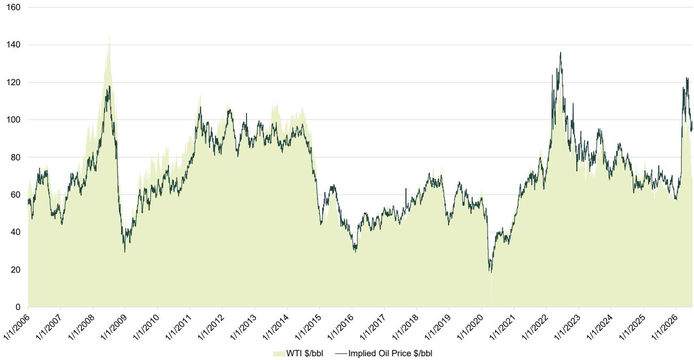  
Source: Bloomberg; Bernstein analysis

EXHIBIT 4: Post Covid-era...crack-implied oil price during Russia-Ukraine conflict was elevated...today's elevation is notable.  
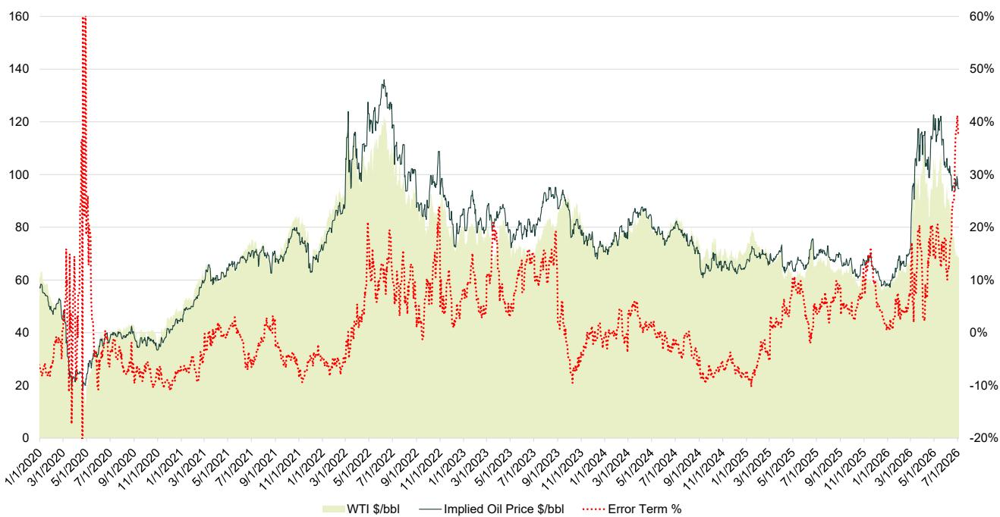  
Source: Bloomberg; Bernstein analysis

EXHIBIT 5: Zooming in...crack-implied price today is >\$90/bbl  
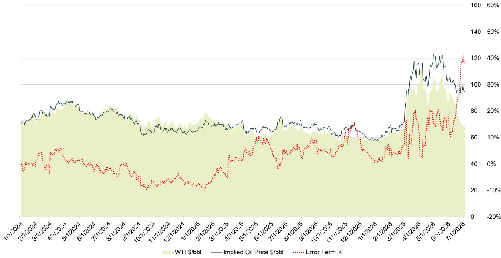  
Source: Bloomberg; Bernstein analysis

EXHIBIT 6: Oil prices reflect commercial inventories and appear to be less influenced by strategic (government) inventories such as SPRs  
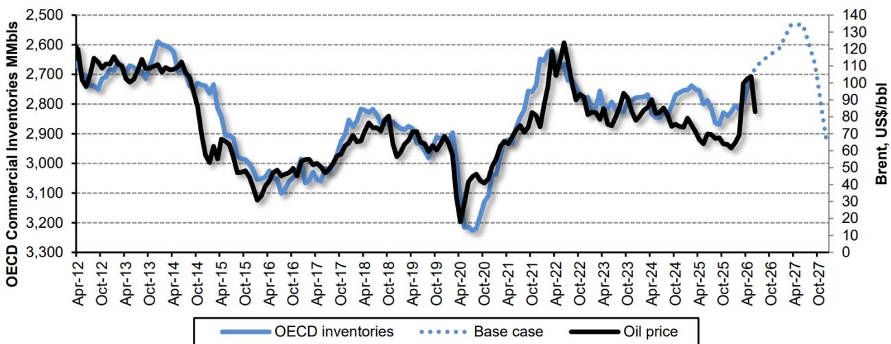  
Source: IEA; EIA; Bloomberg; Bernstein analysis

## BERNSTEIN TICKER TABLE

<table><tr><td rowspan="2">Ticker</td><td colspan="4">6 Jul 2026</td><td rowspan="2">TTMRel.</td><td colspan="4">Adjusted EPS</td><td colspan="3">Adjusted P/E (x)</td></tr><tr><td>Rating</td><td>Cur</td><td>Closing Price</td><td>Price Target</td><td>Cur</td><td>2025A</td><td>2026E</td><td>2027E</td><td>2025A</td><td>2026E</td><td>2027E</td></tr><tr><td>XOM (ExxonMobil)</td><td>O</td><td>USD</td><td>136.44</td><td>182.00</td><td>5.3%</td><td>USD</td><td>7.37</td><td>16.37</td><td>14.49</td><td>18.5</td><td>8.3</td><td>9.4</td></tr><tr><td>CVX (Chevron)</td><td>M</td><td>USD</td><td>168.10</td><td>204.00</td><td>(4.0)%</td><td>USD</td><td>8.43</td><td>16.58</td><td>13.26</td><td>19.9</td><td>10.1</td><td>12.7</td></tr><tr><td>COP (ConocoPhillips)</td><td>O</td><td>USD</td><td>103.58</td><td>121.00</td><td>(5.2)%</td><td>USD</td><td>6.18</td><td>13.89</td><td>10.88</td><td>16.8</td><td>7.5</td><td>9.5</td></tr><tr><td>DVN (Devon Energy)</td><td>O</td><td>USD</td><td>40.36</td><td>59.00</td><td>7.9%</td><td>USD</td><td>4.17</td><td>10.06</td><td>8.43</td><td>9.7</td><td>4.0</td><td>4.8</td></tr><tr><td>FANG (Diamondback)</td><td>O</td><td>USD</td><td>173.73</td><td>241.00</td><td>8.4%</td><td>USD</td><td>4.57</td><td>32.21</td><td>27.22</td><td>38.0</td><td>5.4</td><td>6.4</td></tr><tr><td>APA (APA)</td><td>M</td><td>USD</td><td>32.46</td><td>40.00</td><td>51.2%</td><td>USD</td><td>2.83</td><td>7.20</td><td>6.42</td><td>11.5</td><td>4.5</td><td>5.1</td></tr><tr><td>SPX</td><td></td><td></td><td>7,503.85</td><td></td><td></td><td></td><td></td><td></td><td></td><td></td><td></td><td></td></tr></table>

O - Outperform, M - Market-Perform, U - Underperform, NR - Not Rated, CS - Coverage Suspended  
Source: Bloomberg, Bernstein estimates and analysis.

## I. REQUIRED DISCLOSURES

References to "Bernstein" or the "Firm" in these disclosures relate to the following entities: Bernstein Institutional Services LLC (April 1, 2024 onwards), Bernstein & Co., LLC (pre April 1, 2024), Bernstein Autonomous LLP, BSG France S.A. (April 1, 2024 onwards), Bernstein (Hong Kong) Limited 盛博香港有限公司, Bernstein (Canada) Limited, Bernstein (India) Private Limited (SEBI registration no. INH000006378), Bernstein (Singapore) Private Limited, Bernstein Japan KK (サンフォード・C・バーンスタイン株式会社) and analysts employed by SG Africa Technologies & Services to produce Bernstein under a Global Services Agreement in place between Bernstein and SG.

Bernstein is part of a joint venture between SG (SG) and AllianceBernstein, L.P. (AB). Unless specifically noted otherwise, for purposes of these disclosures, references to Bernstein's “affiliates” relate to both SG and AB and their respective affiliates.

## VALUATION METHODOLOGY

## Exxon Mobil Corp

We rate XOM Outperform. We reach our target price of \$182/sh by applying an 7.0x multiple to 2027E EBITDA of \$96B and incorporating additional FCF to shareholders.

## Chevron Corp

We rate CVX Market-Perform. We reach our target price of \$204/sh by applying a 6.5x multiple to 2027E EBITDA of \$59B and incorporating additional FCF to shareholders.

## ConocoPhillips

We arrive at target price of \$121/sh by applying a 4.5x multiple to 2027E EBITDA of \$32B and incorporating additional FCF to shareholders.

## Devon Energy Corp

We reach our target price of \$59/sh by applying a 3x EV multiple to 2027E EBITDA of \$10.6B and incorporating dividends to reflect total shareholder return.

## Diamondback Energy, Inc.

We arrive at our target price of \$241/sh by applying a 4.5x multiple to 2027E adjusted EBITDA of \$15B and incorporating additional FCF to shareholders.

## APA Corp

We reach our target price of \$40/sh by applying a 2.5x EV multiple to 2027E EBITDA of \$5.6B and incorporating dividends to reflect total shareholder return.

## RISKS

## Exxon Mobil Corp

We rate XOM Outperform. Key downside risks to our price target include (a) market conditions yielding lower commodity prices than forecast, (b) failure to execute on critical growth initiatives (e.g. Stabroek, Permian, downstream/petrochemicals expansions), (c) lower refining margins than forecast, and (d) a prolonged polymer downcycle.

## Chevron Corp

We rate CVX Market-Perform. Key downside risks to our price target include (a) market conditions yielding lower commodity prices than forecast, (b) failure to execute on critical growth initiatives (e.g. Permian, DJ, GoM, Tengiz), and (c) lower refining margins than forecast.

## ConocoPhillips

We rate COP Outperform. Key risks to our price target include (a) poor portfolio management, (b) lower commodity prices and (c) operational disruptions at COP's key facilities.

## Devon Energy Corp

We rate DVN Outperform. Key downside risks to our price target include (a) lower commodity prices and differentials (especially Permian and NGLs) and (b) a poorly priced (or timed) acquisition or sale.

## Diamondback Energy, Inc.

Key downside risks include (a) lower than expected commodity prices and differentials (e.g. Midland, Waha, NGLs), (b) the inability to meet stated cost synergy and production volume targets related to the pending acquisition of Endeavor Energy Resources, and (c) a poorly priced (or timed) acquisition or sale.

## APA Corp

We rate APA Market-Perform. Key downside risks to our price target include (a) balance sheet risks in a low commodity environment, (b) execution mis-steps in Suriname, and (c) lower commodity prices. Key upside risks include (a) strong execution in Suriname and (b) higher commodity prices.

## RATINGS DEFINITIONS, BENCHMARKS AND DISTRIBUTION

## EQUITY RATINGS DEFINITIONS

## Bernstein brand

The Bernstein brand rates stocks based on forecasts of relative performance for the next 12 months versus the S&P 500 for stocks listed on the U.S. and Canadian exchanges, versus the Bloomberg Europe Developed Markets Large and Mid Cap Price Return Index EUR (EDME) for stocks listed on the European exchanges and emerging markets exchanges outside of the Asia Pacific region, versus the Bloomberg Japan Large and Mid Cap Price Return Index USD (JPL) for stocks listed on the Japanese exchanges, and versus the Bloomberg Asia ex-Japan Large and Mid Cap Price Return Index (ASIAX) for stocks listed on the Asian (ex-Japan) exchanges -unless otherwise specified.

The Bernstein brand has three categories of ratings:

- Outperform: Stock will outpace the market index by more than 15 pp
- Market-Perform: Stock will perform in line with the market index to within +/-15 pp
- Underperform: Stock will trail the performance of the market index by more than 15 pp

Coverage Suspended: Coverage of a company under the Bernstein brand has been suspended. Ratings and price targets are suspended temporarily, are no longer current, and should therefore not be relied upon.

Not Rated: A rating assigned when the stock cannot be accurately valued, or the performance of the company accurately predicted, at the present time. The covering analyst may continue to publish research reports on the company to update investors on events and developments.

Not Covered (NC) denotes companies that are not under coverage.

Bernstein brand stock ratings are based on a 12-month time horizon.

## Autonomous brand – common stocks

The Autonomous brand rates common stocks as indicated below. As our benchmarks we use the Bloomberg Europe 500 Banks And Financial Services Index (BEBANKS) and Bloomberg Europe Dev Mkt Financials Large and Mid Cap Price Ret Index EUR (EDMFI) index for developed European banks and Payments, the Bloomberg Europe 500 Insurance Index (BEINSUR) for European insurers, the S&P 500 and S&P Financials for US banks and Payments coverage, S5LIFE for US Insurance, the S&P Insurance Select Industry (SPSIINS) for US Non-Life Insurers coverage, and the Bloomberg Emerging Markets Financials Large, Mid and Small Cap Price Return Index (EMLSF) for emerging market banks and insurers and Payments. Ratings are stated relative to the sector (not the market).

The Autonomous brand has three categories of common stock ratings:

- Outperform (OP): Stock will outpace the relevant index by more than 10 pp
- Neutral (N): Stock will perform in line with the market index to within +/-10 pp
- Underperform (UP): Stock will trail the performance of the relevant index by more than 10 pp

Coverage Suspended: Coverage of a company under the Autonomous research brand has been suspended. Ratings and price targets are suspended temporarily, are no longer current, and should therefore not be relied upon.

Not Rated: A rating assigned when the stock cannot be accurately valued, or the performance of the company accurately predicted, at the present time. The covering analyst may continue to publish research reports on the company to update investors on events and developments.

Those denoted as ‘Feature’ (e.g., Feature Outperform FOP, Feature Under Outperform FUP) are our core ideas.

Not Covered (NC) denotes companies that are not under coverage.

Autonomous brand common stock ratings are based on a 12-month time horizon.

## Autonomous brand – preferred stocks

The Autonomous brand has three categories of preferred stock ratings:

- Outperform (OP): The total return of the preferred instrument is expected to outperform preferred securities of other issuers operating in similar sectors or rating categories over the next six months.
- Neutral (N): The total return of the preferred instrument is expected to perform in line with preferred securities of other issuers operating in similar sectors or rating categories over the next six months.
- Underperform (UP): The total return of the preferred instrument is expected to underperform preferred securities of other issuers operating in similar sectors or rating categories over the next six months.

Autonomous preferred stock ratings are based on a 6-month time horizon.

## AUTONOMOUS CREDIT RESEARCH

Where this report contains investment recommendations for credit instruments, as defined in article 3(1)(35) of the Market Abuse Regulation, the information below is presented to comply with its disclosure requirements.

The report may also include reference(s) to published opinions by other Autonomous or Bernstein analysts covering the equity securities of the issuer(s) referenced herein. Please note an investment recommendation for credit instruments published by the author(s) of this report may differ from the published view of the analyst covering equity securities for the issuer(s) contained in this report and vice versa.

## CREDIT RATINGS DEFINITIONS

The Autonomous brand has three categories of credit ratings:

- Credit Outperform (C-OP): The total return of the Reference Credit Instrument is expected to outperform the credit spread of bonds of other issuers operating in similar sectors or rating categories over the next six months.
- Credit Neutral (C-N): The total return of the Reference Credit Instrument is expected to perform in line with the credit spread of bonds of other issuers operating in similar sectors or rating categories over the next six months.
- Credit Underperform (C-UP): The total return of the Reference Credit Instrument is expected to underperform the credit spread of bonds of other issuers operating in similar sectors or rating categories over the next six months.

Autonomous credit ratings are based on a 6-month time horizon.

A list of all investment recommendations produced by the author(s) of this report alongside credit ratings history are available upon request.

It is at the sole discretion of the Firm as to when to initiate, update and cease research coverage. The Firm has established, maintains and relies on information barriers to control the flow of information contained in one or more areas (i.e. the private side) within the Firm, and into other areas, units, groups or affiliates (i.e. public side) of the Firm

## DISTRIBUTION OF EQUITY RATINGS/INVESTMENT BANKING SERVICES

Outperform (O); Market-Perform (M); Underperform (U); Coverage Suspended (CS); Not Covered (NC)

<table><tr><td>Equity Rating</td><td>Market Abuse Regulation (MAR) and FINRA Rating Category</td><td>Global Rating Distribution</td><td>Investment Banking Relationships*</td></tr><tr><td>Outperform</td><td>BUY</td><td>51.2%</td><td>15.3%</td></tr><tr><td>Market-Perform (Bernstein Brand) Neutral (Autonomous Brand)</td><td>HOLD</td><td>35.8%</td><td>16.2%</td></tr><tr><td>Underperform</td><td>SELL</td><td>13.1%</td><td>13.6%</td></tr></table>

\* These figures represent the percentage of companies within each equity rating category for which affiliates of Bernstein have provided investment banking services within the previous 12 months.
As of June 30, 2026. All figures are updated quarterly.

## PRICE CHARTS / RATINGS AND PRICE TARGET HISTORY

Prior to April 1, 2024, Bernstein & Co., LLC. issued the ratings and price target information in the graph(s) below for the following companies: Exxon Mobil Corp, Chevron Corp, ConocoPhillips, Devon Energy Corp and APA Corp.

Exxon Mobil Corp (XOM) Rating History for Bernstein as of 07/07/2026  
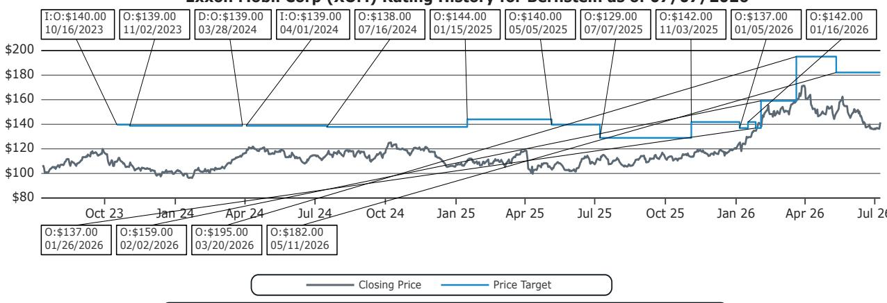

Chevron Corp (CVX) Rating History for Bernstein as of 07/07/2026  
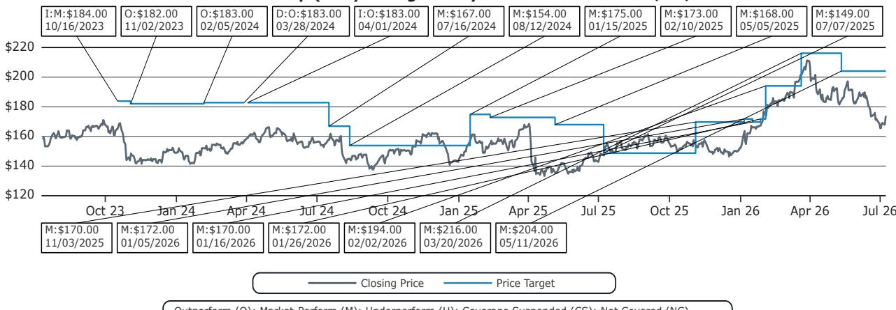

ConocoPhillips (COP) Rating History for Bernstein as of 07/07/2026  
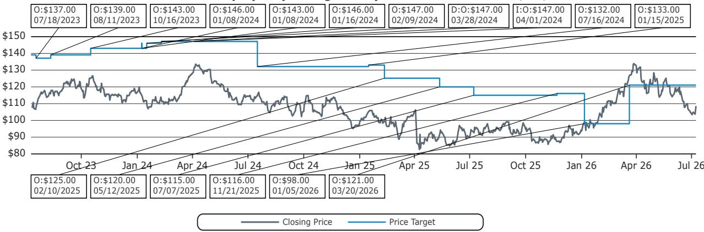  
Outperform (O); Market-Perform (M); Underperform (U); Coverage Suspended (CS); Not Covered (NC)

Devon Energy Corp (DVN) Rating History for Bernstein as of 07/07/2026  
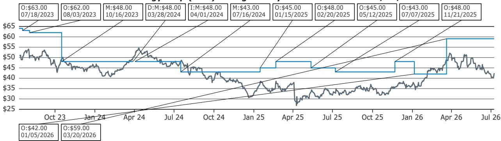  
Outperform (O); Market-Perform (M); Underperform (U); Coverage Suspended (CS); Not Covered (NC)

Diamondback Energy, Inc. (FANG) Rating History for Bernstein as of 07/07/2026  
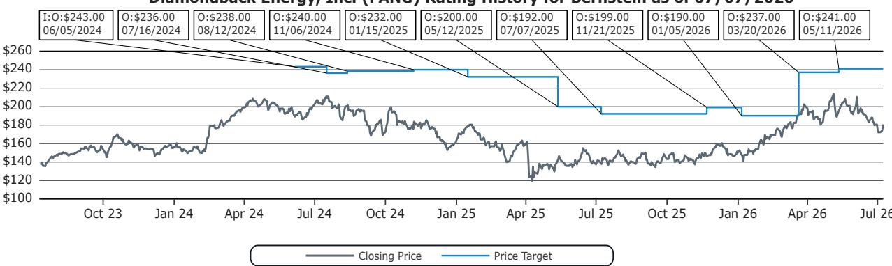  
Outperform (O); Market-Perform (M); Underperform (U); Coverage Suspended (CS); Not Covered (NC)

APA Corp (APA) Rating History for Bernstein as of 07/07/2026  
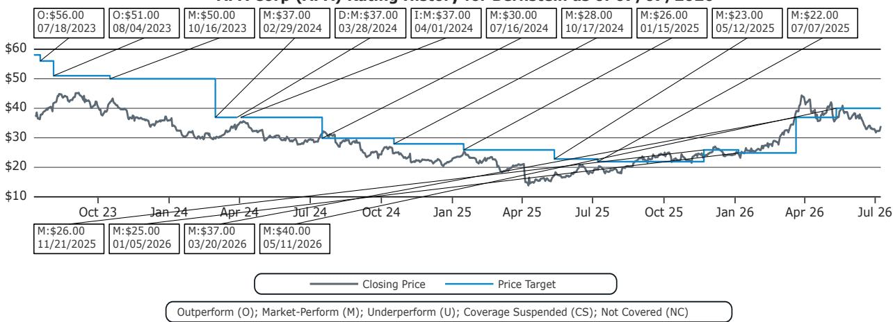  
All price target and closing price data in the chart(s) above are denominated in the currency noted in the Ticker Table of this report.

## CONFLICTS OF INTEREST

Bernstein Autonomous LLP or BSG France SA, beneficially, has either a net long or short position of 0.5% or more of the total issued share capital of a class of common equity securities of the following MiFID eligible securities: APA Corp.

An affiliate of Bernstein has received compensation for non-investment banking securities-related products or services in the previous twelve months from the following clients: Exxon Mobil Corp.

Bernstein and/or affiliates have received compensation for non-investment banking securities-related products or services in the previous twelve months from the following clients: Exxon Mobil Corp and Chevron Corp.

Certain affiliates of Bernstein act as market maker or liquidity provider in the equities securities of: Exxon Mobil Corp, Chevron Corp, ConocoPhillips, Devon Energy Corp, Diamondback Energy, Inc. and APA Corp.

## OTHER MATTERS

The legal entity(ies) employing the analyst(s) listed in this report, and their location, can be determined by the country code of their phone number, as follows:

+1 Bernstein Institutional Services LLC; New York, New York, USA

+44 Bernstein Autonomous LLP; London UK

+212 SG Africa Technologies & Services; Casablanca, Morocco

+33 BSG France S.A.; Paris, France

+34 BSG France S.A.; Madrid, Spain

+41 Bernstein Autonomous LLP; Geneva, Switzerland

+49 BSG France S.A.; Frankfurt, Germany

+91 Bernstein (India) Private Limited; Mumbai, India

+852 Bernstein (Hong Kong) Limited 盛博香港有限公司; Hong Kong, China

+65 Bernstein (Singapore) Private Limited; Singapore

+81 Bernstein Japan KK; Tokyo, Japan

Where this report has been prepared by research analyst(s) employed by a non-US affiliate, such analyst(s), is/are (unless otherwise expressly noted below) not registered as associated persons of Bernstein Institutional Services LLC or any other SEC-registered broker-dealer and are not licensed or qualified as research analysts with FINRA. Accordingly, such analyst(s) may not be subject to FINRA's restrictions regarding (among other things) communications by research analysts with a subject company, interactions between research analysts and investment banking personnel, participation by research analysts in solicitation and marketing activities relating to investment banking transactions, public appearances by research analysts, and trading securities held by a research analyst account.

Where this report has been prepared by research analyst(s) employed by SG Africa Technologies & Services (part of the SG group of companies), it has been prepared on behalf of a Bernstein company under a Global Services Agreement in place between Bernstein and SG.

## CERTIFICATION

Each research analyst listed in this report, who is primarily responsible for the preparation of the content of this report, certifies that all of the views expressed in this publication accurately reflect that analyst's personal views about any and all of the subject securities or issuers and that no part of that analyst's compensation was, is, or will be, directly or indirectly, related to the specific recommendations or views in this publication.

## II. ADDITIONAL GLOBAL CONFLICT DISCLOSURES

It is at the sole discretion of the Firm as to when to initiate, update and cease research coverage. The Firm has established, maintains and relies on information barriers to control the flow of information contained in one or more areas (i.e., the private side) within the Firm, and into other areas, units, groups or affiliates (i.e., public side) of the Firm.

## III. OTHER IMPORTANT INFORMATION AND DISCLOSURES

Separate branding is maintained for “Bernstein” and “Autonomous” research products.

- Bernstein produces a number of different types of research products including, among others, fundamental analysis and quantitative analysis under both the “Autonomous” and “Bernstein” brands. Recommendations contained within one type of research product may differ from recommendations contained within other types of research products, whether as a result of differing time horizons, methodologies or otherwise. Furthermore, views or recommendations within a research product issued under one brand may differ from views or recommendations under the same type of research product issued under the other brand. The Research Ratings System for the two brands and other information related to those Rating Systems are included in the previous section.

- Autonomous operates as a separate business unit within the following entities: Bernstein Institutional Services LLC, Bernstein Autonomous LLP, Bernstein (Hong Kong) Limited 盛博香港有限公司 and Bernstein (India) Private Limited. For information relating to “Autonomous” branded products (including certain Sales materials) please visit: www.autonomous.com. For information relating to Bernstein branded products please visit: www.bernsteinresearch.com.

Analysts are compensated based on aggregate contributions to the research franchise as measured by account penetration, productivity and proactivity of investment ideas. No analysts are compensated based on performance in, or contributions to, generating investment banking revenues.

This report has been produced by an independent analyst as defined in Article 3 (1)(34)(i) of EU 596/2014 Market Abuse Regulation (“MAR”) and the same article of MAR as it forms part of United Kingdom domestic law by virtue of the European Union (Withdrawal) Act 2018.

To our readers in the United States: Bernstein Institutional Services LLC, a broker-dealer registered with the U.S. Securities and Exchange Commission (“SEC”) and a member of the U.S. Financial Industry Regulatory Authority, Inc. (“FINRA”) is distributing this publication in the United States and accepts responsibility for its contents. Where this material contains an analysis of debt product(s), such material is intended only for institutional investors and is not subject to the US independence and disclosure standards applicable to debt research prepared for retail investors.

Bernstein Institutional Services LLC may act as principal for its own account or as agent for another person (including an affiliate) in sales or purchases of any security which is a subject of this report. This report does not purport to meet the objectives or needs of any specific individuals, entities or accounts.

To our readers in Canada: If this publication pertains to a Canadian domiciled company, it is being distributed in Canada by Bernstein (Canada) Limited, which is licensed and regulated by the Canadian Investment Regulatory Organization. If the publication pertains to a non-Canadian domiciled company, it is being distributed by Bernstein Institutional Services LLC, which is licensed and regulated by both the SEC and FINRA, into Canada under the International Dealers Exemption.

This document may not be passed onto any person in Canada unless that person qualifies as "permitted client" as defined in Section 1.1 of NI 31-103.

To our readers in Brazil: This report has been prepared by Bernstein Institutional Services LLC, and Banco BTG Pactual S.A. ("BTG") is responsible for the distribution of this report in Brazil.

To readers in the United Kingdom: This publication has been issued or approved for issue in the United Kingdom by Bernstein Autonomous LLP, authorised and regulated by the Financial Conduct Authority and located at 60 London Wall, London EC2M 5SH, +44 (0)20-7170-5000. Registered in England & Wales No OC343985.

This document is for distribution only to persons who (i) have professional experience in matters relating to investments falling within Article 19(5) of the Financial Services and Markets Act 2000 (Financial Promotion) Order 2005 (as amended, the “Financial Promotion Order”), (ii) are persons falling within Article 49(2)(a) to (d) (“high net worth companies, unincorporated associations, etc.”) of the Financial Promotion Order, (iii) are outside the United Kingdom, or (iv) are persons to whom an invitation or inducement to engage in investment activity (within the meaning of section 21 of the FSMA) in connection with the issue or sale of any securities may otherwise lawfully be communicated or caused to be communicated (all such persons together being referred to as “relevant persons”). This document is directed only at relevant persons and must not be acted on or relied on by persons who are not relevant persons. Any investment or investment activity to which this document relates is available only to relevant persons and will be engaged in only with relevant persons.

To our readers in the member states of the EEA:
