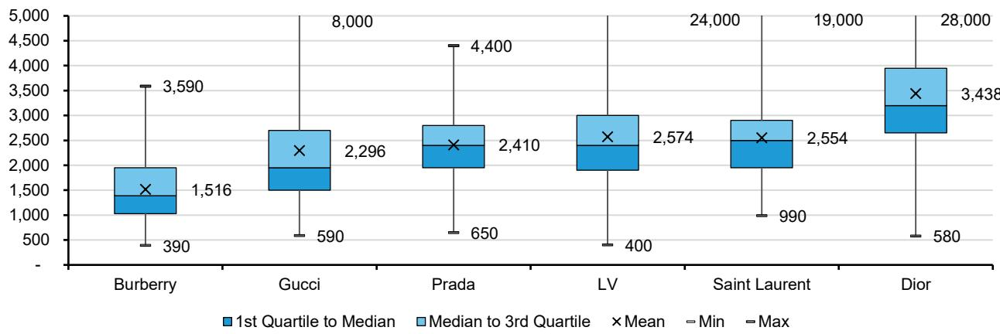
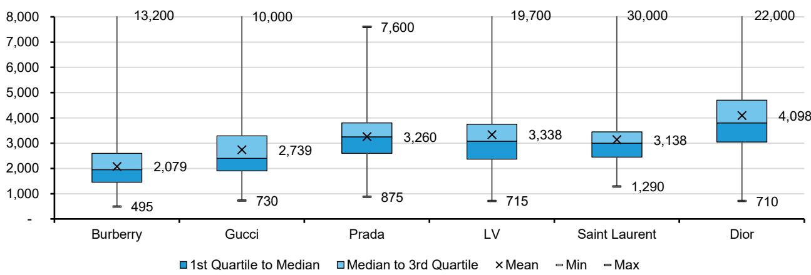

# Global Luxury Goods: The Handbag Price & Mix Barometer - Diverging LFL price and product changes in 2Q26

Luca Solca
+41 582 723 126
luca.solca@bernsteinsg.com

Maria Meita
+44 20 7170 0540
maria.meita@bernsteinsg.com

Yi-Peng Khoo, CFA
+44 20 7676 6822
yi-peng.khoo@bernsteinsg.com

Eric Chen, CFA

+852 2123 2628

eric.chen@bernsteinsg.com

Specialist Sales

Alix Turner
+44 20 7762 4044
alix.turner@bernsteinsg.com

We highlight product mix and price changes (including selective price adjustments at Gucci) implemented over 2Q26.

Our rebased 2Q26 tracker sees Chanel leading in terms of ‘newness’. 67% of the SKUs on Chanel’s French brand.com are likely new compared to the portfolio at the start of the quarter. Prada follows with 52% ‘newness’, largely concentrated at the bottom-half of its portfolio’s price range, with Gucci close behind at 51%. The rate of ‘newness’ at Dior and Burberry seems to have slowed vs. 1Q26, with 39% and 37% of their current portfolio introduced over the course of 2Q26.

Brands continue to diverge in approach when introducing newness. The bulk of Chanel's portfolio changes occurred across mid-May and early-June following the launch of the ‘Métiers d'Art’ collection, shown in Dec'25, building on 1Q26's momentum. Dior seems to have taken a more gradual approach: new handbag lines such as the “Milly-La-Forêt” augment updates to existing lines. For example, Dior seems to have taken a page out of Louis Vuitton's ‘value for money’ playbook by introducing a reversible Dior Toujours.

Gucci continues to take a more ‘experimental’ approach under Francesca Bellettini and Demna. The brand seems to be applying an initial launch strategy for its collections, ahead of a regular release in-store. For example, “Gucci Primavera” debuted with a ‘see now, buy now’ opportunity in end-Feb'26, ahead of the full collection arriving in Jul'26. This seems to emulate Moncler’s “Genius” strategy, to some extent, and is likely intended to drive in-store traffic and retail productivity. This adds another layer to how pricing, product and merchandising strategies have diverged.

Gucci continues to adjust its product portfolio; it is not above price adjustments. We had previously highlighted how “Generation Gucci” marked a slight downshift in the brand’s product architecture. Interestingly, we also note that Gucci is not above selective price adjustments. Global prices for SS26’s Mercato Tote Bag were adjusted by -20% to -25% (from €2.6k to €1.95k for the small version, in leather, in France) in early-May. This drives a -1% to -2% decline in our calculated LFL pricing, on a simple-average basis, contributing to a likely sequential decline in the simple-average price of Gucci’s overall handbag portfolio in 2Q26.

We believe Gucci faces a relative price/mix adjustment, net of price elasticity effects, in 2Q26. Almost all other brands have implemented LSD price increases in 2Q26 and enjoyed positive overall price/mix (Dior being the only other outlier with unchanged LFL prices and negative implied mix) - a key factor to account for when analyzing upcoming 2Q26E and 3Q26E organic growth rates. We caution that our calculations only cover handbags, include some data gaps and will differ from actual, volume-weighted reported rates. Net of price elasticity effects from Gucci's readjusted pricing architecture and improving brand accessibility, however, we believe the relative comparison still holds.

BERNSTEIN TICKER TABLE

<table><tr><td rowspan="2">Ticker</td><td rowspan="2">Rating</td><td rowspan="2">Cur</td><td rowspan="2">7 Jul 2026 Closing Price</td><td rowspan="2">Price Target</td><td rowspan="2">TTM Rel. Perf.</td><td colspan="4">Adjusted EPS</td><td colspan="3">Adjusted P/E (x)</td></tr><tr><td>Cur</td><td>2025A</td><td>2026E</td><td>2027E</td><td>2025A</td><td>2026E</td><td>2027E</td></tr><tr><td>BIRK (Birkenstock)</td><td>M</td><td>USD</td><td>45.56</td><td>50.00</td><td>(27.1)%</td><td>EUR</td><td>1.85</td><td>2.01</td><td>2.49</td><td>21.6</td><td>19.8</td><td>16.0</td></tr><tr><td>BC.IM (Brunello Cucinelli)</td><td>O</td><td>EUR</td><td>81.96</td><td>108.00</td><td>(43.0)%</td><td>EUR</td><td>1.99</td><td>2.26</td><td>2.65</td><td>41.2</td><td>36.3</td><td>30.9</td></tr><tr><td>BRBY.LN (Burberry)</td><td>O</td><td>GBp</td><td>1,105.00</td><td>1,300.00</td><td>(31.0)%</td><td>GBP</td><td>0.24</td><td>0.39</td><td>0.55</td><td>45.2</td><td>28.4</td><td>20.1</td></tr><tr><td>CFR.SW (Richemont)</td><td>O</td><td>CHF</td><td>185.20</td><td>200.00</td><td>3.9%</td><td>EUR</td><td>5.96</td><td>6.89</td><td>7.71</td><td>33.7</td><td>29.1</td><td>26.0</td></tr><tr><td>ZGN</td><td>O</td><td>USD</td><td>13.62</td><td>14.00</td><td>43.6%</td><td>EUR</td><td>0.45</td><td>0.42</td><td>0.60</td><td>26.4</td><td>28.3</td><td>19.8</td></tr><tr><td>EL.FP (EssilorLuxottica)</td><td>M</td><td>EUR</td><td>175.90</td><td>185.00</td><td>(44.7)%</td><td>EUR</td><td>6.79</td><td>7.65</td><td>8.95</td><td>25.9</td><td>23.0</td><td>19.6</td></tr><tr><td>RMS.FP (Hermes)</td><td>O</td><td>EUR</td><td>1,640.00</td><td>2,150.00</td><td>(50.6)%</td><td>EUR</td><td>43.12</td><td>43.89</td><td>52.30</td><td>38.0</td><td>37.4</td><td>31.4</td></tr><tr><td>KER.FP (Kering)</td><td>M</td><td>EUR</td><td>252.20</td><td>220.00</td><td>10.6%</td><td>EUR</td><td>4.35</td><td>6.13</td><td>9.86</td><td>58.0</td><td>41.1</td><td>25.6</td></tr><tr><td>MC.FP (LVMH)</td><td>O</td><td>EUR</td><td>495.80</td><td>600.00</td><td>(14.7)%</td><td>EUR</td><td>22.73</td><td>22.22</td><td>26.71</td><td>21.8</td><td>22.3</td><td>18.6</td></tr><tr><td>MONC.IM (Moncler)</td><td>M</td><td>EUR</td><td>51.28</td><td>57.50</td><td>(19.3)%</td><td>EUR</td><td>2.31</td><td>2.44</td><td>2.64</td><td>22.2</td><td>21.0</td><td>19.4</td></tr><tr><td>1913.HK (Prada SpA)</td><td>O</td><td>HKD</td><td>39.84</td><td>45.00</td><td>(55.2)%</td><td>EUR</td><td>0.33</td><td>0.28</td><td>0.32</td><td>13.4</td><td>15.8</td><td>14.1</td></tr><tr><td>SFER.IM (Ferragamo)</td><td>O</td><td>EUR</td><td>10.53</td><td>8.80</td><td>85.3%</td><td>EUR</td><td>(0.30)</td><td>0.04</td><td>0.15</td><td>(35.7)</td><td>280.5</td><td>71.8</td></tr><tr><td>UHR.SW (Swatch)</td><td>M</td><td>CHF</td><td>198.65</td><td>200.00</td><td>34.3%</td><td>CHF</td><td>0.03</td><td>5.74</td><td>8.67</td><td>N/M</td><td>34.6</td><td>22.9</td></tr><tr><td>SPX</td><td></td><td></td><td>7,503.85</td><td></td><td></td><td></td><td></td><td></td><td></td><td></td><td></td><td></td></tr><tr><td>EDME</td><td></td><td></td><td>1,606.65</td><td></td><td></td><td></td><td></td><td></td><td></td><td></td><td></td><td></td></tr><tr><td>EMLSF</td><td></td><td></td><td>6,219.44</td><td></td><td></td><td></td><td></td><td></td><td></td><td></td><td></td><td></td></tr><tr><td>ASIAX</td><td></td><td></td><td>1,945.70</td><td></td><td></td><td></td><td></td><td></td><td></td><td></td><td></td><td></td></tr></table>

O - Outperform, M - Market-Perform, U - Underperform, NR - Not Rated, CS - Coverage Suspended

BRBY.LN, CFR.SW base year is 2026;

Source: Bloomberg, Bernstein estimates and analysis.

## INVESTMENT IMPLICATIONS

Kering's Gucci turnaround remains a ‘work in progress’. Our data indicates that Gucci continues to work on increasing brand accessibility. Yet, recent selective price adjustments for newly launched product lines (SS26's Mercato tote bag) also suggest that Demna and the Gucci team have yet to truly re-ignite brand desirability. This has contributed to lackluster brand momentum, leaving Gucci fully exposed to painful - but likely necessary - price/mix adjustments.

We believe Dior remains a step ahead of Gucci in its own turnaround. Our data points to a less severe price-mix adjustment at Dior. Granted, Jonathan Anderson's reinvigoration of Dior has yet to match Matthieu Blazy's performance at Chanel, but creative merchandising and consistent communication across multiple cultural fronts (from the ‘Devil Wears Prada 2’ to Taylor Swift's wedding) can only help shrink the gap. Company commentary points to a gradual recovery; we would expect Dior to return to positive growth.

## DETAILS

EXHIBIT 1: We update our ‘newness’ tracker covering the entirety of 2Q26, with each brand’s portfolio at end-1Q26 serving as the base. Chanel continues to lead in terms of newness

<table><tr><td></td><td>Coach</td><td>Burberry</td><td>Gucci</td><td>YSL</td><td>Prada</td><td>LV</td><td>Dior</td><td>Chanel</td></tr><tr><td>€0-€500</td><td>46%</td><td>20%</td><td></td><td></td><td></td><td>100%</td><td></td><td></td></tr><tr><td>€500-€1k</td><td>46%</td><td>35%</td><td>51%</td><td>0%</td><td>83%</td><td>80%</td><td>27%</td><td></td></tr><tr><td>€1k-€1.5k</td><td></td><td>28%</td><td>53%</td><td>7%</td><td>67%</td><td>43%</td><td>36%</td><td></td></tr><tr><td>€1.5k-€2k</td><td></td><td>41%</td><td>55%</td><td>27%</td><td>29%</td><td>37%</td><td>48%</td><td></td></tr><tr><td>€2k-€2.5k</td><td></td><td>45%</td><td>52%</td><td>24%</td><td>80%</td><td>37%</td><td>41%</td><td></td></tr><tr><td>€2.5k-€3k</td><td></td><td>57%</td><td>56%</td><td>21%</td><td>56%</td><td>30%</td><td>33%</td><td></td></tr><tr><td>€3k-€3.5k</td><td></td><td>100%</td><td>33%</td><td>30%</td><td>40%</td><td>43%</td><td>41%</td><td></td></tr><tr><td>€3.5k-€4k</td><td></td><td>0%</td><td>33%</td><td>41%</td><td>22%</td><td>47%</td><td>35%</td><td>0%</td></tr><tr><td>€4-€4.5k</td><td></td><td></td><td>62%</td><td>31%</td><td>0%</td><td>50%</td><td>55%</td><td>100%</td></tr><tr><td>€4.5k-€5k</td><td></td><td></td><td>24%</td><td>50%</td><td></td><td>50%</td><td>32%</td><td>56%</td></tr><tr><td>€5-€5.5k</td><td></td><td></td><td>100%</td><td>50%</td><td></td><td>43%</td><td>38%</td><td>67%</td></tr><tr><td>€5.5k-€6k</td><td></td><td></td><td>0%</td><td></td><td></td><td>67%</td><td>26%</td><td>69%</td></tr><tr><td>€6-€6.5k</td><td></td><td></td><td>80%</td><td></td><td></td><td>100%</td><td>73%</td><td>50%</td></tr><tr><td>€6.5k-€7k</td><td></td><td></td><td>0%</td><td></td><td></td><td>100%</td><td>100%</td><td>80%</td></tr><tr><td>€7-€7.5k</td><td></td><td></td><td></td><td></td><td></td><td></td><td>50%</td><td>100%</td></tr><tr><td>€7.5k-€8k</td><td></td><td></td><td>0%</td><td></td><td></td><td></td><td></td><td>67%</td></tr><tr><td>&gt;€8k</td><td></td><td></td><td></td><td>0%</td><td></td><td>33%</td><td>40%</td><td>67%</td></tr><tr><td>Total</td><td>46%</td><td>37%</td><td>51%</td><td>24%</td><td>52%</td><td>40%</td><td>39%</td><td>67%</td></tr></table>

Source: brand.com, Bernstein analysis and estimates

EXHIBIT 2: The arrival of “Generation Gucci” has helped shift Gucci’s product architecture downwards...  
Handbag Price Architecture - France, in EUR - (03-Jul-26)  
  
Source: brand.com, Bernstein analysis and estimates

EXHIBIT 3: ... across all regions, we now see Gucci largely straddling the pricing umbrella formed between the ‘accessible luxury’ price points (exemplified by Burberry) and the more crowded ‘core luxury’ price points occupied by Prada, Louis Vuitton and Saint Laurent

Handbag Price Architecture - USA, in USD - (03-Jul-26)  
  
Source: brand.com, Bernstein analysis and estimates

EXHIBIT 4: However, this readjustment in pricing architecture will likely generate near-term price-mix adjustments on organic growth performance

<table><tr><td colspan="2">Seq. Change in Price Mix - QoQ</td><td>France</td><td>UK</td><td>China</td><td>USA</td><td>Japan</td></tr><tr><td rowspan="3">Burberry</td><td>LFL Price Δ</td><td>0.6%</td><td>0.6%</td><td>0.9%</td><td>0.8%</td><td>0.0%</td></tr><tr><td>Implied Mix Δ</td><td>-0.6%</td><td>3.0%</td><td>5.2%</td><td>4.6%</td><td>8.1%</td></tr><tr><td>Average Price Δ</td><td>0.0%</td><td>3.6%</td><td>6.1%</td><td>5.4%</td><td>8.1%</td></tr><tr><td rowspan="3">Gucci</td><td>LFL Price Δ</td><td>-0.5%</td><td>-1.7%</td><td>-1.2%</td><td>-1.6%</td><td>-1.4%</td></tr><tr><td>Implied Mix Δ</td><td>-10.8%</td><td>-8.0%</td><td>-5.6%</td><td>-6.1%</td><td>-2.5%</td></tr><tr><td>Average Price Δ</td><td>-11.4%</td><td>-9.7%</td><td>-6.8%</td><td>-7.7%</td><td>-3.9%</td></tr><tr><td rowspan="3">Prada</td><td>LFL Price Δ</td><td>0.9%</td><td>0.8%</td><td>0.9%</td><td>3.6%</td><td>3.2%</td></tr><tr><td>Implied Mix Δ</td><td>-8.6%</td><td>-9.3%</td><td>2.6%</td><td>-2.1%</td><td>4.6%</td></tr><tr><td>Average Price Δ</td><td>-7.7%</td><td>-8.5%</td><td>3.5%</td><td>1.6%</td><td>7.8%</td></tr><tr><td rowspan="3">Louis Vuitton</td><td>LFL Price Δ</td><td>0.0%</td><td>2.0%</td><td>0.0%</td><td>3.0%</td><td>4.0%</td></tr><tr><td>Implied Mix Δ</td><td>-2.0%</td><td>-0.1%</td><td>5.9%</td><td>-0.5%</td><td>-3.0%</td></tr><tr><td>Average Price Δ</td><td>-2.0%</td><td>1.8%</td><td>5.9%</td><td>2.5%</td><td>1.0%</td></tr><tr><td rowspan="3">Saint Laurent</td><td>LFL Price Δ</td><td>0.4%</td><td>0.9%</td><td>1.7%</td><td>1.5%</td><td>3.0%</td></tr><tr><td>Implied Mix Δ</td><td>3.8%</td><td>1.5%</td><td>-3.5%</td><td>1.9%</td><td>4.8%</td></tr><tr><td>Average Price Δ</td><td>4.2%</td><td>2.4%</td><td>-1.8%</td><td>3.4%</td><td>7.8%</td></tr><tr><td rowspan="3">Dior</td><td>LFL Price Δ</td><td>0.0%</td><td>0.0%</td><td>0.0%</td><td>0.0%</td><td>0.0%</td></tr><tr><td>Implied Mix Δ</td><td>0.0%</td><td>0.0%</td><td>-3.4%</td><td>-2.6%</td><td>-1.8%</td></tr><tr><td>Average Price Δ</td><td>0.0%</td><td>0.0%</td><td>-3.4%</td><td>-2.6%</td><td>-1.8%</td></tr><tr><td rowspan="3">Chanel</td><td>LFL Price Δ</td><td>0.6%</td><td>0.9%</td><td>0.2%</td><td>0.3%</td><td>-0.2%</td></tr><tr><td>Implied Mix Δ</td><td>1.1%</td><td>2.3%</td><td>1.5%</td><td>1.2%</td><td>3.0%</td></tr><tr><td>Average Price Δ</td><td>1.6%</td><td>3.3%</td><td>1.7%</td><td>1.5%</td><td>2.8%</td></tr></table>

Note that our LFL and Average Price calculations are not fully representative of actual/reported changes to price-mix given differences attributable to proportional sales volumes, and potential data gaps (e.g. in France for Gucci)
Source: brand.com, Bernstein analysis

EXHIBIT 5: Gucci's negative LFL price calculations are a result of price adjustments on the Mercato tote bag - launched as part of the SS26 collection - implemented in early-May

<table><tr><td colspan="12">Price History of Selected Gucci Handbags</td></tr><tr><td>Model</td><td>Country</td><td>Currency</td><td>27-Mar-26</td><td>10-Apr-26</td><td>24-Apr-26</td><td>01-May-26</td><td>08-May-26</td><td>22-May-26</td><td>12-Jun-26</td><td>03-Jul-26</td><td>% Δ</td></tr><tr><td rowspan="6">Mercato Large Tote Bag</td><td>FR</td><td>EUR</td><td>2,900</td><td>2,900</td><td></td><td>2,900</td><td>2,300</td><td>2,300</td><td>2,300</td><td>2,300</td><td>-21%</td></tr><tr><td>GB</td><td>GBP</td><td>2,560</td><td>2,560</td><td>2,560</td><td>2,040</td><td>2,040</td><td>2,040</td><td>2,040</td><td>2,040</td><td>-20%</td></tr><tr><td>CN</td><td>RMB</td><td></td><td></td><td></td><td></td><td></td><td></td><td></td><td></td><td></td></tr><tr><td>US</td><td>USD</td><td>3,600</td><td>3,600</td><td>3,600</td><td>3,600</td><td>2,900</td><td>2,900</td><td>2,900</td><td>2,900</td><td>-19%</td></tr><tr><td>JP</td><td>JPY</td><td></td><td></td><td></td><td></td><td></td><td></td><td></td><td></td><td></td></tr><tr><td>AE</td><td>AED</td><td>14,100</td><td>14,100</td><td>14,100</td><td>11,200</td><td>11,200</td><td>11,200</td><td>11,200</td><td>11,200</td><td>-21%</td></tr><tr><td rowspan="6">Mercato Medium Tote Bag</td><td>FR</td><td>EUR</td><td>2,900</td><td>2,900</td><td></td><td>2,900</td><td>2,300</td><td>2,300</td><td>2,300</td><td>2,300</td><td>-21%</td></tr><tr><td>GB</td><td>GBP</td><td>2,560</td><td>2,560</td><td>2,560</td><td>2,040</td><td>2,040</td><td>2,040</td><td>1,200</td><td>2,040</td><td>-20%</td></tr><tr><td>CN</td><td>RMB</td><td>28,500</td><td>28,500</td><td>28,500</td><td>23,000</td><td>23,000</td><td>23,000</td><td>23,000</td><td>23,000</td><td>-19%</td></tr><tr><td>US</td><td>USD</td><td>3,600</td><td>3,600</td><td>3,600</td><td>3,600</td><td>2,900</td><td>2,900</td><td>2,900</td><td>2,900</td><td>-19%</td></tr><tr><td>JP</td><td>JPY</td><td>522,500</td><td>522,500</td><td>522,500</td><td>522,500</td><td>418,000</td><td>418,000</td><td>418,000</td><td>418,000</td><td>-20%</td></tr><tr><td>AE</td><td>AED</td><td>14,100</td><td>14,100</td><td>14,100</td><td>11,200</td><td>11,200</td><td>11,200</td><td>11,200</td><td>11,200</td><td>-21%</td></tr><tr><td rowspan="6">Mercato Small Tote Bag</td><td>FR</td><td>EUR</td><td>2,600</td><td>2,600</td><td></td><td>2,600</td><td>1,950</td><td>1,950</td><td>1,950</td><td>1,950</td><td>-25%</td></tr><tr><td>GB</td><td>GBP</td><td>2,300</td><td>2,300</td><td>2,300</td><td>1,730</td><td>1,730</td><td>1,730</td><td>1,730</td><td>1,730</td><td>-25%</td></tr><tr><td>CN</td><td>RMB</td><td>25,500</td><td>25,500</td><td>25,500</td><td>20,000</td><td>20,000</td><td>20,000</td><td>20,000</td><td>20,000</td><td>-22%</td></tr><tr><td>US</td><td>USD</td><td>2,950</td><td>2,950</td><td>2,950</td><td>2,950</td><td>2,350</td><td>2,350</td><td>2,350</td><td>2,350</td><td>-20%</td></tr><tr><td>JP</td><td>JPY</td><td>462,000</td><td>462,000</td><td>462,000</td><td>462,000</td><td>363,000</td><td>363,000</td><td>363,000</td><td>363,000</td><td>-21%</td></tr><tr><td>AE</td><td>AED</td><td>12,650</td><td>12,650</td><td>12,650</td><td>9,500</td><td>9,500</td><td>9,500</td><td>9,500</td><td>9,500</td><td>-25%</td></tr></table>

Source: brand.com, Bernstein analysis and estimates

## A Note on Methodology

• We collect data on a weekly basis across six countries: France, the UK, China, the USA, Japan, and the UAE

\- We identify like-for-like (LFL) products within our data set, which we define as products with the same SKU number or ID that appear across all time periods, for each region.

\- We use this subset of LFL products to calculate a ‘LFL Price’ change for the period covered.

\- We also calculate a portfolio ‘Average Price’ change, which is a simple average of all prices across the portfolio within each region.

\- The ‘Implied Mix’ change is the difference between the Average Price change and the LFL Price change and largely captures any changes due to mix (e.g. the insertion or removal of differently price SKUs).

\- Caveats to keep in mind:

\- The data collection process is dependent on how SKUs are listed on each brand.com. Even within brands, brand.com design may differ across regions (most commonly for China), or over time (e.g. Louis Vuitton and Chanel have updated their brand.com design over the course of 2Q26). This could affect the product mix identified within each period and the comparability of data over time.

\- The data collection process is dependent on what SKUs are listed on each brand.com. Certain product lines may be given more prominence in one region than in another (e.g. backpacks in Japan).

\- The data is sometimes subject to data gaps when a product is temporarily removed from the dataset. The product is no longer counted in LFL calculations as a
