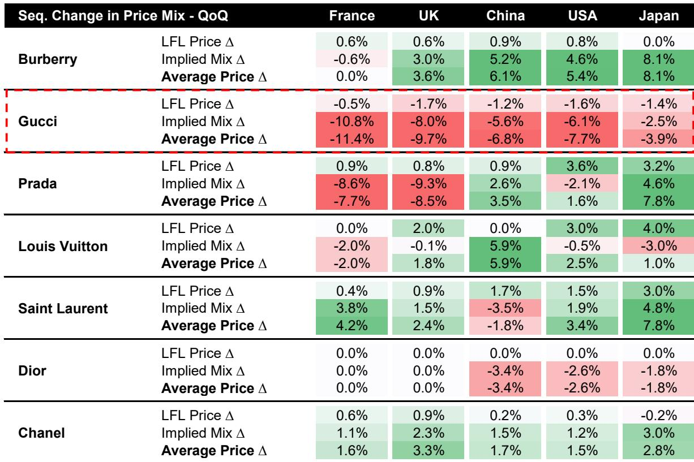
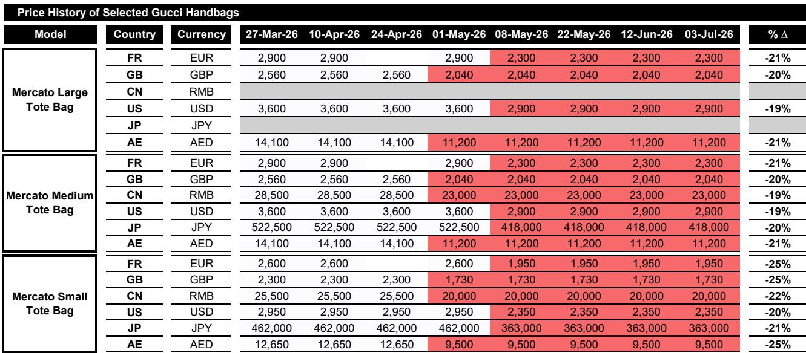
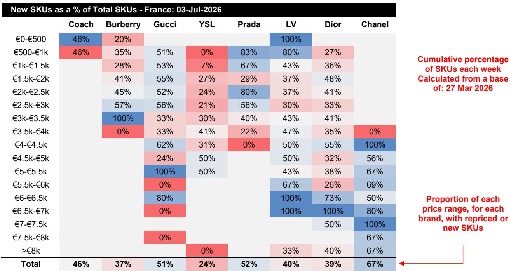

# 奢侈品战略分化：手袋定价如何揭示市场中的品牌定位差异

全球奢侈品手袋市场已不再沿着单一方向发展。过去，人们可以假设知名品牌会步调一致，每年提价，并受益于消费者转向更高价位产品带来的稳定结构升级。那个时代已经结束。2026年第二季度的数据揭示了全球主要皮具品牌之间战略上的根本性分化，而近期一份手袋价格与结构晴雨表显示，这种分化不仅是战术性的，更是结构性的。

核心观点很明确：品牌目前正采取三种不同的战略路径，市场对它们的反馈也各不相同。香奈儿正以远超同行的速度加速其产品更新周期，在更新其三分之二产品组合的同时维持定价能力。普拉达正以新品填充其价格区间的下半部分，押注于销量而非平均交易价值。古驰则正在做一件对其品牌地位而言前所未有的事情：降低新推出产品的价格，这一举动虽显无奈，但可能对其生存至关重要。要判断哪种策略会胜出，需要超越季度收入报告，深入观察产品架构、价格弹性和消费者认知的微观机制。

手袋品类是个人奢侈品中最大的利润池，今天的定价决策将决定未来三到五年的竞争格局。将所有奢侈品公司视为单一交易标的，可能会错失该领域自疫情后繁荣以来最重要的转折点。

## 香奈儿的更新率定义了品牌投入的新基准

第二季度追踪数据中最引人注目的发现是香奈儿产品轮换的速度。与季度初相比，香奈儿法国官网上67%的SKU是新品。这不仅仅是季节性更新，它代表了一种持续的更新策略，为行业设立了新标准。

香奈儿方法特别值得关注之处在于，这种更新并非集中在某个单一价格点上。新品分布在整个产品组合中，从3500欧元到4000欧元的区间，一直延伸到8000欧元以上的高端领域。这表明香奈儿并非单纯追逐潮流或试图吸引特定人群。相反，该品牌将其整个手袋产品组合视为一个活生生的系列，必须不断更新以维持稀缺性和专属感。

其战略意义深远。香奈儿实际上是在压缩产品生命周期。在传统的奢侈品模式中，品牌会推出一个系列，销售几个季度，然后停产。香奈儿正在缩短这个时间线，促使消费者现在做出决定，否则可能错失机会。这创造了一个不依赖降价或促销活动的强大需求生成机制。这也使香奈儿的定价能力自我强化：当消费者知道今天可买的包下个月可能就买不到时，他们对价格的敏感度就会降低。

数据支持了这一观点。香奈儿第二季度的同款价格涨幅温和，各地区在0.2%至0.9%之间。但隐含的结构效应在所有地区都是积极的，这意味着即使在更新产品组合时，香奈儿也成功地将构成转向了更高价位的商品。香奈儿手袋的平均价格在主要市场环比上涨了1.5%至3.3%，考虑到新品引入的高基数，这是一个显著的成就。

## 普拉达与古驰：可及性奢侈品的两种面貌

如果说香奈儿代表了持续高端化的高路，那么普拉达和古驰则代表了如何扩大品牌吸引力的两种截然不同的诠释。两个品牌的新品引入率相似，普拉达为52%，古驰为51%。但这些新品的构成却讲述了截然不同的故事。

普拉达的新品引入高度集中在价格区间的下半部分。在500欧元至1000欧元的区间，83%的SKU是新品。在1000欧元至1500欧元的区间，这一比例为67%。这是一种旨在吸引年轻消费者和那些有抱负但尚未准备好花费普拉达高端价格的消费者的策略。风险在于这会稀释品牌的平均交易价值，数据证实了这一担忧。普拉达在法国、英国和美国的隐含结构效应为负，意味着其产品组合的构成转向了较低价位的商品。

然而，普拉达的同款价格涨幅是行业中较强劲的之一，各地区在0.8%至3.6%之间。这表明普拉达试图两全其美：提高经典款式的价格，同时用新品充斥入门级市场。对平均价格的净影响好坏参半，在法国和英国环比下降，但在中国、美国和日本有所上升。这是一项需要谨慎执行的策略，它最终是会增强还是削弱品牌，尚无定论。

古驰的情况更令人担忧。该品牌不仅在其价格区间的低端引入新品，还在积极降低新推出产品的价格。作为2026春夏系列一部分的Mercato托特包，在5月初经历了全球性的价格下调，幅度为19%至25%。法国的小号版本从2600欧元降至1950欧元，降幅达25%。这不是促销折扣或临时降价。这是对上市仅几个月的产品进行的永久性价格下调。

其影响是严重的。古驰在所有五个追踪地区的同款价格变化均为负值，范围从法国的-0.5%到英国的-1.7%。隐含的结构效应更糟，环比下降5.6%至10.8%。古驰手袋产品组合的平均价格环比下降了3.9%至11.4%，具体取决于地区。这不是一个正在实现软着陆的品牌；这是一个正在主动向下重新定价的品牌。

## Mercato降价揭示古驰的深层问题

对Mercato托特包降价的决策进行分析具有重要意义，因为它揭示了古驰面临的战略困境。该品牌正处于新领导下的创意转型期，“Generation Gucci”系列本应标志着一个新的开始。然而，定价数据表明，新系列在其初始价格点上未能产生足够的需求。

此次降价尤其能说明问题，因为它是全球同步实施的。这不是为了应对汇率波动或当地市场状况的区域性调整。这是一次协调一致的全球重新定价，表明品牌领导层认为该产品相对于消费者的支付意愿而言定价过高。对于像古驰这样历来享有溢价定价能力的品牌来说，这是一个重大的让步。

战略问题是，这次降价是会刺激需求，还是会进一步侵蚀品牌形象。在奢侈品领域，价格是品质和专属性的信号。对新推出的产品降价25%，向消费者传递了一个令人困惑的信号。这表明品牌自身对产品的价值主张也不确定。这种不确定性可能具有传染性，导致消费者质疑是否应该现在购买，还是等待进一步降价。

关于古驰产品架构的数据强化了这一担忧。该品牌的手袋产品组合现在横跨了可及性奢侈品（以博柏利为代表）与更拥挤的核心奢侈品领域（由普拉达、路易威登和圣罗兰占据）之间的价格区间。这是一个尴尬的位置。古驰既非此亦非彼，而Mercato的降价表明该品牌正在这个中间地带挣扎着寻找立足点。

## 报告未完全解答的问题：弹性问题

尽管非常详尽，但手袋价格与结构晴雨表留下了一个关键问题未解答：这些产品的需求价格弹性是多少？该报告追踪了定价和产品结构的变化，但并未将这些变化与实际销量联系起来。这不是对方法的批评；数据基于对在线产品组合的SKU级观察，而非交易数据。但这意味着最重要的分析问题仍然悬而未决。

当古驰将Mercato托特包的价格降低25%时，需求是否会增加到足以抵消更低价格的程度？这个问题的答案决定了降价是理性的还是破坏性的。如果需求是有弹性的，降价可以刺激足够的销量来维持甚至增加收入。如果需求缺乏弹性，降价只会破坏收入和品牌资产。

报告作者谨慎地指出，他们的计算仅涵盖手袋，包含一些数据缺口，并且会与实际按销量加权的报告率有所不同。这一说明至关重要。价格和结构数据是一个领先指标，不能替代销售数据。使用此报告进行决策的人必须辅以公司自身的实际收入和利润率数据。

另一个相关的未解问题是降价如何影响古驰产品组合中的其他产品。如果Mercato托特包在法国的售价现在是1950欧元，这会如何影响消费者对定价2500欧元或3000欧元的包的看法？存在同类相食的风险，即原本可能购买更高价包的消费者现在选择Mercato，因为它代表了更好的价值。还存在锚定效应的风险，即较低的价格成为整个品牌的参考点，使得维持其他产品的溢价定价变得更加困难。

## 应对奢侈品分化的决策框架

手袋策略的分化要求一个比简单品牌认知或历史表现更复杂的分析框架。以下三部分框架可以帮助评估哪些品牌正在建立可持续的竞争优势，哪些正在做出可能代价高昂的短期妥协。

首先，评估新品与定价能力之间的关系。理想情况是高新品率结合正面的结构效应以及稳定或上升的同款价格。这就是香奈儿所实现的。这表明品牌的新产品正在获得溢价，并且消费者正在产品组合内进行升级。警示信号是高新品率结合负面的结构效应和下降的价格，这正是古驰正在经历的情况。这表明品牌正在利用新品来降低其价格架构，这是疲软而非活力的迹象。

其次，评估价格涨幅的可持续性。普拉达在价格区间低端引入新品的同时提高同款价格的能力令人印象深刻，但这引发了一个问题：该品牌能维持这种双重策略多久？最终，较低价位的新品将构成产品组合的更大份额，结构效应将变得更加负面。需要关注的关键指标是多个季度平均价格的趋势。如果普拉达能够在保持新品率的同时稳定或提高其平均价格，那么该策略是有效的。如果平均价格继续下降，那么该品牌实际上是在向下调整。

第三，考虑每个价格区段内的竞争动态。手袋市场不是一个单一市场；它是由价格点定义的一系列重叠区间。香奈儿主要在3500欧元以上的区间运营，那里的竞争有限。古驰现在横跨1000欧元至2500欧元的区间，在那里它直接面对来自普拉达、路易威登和圣罗兰的竞争。这是一个更加拥挤和价格敏感的区间，古驰的降价表明该品牌难以在其中实现差异化。

## 有待进一步分析的问题

第二季度数据最引人入胜之处在于它对行业未来轨迹的暗示。如果香奈儿的快速更新策略被证明是可持续的，它可能会迫使其他品牌加速自己的产品周期，从而增加整个行业的成本和复杂性。如果普拉达在提价的同时引入低价位新品的双重策略成功，它可能成为其他寻求在不稀释高端定位的情况下扩大吸引力的品牌的模板。

但最重大的问题关乎古驰。该品牌正处于一场高风险的实验之中。它正在降价，通过借鉴盟可睐的“drop”策略引入新品，并试图在新领导下重置其创意方向。如果这个实验成功，古驰可能会成为一个更强大、更易接近、拥有更广泛消费者基础的品牌。如果失败，该品牌可能会陷入降价和认知度下降的恶性循环。

第二季度的数据提供了一个快照，而非预测。完整报告包含关于地区差异、价格架构变化以及推动这些变化的具体产品的更多细节。对于那些希望了解在当前环境中哪些品牌正在胜出、哪些正在落后的观察者来说，这些细节至关重要。

加入社区阅读完整报告并查看原始图表。

*仅供参考。部分内容可能基于源材料通过AI辅助生成、翻译、总结或编辑，可能存在遗漏或错误。请独立核实。本文不构成专业建议。*

仅供参考。部分内容可能基于源材料通过AI辅助生成、翻译、总结或编辑，可能存在遗漏或错误。请独立核实。本文不构成专业建议。

