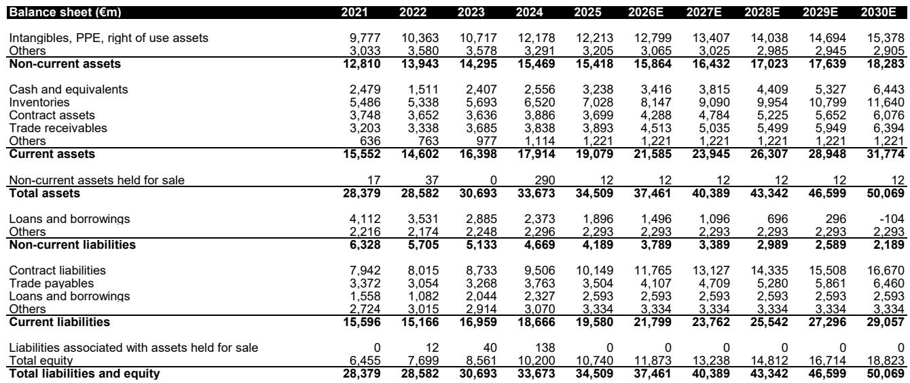
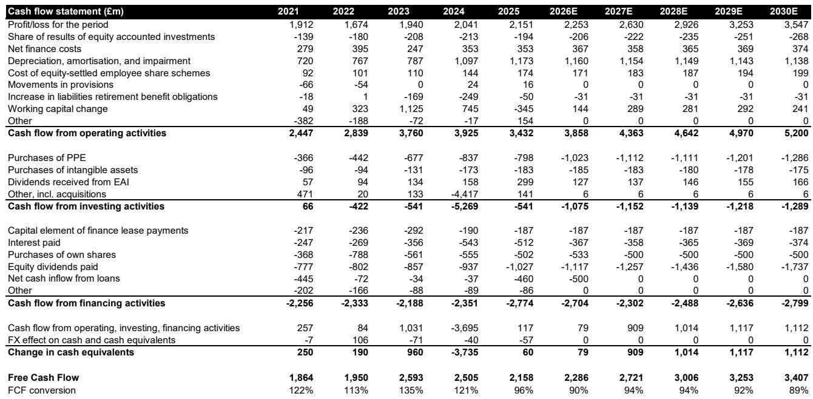
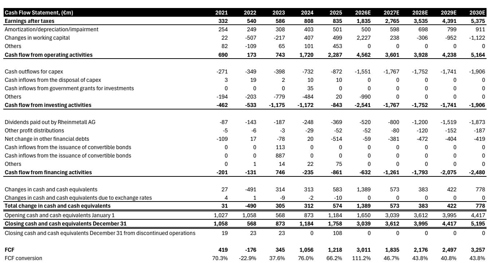

# Bernstein：现金流修复才是真正拐点，Bernstein拆解防务股自证能力

欧洲防务板块过去一年经历了从集体飙升到剧烈分化的转折。Bernstein在最新发布的Q2'26前瞻报告中给出一个清晰判断：板块普涨阶段已经结束，公司将根据自身执行力、订单可见度和业务结构进入分化行情。报告重点覆盖了六家公司，但核心信号只有一个——在宏观叙事让位于公司基本面的窗口期，拥有“自证”能力的标的将跑赢。

这份报告发布的时间点值得注意。欧洲防务股自2025年初以来波动剧烈，多数标的的估值已回落到2026年初的水平。市场不再满足于“国防开支上升”的宏大逻辑，而是开始追问：哪家公司真正把订单转化成了利润，谁的现金流在改善，谁的业务组合能抵御“新战争形态”的叙事冲击。

**KC评论：** Bernstein的核心框架其实是一个经典的“从beta到alpha”切换。当行业整体估值不再便宜，资金就会从买赛道变成买选手。这份报告的价值在于，它给出了一个可验证的筛选逻辑——关注那些不需要依赖宏观假设、靠自身经营就能实现盈利超预期的公司。

## 1. 莱昂纳多：管理层更迭后的“自证”机会

在所有覆盖标的中，Bernstein对莱昂纳多的战术偏好最高。核心逻辑不是订单暴增，而是“连续超预期并上调指引”的能力。报告预计其二季度EBITA将高出市场共识5%，且现金流改善明显。更重要的是，公司业务组合偏重电子、导弹和防空系统，在当前“新战争形态”叙事下防御性更强。

一个意外的催化剂是CEO更迭。前CEO Cingolani自2023年起主导了公司的扭亏为盈，但他的背景是科学家和政治家。接任的Mariani在莱昂纳多和MBDA工作超过20年，更熟悉核心业务。Bernstein认为，这一变化虽然短期引发报价调整，但长期看有助于公司从“扭亏故事”过渡到“增长故事”。

**KC评论：** 管理层更迭往往被市场视为不确定性，但Bernstein在这里做了一个反直觉判断：如果新任CEO的执行力不差，这种“从外部明星到内部专家”的过渡反而可能降低长期不确定性。值得关注的是，报告提到莱昂纳多当前估值仅为EBITDA的11倍，低于板块平均的14倍，这意味着如果业绩持续超预期，估值修复的空间可能比盈利增长本身更大。

## 2. 泰雷兹：市场过度聚焦的“短板”正在变成长板

泰雷兹是2025年许多对冲产品做空的对象，原因很直接：它是欧洲防务股中军事业务占比最低的公司之一（略超50%），而且网络安全业务明显影响业绩。但Bernstein认为，做空逻辑正在瓦解。

网络安全业务目前仅占泰雷兹销售额的8%，且从二季度起将面临容易的同比基数。报告预计该业务将恢复增长，这意味着它不再有足够分量来驱动盈利下调。与此同时，公司核心的航空航天与防务业务增长强劲，报告在这两个板块的预测分别高出市场共识5%以上。

另一个值得注意的动向是收购Exail。这笔交易估值偏高（约28倍远期EV/EBIT），但战略逻辑清晰——强化海军领域的布局。Bernstein认为，短期内财务影响有限，但释放了一个重要信号：管理层正在把注意力重新聚焦到核心防务业务上。

## 3. 莱茵金属：高增长预期的“信任重建”时刻

莱茵金属是欧洲防务股中增长叙事最激进的标的，但也是市场信任度最脆弱的。Bernstein指出，二季度是关键的短期催化剂——市场将检验公司能否实现隐含的60%收入增长目标。如果达标，报价有望收复部分失地。

但报告也提出了一个需要警惕的长期问题。Bernstein对莱茵金属2030年的EBIT预测比市场共识低18%。尽管公司拥有无与伦比的增长曲线，但长期盈利预期的可靠性仍存疑。下一个关键催化剂是Arminius Boxer订单，预计首批订单将在2026年底前完全落地，但后续订单的确定性较低。

**KC评论：** 莱茵金属是这份报告中“不确定性回报”最极端的案例。短期看，二季度业绩可能成为报价反弹的触发器；但长期看，市场共识可能仍然过于乐观。读者需要区分“收入增长”和“盈利质量”——前者是订单驱动的，后者取决于执行力和成本控制。报告没有完全回答的问题是：当高增长预期被部分证伪后，市场会给莱茵金属什么样的估值倍数？

## 4. 报告没有完全回答的关键问题

Bernstein的这份前瞻覆盖全面，但有几个维度值得进一步追问。

第一，美国国防预算的不确定性。BAE系统公司有45%的销售额来自美国，但2027财年的预算要到下半年才能明朗。这意味着，对于高度依赖美国市场的标的，当前估值中可能隐含了过于乐观的假设。

第二，TKMS的“展示给我看”阶段。这家公司此前因大额订单获得战术性机会，但下一个大型订单（印度、F127）最早也要到年底才能落地。在没有新催化剂的情况下，报价可能回归基本面驱动的弱势表现。

第三，达索航空的印度订单时间表。印度Rafale订单被寄予厚望，但报告预计2026年底才能最终敲定。在订单正式落地之前，公司缺乏其他有力催化剂，Falcon公务机的交付疲软仍在影响业绩。

## 5. 读者的观察框架

综合Bernstein的分析，可以提炼出三个筛选维度

第一，自证能力。在宏观叙事降温后，哪家公司能持续交出超预期的季度业绩，尤其是现金流改善的迹象？莱昂纳多和泰雷兹在这方面得分较高。

第二，业务组合的防御性。在“新战争形态”讨论升温的背景下，电子、导弹、防空等领域的公司可能比传统平台制造商更具估值韧性。

第三，预期差的方向。市场对某些公司的担忧（如泰雷兹的网络安全）可能已经过度定价，而对另一些公司的长期增长预期（如莱茵金属）可能仍过于乐观。寻找预期差正在收窄或扩大的拐点，是当前阶段的关键。

欧洲防务股的下一阶段，不再是关于“谁在风口上”，而是关于“谁在风停后还能飞”。

For informational purposes only. Portions may be generated,translated,summarized,or edited with AI assistance based on source materials and may contain omissions or errors. Please verify independently. This is not investment,legal,tax,accounting,or other professional advice.

For informational purposes only. Portions may be generated,translated,summarized,or edited with AI assistance based on source materials and may contain omissions or errors. Please verify independently. This is not investment,legal,tax,accounting,or other professional advice.

