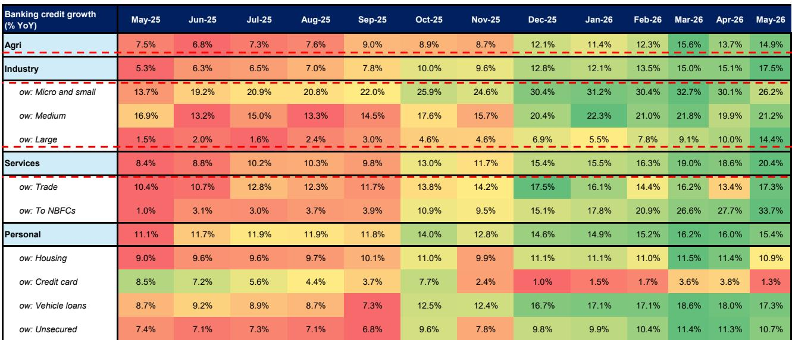
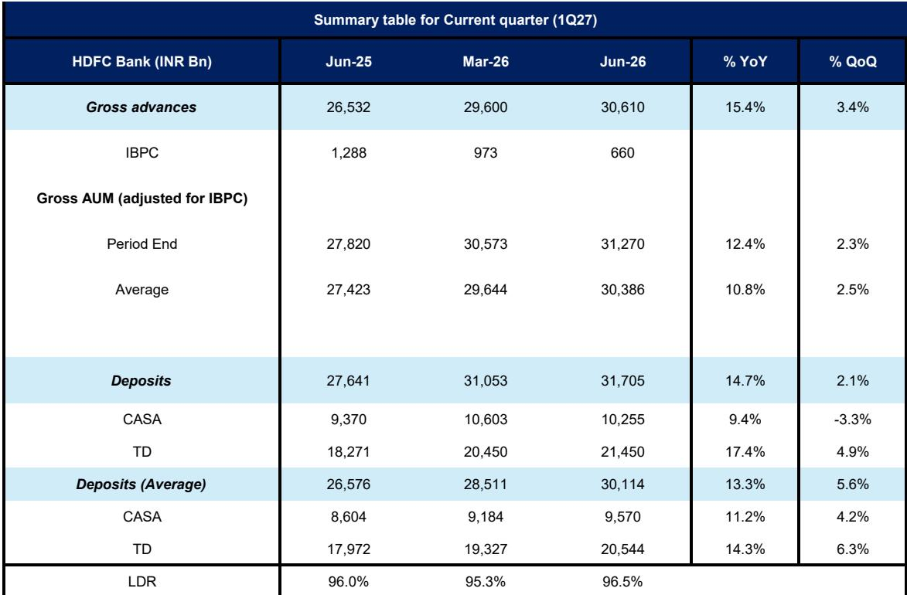
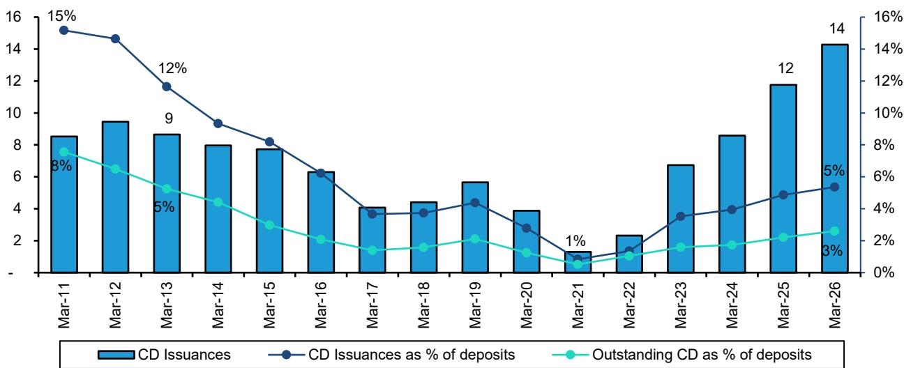

# Bernstein：印度信贷增长18%韧性显现，Bernstein称宏观担忧被高估

印度银行业正在进入2027财年第一季度的财报季，宏观担忧仍然主导市场情绪，但Bernstein这份最新研报给出了一个与市场普遍叙事不太一样的判断：运营基本面比市场担心的要稳健，增长、利润率与资产质量的韧性正在将焦点从宏观不确定性转向公司层面的执行能力。

报告的核心信号很清晰——外部不确定性在边际上正在缓解，而银行自身的基本面修复比多数读者预期的要快。这不是一个全面反转的故事，而是一个“坏消息已被定价、好消息正在积累”的窗口。

## 1. 宏观不确定性在边际上被高估了

印度宏观环境在FY26实现了7.7%的实际GDP增长，通胀控制在4%目标附近，财政轨迹符合历史季节性规律。市场最担心的几个外部不确定性——贸易逆差、外资流出、地缘不确定性——在近期都出现了边际改善。

尤其值得关注的是，中东停火协议触发了一轮固定收益市场的反弹，12个月CD利率从此前冲突高峰水平下降了超过100个基点。这直接降低了银行的融资成本，缓解了市场对流动性收紧的担忧。

> **KC评论：** 市场往往把宏观不确定性线性外推，但Bernstein提醒读者注意边际变化。CD利率下降100bps这件事，对银行净息差的支撑可能比很多分析师预期的更直接。完整报告里有详尽的图表对比，值得细看。

## 2. 银行信贷增长保持韧性，结构分化正在收窄

系统信贷增速维持在约18%的同比水平，支撑来自工业、服务业和抵押贷款等领域的广泛复苏。值得注意的是，个人贷款中的无担保部分仍然仍在调整——信用卡债务增速不到2%，但整体信贷组合的多元化正在吸收这部分不确定性。

在银行间结构上，Bernstein提出了一个关键判断：公共部门银行（PSBs）此前跑赢私营银行（PVBs）的核心驱动力——超额流动性和超低信用成本——正在消退。未来几个季度，两类银行在增长和盈利上的差距将逐步收敛。

这意味着，过去两年PSBs的估值溢价正在失去支撑，而PVBs在经历了相对落后之后，可能进入一个追赶期。

## 3. 各家银行的关键变量各不相同，但有一个共同主题

Bernstein对主要机构的观察框架非常具体，但背后有一条共同逻辑：在宏观不确定性边际缓解的背景下，公司层面的执行能力将成为区分表现的核心。

HDFC银行的关键在于能否将健康的贷款和存款增长转化为净利息收入增长，同时消化管理层变动的过渡期。ICICI银行需要证明在信用成本正常化过程中，其资产回报率的改善是可维持的。Axis银行的估值已经经历了一轮重估，接下来的问题是利润率轨迹和信用成本能否持续。

对于SBI，强劲的增长势头能否维持是关键。IndusInd的核心观察点则是信用成本的持续改善。Bajaj Finance的焦点在信贷成本的进一步下降和新贷款业务线的进展。

> **KC评论：** Bernstein这个观察框架的本质是告诉读者，在系统性不确定性下降之后，选股逻辑需要从“买什么银行”转向“买哪个银行的具体故事”。报告里对每家银行的详细拆解，是理解这种差异化的基础。

## 报告没有完全回答的关键问题

尽管Bernstein给出了清晰的判断框架，但仍有几个问题悬而未决。第一，无担保零售贷款（尤其是信用卡）的疲软是否会进一步蔓延到其他消费信贷领域，目前的数据还不足以给出明确答案。第二，PSBs和PVBs的收敛速度——报告预期的是“渐进式收敛”，但收敛的节奏和幅度仍然取决于政策环境和银行自身的执行。第三，中东停火带来的利率下降能否持续，取决于地缘局势的后续演变，这超出了任何一家国际机构的预测能力。

这些问题本身不是对报告的否定，而是提醒读者：Bernstein的分析提供了一个很好的起点，但最终的判断需要结合后续数据和事件来动态修正。

## 对读者的观察框架

，而是它提供了一个思考印度银行板块的框架：宏观不确定性在边际上改善，基本面保持韧性，银行间的结构性分化正在重新洗牌。读者需要关注的不是“印度银行业好需要继续观察”，而是“哪家银行在当前的条件下最能把自己的规模优势和风控能力转化为可持续的盈利”。

Bernstein在报告开头引用的一个观点值得记住：印度银行板块目前相对于NIFTY指数仍有折价。这个折价是否合理，取决于市场是否愿意重新定价那些被宏观担忧压制的公司层面的积极信号。

For informational purposes only. Portions may be generated,translated,summarized,or edited with AI assistance based on source materials and may contain omissions or errors. Please verify independently. This is not investment,legal,tax,accounting,or other professional advice.

For informational purposes only. Portions may be generated,translated,summarized,or edited with AI assistance based on source materials and may contain omissions or errors. Please verify independently. This is not investment,legal,tax,accounting,or other professional advice.

