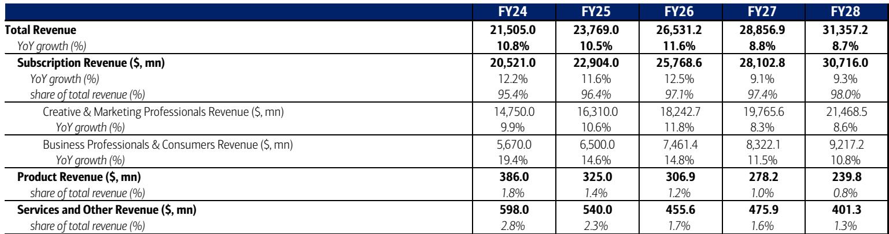
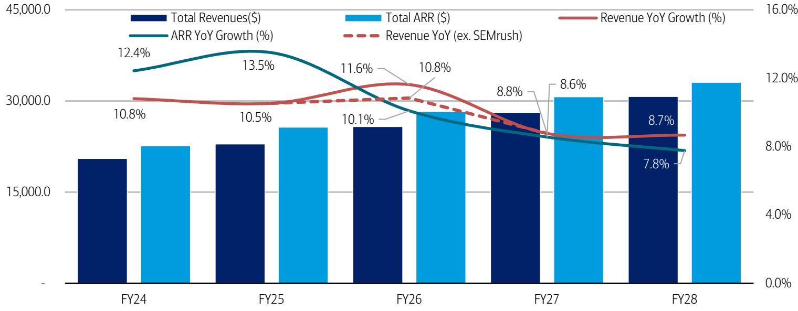
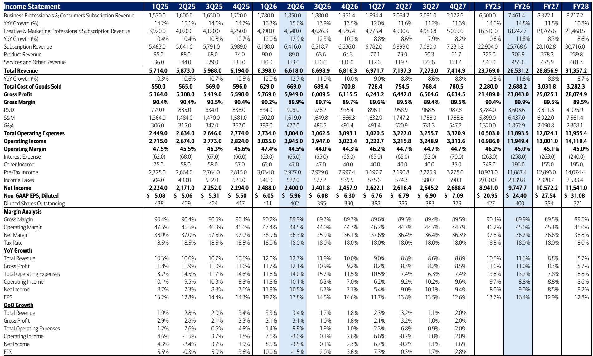

# BofA：AI蚕食创意软件护城河，Adobe的低估值是机会还是陷阱

市场对Adobe的定价已经反映了悲观预期——报价从2024年高点下跌约70%，当前估值位于历史低位。但BofA一份最新研报提出了一个更尖锐的问题：如果AI带来的不是短期扰动，而是结构性替代，那么Adobe当前看似“便宜”的报价，是否只是价值陷阱？

这份报告的核心判断是：Adobe的AI策略本质上是防御性的，难以形成可持续的高质量收入增长。而真正值得关注的，是生成式AI正在压缩创意软件的门槛，让“足够好”的替代品蚕食Adobe的核心市场。

## 1. AI对Adobe的影响并非均匀分布，但低端市场的流失会侵蚀整体定价权

BofA将Adobe的用户分为两个群体：专业创意与营销人员（CMP），以及商业专业与消费者（BPC）。前者贡献约71%的订阅收入，后者约29%。

报告认为，不确定性是不对称的。在BPC群体中，用户对像素级控制没有执念，“足够好”的AI输出就能替代付费工作流。这部分用户最容易流失到免费的AI原生工具。而在CMP群体中，专业用户对工具深度和生态黏性有更高要求，短期内相对稳定。

但问题在于，低端市场的流失会反过来压缩Adobe在高端市场的定价空间。当大量用户习惯了免费或低成本的AI工具，Adobe要维持现有订阅价格和座位数，将面临持续不确定性。

> **KC评论：** 这种“从底部开始瓦解”的竞争逻辑，在软件行业并不陌生。但Adobe的特殊之处在于，它的产品本身就是行业标准。当AI让“非标准”变得足够好用，标准的价值就会被重新定价。BofA报告里有一张用户分层与不确定性矩阵图，值得仔细看。

## 2. AI产品有增长，但货币化质量存疑

Adobe在AI产品上并非没有动作。Firefly的ARR季度环比增长超过50%，Acrobat和Express的月活用户环比增长21%，创意产品的免费用户同比增长70%。这些数字看起来不错。

但BofA指出一个关键问题：AI-first ARR目前仅占公司总ARR的不到2%。更重要的是，这些增长主要来自免费用户的附着，而非新产品的付费转化。换句话说，AI产品在拉新和留存上有效，但在创造增量收入上效果有限。

报告预计，公司整体收入增速将从2025年的10.5%逐步下降至2028年的8.7%左右。在没有明确证据表明AI能带动收入加速之前，市场很难给更高的估值倍数。

## 3. 管理层变动增加了战略执行的不确定性

在AI转型的关键窗口期，Adobe同时面临CEO和CFO的更替。报告虽然没有过度渲染这一不确定性，但明确指出：管理层变动会增加战略连续性和执行力的不确定性。

对于一个正在应对结构性变化的公司而言，领导层的稳定性本身就是重要的信心指标。这一点，在估值已经承压的背景下，显得尤为敏感。

## 4. 估值便宜，但催化剂缺失

当前Adobe的EV/FCF倍数约为8倍，远低于其历史区间的25-30倍。公司运营利润率维持在45%左右，自由现金流利润率约39%，基本面并不差。

但BofA认为，低估值本身不足以构成观点偏积极理由。在没有看到AI货币化加速或增长重新提速的信号之前，估值倍数缺乏扩张的催化剂，意味着当前报价仍有节奏变化空间。

> **KC评论：** 这份报告最值得关注的部分，是它对“AI货币化质量”的拆解。许多读者只看到AI产品用户增长，但忽略了这些用户是否愿意付费、以及付费水平是否高于原有产品。BofA在报告里对比了Adobe不同产品的单位宏观环境模型，这部分信息密度很高。

**报告尚未完全回答的关键问题：**

Adobe是否有能力通过收购或自研，在AI工作流层面建立新的护城河？当前竞争格局中，哪些AI原生公司最有可能从Adobe手中抢走份额？以及，当专业用户也开始接受“AI辅助”而非“AI替代”时，Adobe能否在工具深度和生态广度之间找到新的平衡点？

这些问题，可能需要更长的时间窗口来验证。但BofA的这份研报，为读者提供了一个清晰的分析框架：不要被低估值迷惑，先问清楚增长从哪里来。

For informational purposes only. Portions may be generated,translated,summarized,or edited with AI assistance based on source materials and may contain omissions or errors. Please verify independently. This is not investment,legal,tax,accounting,or other professional advice.

For informational purposes only. Portions may be generated,translated,summarized,or edited with AI assistance based on source materials and may contain omissions or errors. Please verify independently. This is not investment,legal,tax,accounting,or other professional advice.

