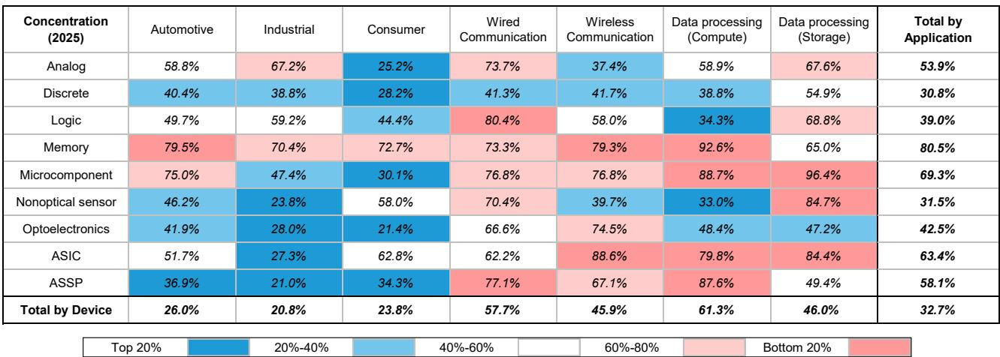
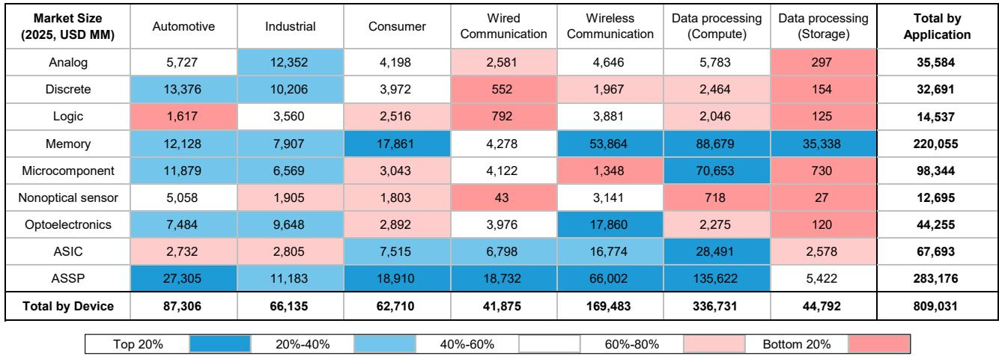
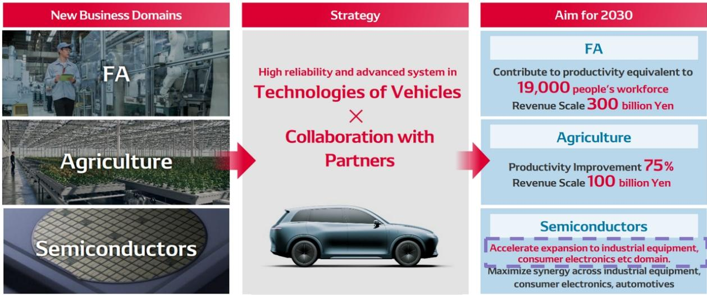

# Bernstein：功率半导体第二增长引擎，AI电力需求下的电装并购窗口

电装对罗姆的收购要约在四月底撤回后，市场关注的焦点迅速转向这家日本汽车零部件巨头的下一步动作。Bernstein在最新研究报告中给出了一个清晰的判断：并购仍是电装实现中期增长目标最现实、最有效的路径，而在所有潜在标的中，富士电机在收购成本、产品组合和管理契合度上均最具可行性。

这份报告的独特价值不在于罗列所有可能目标，而在于它建立了一个筛选框架——电装需要的不是任何半导体公司，而是一家能帮它从汽车市场跨入工业和消费电子领域的功率半导体企业。

电装的半导体业务目前几乎完全服务于内部需求。据Gartner数据，其2025年半导体收入约2080亿日元，其中功率和模拟芯片占比接近90%，汽车应用占99.7%。这种高度集中的结构在电装的中期计划中被明确列为需要改变的方向——公司希望将半导体技术“扩展到工业设备和消费电子领域”。

问题是，电装过去通过少数股权研究建立的合作关系，如入股英飞凌、瑞萨、安森美和罗姆，主要目的都是强化汽车业务。要真正实现跨领域扩张，仅靠现有合作远远不够。

Bernstein认为，电装瞄准的六个细分市场——分立器件和模拟芯片在汽车、工业、消费三大领域的组合——虽然只占全球半导体市场的5%左右，但规模可观且增长稳定：预计从2025年的500亿美元增长至2030年的800亿美元，年复合增长率约10%。更重要的是，这些市场仍有整合空间。

> **KC评论：** 电装并非要在半导体领域与英伟达或三星竞争。它选择的是一个规模适中、增长可预期、且自身已有技术积累的赛道。这意味着并购的整合难度相对可控，但需要回答一个更根本的问题——这些市场能否支撑电装从小规模内部供应商转型为外部开放供应商。

在筛选潜在目标时，Bernstein排除了几种可能性。全面收购安森美、瑞萨或英飞凌/意法半导体在财务上难度过大。对罗姆的敌意收购则面临声誉不确定性。而罗姆、东芝和日本制铁所组成的联盟，电装或许能参股，但全面收购操作难度很大。

富士电机的优势因此凸显。其市值约2万亿日元，在所有主要功率半导体候选标的中最低。更重要的是，电装与富士电机在IGBT和SiC领域已有长期联合开发关系，且富士电机在工业领域有实质性业务布局——这正是电装最需要的外部市场入口。

这份报告没有回避并购后的连锁反应。如果电装动用出售丰田持股所得资金进行并购，可能令期待股东回报的读者失望。反之，若丰田回购这些股份，则对丰田报价形成支撑。在行业层面，随着软件定义汽车趋势下整车厂开始内化硬件相关的软件层，电装传统优势领域面临调整，向上游半导体扩张的战略紧迫性正在上升。

对于瑞萨和英飞凌的读者，Bernstein认为影响有限。即便电装成功收购富士电机，其战略收益将集中在功率半导体领域，不会直接冲击瑞萨在MCU的核心竞争力。英飞凌仅有9%的销售来自日本整车厂，不确定性敞口更小。

> **KC评论：** 报告最值得细读的部分是对“电装目标市场吸引力”的分析——它把9种器件和7种应用组合成矩阵，逐格评估规模、增长率和整合空间。这一分析框架本身对理解功率半导体行业的竞争格局就很有价值，不限于电装这一个案。

报告尚未完全回答的关键问题是：电装如何平衡内部半导体产能与外部采购的关系。目前电装的功率半导体是垂直整合模式，从设计到制造都在内部完成。如果通过并购获得外部产能，是保留还是整合？这决定了并购的协同效应能否真正兑现。

另一个值得跟踪的变量是AI电力需求的增长。Bernstein对功率半导体持建设性看法，认为CPU复兴将成为功率半导体的第二增长引擎。这一判断若成立，电装并购的时间窗口可能比市场预期的更紧迫。

对于关注日本汽车和半导体产业链的读者，这份报告提供了一个难得的视角：一家传统Tier 1供应商如何通过半导体并购实现战略转型，以及这一转型对丰田、瑞萨等关联公司的影响路径。报告中的图表数据——特别是电装半导体业务的收入结构和市场增长预测——值得仔细对照原文查看。

For informational purposes only. Portions may be generated,translated,summarized,or edited with AI assistance based on source materials and may contain omissions or errors. Please verify independently. This is not investment,legal,tax,accounting,or other professional advice.

For informational purposes only. Portions may be generated,translated,summarized,or edited with AI assistance based on source materials and may contain omissions or errors. Please verify independently. This is not investment,legal,tax,accounting,or other professional advice.

