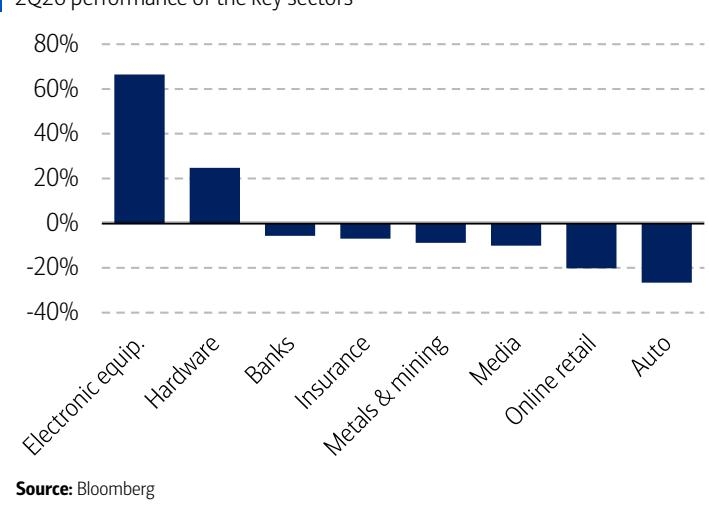
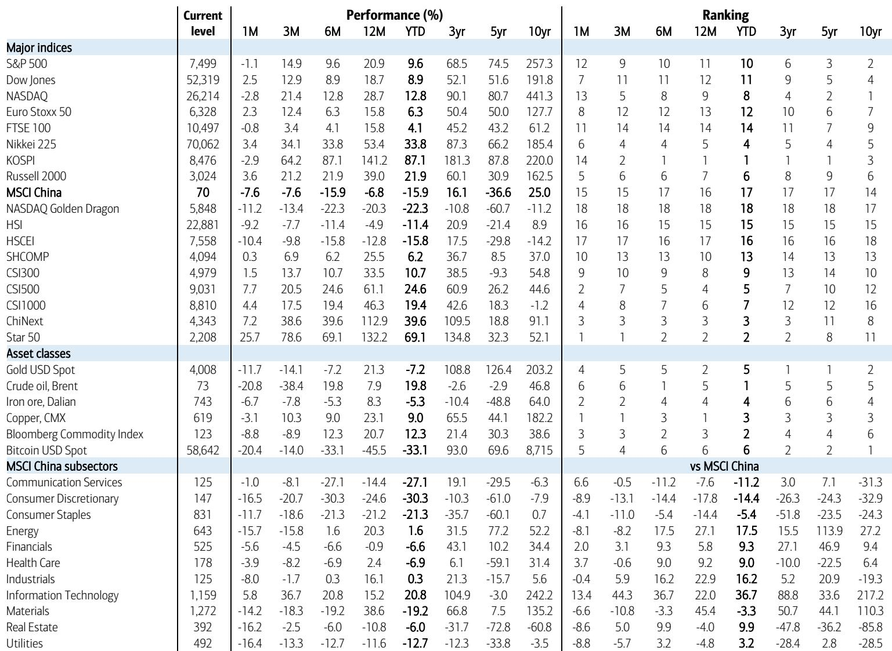
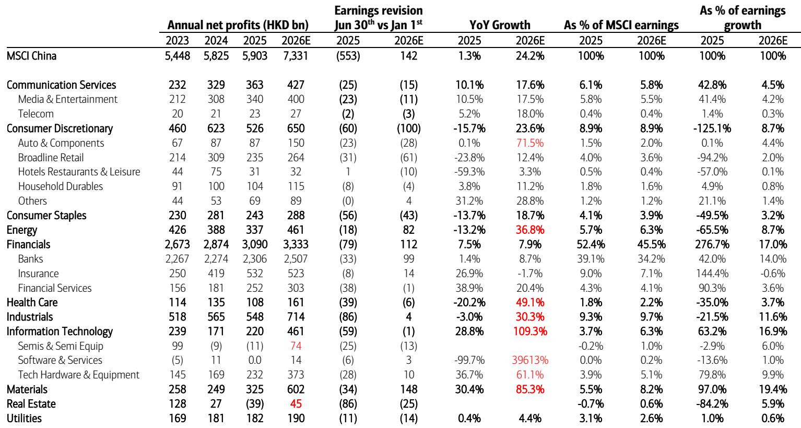

# BofA：AI主题重塑资金流向，中国消费板块观察

二季度中国市场的表现，让不少关注者感到困惑。一边是创业板和科创板分别上涨38.6%和78.6%，另一边是MSCI中国和恒生国企指数分别下跌7.6%和9.8%。这种极端的分化，不是简单的板块轮动，而是一个更深层信号：市场已经进入了一个对选股能力要求极高的阶段，传统的指数配置思路可能面临持续挑战。

BofA在最新发布的季度策略报告中，用“K-shaped market”来概括这一格局。报告的核心判断是，中国市场的整体估值虽然看起来不算贵——MSCI中国当前远期市盈率10.3倍，比长期均值低12%——但这个数字并不构成观点偏积极理由。真正值得关注的，是盈利预期正在被持续下调。2026年每股盈利增长预期已从1月的11-12%降至目前的2-3%。估值便宜但盈利预期承压，两者叠加，意味着市场缺乏系统性向上的驱动力。

> **KC评论：** 10.3倍的市盈率放在历史上看确实不贵，但报告提醒读者注意，这个估值水平仍高于8-9倍的历史底部。更关键的是，盈利预期下调的速度在加快。如果盈利继续走弱，当前的“便宜”可能只是暂时的。报告中的图表值得细看，它展示了盈利预测修正的轨迹，能帮助判断后续估值是否还有压缩空间。

## 1. 这轮分化背后，是AI主题对资金流向的彻底重塑

二季度最显著的特征，是AI相关产业链对资金的虹吸效应。MSCI中国中，信息技术是相对少见录得正回报的板块，涨幅36.7%。而可选消费、必选消费和原材料分别下跌20.7%、18.6%和18.3%。市值增长前十的公司全部来自科技硬件和半导体领域。这种集中度，在历史上并不多见。

BofA的报告指出，AI研究主题在二季度变得更加复杂。市场在内存超级周期、CPO部署延迟、国产GPU替代、互联网平台AI变现等多个叙事之间反复切换。但一个不变的事实是，资金越来越集中在少数几个方向。这种集中度本身，就增加了市场的脆弱性。一旦核心叙事出现动摇，调整的幅度可能超出预期。

报告特别提到，相关市场和H股的分化在二季度显著扩大。沪深300上涨13.7%，而恒生国企指数下跌9.8%。原因在于，相关市场对国产半导体主题的敞口更大，而相关市场更多集中在互联网和资金板块，这些板块在盈利和宏观层面承受的不确定性更直接。

## 2. 宏观数据呈现“出口强、内需弱”的格局，但出口的可持续性存疑

BofA的宏观分析显示，中国宏观环境在二季度呈现出明显的结构性分化。出口是最大的亮点，2026年前五个月同比增长15.5%。但固定资产研究同比下降4.1%，零售销售仅增长1.4%。信贷增速也在节奏变化，从2025年的8.2%降至5月的7.4%。

一个值得注意的变化是，PPI在经历了连续41个月的负增长后，于2026年3月转正，到5月已升至3.9%。这带动了工业企业利润的强劲增长，前五个月同比增长18.8%。但报告对利润增长的可持续性持谨慎态度，认为其中能源价格上涨的贡献较大，而能源价格本身存在不确定性。

> **KC评论：** 出口强劲是当前中国宏观环境为数不多的支撑点。但报告没有回避一个关键问题：这种出口驱动的增长模式能否持续。如果全球需求走弱或贸易摩擦升级，出口的韧性将面临考验。对于关注宏观环境的读者，报告中的“China Investment Compass”框架提供了一个有用的参考，它用C4阶段来描述当前的政策环境，值得仔细理解其含义。

## 3. 资金面的不确定性正在积聚，IPO热潮可能成为短期扰动因素

报告在资金流分析部分提出了一个容易被忽视的不确定性。三季度，相关市场面临约5400亿港元的锁定期到期解禁。同时，IPO市场异常活跃——上半年相关市场IPO融资额同比增长89%至100亿美元，相关市场同比增长91%至270亿美元，创下上半年历史新高。

这些新股的发行，以及解禁带来的潜在抛压，都可能对现有持仓形成资金分流。BofA的模型组合在三季度进行了调整，增持了工业（重型机械、电气设备）、科技硬件和多元化资金，同时减持了电力及可再生能源、白酒、汽车等板块。这一调整方向，本质上是在寻找那些盈利增长更确定、估值更有安全边际的领域。

## 4. 报告尚未完全回答的关键问题：AI主题的宽度能否扩展

BofA的报告虽然给出了清晰的行业配置建议，但有一个问题留给了读者自己判断：AI主题能否从硬件和半导体扩展到更广泛的领域。当前市场的上涨高度集中在少数公司，如果AI的应用场景无法在消费、企业服务、制造业等领域实现突破，那么市场的结构性分化可能会持续，甚至加剧。

报告没有给出明确的答案，但提供了一个观察框架：关注AI本地化主题的演进，以及政策对科技创新的支持力度。科创板上市条件的放宽，允许尚未盈利的AI模型公司上市，这是一个值得跟踪的信号。

对于关注中国市场的读者，BofA这份报告的核心价值不在于具体的行业提到，而在于它提供了一个理解当前市场环境的框架——K型分化不是短期现象，而是对选股能力的长期考验。在盈利预期持续下调、资金面不确定性加大、AI主题高度集中的背景下，依赖指数配置的策略可能越来越难以获得理想的回报表现。

For informational purposes only. Portions may be generated,translated,summarized,or edited with AI assistance based on source materials and may contain omissions or errors. Please verify independently. This is not investment,legal,tax,accounting,or other professional advice.

For informational purposes only. Portions may be generated,translated,summarized,or edited with AI assistance based on source materials and may contain omissions or errors. Please verify independently. This is not investment,legal,tax,accounting,or other professional advice.

