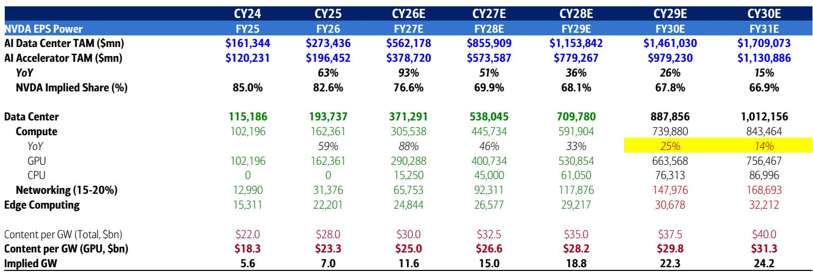
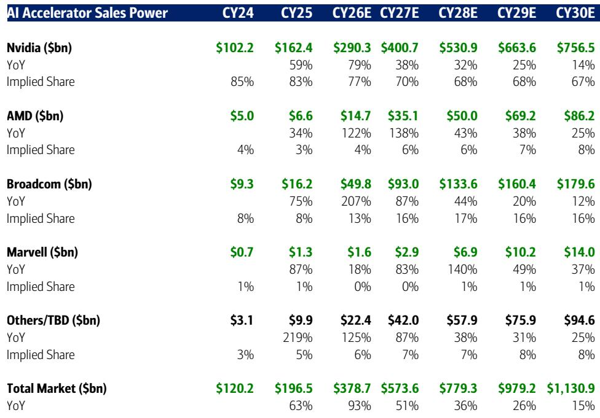
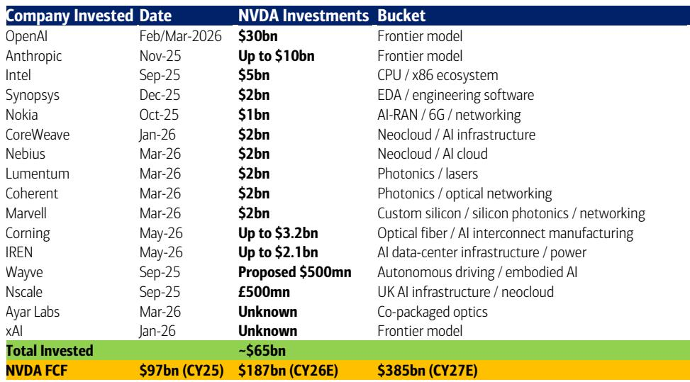

# BofA：AI芯片龙头估值低于同行30%，BofA指市场误判不确定性

AI芯片龙头英伟达今年以来涨幅仅3%，远不及费城半导体指数82%的表现。市场在担忧什么？BofA一份7月发布的报告给出了直接判断：当前报价已经在为2027-2028年每股盈利预期打折30-35%，而这一折价缺乏依据。

这份报告的核心论点不是“英伟达很好”，而是“市场已经过度悲观”。在18倍远期市盈率这个七年低点，机构看到的不是不确定性，而是定价错误。

## 1. 内存成本上涨被高估，定价权被低估

读者最担心的是HBM内存成本上升挤压毛利率。从Blackwell到Rubin架构，每机柜的HBM成本确实会增加约20-30万美元。但报告指出一个容易被忽略的数字：同期单机柜定价可能从300-400万美元升至600-700万美元。

这意味着什么？内存成本在机柜总成本中的占比其实变化不大——从Blackwell的5.2%微升至Rubin的6.4%。真正驱动定价上升的是Vera CPU升级、NVLink和Quantum以太网等非内存组件，以及软件功能带来的推理成本下降。

> **KC评论：** 市场习惯把英伟达简单看作“卖显卡的”，但它的机柜系统里越来越多的价值来自网络、CPU和软件。只看HBM成本，就像只看发动机成本来评估一辆豪华车。完整报告里那张HBM成本占比的表格值得细看。

## 2. 定制芯片威胁被历史数据证伪

Google TPU在2015年推出，亚马逊Trainium在2020年，Meta MTIA在2023年。这些定制ASIC芯片一直在“威胁”英伟达，但报告给出的数据是：英伟达的GPU加速器销售额自2015年以来增长了约700倍。

更关键的信号来自最新披露的细分数据：英伟达对超大规模客户的销售额同比增长115%，几乎是云资本支出增速的两倍。这不是份额被侵蚀，而是钱包份额在扩大。

长期来看，报告预计英伟达将维持AI资本支出65-70%以上的份额，剩下的30-35%由定制芯片和AMD等竞争对手瓜分。

## 3. 估值隐含了一个不该存在的折扣

这是报告最有冲击力的部分。英伟达当前交易在2027/2028年预期市盈率约16倍和12倍，而亚马逊、Meta、谷歌、微软、苹果这五家同行的平均估值是22倍和19倍。

报告的逻辑很直接：这些公司面临相似的AI机会和内存成本不确定性，但英伟达的估值却低了30-35%。相对少见的解释是市场已经把成本不确定性和竞争威胁计入了价格。但报告认为，即将到来的财报将是正面催化剂，会澄清英伟达在产品、定价和供应链上的护城河。

当然，报告也坦诚指出了两个悬而未决的问题：英伟达在标普500主动型产品中的持仓权重达到1.15倍，78%的主动产品已经持有；以及约650亿美元的战略研究虽然只消耗不到35%的自由现金流，但仍被部分读者视为资金使用效率不高。

> **KC评论：** 估值对比最值得关注的是增长差异。英伟达2025-2028年营收年复合增长率预计48%，每股盈利增速52%，PEG仅0.3倍。同行的PEG中位数是1.3倍。这不是同一个增长级别的公司，却被市场用同样的折价逻辑对待。报告没有完全展开的是：如果英伟达的增长持续超出预期，这个估值折扣可能不是不确定性，而是机会。

## 4. 报告没有完全回答的关键问题

BofA这份报告逻辑清晰，但仍有几个问题留给了读者自己判断。第一，超大规模客户自研芯片的长期影响，报告用历史数据反驳了短期威胁，但五年后技术架构是否会变化，报告没有给出明确答案。第二，英伟达的客户集中度——当少数几家超大规模公司贡献了越来越多收入时，议价权的天平会不会慢慢倾斜？第三，报告提到了Vera Rubin比Blackwell性能提升数倍，但客户是否愿意为这种性能提升支付溢价，最终取决于AI应用本身的商业回报率。

这三个问题都不是英伟达自身能完全控制的，它们取决于整个AI生态的演进速度。

对于关注AI基础设施竞争的读者，这份报告提供了一个有价值的观察框架：不要只看HBM成本或定制芯片新闻这些短期噪音，而是关注英伟达能否在每次架构迭代中维持系统级定价权，以及它的营收增速是否持续跑赢客户的资本支出增速。这两个指标，比任何短期毛利率波动都更能说明问题。

For informational purposes only. Portions may be generated,translated,summarized,or edited with AI assistance based on source materials and may contain omissions or errors. Please verify independently. This is not investment,legal,tax,accounting,or other professional advice.

For informational purposes only. Portions may be generated,translated,summarized,or edited with AI assistance based on source materials and may contain omissions or errors. Please verify independently. This is not investment,legal,tax,accounting,or other professional advice.

