## HK Banks Monthly

## June 2026: Regional banks showed relative strength amid broad market adjustments

HK banks on average saw a 5% adjustment in June, but performed 4% better relative to the HSI as broad market sentiment was influenced by ongoing discussions on new ODI rules and their implications for cross-border capital flows. Meanwhile, improving operating trends and a more hawkish tone from the FED interest rate meeting provided support to bank valuations, and explained the relative performance of regional banks over local HK banks. More favorable earnings momentum in 1H26 and a more direct beneficiary of potential FED rate adjustments might allow HSBC to sustain the relative performance in the near future.

\- News summary for June 2026: June headlines continued to focus on tighter cross-border investment activity for mainland clients, with some banks reportedly postponing mainland-related initiatives, although the HKMA commented that the relevant account-opening process remains smooth. On asset quality, KPMG expects HK banks' NPL ratios to improve in FY27 and Fitch has upgraded the sector's outlook, citing that the worst of HK CRE stress has passed, while Deloitte observed that HK banks have sped up the collateral divestments in individual delinquent CRE cases. At the company level, HSBC has reportedly become involved in the IFFCO Group's debt situation with exposure of up to US\$400mn, while it is also conducting a strategic review for the potential sale of its SG insurance business. Meanwhile, STAN is assessing the feasibility to set up a gold vault in HK for business expansion after it delivered a high double-digit growth in gold-related revenue in 1Q26. For BOCHK, the CRO noted that NPL pressure is likely to persist in 2H26, but the bank has adequate LLR and expects its asset quality to perform well relative to peers.

\- Loan growth momentum continues to trend up: (1) Industry loan growth rose to 6.0% YoY in May from 5.4% in April, continuing the sequential uptrend since November 2025, driven by decent momentum in trade finance-related flows. (2) Mortgage lending growth also edged up to 3.3% YoY in May from 3.1% in April, while newly approved mortgage loans rose 10.1% MoM. BOCHK remained the market leader in completed mortgages in 1H26, capturing a 31% market share, followed by HSBC at 24%; however, HSBC led the off-plan mortgage segment with a 24% market share, higher than the 22% at BOCHK. (3) LDR fell 47 bps MoM to 52.3% in May on stronger deposit growth, with HKD LDR declining more materially (-65 bps MoM) than FCY LDR (-7 bps MoM). The overall CASA ratio was up slightly to 44.6% in May from 44.1% in April.

\- Narrowing SOFR-HIBOR gap on stronger HIBOR: (1)1M/3M SOFR was largely stable MoM in June on a daily average basis, while 1M/3M HIBOR increased by 23bps/10bps MoM, leading to a narrowing 1M/3M SOFR-HIBOR gap of 82bps/79bps (down 21bps/6bps MoM) likely reflecting the typical quarter-end liquidity conditions and changing expectations for US rate policy. (2) Aggregate balances and EFBN (Exchange Fund Bills and Notes) stabilized at c.HK\$1.4tn in June, while the HKD/USD also remained broadly unchanged at 7.84 by the end of June. (3) Composite interest rates rose to 1.26% in May from 1.21% in April, marking an uptick in banks' funding costs after a steady decline since Dec 2025, but the implied deposit spreads increased 26 bps MoM on the back of a stronger HIBOR. (4) Overall deposit competition in HK remained rational during the past month, with slightly intensified competition among small and virtual banks mainly on HKD deposits in response to the quarter-end liquidity management (Table 3).

\- Underlying asset quality trends were largely stable: (1) 3M mortgage delinquency ratio was further down to $0.11\%$ in May from $0.12\%$ in April, representing a gradual declining trend since Nov 2025 amid stabilizing property market, while the 6M ratio was unchanged at $0.09\%$ in May. (2) The unemployment rate was $3.7\%$ in May, as the labor market in HK remained stable after seeing a downward trend YTD. (3) In May, there were 728 bankruptcy petitions $(-7\% \mathrm{MoM})$ , with the cumulative 5M26 figure showing a $12\%$ YoY decline; meanwhile, bankruptcies reached 753 cases, up $25\%$ MoM, but the 5M26 figure was still down $5\%$ YoY. (4) According to HKMA, HK banks' NPL ratio fell to $1.87\%$ in 1Q26 from $2.01\%$ in 4Q25, marking an eight-quarter low under an improving asset quality trend.

\- HSBC>BOCHK & STAN into 1H26 results. Both BOCHK and STAN would be facing higher base effects on non-NII in 1H26 due to stronger trading gains and episodic income in 2Q25 respectively, thus HSBC may deliver better momentum on operating profits into 1H26 results to sustain its relative performance YTD. Meanwhile, market focus should also be on management guidance on WM business implications/impacts due to the new ODI rules as well as on shareholder return measures, in particular the relaunch of SBB at HSBC and details of the three-year shareholder return enhancement program at BOCHK.

Table 1: Summary of key news in June

<table><tr><td>Date</td><td>Summary</td><td>Details</td><td>Link</td></tr><tr><td>6/6/2026</td><td>Banks Postpone Mainland Activities and Limit Travel Due to Tightened Scrutiny</td><td>Following tightened cross-border investment scrutiny by authorities, certain private banks like UBS have postponed mainland activities, while HSBC has advised private bankers to avoid non-essential travel to China.</td><td>Link</td></tr><tr><td>6/7/2026</td><td>HKMA: Bank Account Opening for Mainland Customers Remains Smooth</td><td>The HKMA stated that the banking sector has implemented the latest regulatory requirements for mainland clients, and the overall process for mainland customers opening accounts remains smooth.</td><td>Link</td></tr><tr><td>6/11/2026</td><td>Fitch Upgrades China/HK Banking Sector Outlook</td><td>Fitch has upgraded the banking sector outlook for HK and China from &quot;deteriorating&quot; to &quot;neutral.&quot; The agency also noted that the worst period for HK CRE has largely passed and HK banks continue to benefit from cross-border WM flows and robust capital market activities.</td><td>Link</td></tr><tr><td>6/13/2026</td><td>HSBC Reportedly Faces Up to US $400mn Exposure in IFFCO&#x27;s Debt Situation</td><td>HSBC is reportedly involved in a bankruptcy debt situation of IFFCO Group, a major consumer goods company in the Middle East. As the largest creditor, HSBC&#x27;s debt exposure could reach up to US$400m.</td><td>Link</td></tr><tr><td>6/15/2026</td><td>STAN Explores Setting Up Gold Vault in HK</td><td>STAN reported a high double-digit growth in gold-related revenue for 1Q26 and is currently evaluating locations to set up its own gold vault in HK to expand its gold business in 2H26.</td><td>Link</td></tr><tr><td>6/15/2026</td><td>HSBC Considers Sale of SG Insurance Business with Allianz Reportedly Leading the Bid</td><td>HSBC is conducting a strategic review regarding the potential sale of its Singapore insurance business, which could be valued at up to US$2bn. Allianz has reportedly emerged as the leading contender in the bidding process.</td><td>Link</td></tr><tr><td>6/18/2026</td><td>KPMG: HK Banks&#x27; FY25 Revenue Rose Over 5% with Improving NPL Outlook Next Year</td><td>A KPMG report highlighted that HK banks saw 5.1% revenue growth for 2025. Although future profitability may face uncertainty from interest rate changes, continued conditions in CRE and rising deposit competition, the impaired loan ratio is expected to decline next year.</td><td>Link</td></tr><tr><td>6/18/2026</td><td>HKMA Proposes 23% Hike in Bank License Fees</td><td>The government has proposed raising bank license fees by 23% to HK$750k. Authorities emphasized that this fee represents a minimal fraction of financial institutions&#x27; expenses and will not harm HK&#x27;s international financial competitiveness.</td><td>Link</td></tr><tr><td>6/22/2026</td><td>HK Banks Sped up the Collateral Divestments in Individual Delinquent CRE Cases</td><td>According to Deloitte, HK banks are stepping up efforts to resolve NPL tied to local property developers, even if it means realizing losses, as prolonged conditions in the CRE market have increased pressure on collateral values and regulatory capital.</td><td>Link</td></tr><tr><td>6/25/2026</td><td>STAN Explores Sale of Bahrain Wealth &amp; Retail Banking Business</td><td>STAN is exploring the sale of its WM and retail banking operations in Bahrain as part of its strategy to focus on larger-scale business and customer segments with greater product differentiation. The bank will retain its CIB business in Bahrain, with the transition expected to take 18-24 months, subject to regulatory approvals.</td><td>Link</td></tr><tr><td>6/25/2026</td><td>BOCHK Expects Continued NPL Pressure in 2H26</td><td>BOCHK&#x27;s Chief Risk Officer said at the AGM that NPL pressure is expected to remain elevated in 2H26 amid ongoing geopolitical tensions and persistent inflation. The bank has maintained adequate loan-loss provisions and expects its asset quality to remain better than the market average.</td><td>Link</td></tr></table>

Source: News websites, JPM.

Figure 1: Industry loan YoY growth – for use in vs outside HK  
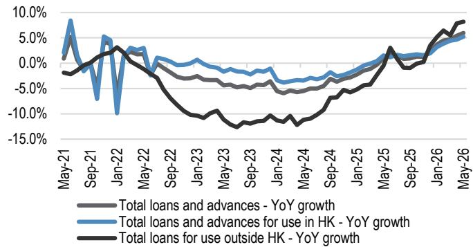  
Total loans and advances - YoY growth
Total loans and advances for use in HK - YoY growth
Total loans for use outside HK - YoY growth  
Source: HKMA, JPM.

Figure 2: Industry loan YoY growth – HKD vs FCY loans  
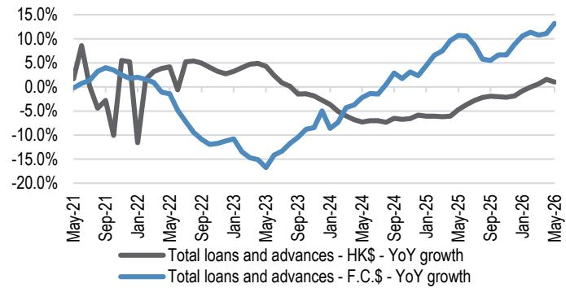  
Source: HKMA, JPM.

Figure 3: Industry mortgage YoY growth  
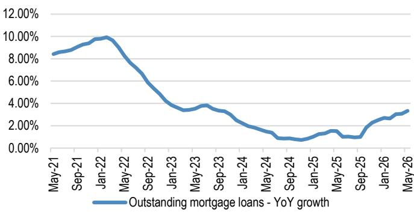  
Table 2: Mortgage share ranking for completed and off-plan properties – 1H26  
Source: HKMA, JPM.

<table><tr><td colspan="2"></td><td colspan="2">Completed property</td><td colspan="2">Off-plan property</td></tr><tr><td>No.</td><td>Company</td><td>Unit</td><td>% shares</td><td>Unit</td><td>% shares</td></tr><tr><td>1</td><td>BOCHK</td><td>12,703</td><td>31.3%</td><td>630</td><td>22.1%</td></tr><tr><td>2</td><td>HSBC</td><td>9,649</td><td>23.7%</td><td>684</td><td>24.0%</td></tr><tr><td>3</td><td>HSB</td><td>5,180</td><td>12.7%</td><td>382</td><td>13.4%</td></tr><tr><td>4</td><td>STAN</td><td>3,423</td><td>8.4%</td><td>328</td><td>11.5%</td></tr><tr><td>5</td><td>ICBC Asia</td><td>2,116</td><td>5.2%</td><td>295</td><td>10.3%</td></tr><tr><td>6</td><td>BEA</td><td>1,527</td><td>3.8%</td><td>112</td><td>3.9%</td></tr><tr><td>7</td><td>BoCom (HK)</td><td>972</td><td>2.4%</td><td>146</td><td>5.1%</td></tr><tr><td>8</td><td>Citic Bank</td><td>910</td><td>2.2%</td><td>60</td><td>2.1%</td></tr><tr><td>9</td><td>Citi</td><td>891</td><td>2.2%</td><td>48</td><td>1.7%</td></tr><tr><td>10</td><td>OCBC (HK)</td><td>714</td><td>1.8%</td><td>79</td><td>2.8%</td></tr><tr><td></td><td>Industry</td><td>40,642</td><td>100.0%</td><td>2,854</td><td>100.0%</td></tr></table>

Source: Centraline.

Figure 4: Industry LDR and CASA %  
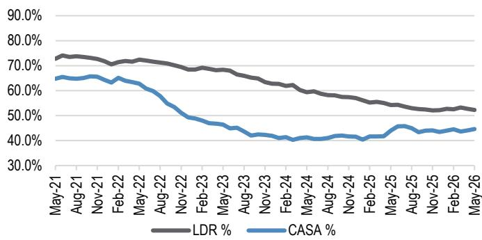  
Source: HKMA, JPM.

Figure 5: Industry LDR by currency – HKD vs FCY  
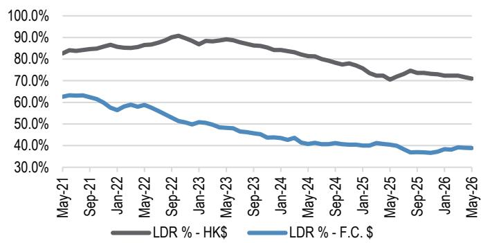

Figure 6: Daily average 1M SOFR and HIBOR  
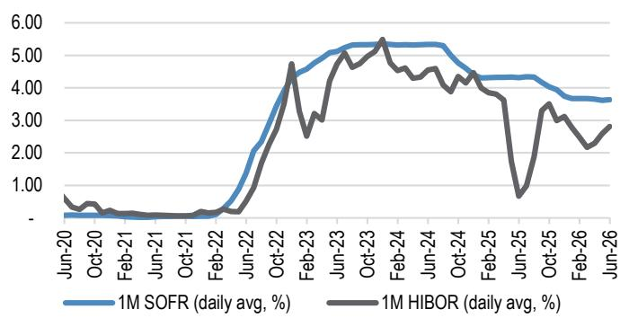  
Source: Bloomberg Finance L.P., JPM.  
Source: HKMA, JPM.

Figure 7: Daily average 3M SOFR and HIBOR  
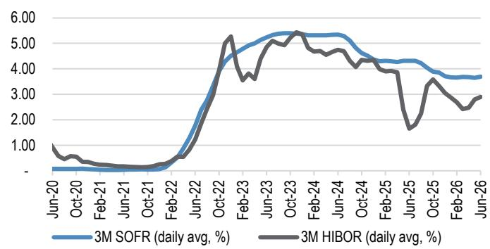  
Source: Bloomberg Finance L.P., JPM.

Figure 8: 1M SOFR-HIBOR gap vs. USD/HKD FX rates  
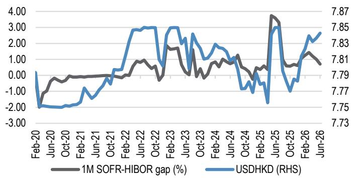  
Source: Bloomberg Finance L.P., JPM.

Figure 9: 1M SOFR-HIBOR gap vs. aggregate balance + EFBN  
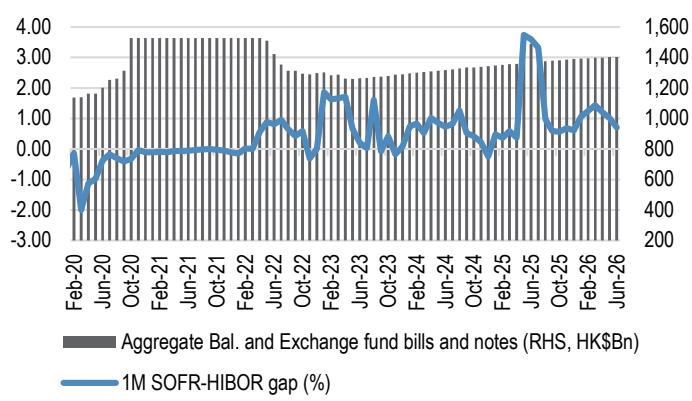  
Source: Bloomberg Finance L.P., JPM.

Figure 10: The composite interest rate was 1.26% in May 2026  
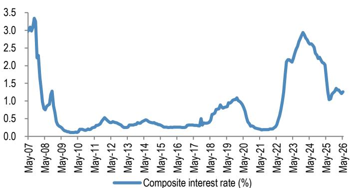  
Source: HKMA.

Figure 11: Implied deposit spreads increased MoM in May on higher HIBOR  
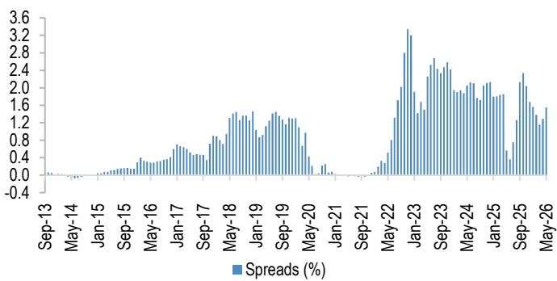  
Source: Bloomberg Finance L.P., HKMA, JPM. Note: Spreads calculated based on the composite interest rate since July 2025 (previously weighted deposit rate) due to data unavailability.

Table 3: Special deposit terms for HKD and USD in June

<table><tr><td>Date</td><td>Bank</td><td>Deposit</td><td>Annual rates</td><td>Note</td></tr><tr><td>6/1/2026</td><td>ICBC (Asia)</td><td>HKD time deposit (3M)</td><td>3.88%</td><td>New customers opening an integrated account via the mobile banking&#x27;s &quot;e-Account Opening&quot; feature and placing a 3M HKD time deposit.</td></tr><tr><td>6/2/2026</td><td>OCBC</td><td>HKD time deposit (3M)</td><td>2.70%</td><td>Wealth management customers opening a 3M HKD time deposit with at least HK$100k of new funds at a branch can enjoy a promotional annual interest rate of 2.7%.</td></tr><tr><td>6/2/2026</td><td>Fusion Bank</td><td>USD time deposit (12M)</td><td>3.70%</td><td>Customers opening a 12M USD time deposit through the mobile app can enjoy a 3.7% annual interest rate, with no minimum deposit requirement.</td></tr><tr><td>6/3/2026</td><td>EleBank</td><td>HKD time deposit (12M)</td><td>2.90%</td><td>Customers who place a 12M HKD time deposit via the mobile app can enjoy an annual interest rate of 2.90%; min deposit amount: HK$1k</td></tr><tr><td>6/5/2026</td><td>WeLab Bank</td><td>HKD time deposit (12M)</td><td>2.80%</td><td>Customers opening a 12M HKD time deposit via the mobile app can enjoy an annual interest rate of 2.8%.</td></tr><tr><td>6/8/2026</td><td>STAN</td><td>HKD time deposit (7D)</td><td>5.00%</td><td>Customers who exchange foreign currency into HKD via online or mobile banking, and open a 7-day designated HKD time deposit; min deposit amount: HK$10k</td></tr><tr><td>6/9/2026</td><td>EleBank</td><td>HKD time deposit (12M)</td><td>2.90%</td><td>Customers who place a 12M HKD time deposit via the mobile app can enjoy an annual interest rate of 2.90%; min deposit amount: HK$1k</td></tr><tr><td>6/9/2026</td><td>CCB (Asia)</td><td>USD time deposit (3M)</td><td>7.38%</td><td>Visit a CCB (Asia) branch in person to place a 3 month time deposit using new funds or by exchanging into USD; deposit an amount no less than the time deposit amount into a CASA account and keep it until the time deposit matures.</td></tr><tr><td>6/10/2026</td><td>Fusion Bank</td><td>HKD time deposit (12M)</td><td>2.90%</td><td>Customers opening 12M HKD time deposit through the mobile app can enjoy a 2.9% annual interest rate, with no minimum deposit requirement.</td></tr><tr><td>6/10/2026</td><td>EleBank</td><td>USD time deposit (12M)</td><td>3.80%</td><td>Customers who place a 12M USD time deposit via the mobile app can enjoy an annual interest rate of 3.8%; min deposit amount: US$1k</td></tr><tr><td>6/11/2026</td><td>DBS</td><td>HKD time deposit (6M)</td><td>3.00%</td><td>DBS customers who successfully register and open a 4- or 6-month HKD time deposit with qualifying new funds of HK$500k or USD65k or more can enjoy an additional annual interest rate.</td></tr><tr><td>6/15/2026</td><td>Chiyu Bank</td><td>HKD time deposit (7D)</td><td>5.00%</td><td>Customers who exchange funds of at least HK$50k and open a 1-week HKD time deposit can enjoy a special annual interest rate of 5%.</td></tr><tr><td>6/16/2026</td><td>EleBank</td><td>HKD time deposit (12M)</td><td>2.95%</td><td>Customers who place a 12M HKD time deposit via the mobile app can enjoy an annual interest rate of 2.95%; min deposit amount: HK$1k</td></tr><tr><td>6/16/2026</td><td>Ping An Digital Bank</td><td>USD time deposit (12M)</td><td>3.75%</td><td>Customers who place a 12M USD time deposit via the mobile app can enjoy an annual interest rate of 3.75%.</td></tr><tr><td>6/17/2026</td><td>WeLab Bank</td><td>HKD time deposit (12M)</td><td>2.85%</td><td>Customers opening a 12M HKD time deposit via the mobile app can enjoy an annual interest rate of 2.85%.</td></tr><tr><td>6/22/2026</td><td>EleBank</td><td>HKD time deposit (12M)</td><td>2.95%</td><td>Customers who place a 12M HKD time deposit via the mobile app can enjoy an annual interest rate of 2.95%; min deposit amount: HK$1k</td></tr><tr><td>6/22/2026</td><td>NCB</td><td>USD time deposit (6M)</td><td>3.70%</td><td>Customers can enjoy a preferential annual interest rate by joining a special time deposit program with new funds or with exchanged existing funds; min deposit amount: equivalent to HK$10k</td></tr><tr><td>6/23/2026</td><td>Fusion Bank</td><td>HKD time deposit (1M)</td><td>25.00%</td><td>Enter the account-opening invitation code to open an account and deposit funds by Aug 30, 2026</td></tr><tr><td>6/25/2026</td><td>Chiyu Bank</td><td>HKD time deposit (7D)</td><td>5.00%</td><td>Customers who exchange funds of at least HK$50k and open a 1-week HKD time deposit can enjoy a special annual interest rate of 5%.</td></tr><tr><td>6/26/2026</td><td>STAN</td><td>HKD time deposit (12M)</td><td>3.30%</td><td>Open a time deposit with new funds via the mobile app or online banking by Jun 30; min deposit amount: HK$10k or above</td></tr><tr><td>6/29/2026</td><td>ICBC (Asia)</td><td>HKD time deposit (3M)</td><td>3.88%</td><td>New customers opening an integrated account via the mobile banking&#x27;s &quot;e-Account Opening&quot; feature and placing a 3M HKD time deposit</td></tr><tr><td>6/30/2026</td><td>STAN</td><td>HKD time deposit (12M)</td><td>3.30%</td><td>Open a time deposit with new funds via the mobile app or online banking during the promotional period</td></tr><tr><td>6/30/2026</td><td>NCB</td><td>USD time deposit (1M)</td><td>5.00%</td><td>Customers opening a 1M USD time deposit via the online banking or mobile app can enjoy an annual interest rate of 5%; min deposit amount: equivalent to HK$1k</td></tr></table>

Source: News websites, JPM.

Figure 12: Mortgage delinquency ratio – over 3M/6M  
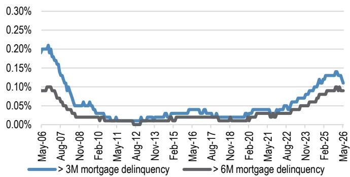

Figure 13: Bankruptcy and petitions vs unemployment rate  
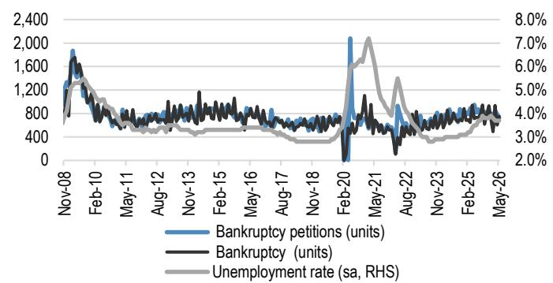  
Source: CEIC.  
Source: CEIC.

Table 4: Valuation summary of HK banks

<table><tr><td rowspan="2">Company</td><td rowspan="2">Ticker</td><td rowspan="2">Price (HK$)</td><td rowspan="2">Mkt Cap (US$mn)</td><td rowspan="2">PT (HK$)</td><td rowspan="2">Rating</td><td colspan="2">P/E</td><td colspan="2">P/B</td><td colspan="2">ROE</td><td>DVD yield</td></tr><tr><td>26E</td><td>27E</td><td>26E</td><td>27E</td><td>26E</td><td>27E</td><td>26E</td></tr><tr><td>BEA</td><td>23 HK</td><td>12.81</td><td>4,319</td><td>10.3</td><td>UW</td><td>6.7</td><td>5.9</td><td>0.3</td><td>0.3</td><td>4.7%</td><td>5.2%</td><td>6.9%</td></tr><tr><td>DSF</td><td>440 HK</td><td>39.22</td><td>1,598</td><td>45.7</td><td>OW</td><td>5.5</td><td>5.0</td><td>0.3</td><td>0.3</td><td>6.0%</td><td>6.2%</td><td>7.3%</td></tr><tr><td>DSBG</td><td>2356 HK</td><td>11.93</td><td>2,139</td><td>14.5</td><td>OW</td><td>5.8</td><td>5.3</td><td>0.5</td><td>0.4</td><td>8.0%</td><td>8.3%</td><td>7.9%</td></tr><tr><td>BOCHK</td><td>2388 HK</td><td>43.16</td><td>58,189</td><td>43.3</td><td>N</td><td>10.4</td><td>9.6</td><td>1.2</td><td>1.1</td><td>11.9%</td><td>12.2%</td><td>5.5%</td></tr><tr><td>HSBC</td><td>5 HK</td><td>153.30</td><td>335,914</td><td>182.0</td><td>OW</td><td>12.1</td><td>10.5</td><td>1.6</td><td>1.6</td><td>15.5%</td><td>17.1%</td><td>4.2%</td></tr><tr><td>STAN</td><td>2888 HK</td><td>226.20</td><td>63,200</td><td>275.0</td><td>OW</td><td>12.4</td><td>10.0</td><td>1.3</td><td>1.2</td><td>10.9%</td><td>12.6%</td><td>2.8%</td></tr></table>

Source: Bloomberg Finance L.P., JPM estimates. Note: Stock prices as of 7 Jul 2026.

Table 5: Share price performance – HK banks

<table><tr><td rowspan="2"></td><td rowspan="2">Ticker</td><td rowspan="2">Price (HK$)</td><td colspan="4">Absolute performance</td><td colspan="4">Relative to HSI Index</td><td colspan="4">Relative to HSF Index</td></tr><tr><td>1m</td><td>3m</td><td>6m</td><td>YTD</td><td>1m</td><td>3m</td><td>6m</td><td>YTD</td><td>1m</td><td>3m</td><td>6m</td><td>YTD</td></tr><tr><td colspan="15">Banks</td></tr><tr><td>BEA</td><td>23 HK</td><td>12.81</td><td>-6%</td><td>-5%</td><td>-4%</td><td>-2%</td><td>0%</td><td>2%</td><td>7%</td><td>6%</td><td>-3%</td><td>-3%</td><td>-4%</td><td>-5%</td></tr><tr><td>DSF</td><td>440 HK</td><td>39.22</td><td>-1%</td><td>1%</td><td>13%</td><td>15%</td><td>5%</td><td>7%</td><td>24%</td><td>23%</td><td>2%</td><td>3%</td><td>14%</td><td>12%</td></tr><tr><td>DSBG</td><td>2356 HK</td><td>11.93</td><td>-5%</td><td>0%</td><td>14%</td><td>16%</td><td>1%</td><td>6%</td><td>25%</td><td>25%</td><td>-3%</td><td>2%</td><td>15%</td><td>13%</td></tr><tr><td>BOCHK</td><td>2388 HK</td><td>43.16</td><td>-6%</td><td>3%</td><td>13%</td><td>13%</td><td>0%</td><td>10%</td><td>24%</td><td>22%</td><td>-4%</td><td>6%</td><td>14%</td><td>10%</td></tr><tr><td>HSBC</td><td>5 HK</td><td>153.30</td><td>8%</td><td>19%</td><td>24%</td><td>29%</td><td>14%</td><td>25%</td><td>36%</td><td>38%</td><td>11%</td><td>21%</td><td>25%</td><td>26%</td></tr><tr><td>STAN</td><td>2888 HK</td><td>226.20</td><td>12%</td><td>38%</td><td>20%</td><td>23%</td><td>18%</td><td>45%</td><td>32%</td><td>31%</td><td>15%</td><td>40%</td><td>21%</td><td>20%</td></tr><tr><td colspan="15">Benchmark</td></tr><tr><td>Hang Seng Index</td><td>HSI Index</td><td>23,497</td><td>-6%</td><td>-6%</td><td>-11%</td><td>-8%</td><td>0%</td><td>0%</td><td>0%</td><td>0%</td><td>-3%</td><td>-4%</td><td>-11%</td><td>-11%</td></tr><tr><td>Hang Seng Financial</td><td>HSF Index</td><td>50,348</td><td>-3%</td><td>-2%</td><td>-1%</td><td>3%</td><td>3%</td><td>4%</td><td>11%</td><td>11%</td><td>0%</td><td>0%</td><td>0%</td><td>0%</td></tr></table>

Source: Bloomberg Finance L.P., JPM. Note: Stock prices as of 7 Jul 2026.

Companies Discussed in This Report (all prices in this report as of market close on 07 July 2026, unless otherwise indicated) Bank of China (BOCHK) (2388)(2388.HK/HK\$43.16/N), HSBC Holdings plc (0005)(0005.HK/HK\$153.30/OW), Standard Chartered Plc (HK) (2888)(2888.HK/HK\$226.20/OW)

Analyst Certification: The Research Analyst(s) denoted by an “AC” on the cover of this report certifies (or, where multiple Research Analysts are primarily responsible for this report, the Research Analyst denoted by an “AC” on the cover or within the document individually certifies, with respect to each security or issuer that the Research Analyst covers in this research) that: (1) all of the views expressed in this report accurately reflect the Research Analyst’s personal views about any and all of the subject securities or issuers; and (2) no part of any of the Research Analyst's compensation was, is, or will be directly or indirectly related to the specific recommendations or views expressed by the Research Analyst(s) in this report. For all Korea-based Research Analysts listed on the front cover, if applicable, they also certify, as per KOFIA requirements, that the Research Analyst’s analysis was made in good faith and that the views reflect the Research Analyst’s own opinion, without undue influence or intervention.

All authors named within this report are Research Analysts who produce independent research unless otherwise specified. In Europe, Sector Specialists (Sales and Trading) may be shown on this report as contacts but are not authors of the report or part of the Research Department.

## Important Disclosures

• Market Maker/ Liquidity Provider: JPM is a market maker and/or liquidity provider in the financial instruments of/related to HSBC Holdings plc
