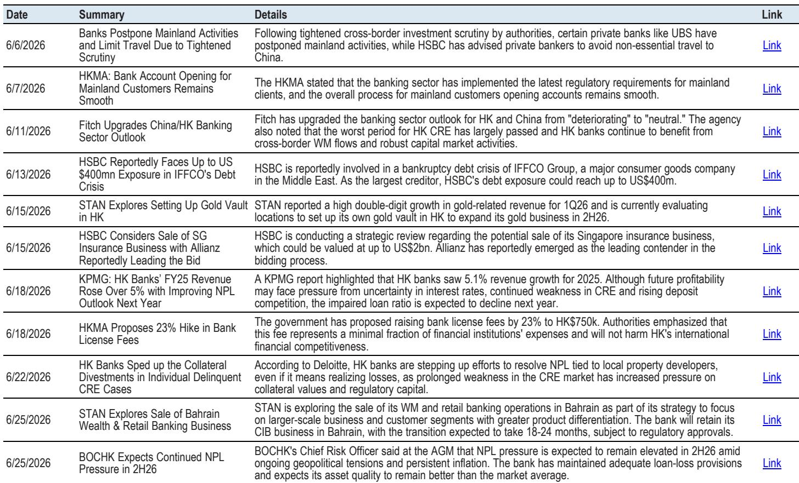
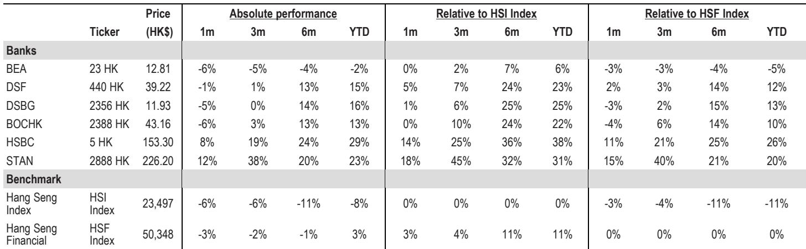

# JPM：香港银行贷款增速回升，JPM提醒注意非利息收入基数效应

当市场还在为跨境研究新规和地产不确定性担忧时，一份来自JPM的月度追踪报告给出了一组值得细看的信号：香港银行板块6月虽下跌5%，却跑赢恒生指数4个百分点。跑赢本身不稀奇，稀奇的是跑赢的逻辑——美联储偏鹰的利率立场，反而成了区域性银行的相对利好。

这份报告的核心判断是：香港银行股正在经历一个从“宏观影响”到“微观分化”的转折点。不是所有银行都受益，但结构性的赢家已经浮现。

## 1. 资产质量的底部信号比市场预期的更清晰

报告中最值得关注的不是利润增速，而是资产质量数据。香港银行整体不良贷款率在2026年第一季度降至1.87%，这是八个季度以来的最低点。惠誉同期将香港银行业展望从“出现变化”上调至“中性”，理由是商业地产最坏阶段已经过去。

更微观的指标也在印证这一趋势：3个月按揭逾期率从0.12%进一步降至0.11%，破产申请量在5个月内同比下降12%。这些数字单独看幅度不大，但方向一致——资产质量的节奏变化周期正在收窄。

> **KC评论：** 不良率见顶不等于马上改善，但至少让市场少了一个“继续出现变化”的理由。对于持有银行仓位的读者，真正的观察窗口不在一两个季度的不良率波动，而是银行管理层是否愿意增加拨备——如果拨备反而开始下降，才是真正的信心信号。

## 2. 贷款增长正在悄悄加速，但结构决定赢家

行业贷款增速从4月的5.4%升至5月的6.0%，延续了自2025年11月以来的回升趋势。驱动力来自贸易融资，而非地产相关贷款。按揭贷款增速虽也微升至3.3%，但新批按揭环比增长10.1%的背后，是银行间市场份额的激烈争夺。

中银香港在已完工按揭市场以31%的份额领先，HSBC则在楼花按揭市场以24%的份额反超。这种分化说明：贷款总量的回升掩盖了银行间“抢份额”的零和博弈。谁的客户基础更稳定、谁在非价格竞争上更有优势，谁才能在利率环境变化时保住息差。

## 3. 息差不确定性正在从“方向”变成“节奏”问题

6月的一个关键变化是港元拆借利率（HIBOR）环比上升，而美元担保隔夜融资利率（SOFR）基本持平，导致SOFR-HIBOR利差收窄。这对香港银行意味着什么？简单说，资金成本上升的节奏在节奏变化，而港元存款竞争仍然理性——报告明确提到，存款竞争主要集中在小型银行和虚拟银行，大型银行并未卷入价格战。

更值得关注的是，报告指出HSBC在1H26的盈利动能可能优于中银香港和渣打，因为后两者面临较高的非利息收入基数效应。这不是简单的“谁赚得多”，而是“谁的增长更可持续”。

> **KC评论：** 市场往往高估利率方向对银行股的影响，低估“基数效应”和“收入结构”的扰动。JPM这份报告提示了一个容易被忽略的问题：1H26的盈利数字好看与否，很大程度上取决于去年同期有没有一次性收入。读者应该把注意力从“利率会不会降”转移到“非利息收入能否填补缺口”。

## 4. 报告没有完全回答的关键问题

尽管数据面改善明显，这份报告也留下了一些待验证的缺口。

第一，跨境研究新规对财富管理收入的实际冲击还没有量化。报告提到部分银行推迟了内地相关业务拓展，但HSBC、中银香港等机构的财富管理收入具体会受多大影响，管理层在1H26业绩会上才会给出指引。

第二，商业地产不确定性“最坏时刻已过”的判断，更多来自评级机构而非银行自身的拨备行为。德勤观察到银行正在加速处置个别违约商业地产抵押品，甚至愿意承担损失——这说明银行的真实不确定性偏好仍然保守，而非主动乐观。

第三，HSBC在IFFCO集团的债务不确定性敞口高达4亿美元，这笔个案是否会引发其他中东相关资产的重新定价，报告没有展开。

## 5. 一个更现实的观察框架

综合这份报告的信息，对关注香港银行板块的读者来说，更实用的框架不是“买哪家”，而是“跟踪什么”。

第一，盯住不良率的方向比盯住相对值更重要。如果1H26的行业不良率能继续低于1.87%，资产质量改善就从“数据改善”变成“趋势确认”。

第二，关注管理层对股东回报的表态。报告特别提到，HSBC是否重启公司回购、中银香港的三年股东回报计划细节，将是1H26业绩会的焦点。在盈利增长有限的环境下，资本返还能力将成为银行股定价的分水岭。

第三，警惕“盈利超预期”背后的基数陷阱。1H26的高基数效应意味着，即使相对利润不错，同比增速也可能让人失望。真正有意义的比较，是剔除一次性项目后的核心盈利趋势。

一份月的月度追踪报告，通常不会改变市场对银行股的中长期看法。但这期JPM报告的价值在于，它用一组收敛的数据，让“底部”这个判断不再是口号，而是可以跟踪的变量。

For informational purposes only. Portions may be generated,translated,summarized,or edited with AI assistance based on source materials and may contain omissions or errors. Please verify independently. This is not investment,legal,tax,accounting,or other professional advice.

For informational purposes only. Portions may be generated,translated,summarized,or edited with AI assistance based on source materials and may contain omissions or errors. Please verify independently. This is not investment,legal,tax,accounting,or other professional advice.

