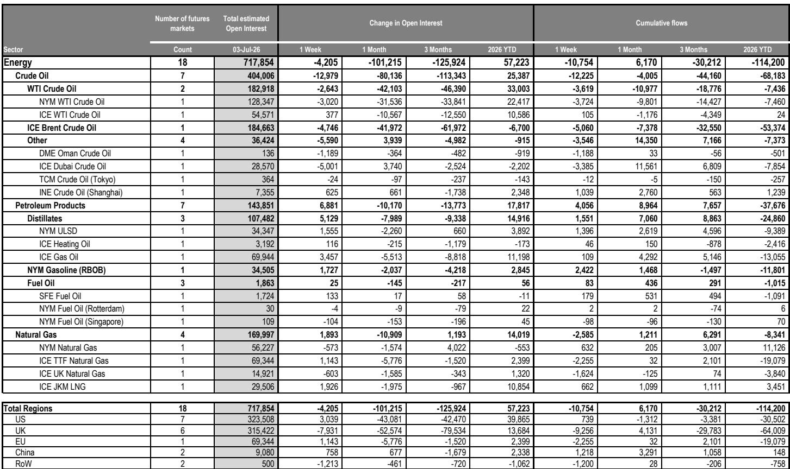
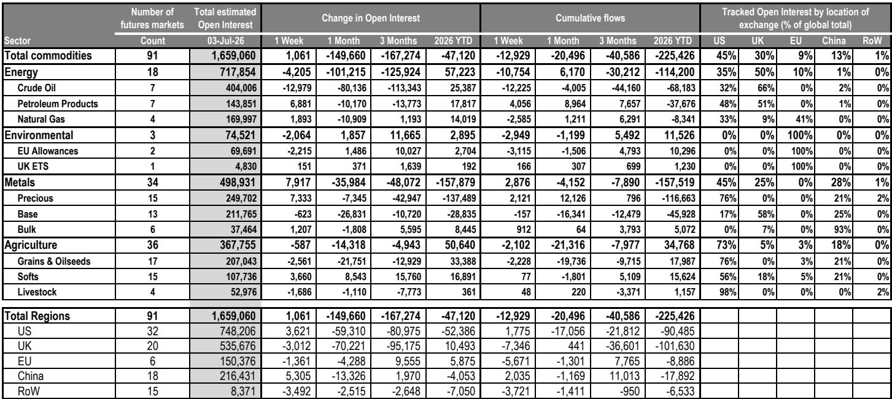
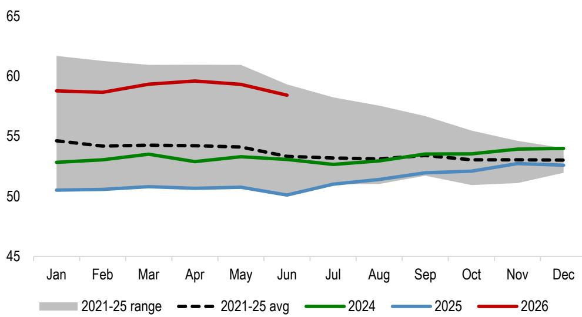

# JPM：中国铜库存降至多年低位，JPM解读消费改善信号

全球大宗商品市场经历连续六周的持仓下滑后，终于在上周出现企稳信号。JPM最新发布的《大宗商品市场持仓与资金流》周报显示，截至7月3日，跟踪市场的未平仓合约估值小幅回升至1.7万亿美元，结束了自5月中旬霍尔木兹海峡重开预期以来的持续缩水。但更值得关注的不是总量，而是结构——资金正在从能源和工业金属撤出，重新涌入贵金属，尤其是黄金。

这份报告的核心判断是：黄金正在重新获得利率敏感型资金的支持，ETF流量正在取代央行购金成为边际定价力量。而原油市场则陷入了“中国需求变化”与“闲置产能重新入市”的双重夹击，短期内看不到明确的向上动力。

## 1. 黄金的定价权正在从央行转向ETF，但这不是一个简单的信号

报告中最值得细读的是黄金部分。截至7月3日，贵金属板块的未平仓合约估值周环比增长3%至2500亿美元，净多头持仓增加40亿美元，其中黄金贡献了35亿美元。更关键的是，COMEX黄金期货中管理资金净多头增加了4700手，总量达到12万手。

JPM分析师明确指出：在其他需求板块购买力度暂时下降的背景下，对利率敏感的ETF流量重新获得了黄金的边际定价权。这意味着一件重要的事情——黄金与真实利率之间的相关性正在重新建立。

> **KC评论：** 过去两年黄金的上涨逻辑更多是央行购金和地缘避险，与利率脱钩。如果ETF流量重新成为主导，那么美联储的利率路径将再次成为黄金定价的核心变量。报告预计3季度金价均价4300美元/盎司，4季度4500美元/盎司，但前提是美联储保持耐心。如果市场开始定价更早的降息，这个区间可能被打破。

## 2. 原油的现状：中国买盘变化，闲置产能正在重新入市

能源板块是上周资金流出的重灾区。原油市场净多头持仓周环比减少55亿美元，ICE布伦特原油净多头从350亿美元降至300亿美元。报告提到了一个值得关注的现象：大量闲置石油正在重新进入系统，可能造成短期供应变化，尤其是在中国需求依然处于调整阶段的情况下。

JPM对中国原油需求的判断是：2026年需求将下降60万桶/日，2027年才回升80万桶/日。这意味着中国短期内不会成为原油市场的关键变量。而卡塔尔能源在霍尔木兹海峡重新开放后的复产节奏，也在按部就班地进行，预计8月恢复到正常满产水平（排除两个受损的液化装置）。

原油市场的反弹取决于两个变量：中国是否恢复采购，以及全球库存补充的速度。目前来看，两个变量都需进一步观察。

## 3. 铜的库存信号值得跟踪，但报告没有完全回答“需求到底如何”

基本金属板块整体未平仓合约估值持平于2120亿美元，但内部结构分化明显。铝和镍净流出26亿美元，而铅和锌有资金流入，铜的净流量大体持平。

最值得关注的是中国的铜库存数据。报告显示，过去三周中国铜库存累计下降8.2万吨，目前总量降至16.3万吨，处于多年同期低位。JPM将这一信号解读为中国铜消费改善的迹象，同时美国持续将铜拉向COMEX仓库，以应对美国商务部即将做出的铜进口关税决定。

> **KC评论：** 库存下降本身是一个积极信号，但需要区分是真实需求拉动还是贸易商在关税落地前的囤货行为。报告没有给出明确的判断，读者可以关注后续的进口数据和下游加工企业开工率来验证。

## 4. 报告没有完全回答的关键问题：农产品持仓能否持续反弹

农产品板块净持仓减少了23亿美元，但JPM的QDS模型预测未来一周将增加75亿美元，主要由玉米、大豆和咖啡贡献。这个预测与当前的实际资金流向存在明显分歧。

从价格动量信号来看，小麦的短期和长期信号均已转为“买入”，大豆的长周期信号则转为“卖出”，糖的短期信号也转为“买入”。这些信号的分化说明农产品市场正处于一个关键的转折点，但方向尚未统一。

报告没有充分解释的是：如果中国需求持续调整，农产品价格能否仅靠供给端的故事维持上涨。这是读者在阅读完整报告时需要自行判断的部分。

整体而言，这份报告传递的核心信息是：大宗商品市场正在从宏观驱动的普涨模式转向品种分化。黄金和铜有各自的结构性支撑，而原油和部分农产品则面临需求端的真实考验。对于产业决策者来说，现在不是押注整体方向的时候，而是需要精细到每个品种的供需平衡表。

For informational purposes only. Portions may be generated,translated,summarized,or edited with AI assistance based on source materials and may contain omissions or errors. Please verify independently. This is not investment,legal,tax,accounting,or other professional advice.

For informational purposes only. Portions may be generated,translated,summarized,or edited with AI assistance based on source materials and may contain omissions or errors. Please verify independently. This is not investment,legal,tax,accounting,or other professional advice.

