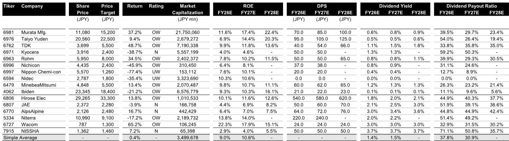
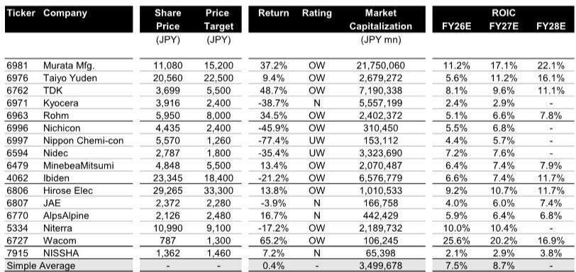

# JPM：MLCC涨价预期落空？JPM称真正供需紧张在2027年

四月至六月这一财报季，日本电子元器件公司大概率交出一份不错的成绩单。JPM最新研报的判断很直接：AI服务器、工业设备和汽车领域的订单回暖叠加日元贬值，多数公司的营业利润有望达到甚至超过公司指引。但报告紧接着提出了一个反直觉的提醒——利润好，不代表报价能继续涨。

被动元件和AI服务器相关公司的涨幅已经远远跑在了短期盈利前面。过去三个月，村田制作所涨了191%，太阳诱电涨了352%，罗姆涨了64%。当报价已经包含大量乐观预期时，财报只要“没有惊喜”，就可能成为回调的理由。

## 1. 日元贬值与需求复苏构成双重安全垫，但市场定价已提前消化

这份研报在盈利预测中埋了一个关键变量：日元汇率。多数日本电子元器件公司在制定2026财年指引时，假设的美元兑日元汇率在150-155区间。而四月至六月的实际汇率已经来到159-160。仅汇率这一个变量，就能直接推高以日元计价的海外收入。

与此同时，AI服务器、工业设备和汽车这三个终端市场的需求复苏势头比预期更扎实。JPM认为，在日元贬值和需求回暖的双重作用下，四月至六月这一季的营业利润大概率落在“符合指引”或“超越指引”的区间。

> **KC评论：** 日元贬值和AI需求回暖是两股不同性质的力量。汇率是一次性红利，而AI带动的MLCC（多层陶瓷电容）出货量增长才是结构性故事。研报提示了短期报价不确定性，但真正值得深读的是它对MLCC供需缺口的远期判断——缺货预期可能在2026年四季度才开始体现。

问题在于，市场已经提前为这些好消息买单了。报告里的报价表现表格显示，太阳诱电过去12个月涨幅接近700%，村田制作所超过400%。一家公司利润增长30%-50%，报价涨了4-7倍，中间的估值裂口需要用更长的时间或更大的业绩惊喜来弥合。

## 2. 被动元件：MLCC涨价预期存在时间错位，三季度可能让部分读者失望

对被动元件板块，JPM的判断值得细读。海外读者对七月至九月MLCC涨价的预期仍然很高，但报告认为“几乎看不到涨价的迹象”。真正的MLCC供需紧张，要到2027财年才会出现——届时客户会在2026年四季度开始就2027年供货进行谈判，涨价预期才会真正落地。

这就形成了一个时间错位：读者在二季度押注涨价，但涨价信号最快要到四季度才会出现。中间这一个季度的业绩空窗期，可能让那些对短期涨价抱有极高期待的参与者感到失望。

报告对几家公司的一季度利润做了具体情景分析。村田制作所的营业利润，JPM目前保守估计865亿日元，但考虑到日元贬值和市场景气度，认为达到900亿日元以上并非没有可能。太阳诱电则面临韩国MLCC工厂罢工的扰动，一季度利润能否达到50亿日元的预测，存在不确定性。TDK方面，报告认为如果营业利润大幅超过700亿日元，会构成“正向惊喜”。

## 3. 报告尚未完全回答：报价透支后，需要多长时间的业绩来消化

这是这份研报最有价值但没有完全展开的问题。JPM明确提示了“报价可能因盈利小幅低于预期或仅仅让市场失望而大幅下跌”的不确定性，但它没有给出一个具体的估值锚——比如，当前报价隐含了多高的长期增长率？需要几个季度的利润超预期才能消化当前的估值？

从报告附带的报价表现排名来看，过去12个月涨幅最大的太阳诱电和村田制作所，恰恰是短期盈利预期最不确定的两家公司。太阳诱电面临工厂罢工和执行力不确定性，村田制作所的盈利预测也有较大波动空间。换句话说，涨幅最大的公司，恰恰是短期业绩最“脆弱”的标的。

但它的框架已经暗示了一个观察思路：当报价涨幅远超盈利改善幅度时，读者需要关注的不是“利润好需要继续观察”，而是“利润好到什么程度才能让市场满意”。这个门槛在二季度可能相当高。

## 4. 工业设备和汽车连接器可能是更安全的配置方向

在被动元件之外，报告对工业设备和汽车连接器领域的公司给出了更积极的短期判断。广濑电机、美蓓亚三美和罗姆，JPM认为其一季度业绩有望超过指引。驱动因素各不相同：广濑电机受益于工业设备需求强劲，美蓓亚三美靠精密技术板块的景气度，罗姆则得益于分立器件供需紧张和整体市场回暖。

这些公司的报价涨幅相对温和。广濑电机过去12个月涨幅约72%，美蓓亚三美约123%，远低于被动元件龙头。如果业绩确实超预期，市场给出正向反馈的空间可能更大。

**对于关注日本电子元器件产业链的读者，这份报告提供了一个清晰的观察框架：短期看日元汇率和需求复苏能否推动业绩超预期，中期看MLCC涨价预期何时落地，长期则要看AI服务器需求能否持续拉动被动元件出货量。** 当前最值得追问的问题不是“哪家公司利润最好”，而是“市场对哪家公司的利润预期最不理性”。JPM的研报已经给出了第一层答案。

For informational purposes only. Portions may be generated,translated,summarized,or edited with AI assistance based on source materials and may contain omissions or errors. Please verify independently. This is not investment,legal,tax,accounting,or other professional advice.

For informational purposes only. Portions may be generated,translated,summarized,or edited with AI assistance based on source materials and may contain omissions or errors. Please verify independently. This is not investment,legal,tax,accounting,or other professional advice.

