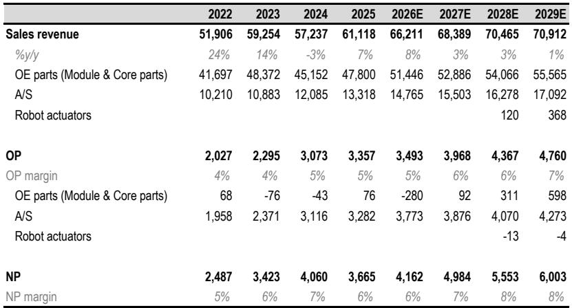
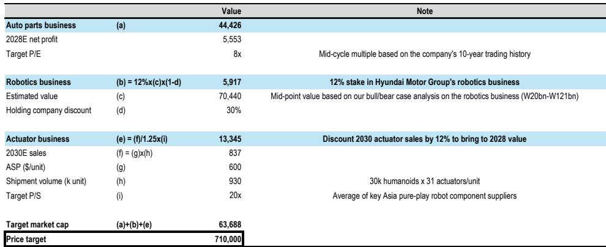
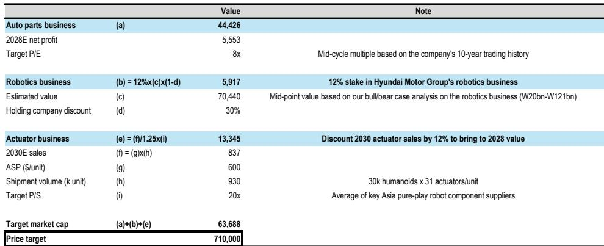

# JPM：韩国汽车零部件公司机器人业务不再是免费期权

报价从高点回调超过36%之后，JPM开始重新审视韩国两大汽车零部件公司——现代摩比斯和HL万都。这份研报的核心判断并不复杂：机器人执行器业务此前被市场当作“免费看涨期权”定价，但现在报价已经跌到只反映核心零部件业务的价值，执行器变成了真正的增量期权。不确定性回报比变了，评级也随之调整。

报告上调现代摩比斯至“超配”，HL万都从“低配”上调至“中性”。这不是因为两家公司的基本面出现了突然的改善，而是因为市场已经替它们完成了“不确定性测试”。

## 1. 报价回调之后，核心业务提供了估值底

JPM用SOTP（分部加总估值法）拆解了两家公司的价值构成。对于现代摩比斯，核心汽车零部件业务估值约44万亿韩元，再加上其在现代汽车集团机器人业务中12%的持股（约6万亿韩元），两者之和已经基本覆盖了当前市值。也就是说，市场目前对摩比斯的定价，几乎完全基于它作为传统汽车零部件供应商的价值，机器人业务几乎没有被赋予额外溢价。

HL万都的情况类似：核心零部件业务隐含价值约2.3万亿韩元，与当前市值大致相当。执行器业务虽然被讨论，但报告明确指出“订单可见性仍然有限”，因此没有给予其估值上的“信任票”。

> **KC评论：** 这实际上是一种“安全边际”的重新确认。当一家公司的市值已经跌到其传统业务的价值附近时，市场对它的叙事溢价就被挤干了。剩下的只有两个可能性：要么传统业务被低估，要么新业务成为真正的惊喜。JPM选择赌后者。

## 2. 机器人叙事没有消失，但性质变了

报告里有一组很有意思的读者反馈。JPM在亚洲路演中得到的反馈是：大部分读者同意，新进入执行器领域可能不会带来很高的利润率。但即便如此，这些零部件公司的机器人相关动作仍然可以作为“叙事催化剂”驱动报价。

这不是在否定机器人逻辑，而是在重新定义它的作用方式。执行器业务不再是被市场充分定价的确定性增长，而是变成了一个“难以做空”的理由——因为机器人主题的热度仍在，ETF相关的资金流入也可能提供支撑。

对读者来说，这意味着判断框架需要调整。过去市场可能用P/E来评估执行器业务的盈利贡献，但现在JPM观察到市场正在用P/S（市销率）来定价。这是一个重要的信号：市场不再要求马上看到利润，而是愿意为收入可见性买单。只要公司能证明执行器订单在增加，哪怕利润率不高，报价也可能获得支撑。

## 3. 短期催化剂有限，但不确定性已提前释放

报告对二季度业绩的展望相对平淡。现代摩比斯二季度营业利润预计为9010亿韩元，同比微增；HL万都预计为1040亿韩元，同比持平。成本端，铝、铜、塑料和半导体等大宗商品价格上涨是主要不确定性，但部分可以通过汇率和向OEM转嫁来对冲。另外，摩比斯在售后市场（A/S）业务上有结构性利润提升，受益于现代汽车集团在发达市场车型ASP上升以及Genesis车龄进入五年以上的维修高峰期。

这些细节说明，短期基本面并没有出现爆点。但JPM选择在这个时点更新公司观点，恰恰说明它认为“坏消息已经足够多”。报价从高点回调36%和37%，而同期KOSPI指数只下跌了10-12%，零部件板块的超额回调本身就是一种信号。

> **KC评论：** 这是典型的“逆向调整”逻辑。当一家公司因为一个尚未被验证的叙事（机器人执行器）而上涨，又因为叙事热度消退而大幅回调，如果此时它的传统业务估值已经足够便宜，那么回调本身就会创造机会。关键在于，传统业务是否真的能支撑估值。JPM用SOTP给出了肯定的答案。

## 4. 报告没有完全回答的问题

研报坦诚地指出了几个尚未解决的疑问，这正是读者需要自己去原文中寻找答案的地方。

第一，执行器业务的收入可见性仍然很低。JPM对现代摩比斯2030年执行器销售规模的预测是8370亿韩元，基于每台人形机器人搭载31个执行器、每个600美元的假设。但报告没有详细说明这些订单来自哪些客户、何时开始量产、以及是否有明确的产能规划。对于HL万都，报告甚至明确表示“订单可见性仍然有限”。

第二，竞争格局没有展开。全球范围内，执行器领域已经有不少专业玩家，中国和日本的多家零部件公司也在积极布局。JPM在估值对比表中列出了Harmonic Drive Systems、绿的谐波等公司，但并没有深入分析现代摩比斯和HL万都相比这些专业厂商的竞争优势在哪里。

第三，现代汽车集团在机器人产业链中的角色是一个变量。报告提到，在机器人和汽车两个领域，OEM对价值链的支配权正在增加，因此JPM更偏好现代汽车和起亚而非零部件供应商。这个判断如果成立，意味着零部件公司在机器人业务中的议价能力可能受限。

## 5. 给读者的观察框架

这份报告提供了一个可复用的分析框架，适用于评估那些“叙事驱动、估值回调”的公司

第一步，拆解估值底。用SOTP把传统业务的价值算清楚，看当前市值是否已经接近或低于这个底线。如果答案是肯定的，那么新业务就变成了“免费期权”。

第二步，判断新业务的定价方式。市场是用P/E还是P/S来定价？如果是P/S，那么收入可见性比利润率更重要。公司是否在释放订单相关的信号？客户是谁？量产时间表如何？

第三步，评估短期催化剂。二季度业绩、大宗商品成本、汇率、OEM转嫁能力，这些因素是否已经被市场充分预期？如果预期的坏消息已经反映在报价中，那么实际结果只要不更差，就可能构成正面推动。

第四步，承认不确定性。报告没有给出执行器业务的确定性盈利预测，而是用“增量期权”来描述。这意味着，如果执行器业务最终没有兑现，估值底仍然存在；如果兑现了，则是额外收益。

对于产业决策者来说，这份报告的价值不在于评级本身，而在于它提供了一个系统性的思考框架：当市场情绪退潮时，如何区分哪些公司的报价是“跌出了价值”，哪些只是“跌回了原点”。

For informational purposes only. Portions may be generated,translated,summarized,or edited with AI assistance based on source materials and may contain omissions or errors. Please verify independently. This is not investment,legal,tax,accounting,or other professional advice.

For informational purposes only. Portions may be generated,translated,summarized,or edited with AI assistance based on source materials and may contain omissions or errors. Please verify independently. This is not investment,legal,tax,accounting,or other professional advice.

