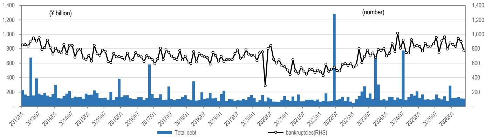
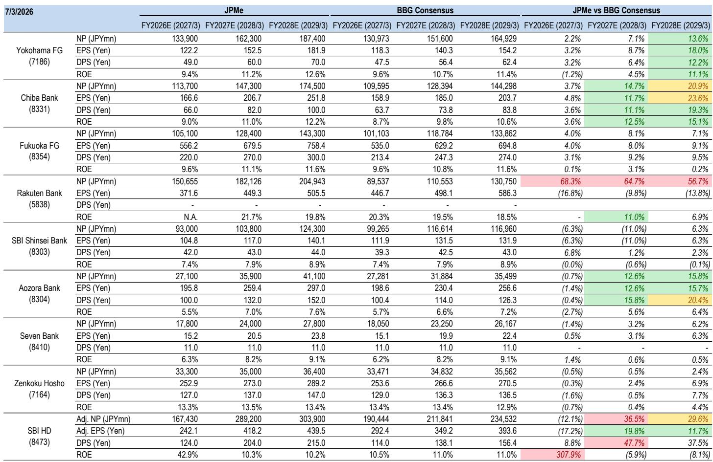
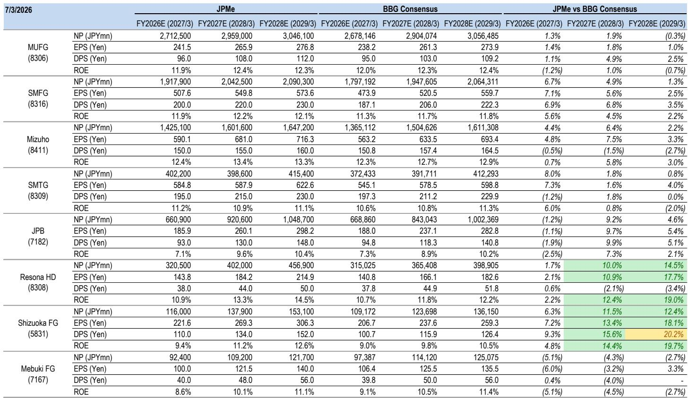

# 日本银行财报季的关键信号：管理层是否调整全年指引

市场关注日本央行2026年6月加息对日本银行盈利的影响，但这并非重点。在即将到来的第一季度财报季，读者应关注的核心信号不是净利息收入的相对水平，而是银行管理层是否有信心上调全年指引。在加息周期的全面影响尚未显现之前，调整指引表明管理层认为其业务动能足以吸收不确定性。而维持指引不变，则可能反映保守态度或对潜在盈利轨迹缺乏信心。

本财报季是对管理层可信度的考验，而不仅仅是利率敏感性的测试。6月加息已被广泛预期，但许多银行尚未将其纳入官方预测。它们如何应对这一差距，将区分出哪些机构在主动管理叙事，哪些在被动应对宏观环境。对于读者而言，定于2026年8月发布的季度业绩，提供了一个难得的窗口来评估哪些银行走在前列，哪些仍在追赶。

利率环境已改变了竞争格局，其影响尚未完全反映在一致预期中。国内贷款增长显著加速，城市银行对大型企业的贷款同比增长达到两位数。网络银行的存款增长已回升。权益市场上涨，提升了可供出售证券的估值。然而，许多银行的指引仍仅假设一次加息，甚至没有。实体经济正在发生的情况与指引所反映的情况之间的差距正在扩大。

## 本财报季最重要的信号：银行是否调整指引以反映6月加息

报告分析显示，许多大型银行尚未将6月日本央行加息纳入全年指引。这并非细枝末节。这意味着，如果一家银行选择在第一季度业绩发布时上调指引，实际上是在表明其基础业务表现优于自身保守的基线。报告明确指出，如果任何银行迅速调整指引，分析师将视其为对业务进展有信心的积极信号。

这是一个经典的委托代理洞察。管理层有充分动机设定低预期并超越它。但在第一季度，当财年尚早、不确定性仍高时调整指引，需要另一种信心。这表明管理层认为贷款增长、手续费收入或成本控制方面有足够的有机动能来吸收剩余风险。对读者而言，调整指引的决定比任何单一季度的盈利相对水平都更具信号意义。

报告还指出，三菱日联金融集团最不可能在第一季度发布重大业绩，恰恰因为其指引已假设2026年中期加息。这是一个反例，印证了规则。MUFG的指引已反映加息，因此无需调整。尚未纳入加息的银行才是值得关注的。它们的决策将揭示它们是在主动管理，还是仅仅希望利率环境能在财年后期带来收益。

## 地方银行的股票回购将是主要的股东回报机制，但规模和时间差异显著

大型银行、三井住友信托集团和理索纳控股已在5月宣布回购。覆盖范围内的地方银行则没有。这使得8月财报季成为地方银行预计宣布回购的时刻。报告特别指出，静冈金融集团和横滨金融集团可能各自回购400亿日元，相当于一年或接近一年的规模。目引金融集团和千叶银行预计将宣布较小的回购，相当于年度预测金额的一半或更少。

这对读者而言是一个关键区别。回购公告不仅关乎向股东返还资本，也是管理层对股票估值和银行资本充足率看法的信号。大规模回购，尤其是在财年上半年提前进行的回购，表明管理层认为股票被低估且银行有充足资本可部署。较小的回购或延迟回购，可能反映对盈利前景的谨慎，或倾向于保留资本用于其他用途。

报告还指出，除非净利润指引被修正，否则预计股息指引不会发生变化。这意味着回购是第一季度股东回报的主要杠杆。读者应密切关注不仅是否宣布回购，还有其相对于银行市值和盈利的规模。相对于盈利而言规模较大的回购，比象征性的回购信号更强。

## 国内贷款增长显著加速，但不同类型银行的受益分布不均

报告显示，2026年5月国内贷款平均余额同比增长5.7%。这比2025年上半年约2%的增长率有显著加速。更引人注目的是，城市银行对大型企业的贷款在5月同比增长达14%，高于3月的10%。地方银行对大型企业的贷款也实现了高个位数增长。

这是一个结构性转变，而非周期性波动。作为市场利率挂钩贷款利率基准的三个月TIBOR回报表现，在加息后进一步上升。这意味着银行不仅贷款更多，而且利率更高。数量增长与利差扩大的结合是强有力的。然而，收益分布并不均匀。城市银行因对大型企业借款人的敞口，数量增长最为强劲。地方银行增长较慢，其贷款组合更集中于定价能力可能较弱的小型借款人。

报告还指出，日本破产数量未见显著变化，这表明信贷质量保持稳定。这一点很重要，因为它消除了可能抵消加息收益的关键风险之一。如果信贷成本保持可控，净利息收入的改善应更直接地传导至利润。

## 可供出售证券估值改善，但构成比总额更重要

从2026年3月底到6月底，日本国债回报表现在短期区间小幅上升，在7-10年区间上升更为显著。美国国债回报表现在2-3年区间相对急剧上升，而10年区间升幅较为温和。与此同时，TOPIX大幅上涨，季度环比上涨14%。报告指出，在许多银行，权益估值收益的增加超过了日元债券和外币债券估值收益的恶化。

这是银行资产负债表典型的风险偏好环境。权益市场上涨，提升了银行股票持仓的价值。债券回报表现上升，压低了债券持仓的价值。对大多数银行而言，净效应为正，因为权益持仓通常大于债券持仓。但这掩盖了显著差异。拥有大量债券组合，尤其是长久期持仓的银行，将面临回报表现上升带来的更大压力。拥有大量权益持仓的银行，将从权益市场上涨中受益更多。

读者应超越总体估值收益，审视每家银行可供出售证券的构成。拥有大量长久期债券组合的银行，对进一步加息更为敏感。拥有大量权益组合的银行，对权益市场调整更为敏感。当前环境对大多数银行有利，但潜在风险正在转移。

## 报告未完全解答的问题：贷款增长的可持续性与数字竞争的影响

报告提供了当前状况的详细快照，但留下了几个重要问题。首先，国内贷款增长的加速是否可持续？报告指出2026年增长显著加快，但未详细分析驱动因素。这种增长是来自真正的经济扩张，还是由库存融资或并购相关借贷等一次性因素驱动？如果增长是周期性的，随着经济放缓可能逆转。如果是结构性的，则可能持续。

其次，报告未完全解决数字竞争对存款成本和手续费收入的影响。报告指出，乐天银行等网络银行的存款增长在2026年已回升至同比增长13-15%。这表明网络银行正在继续获取市场份额。随着它们这样做，可能会对整个行业的存款定价施加压力。传统银行可能需要提高存款利率以留住客户，这将压缩其净息差。报告未详细模拟这一动态。

第三，报告未涉及可能影响银行资本要求或股息政策的监管变化。日本央行的加息周期可能导致银行资本监管框架的变化，尤其是在加息步伐加快的情况下。这是一个读者需要关注的开放性问题。

## 读者决策框架：如何评估日本银行第一季度业绩

基于报告，读者应使用三步框架评估第一季度业绩。第一步是确定银行是否上调了全年指引。如果是，这是一个强烈的积极信号。如果没有，读者需要了解原因。银行是保守，还是看到了市场未注意到的风险？

第二步是评估回购公告。如果银行宣布回购，关键问题是规模。相对于市值和盈利而言规模较大的回购是强烈信号。小规模回购可能只是象征性姿态。时机也很重要。在财年早期宣布回购表明管理层对盈利前景有信心。较晚宣布的回购可能是对股价下跌的反应。

第三步是分析盈利增长的构成。增长来自净利息收入、手续费收入还是资产出售收益？净利息收入驱动的增长比一次性收益驱动的增长更可持续。报告指出，一些银行第一季度利润将大幅下降，因为它们在去年同期记录了资产出售收益或税收优惠。读者在评估基础盈利动能时，应调整这些一次性项目。

## 加入社区阅读完整报告并查看原始图表

以上分析基于对一份关于日本银行的详细研究报告的解读。完整报告包含按银行类型划分的贷款增长数据、网络银行存款趋势以及可供出售证券的详细估值分析。还包括显示TOPIX银行指数与日本国债回报表现关系、各银行净利润同比增长率以及股息和回购政策比较的原始图表。对于希望就日本银行做出知情决策的读者，完整报告提供了建立信心所需的详细数据。

加入社区阅读完整报告并查看原始图表。

*仅供参考。部分内容可能基于源材料通过AI辅助生成、翻译、总结或编辑，可能存在遗漏或错误。请独立核实。这不构成专业建议。*
